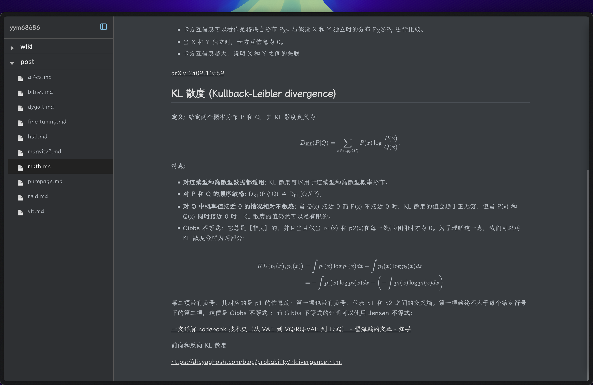

# PurePage



[English](README.md) | [中文](README_CN.md)

PurePage is a minimalist blog page completely implemented with native HTML, JS, and CSS. Its main function is to render Markdown article content and support LaTeX mathematical formula rendering, allowing you to focus on writing without worrying about complex blog system setup and maintenance. PurePage emphasizes localization and data autonomy, ensuring your content remains under your control. It supports deployment on GitHub Pages, Vercel, and Cloudflare Pages, adhering to local optimization without relying on any third-party services.

I developed PurePage because I tried many different blog systems like Hexo, Docusaurus 2, and Notion, which relied on too many unnecessary components, were difficult to customize with desired features, had data migration challenges, or were hard to use. I wanted a simple and efficient blog page that makes writing easier.

PurePage's hallmark is its simplicity - no excess settings or complex features, just a simple search function and automatically generated article list. At the same time, PurePage offers excellent rendering effects, making your articles look more beautiful and professional.

If you're a minimalist blogger looking for a simple, efficient blog page that emphasizes data autonomy and localization, then PurePage is definitely a good choice. You're welcome to try it and provide feedback and suggestions.

## ✨ Features

- Implemented with native HTML, JS, and CSS
- Supports Markdown rendering
- Supports LaTeX mathematical formula rendering
- Supports Mermaid chart rendering
- Supports code highlighting
- Responsive interface

## 🚀 Quick Deployment

1. You can deploy PurePage to Vercel with one click:

[](https://vercel.com/new/clone?repository-url=https%3A%2F%2Fgithub.com%2Fyym68686%2FPurePage)

2. You can deploy to Cloudflare Pages:

```bash
# Install Wrangler CLI
npm install -g wrangler

# Login to Cloudflare
wrangler login

# Deploy to Cloudflare Pages (with SSL configuration)
wrangler pages deploy . --project-name purepage --branch main
```

3. You can also deploy to GitHub Pages:

```bash
# Fork this repository
# Then go to Settings -> Pages in your repository
# In the "Build and deployment" section:
# - Set "Source" to "Deploy from a branch"
# - Select your branch (main/master) and root directory (/)
# - Click Save
```

## Usage Guide

Run `generate-sidebar-structure.js` to generate the sidebar file list

```bash
node generate-sidebar-structure.js
```

Run `init.py` to generate the homepage directory

```bash
python init.py
```
