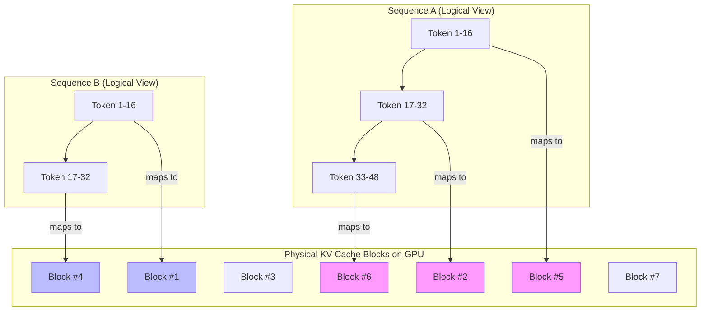
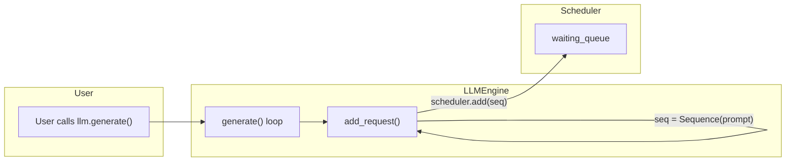

# `nano-vllm` 揭秘：从零开始构建你自己的高性能LLM推理引擎

## 引言

你是否曾对 `vLLM` 这类高性能推理框架背后的魔法感到好奇？想知道它们是如何在处理海量并发请求时，依然能保持惊人的吞吐量和低延迟吗？本教学文档将为你彻底揭开这层神秘的面纱。

我们将以 `nano-vllm` 这个轻量级、代码简洁且设计精巧的项目为蓝本，进行一次深入的探索之旅。这趟旅程的目标，不仅仅是学会如何 *使用* 一个推理引擎，更是要彻底理解其背后每一个关键决策的 *原因* 和 *实现方式*。

我们将像剥洋葱一样，一层层地剖析 `nano-vllm` 的核心架构。从最基础的 LLM 推理瓶颈出发，逐步引入 `PagedAttention`、持续批处理、张量并行、CUDA Graphs 等一系列尖端优化技术。这不仅仅是一篇技术文档，更是一个引导你从零开始，思考并“重新发明”一个现代 LLM 推理引擎的故事。

**目标读者:** 对 LLM 推理优化充满好奇的学生、研究人员、算法工程师和系统工程师。
**你将收获:**

- 对现代 LLM 服务框架核心原理的深刻理解。
- 动手分析和构建高性能计算系统的能力。
- 一份可以引爆你知识宇宙的 LLM serving 深度指南。

准备好了吗？让我们一起启程，去探索 LLM 推理性能的极限！

---

## 第一章：LLM 推理的挑战——为何“朴素”方法行不通？

想象一下，你刚刚训练好一个强大的语言模型。现在，你需要将它部署为在线服务，让成千上万的用户能够与它实时交互。很快，你就会遇到一个棘手的问题：**性能**。当大量请求同时涌入时，如何才能既快又省地给出响应？

要回答这个问题，我们必须先理解 LLM 推理过程中的“性能恶魔”藏在哪里。

### 1. 万恶之源：KV Cache

我们知道，现代大语言模型大多基于 Transformer 架构。其核心是**自注意力机制 (Self-Attention)**，它允许模型在生成每个新词时，回顾并权衡前面已经出现过的所有词。

在自回归生成（auto-regressive generation）的每一步，模型都会把新生成的词加入到输入序列中，然后进行一次完整的前向传播，来预测下一个词。例如，要从 "Hello" 生成 "Hello, world!"，过程是这样的：

1.  输入: "Hello" -> 输出: ","
2.  输入: "Hello," -> 输出: "world"
3.  输入: "Hello, world" -> 输出: "!"

这里面存在巨大的计算浪费。在第2步中，模型需要重新计算 "Hello" 的注意力；在第3步中，又要重新计算 "Hello," 的注意力。为了避免这种冗余计算，几乎所有的推理框架都引入了一项关键优化：**KV Cache**。

在注意力计算中，每个输入词（token）都会产生对应的 Key (K) 和 Value (V) 向量。一旦某个词的 K 和 V 计算出来，它们在后续的生成步骤中是不会改变的。因此，我们可以把它们缓存起来。在生成下一个词时，我们只需要为最新的词计算 K 和 V，然后将它们与缓存中所有历史词的 K 和 V 拼接起来，送入注意力模块即可。

这个缓存，就是 **KV Cache**。它极大地加速了推理，但同时也带来了新的、更致命的问题：**惊人的内存消耗**。

一个典型的 KV Cache 大小可以用以下公式估算：
$$
\text{CacheSize} = 2 \times (\text{num\_layers}) \times (\text{sequence\_length}) \times (\text{num\_heads}) \times (\text{head\_dim}) \times \text{precision}
$$
其中：

- `2`: 代表 Key 和 Value 两个缓存。
- `num_layers`: 模型的层数。
- `sequence_length`: 序列的当前长度。
- `num_heads`: 注意力头的数量。
- `head_dim`: 每个头的维度。
- `precision`: 数据类型占用的字节数（例如 FP16 占 2 字节）。

从公式可以看出，KV Cache 的大小与序列长度成**线性关系**。一个有 32 层、序列长度为 2048 的 7B 模型，其 KV Cache 就可能占用数 GB 的显存！对于需要处理长文本的应用来说，这完全是不可接受的。

### 2. 朴素批处理 (Static Batching) 的双重困境

为了提高 GPU 的利用率，一个自然而然的想法是**批处理 (Batching)** —— 将多个用户的请求打包在一起，形成一个批次（batch），然后一次性送入 GPU 进行计算。最简单直接的方法叫做**静态批处理 (Static Batching)**。

它的工作方式如下：

1.  收集一批请求（例如，8个用户的请求）。
2.  找到这批请求中最长的序列长度（prompt + max_new_tokens）。
3.  将所有其他较短的序列**填充 (Padding)** 到这个最大长度。
4.  将整个批次送入模型进行推理。
5.  等待批次中**所有**序列都生成完毕后，才返回结果并处理下一个批次。

这种方法虽然简单，却带来了两个致命的问题，我们将它们称为“双重困境”。

#### 困境一：内部碎片化 (Internal Fragmentation)

Padding 操作是内存浪费的罪魁祸首。假设一个批次中有两个请求：

- **请求A:** 提示长度10，生成长度50，总长60。
- **请求B:** 提示长度500，生成长度500，总长1000。

为了将它们批处理，静态批处理会将请求A填充到1000的长度。这意味着，为请求A分配的 KV Cache 空间中，有 `1000 - 60 = 940` 个词元的位置是完全被浪费掉的！这部分被分配但未被有效利用的内存，就像一个停车场里被一辆小smart占了一个加长林肯的车位，我们称之为**内部碎片化**。在实际场景中，请求长度分布非常不均，这种浪费是巨大的，它直接限制了我们所能支持的批次大小。

*静态批处理中，短序列被填充到与长序列相同的长度，导致大量KV Cache被浪费。*

#### 困境二：低GPU利用率（Head-of-Line Blocking）

静态批处理的第二个问题在于其“齐步走”的机制。批次中的所有序列必须共同进退。在上面的例子中，请求A在第60步就已经生成完毕，但它无法提前退出。它所占用的计算资源和内存必须保持，直到请求B也完成了全部1000步的生成。

在这漫长的等待期间（从第61步到第1000步），属于请求A的那部分计算单元实际上是空闲的，但又不能被新的请求利用。这种现象类似于交通堵塞中的“队头阻塞 (Head-of-Line Blocking)”，严重拖累了整个系统的吞吐量。

### 3. 核心矛盾：动态请求 vs. 静态计算

总结一下，我们面临的核心矛盾是：
**用户的请求是动态的、不可预测的（长度各异），而最大化 GPU 效率却要求计算任务是静态的、规整的。**

朴素的静态批处理试图用一种僵硬的方式来适配动态的请求，结果导致了严重的内存浪费和计算资源闲置。

那么，有没有一种方法，可以让我们像管理系统内存那样，灵活、高效地管理显存？有没有一种调度策略，可以让我们像运行现代多任务操作系统那样，智能地、动态地执行推理任务，从而让 GPU 永不停歇？

`nano-vllm` 正是为了解决这些问题而生。在接下来的章节中，我们将一起探索它是如何通过 `PagedAttention` 和 `持续批处理` 等关键技术，优雅地化解这一矛盾的。

---

## 第二章：内存革命——`PagedAttention` 与 `BlockManager`

在第一章中，我们看到了静态批处理在内存管理上的“双重困境”。KV Cache 的巨大开销和内存碎片化，像两座大山一样，阻碍了我们通往高性能推理的道路。要如何搬开它们？

答案出奇地巧妙，它的灵感来源于一个我们每天都在使用，却可能从未深入思考过的技术：**计算机操作系统的虚拟内存管理**。

### 1. 灵感之源：操作系统的虚拟内存与分页

想象一下你的电脑有 8GB 内存，但你同时打开了浏览器、代码编辑器、音乐播放器和多个大型软件，它们需要的总内存可能远超 8GB。为什么电脑没有崩溃？

这就是**虚拟内存 (Virtual Memory)** 的功劳。操作系统会为每个程序创建一个独立的、巨大的“虚拟地址空间”。程序看到的内存是连续的，但实际上，操作系统会将这些虚拟地址映射到物理内存（RAM）中一个个固定大小的**物理页帧 (Physical Page Frame)** 上。

这个映射关系记录在一张叫做**页表 (Page Table)** 的地图上。当程序需要内存时，操作系统就分配一个空闲的物理页帧，并在页表中记录下“虚拟页A -> 物理页帧X”的映射。如果物理内存不足，操作系统还会聪明地将一些不常用的页帧临时存到硬盘上（Swap Out）。

这种“分页 (Paging)”机制带来了革命性的好处：

1.  **消除碎片化：** 内存被划分为统一大小的页帧，分配和回收都非常高效，几乎没有浪费。
2.  **地址空间解耦：** 程序的逻辑地址和物理地址分离，程序无需关心物理内存是否连续。

现在，让我们把这个天才的想法应用到 GPU 的显存管理上。

### 2. `PagedAttention`：将分页思想引入 KV Cache

`PagedAttention` 的核心思想，就是将操作系统的分页机制完美地复刻到了 KV Cache 的管理上。

-   **物理内存**  ->  **GPU 显存**
-   **物理页帧**  ->  **KV Cache 块 (Block)**
-   **页表**      ->  **块表 (Block Table)**
-   **进程**      ->  **单个请求 (Sequence)**

`PagedAttention` 不再为每个请求预留一块巨大的、连续的显存空间来存放 KV Cache。取而代之的是，它将整个 KV Cache 空间预先划分为数千个固定大小的、较小的 **块 (Block)**。

如下图所示，序列A和序列B的 KV Cache 在逻辑上是连续的，但在物理上，它们被映射到了离散的、不相邻的物理块上。



当一个新请求到来时，系统不会立即给它分配能容纳其最大长度的全部内存。而是：

1.  为这个请求（在 `nano-vllm` 中称为一个 `Sequence`）创建一个空的**块表 (block_table)**。
2.  在 `prefill` 阶段，根据其提示（prompt）的长度，按需分配相应数量的 `Block`，并将这些 `Block` 的 ID 填入其 `block_table`。
3.  在 `decode` 阶段，每当序列长度增长，需要一个新的 `Block` 时，再从全局的空闲块池中取一个，并更新其 `block_table`。

这样一来，一个序列的 KV Cache 在物理上是分散在显存各处的，但在逻辑上，通过 `block_table` 这张地图，它们又被组织成了一个连续的序列。

### 3. 代码深潜：`BlockManager` 的实现

`nano-vllm` 中 `PagedAttention` 机制的实现者，正是 `BlockManager`。让我们深入 `nanovllm/engine/block_manager.py`，看看它是如何工作的。

`BlockManager` 就像是 GPU 显存的“内存管理局”，它的设计简洁而高效。

```python
# nanovllm/engine/block_manager.py (简化示意)

class BlockManager:
    def __init__(self, num_blocks: int, block_size: int):
        # 初始化时，创建所有物理块
        self.blocks: list[Block] = [Block(i) for i in range(num_blocks)]
        # 并创建一个“空闲块ID”队列，所有块一开始都是空闲的
        self.free_block_ids: deque[int] = deque(range(num_blocks))

    def can_allocate(self, seq: Sequence) -> bool:
        # 计算序列需要多少个新块
        num_required_blocks = ... 
        # 检查空闲块是否足够
        return len(self.free_block_ids) >= num_required_blocks

    def allocate(self, seq: Sequence):
        # 为序列分配所需的块
        num_required_blocks = ...
        for _ in range(num_required_blocks):
            # 从空闲队列中弹出一个块ID
            block_id = self.free_block_ids.popleft()
            # 将块ID添加到序列的块表中
            seq.block_table.append(block_id)
    
    def deallocate(self, seq: Sequence):
        # 释放一个序列占用的所有块
        for block_id in seq.block_table:
            # 将块ID归还到空闲队列
            self.free_block_ids.append(block_id)
        # 清空序列的块表
        seq.block_table.clear()
```

-   **`__init__`**: 在引擎启动时，`BlockManager` 就把可用的 KV Cache 空间全部“格式化”成标准大小的 `Block`，并把它们的 ID 放入 `free_block_ids` 这个双端队列中。这个队列就是我们的“空闲物理内存池”。
-   **`allocate`**: 当 `Scheduler`（我们将在下一章详述）决定要为一个新序列分配资源时，它会调用 `allocate`。此函数会从 `free_block_ids` 队列的左侧取出（`popleft`）所需数量的块 ID，然后将这些 ID 追加到序列自己的 `block_table` 中。
-   **`deallocate`**: 当一个序列生成完成或被抢占时，`deallocate` 会被调用。它会遍历该序列的 `block_table`，将所有块 ID 一个个归还到 `free_block_ids` 队列的右侧（`append`）。

这“一取一还”的设计，完美地解决了内存碎片化问题。因为所有的块大小都一样，所以不存在无法利用的小碎片。任何被释放的块都可以立即被任何新的请求所使用。

### 4. `PagedAttention` 带来的革命性优势

通过引入 `PagedAttention` 和 `BlockManager`，`nano-vllm` 获得了巨大的性能优势：

1.  **接近100%的内存利用率：** 几乎没有了内部碎片化，显存不再被白白浪费。这意味着在同等显存下，我们可以容纳更多的请求，批次大小可以显著增大，从而提升吞- 吐量。
2.  **灵活的内存共享：** `PagedAttention` 还解锁了一个更高级的玩法——**前缀缓存共享 (Prefix Caching)**。如果多个用户请求拥有相同的前缀（例如，都使用了相同的系统提示），`BlockManager` 可以让它们的 `block_table` 指向相同的、只读的物理 `Block`。这进一步节省了内存和`prefill`的计算量。`nano-vllm` 中的 `Block` 类包含 `hash` 属性，正是为实现这一机制奠定了基础。

我们已经解决了内存管理的顽疾。现在，我们拥有了一个高效、灵活的“内存地基”。但是，如何在这块地基上，智能地安排各种长短不一的“建筑任务”（推理请求），以确保我们的“施工队”（GPU）永远保持忙碌呢？

这就是我们下一章将要探讨的**调度艺术**。

---

## 第三章：调度艺术——持续批处理与 `Scheduler`

拥有了 `PagedAttention` 这一强大的内存管理工具后，我们就如同有了一个无限容量、永不拥堵的停车场。但这还不够，我们还需要一个聪明的交通指挥官，来决定车辆（请求）何时进入、何时离开、以及如何排列组合，从而让整条高速公路（GPU）的利用率达到最高。这个指挥官，就是 `nano-vllm` 的 `Scheduler`。

`Scheduler` 的核心武器是**持续批处理 (Continuous Batching)**。

### 1. 从“班车”到“地铁”：持续批处理的威力

让我们用一个生动的比喻来理解。

- **静态批处理 (Static Batching)** 就像一辆**公司班车**。班车必须等到所有预定的人都上车后才能发车。如果有人迟到，全车人都得等。即使有人提前到达目的地，也必须等到班车到达终点站才能下车。这导致了大量的时间浪费。

- **持续批处理 (Continuous Batching)** 则像一座城市的**地铁系统**。地铁到站后，下车的乘客立即离开，站台上等待的乘客则立刻上车，车满即走，无需等待。当地铁运行时，后续的列车已经开始进站载客。

持续批处理正是以这种“流水线”的方式工作的：

1.  GPU 处理完一个推理步骤（iteration）后，`Scheduler`会立即检查批次中是否有已经完成的序列。
2.  如果有，它会马上将这些完成的序列移出批次，并释放它们占用的资源。
3.  然后，`Scheduler`会尝试从等待队列中拉取新的序列，填补刚刚空出的位置。
4.  形成新的批次后，立即送入 GPU 进行下一个步骤的计算。

这种方式彻底打破了静态批处理中“齐步走”的限制，使得 GPU 的计算资源几乎可以做到无缝衔接，从而将吞吐量提升数倍。

### 2. `Scheduler` 的双队列系统与双阶段调度

为了实现持续批处理，`Scheduler` 内部维护了两个核心队列：

- `self.waiting: deque[Sequence]`: 一个等待队列，所有新来的用户请求（被封装为 `Sequence` 对象）都会先进入这里排队。
- `self.running: deque[Sequence]`: 一个运行队列，代表当前正在 GPU 上处理的序列批次。

`Scheduler` 的核心方法 `schedule()` 的逻辑，正是围绕着这两个队列以及两种不同的调度阶段展开的。

#### 阶段一：抢占式 Prefill 调度

LLM 推理分为两个阶段：

- **Prefill**: 对输入的 `prompt` 进行一次性的、并行的计算，生成第一个 `token`。这个阶段计算量大，但只做一次。
- **Decode**: 每一步只处理一个 `token`，自回归地生成后续内容。这个阶段计算量小，但需要反复执行。

`Scheduler` 认为，让新请求尽快开始 `Prefill` 是非常重要的，因为它能改善用户的“首次响应时间”。因此，`schedule()` 方法会**优先**处理 `waiting` 队列。

```python
# nanovllm/engine/scheduler.py

    def schedule(self) -> tuple[list[Sequence], bool]:
        # prefill
        scheduled_seqs = []
        # ...
        while self.waiting and num_seqs < self.max_num_seqs:
            seq = self.waiting[0]
            if not self.block_manager.can_allocate(seq):
                break
            # ...
            self.block_manager.allocate(seq)
            seq.status = SequenceStatus.RUNNING
            self.waiting.popleft()
            self.running.append(seq)
            scheduled_seqs.append(seq)
        if scheduled_seqs:
            return scheduled_seqs, True # is_prefill = True
```

代码逻辑很清晰：

1.  它会遍历 `waiting` 队列。
2.  对于队首的序列，它会调用 `block_manager.can_allocate(seq)` 检查是否有足够的空闲块来容纳它的整个 `prompt`。
3.  如果资源充足，就调用 `allocate()` 分配资源，将序列从 `waiting` 移动到 `running` 队列，并将其加入到本次要执行的批次 `scheduled_seqs` 中。
4.  一旦 `waiting` 队列中有任何序列被成功调度，`schedule` 方法会立刻返回这个批次，并标记 `is_prefill=True`。

#### 阶段二：Decode 调度

如果 `waiting` 队列是空的，或者因为资源不足而无法调度新的 `prefill` 请求，`Scheduler` 就会转而处理 `running` 队列中的 `decode` 任务。

```python
# nanovllm/engine/scheduler.py

        # decode
        # ...
        while self.running:
            seq = self.running.popleft()
            # ...
            scheduled_seqs.append(seq)
        
        self.running.extendleft(reversed(scheduled_seqs))
        return scheduled_seqs, False # is_prefill = False
```

这里的逻辑是，它会把 `running` 队列中的所有序列都加入到 `scheduled_seqs` 中，准备进行下一步的 `decode` 计算。

### 3. 抢占 (Preemption)：为高优任务让路

在 `Prefill` 调度中，如果 `block_manager` 返回资源不足 (`can_allocate` 为 `False`)，会发生什么？`nano-vllm` 的实现中没有显式地写出抢占逻辑，但我们可以从 `vllm` 的设计中理解其思想：

此时，`Scheduler` 可以执行**抢占**：从 `running` 队列中选择一个或多个序列（通常是优先级最低或运行时间最长的），将它们“暂停”。这个过程包括：

1.  调用 `block_manager.deallocate(seq)` 释放该序列占用的所有 KV Cache 块。
2.  将该序列的状态从 `RUNNING` 改为 `WAITING`。
3.  将它重新插回到 `waiting` 队列的队首。

这样，就为高优先级的 `prefill` 任务腾出了宝贵的资源。被抢占的序列并不会丢失进度，当它下次被重新调度时，它的 `prompt` 会被重新计算（re-prefill），但由于有前缀缓存（Prefix Caching）机制，这个开销通常很小。

### 4. `postprocess`：更新状态，完成闭环

当 `ModelRunner` 完成一次推理计算并返回新的 `token_ids` 后，`LLMEngine` 会调用 `Scheduler.postprocess()`。

```python
# nanovllm/engine/scheduler.py

    def postprocess(self, seqs: list[Sequence], token_ids: list[int]):
        for seq, token_id in zip(seqs, token_ids):
            seq.append_token(token_id)
            if seq.is_finished: # 检查是否生成了 EOS 或达到最大长度
                seq.status = SequenceStatus.FINISHED
                self.block_manager.deallocate(seq)
                self.running.remove(seq)
```

这个方法完成了调度的闭环：

1.  将新生成的 `token` 添加到对应的序列中。
2.  检查序列是否达到了完成状态（`is_finished`）。
3.  如果已完成，就将其状态标记为 `FINISHED`，调用 `deallocate` 彻底释放其资源，并将其从 `running` 队列中移除。

通过 `schedule` 和 `postprocess` 的紧密配合，`Scheduler` 实现了高效、动态、流水线式的请求处理，让 GPU 的核心始终保持繁忙，从而实现了惊人的吞吐量。

我们已经有了精密的内存管理和智能的调度系统。下一章，我们将深入到计算的最前线，看看模型究竟是如何在 GPU 上被高效执行的，并揭开张量并行和 CUDA Graphs 的神秘面纱。

---

## 第四章：执行奥秘——`ModelRunner`、张量并行与 CUDA Graphs

我们已经装备了精密的内存管理器 `BlockManager` 和智能的调度系统 `Scheduler`。现在，是时候深入到引擎的“心脏”——`ModelRunner` 了。这是所有计算真正发生的地方，也是 `nano-vllm` 施展其另外两个性能魔法的地方：**张量并行 (Tensor Parallelism)** 和 **CUDA Graphs**。

本章将揭示模型究竟是如何在（多个）GPU 上被高效执行的。

### 1. 从单卡到多卡：张量并行 (Tensor Parallelism)

随着模型规模的急剧增长，一个模型（如 Llama-70B）的权重可能高达上百GB，远远超出了单张消费级或服务器级 GPU 的显存容量。为了运行这些庞然大物，我们必须将模型“切分”到多个 GPU 上。**张量并行**就是实现这一目标的主流技术之一。

其核心思想是将模型中的巨大权重矩阵（主要在 `Linear` 层和 `Embedding` 层）沿着某个维度切分，让每个 GPU 只持有和计算完整矩阵的一部分。

`nano-vllm` 主要使用了两种张量并行策略，这在 `nanovllm/layers/linear.py` 中有所体现：

-   **Column-Parallel Linear**: 将权重矩阵 $W$ 按**列**切分。输入 $X$ 会被广播到所有 GPU 上，每个 GPU 计算 $Y_i = X W_i$。这样，每个 GPU 都得到了输出的一部分。
-   **Row-Parallel Linear**: 将权重矩阵 $W$ 按**行**切分。输入 $X$ 也会被切分，每个 GPU 接收到 $X_i$ 并计算 $Y_i = X_i W$。然后，通过一次 `All-Reduce` 操作将所有 GPU 上的部分结果 $Y_i$ 相加，得到最终的完整输出。

在 `LLMEngine` 的初始化代码中，如果 `tensor_parallel_size > 1`，它会为每个 GPU rank 创建一个 `ModelRunner` 进程，从而启动张量并行模式。

### 2. 多进程通信：低延迟的秘密武器——共享内存

启动多个进程后，它们之间必须高效地通信。`LLMEngine` 中的主进程需要不断地向所有 `ModelRunner` 工作进程下发指令（例如，执行 `run` 方法）。传统的进程间通信（IPC）方式如管道（Pipe）或队列（Queue）需要序列化和反序列化数据，并在内存中进行拷贝，开销较大。

`nano-vllm` 采用了一种更为高效的机制：**共享内存 (Shared Memory)**。

让我们看看 `ModelRunner` 的 `__init__` 和 `call` 方法：

```python
# nanovllm/engine/model_runner.py

class ModelRunner:
    def __init__(self, config: Config, rank: int, event: Event | list[Event]):
        # ...
        if self.world_size > 1:
            if rank == 0:
                self.shm = SharedMemory(name="nanovllm", create=True, size=2**20)
            else:
                self.shm = SharedMemory(name="nanovllm")
                self.loop() # Worker 进程进入循环等待

    def write_shm(self, method_name, *args):
        # Rank 0 调用此方法
        data = pickle.dumps([method_name, *args])
        self.shm.buf[4:n+4] = data
        for event in self.event:
            event.set() # 通知所有 worker

    def read_shm(self):
        # Worker 进程调用此方法
        self.event.wait() # 等待 Rank 0 的通知
        # ... 从 self.shm.buf 读取数据
        self.event.clear()
        return method_name, args

    def call(self, method_name, *args):
        if self.world_size > 1 and self.rank == 0:
            self.write_shm(method_name, *args)
        method = getattr(self, method_name)
        return method(*args)
```

工作流程如下：

1.  **初始化**: Rank 0 的 `ModelRunner` 创建一块名为 `"nanovllm"` 的共享内存。其他所有 rank 的 `ModelRunner` 则连接到这块已存在的共享内存，并进入 `loop()` 方法，通过 `event.wait()` 阻塞自己，等待指令。
2.  **指令下发**: 当主进程调用 Rank 0 `ModelRunner` 的 `call` 方法时（例如 `call("run", ...)`），它会触发 `write_shm`。
3.  `write_shm` 将要调用的方法名和参数序列化后，直接写入共享内存区域，然后调用 `event.set()`，这会唤醒所有正在等待的 worker 进程。
4.  **指令接收与执行**: Worker 进程被唤醒后，从 `read_shm` 中读取并反序列化指令，然后和 Rank 0 一样，在本地执行相应的方法。

通过这种方式，指令的传递几乎没有拷贝开销，实现了极低的通信延迟，这对于需要频繁同步的张量并行计算至关重要。

### 3. 终极加速：CUDA Graphs

在推理的 `decode` 阶段，我们每一步都在重复做几乎完全相同的事情：输入一个小的批次（batch），运行一次模型，得到下一个 `token`。在这个过程中，CPU 需要向 GPU 发起成百上千次微小的 CUDA kernel 调用。这种频繁的、重复的“CPU-GPU握手”本身就会成为一个性能瓶颈，我们称之为**内核启动开销 (Kernel Launch Overhead)**。

为了消除这个瓶颈，`nano-vllm` 采用了 **CUDA Graphs** 技术。

CUDA Graph 的思想类似于“录制-重放”：

1.  **录制 (Capture)**: 选择一个典型的计算过程（例如，一个 `decode` 步骤），将其中所有的 CUDA kernel 调用和内存操作的序列捕获成一个单一的、静态的“图”对象。
2.  **重放 (Replay)**: 在后续的计算中，CPU 不再需要一个个地重新发起 kernel 调用，而是直接向 GPU 发出一个“重放”命令，GPU 就会自动执行图中所记录的整个操作序列。

`ModelRunner` 在 `capture_cudagraph` 方法中实现了这一过程：

```python
# nanovllm/engine/model_runner.py

    @torch.inference_mode()
    def capture_cudagraph(self):
        # ...
        # 为不同的批次大小预先录制好图
        self.graph_bs = [1, 2, 4, 8] + list(range(16, max_bs + 1, 16))
        self.graphs = {}
        
        for bs in reversed(self.graph_bs):
            graph = torch.cuda.CUDAGraph()
            # ... 准备伪输入 ...
            with torch.cuda.graph(graph, self.graph_pool):
                outputs[:bs] = self.model(input_ids[:bs], positions[:bs]) # 录制模型前向传播
            self.graphs[bs] = graph
```

在实际运行时，`run_model` 方法会检查当前是否处于 `decode` 阶段。如果是，它就会选择一个与当前批次大小最匹配的、预先录制好的图，更新图的输入数据，然后直接调用 `graph.replay()` 来执行，从而绕过了绝大部分 CPU 开销。

```python
# nanovllm/engine/model_runner.py
    def run_model(self, input_ids: torch.Tensor, positions: torch.Tensor, is_prefill):
        if is_prefill or self.enforce_eager: # Prefill阶段或强制eager模式不使用图
            return self.model.compute_logits(...)
        else: # Decode阶段使用图
            # ...
            graph = self.graphs[next(x for x in self.graph_bs if x >= bs)]
            # ... 更新输入张量的数据指针 ...
            graph.replay()
            return self.model.compute_logits(...)
```

### 4. `run` 方法：将一切融会贯通

`ModelRunner.run` 方法是所有执行逻辑的入口点。它接收 `Scheduler` 调度好的序列，并根据 `is_prefill` 标志来决定是为 `prompt` 计算还是为新 `token` 计算。

它的核心是调用 `prepare_prefill` 或 `prepare_decode` 来准备模型输入。这些“准备”方法最关键的一步，就是**将 `PagedAttention` 的逻辑视图（`block_table`）转化为硬件可以理解的物理地址**。

它会创建一个 `slot_mapping` 张量，这个张量精确地告诉注意力计算内核（CUDA kernel），对于输入序列中的每一个 `token`，它计算出的 K 和 V 向量应该被写入到 KV Cache 大数组中的哪一个**物理槽位 (slot)**。这个 `slot_mapping` 正是 `BlockManager` 的块分配结果和底层计算内核之间的桥梁。

至此，我们已经集齐了 `nano-vllm` 的所有核心部件。下一章，我们将把所有知识串联起来，跟随一个真实的请求，走完它从被接收到返回结果的完整生命周期。

---

## 第五章：融会贯通——一个请求的完整生命周期

经过前面四个章节的探索，我们已经分别解构了 `nano-vllm` 的四大核心技术：`PagedAttention`、持续批处理、张量并行和 CUDA Graphs。现在，是时候将这些碎片化的知识拼接成一幅完整的画卷了。

在本章中，我们将以 `example.py` 为起点，跟随一个用户请求，完整地走一遍它在 `nano-vllm` 引擎内部的旅程，看看这些组件是如何天衣无缝地协同工作的。

### 1. 旅程的起点：`example.py`

让我们看看 `example.py` 中的核心代码：

```python
# example.py

from nanovllm import LLM, SamplingParams

# 1. 初始化 LLM 引擎
llm = LLM(path, enforce_eager=True, tensor_parallel_size=1)

# 2. 定义采样参数和提示
sampling_params = SamplingParams(temperature=0.6, max_tokens=256)
prompts = ["introduce yourself", "list all prime numbers within 100"]

# 3. 发起生成请求
outputs = llm.generate(prompts, sampling_params)

# 4. 打印结果
for prompt, output in zip(prompts, outputs):
    print(f"Prompt: {prompt!r}")
    print(f"Completion: {output['text']!r}")
```

这个过程看似简单，但 `llm.generate()` 这个调用背后，却触发了一系列精密的连锁反应。

### 2. 可视化追踪：一个请求的旅程

我们将这个旅程分解为四个关键步骤，并用可视化的方式追踪一个 `prompt` 的命运。

#### **Step 1: 请求入队——从 `generate` 到 `Scheduler`**

1.  **`LLM.generate()` 被调用**: 用户代码触发生成请求。
2.  **`LLMEngine.add_request()`**: `generate` 方法内部会遍历所有 `prompts`。对于每一个 `prompt`，它会：
    *   将其 `tokenize` 成 `token_ids`。
    *   创建一个 `SamplingParams` 对象。
    *   用 `token_ids` 和 `sampling_params` 实例化一个 `Sequence` 对象。这个对象是请求在引擎内部的唯一标识，它将记录请求的所有状态。
    *   调用 `self.scheduler.add(seq)`，将这个 `Sequence` 对象放入 `Scheduler` 的 `waiting` 队列中。

**此刻状态:**

-   `Scheduler.waiting` 队列: `[Sequence(prompt="introduce..."), Sequence(prompt="list all...")]`
-   `Scheduler.running` 队列: `[]`



#### **Step 2: Prefill 阶段——首次计算**

1.  **`LLMEngine.step()` 循环启动**: `generate` 方法内部有一个 `while not self.is_finished()` 循环，它会不断调用 `step()` 方法来驱动整个流程。
2.  **`Scheduler.schedule()` (Prefill)**:
    *   `schedule()` 方法首先检查 `waiting` 队列，发现里面有待处理的序列。
    *   它从队首取出 `Sequence("introduce...")`，并向 `BlockManager` 询问：“我有足够的空闲块来存放这个 `prompt` 的 KV Cache 吗？” (`can_allocate`)。
    *   `BlockManager` 检查 `free_block_ids` 队列，发现资源充足，返回 `True`。
    *   `Scheduler` 随即调用 `BlockManager.allocate(seq)`，为这个序列分配好它所需要的物理块，并把块ID写入 `seq.block_table`。
    *   `Scheduler` 将该序列从 `waiting` 队列移动到 `running` 队列，并将其打包成一个批次返回给 `LLMEngine`。返回值为 `([seq1, seq2, ...], is_prefill=True)`。

3.  **`ModelRunner.run()` (Prefill)**:
    *   `LLMEngine` 调用 `model_runner.run(scheduled_seqs, is_prefill=True)`。
    *   `ModelRunner` 内部调用 `prepare_prefill()`。这个方法会根据序列的 `block_table` 生成关键的 `slot_mapping`，告诉 GPU 内核每个新计算出的 KV 值应该存到哪里。
    *   模型执行一次前向传播。
    *   `Sampler` 根据 `logits` 和 `sampling_params` 采样得到第一个新 `token`。
    *   `run` 方法返回 `token_ids`。

4.  **`Scheduler.postprocess()`**:
    *   `LLMEngine` 将返回的 `token_ids` 交给 `scheduler.postprocess()`。
    *   `postprocess` 将新的 `token` 追加到 `Sequence` 对象的 `completion_token_ids` 列表中。

**此刻状态:**

-   `Scheduler.waiting` 队列: `[]`
-   `Scheduler.running` 队列: `[Sequence(prompt="introduce...", completion="I"), Sequence(prompt="list all...", completion="The")]`
-   每个序列的 `block_table` 都已被填充，并占用了相应的物理块。

#### **Step 3: Decode 循环——自回归生成**

1.  **`LLMEngine.step()` 继续循环**。
2.  **`Scheduler.schedule()` (Decode)**:
    *   `schedule()` 再次被调用。这次它发现 `waiting` 队列是空的。
    *   于是，它转向 `running` 队列，将其中所有的序列打包成一个新的批次返回。返回值为 `([seq1, seq2, ...], is_prefill=False)`。

3.  **`ModelRunner.run()` (Decode)**:
    *   `LLMEngine` 调用 `model_runner.run(scheduled_seqs, is_prefill=False)`。
    *   `ModelRunner` 内部调用 `prepare_decode()`。这个方法同样会生成 `slot_mapping`，但这次是为单个新 `token` 在块中的下一个可用 `slot` 进行映射。
    *   **关键优化**: `run_model` 方法检测到 `is_prefill=False`，于是它会选择一个预先录制好的 **CUDA Graph** 并调用 `replay()` 来执行计算，极大地减少了 CPU 开销。
    *   返回新采样的 `token_ids`。

4.  **`Scheduler.postprocess()`**:
    *   过程同 `Prefill` 阶段，新的 `token` 被追加到序列中。
    *   `postprocess` 会检查 `seq.is_finished`。如果一个序列生成了 `EOS` 标记或达到了 `max_tokens`，它的状态会被标记为 `FINISHED`。
    *   对于 `FINISHED` 的序列，`BlockManager.deallocate(seq)` 会被调用，该序列占用的所有物理块会被**立即回收**到 `free_block_ids` 队列中，从而可以被**下一个 `step` 中可能出现的新请求**所使用。这就是持续批处理的精髓。

这个 `Decode` 循环会一直持续下去，直到 `running` 队列中的所有序列都变为 `FINISHED` 状态。

#### **Step 4: 请求完成——返回结果**

1.  **`LLMEngine.is_finished()`**: 当 `Scheduler` 的 `waiting` 和 `running` 队列都变为空时，`is_finished()` 方法返回 `True`。
2.  **循环结束**: `LLMEngine` 的 `generate` 方法主循环退出。
3.  **返回结果**: `generate` 方法收集所有完成的 `outputs`，`detokenize` 后，以列表的形式返回给用户。

至此，一个请求的完整生命周期宣告结束。它经历了排队、预计算、循环解码和最终释放的全过程，而 `nano-vllm` 的各个组件在这个过程中高效协作，将 GPU 的每一分计算力都压榨到了极致。

---

## 第六章：总结与展望——你的高性能计算之旅才刚刚开始

我们的 `nano-vllm` 探索之旅即将到达终点。在这次旅程中，我们从 LLM 推理最基本的挑战出发，一步步揭示了 `nano-vllm` 如何通过一系列精巧的设计来构建一个高性能推理引擎。

### 1. 架构回顾

让我们再次回顾 `nano-vllm` 的四大技术支柱，它们共同构成了其高性能的基石：

-   **`PagedAttention` (通过 `BlockManager`)**: 彻底解决了 KV Cache 的内存碎片问题，将显存利用率提升到极致，从而允许更高的批处理大小。
-   **持续批处理 (通过 `Scheduler`)**: 打破了传统批处理的僵局，通过流水线式的调度，让 GPU 永不停歇，极大地提升了系统吞吐量。
-   **张量并行 (通过 `ModelRunner` 和分布式 PyTorch)**: 使得运行远超单卡显存容量的巨型模型成为可能。
-   **CUDA Graphs (在 `ModelRunner` 中)**: 通过“录制-重放”机制，消除了 `decode` 阶段的 CPU 瓶颈，进一步榨取了性能。

这四大支柱，由 `LLMEngine` 这个总指挥官统一协调，共同谱写了一曲高性能计算的交响乐。

### 2. 未来探索方向

`nano-vllm` 为我们提供了一个理解现代 LLM 服务框架的绝佳起点，但性能优化的世界是无止境的。基于此，你可以向更广阔的星辰大海探索：

-   **量化 (Quantization)**: 如何在保持模型效果的同时，使用更低精度的数据类型（如 INT8, INT4）来减少模型大小和内存占用，从而实现更快的计算速度？
-   **更复杂的采样策略**: 当前的实现主要是贪心采样或带温度的采样。如何高效地实现 `Beam Search` 或 `Top-k/Top-p` 采样？
-   **投机性解码 (Speculative Decoding)**: 是否可以用一个小的、计算速度快的模型来“猜测”多个未来 `token`，然后用大模型一次性验证，从而在 `decode` 阶段实现并行化？

### 3. 开启你自己的旅程

本教程的终点，是你自己探索之旅的起点。现在，你不仅理解了 `nano-vllm` 的工作原理，更重要的是，你掌握了分析和理解这类复杂高性能计算系统的思维框架。

我们强烈鼓励你：

-   **动手修改**: 尝试在 `nano-vllm` 中实现一个新的功能，比如添加 `Top-k` 采样。
-   **进行实验**: 改变 `block_size` 或 `max_num_seqs` 等参数，看看它们对性能有何影响。
-   **参与社区**: 将你的学习和发现分享出来，参与到 `vLLM` 等开源社区的讨论中。

高性能计算的世界充满了挑战，但也充满了创造的乐趣。希望这篇文档能成为你开启这段奇妙旅程的钥匙。祝你探索愉快！