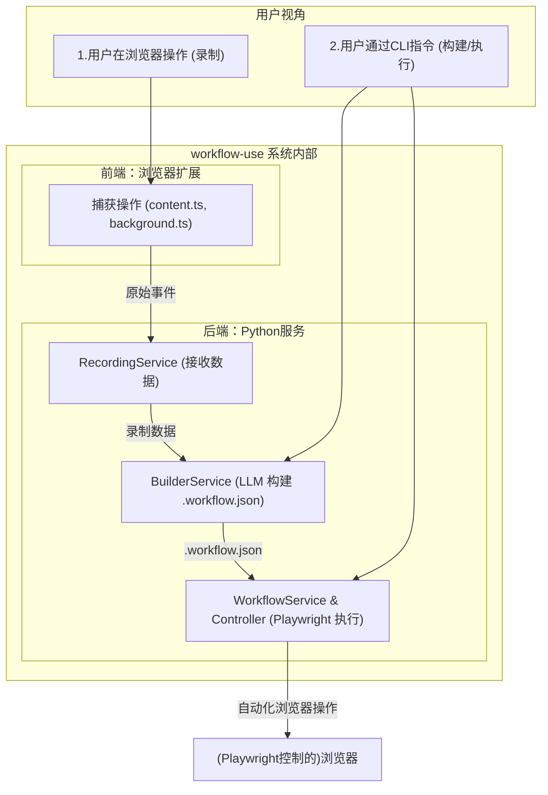
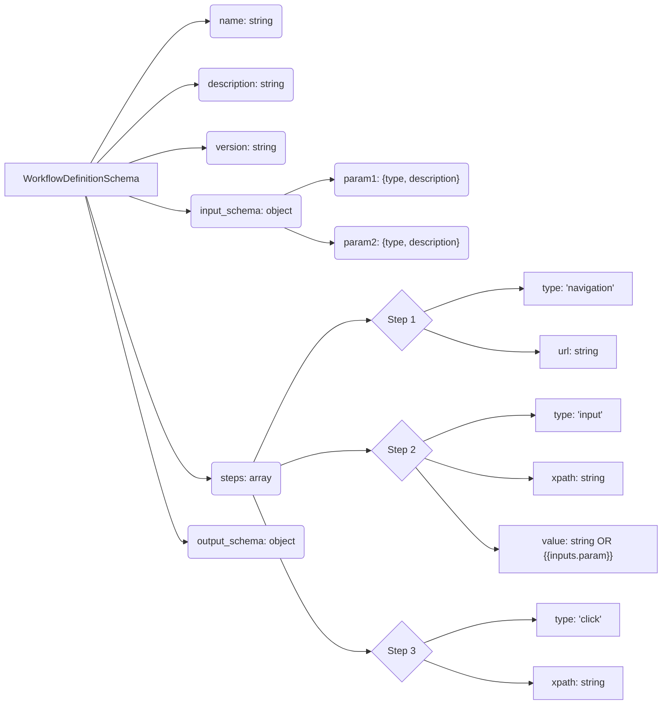

# 引言：告别重复，拥抱自动化 - `workflow-use` 为你而来

小明是一名勤奋的运营专员，每天他的工作都离不开浏览器。登录不同的后台系统查数据、核对报表、定期从特定网站抓取竞品信息、在多个平台发布内容……这些任务占据了他大量的时间。日复一日，单调重复的操作不仅让他感到疲惫，还时常因为疏忽导致一些小错误，影响工作效率。小明常常想：“如果能有个工具帮我自动完成这些烦人的重复操作，那该多好啊！”

你是否也像小明一样，被这些重复性的浏览器任务所困扰，渴望找到一种解放双手、提升效率的方法？

现在，让 **`workflow-use`** 来终结这一切！

**`workflow-use` 是什么？**

简单来说，`workflow-use` 是一款创新的自动化工具。它能像录像机一样**录制你在浏览器中的操作**（比如点击、输入、滚动、跳转页面等），然后智能地将这些录制下来的步骤**转化为一个可执行的自动化工作流程**。之后，你就可以让 `workflow-use` 代替你，精准地重放这些操作，自动完成那些曾经让你头疼的重复性任务。

**`workflow-use` 能为你解决什么核心问题？**

*   **大幅提升工作效率**：将你从重复的浏览器操作中解放出来，让你有更多时间专注于更有创造性和价值的工作。
*   **减少手动操作错误**：机器执行比人工操作更精确，能有效避免因疲劳或疏忽导致的错误。
*   **轻松实现浏览器任务自动化**：无论是每日的数据抓取、表单填写，还是定期的报告生成，`workflow-use` 都能帮你搞定。

**`workflow-use` 的项目亮点：**

*   **便捷的浏览器扩展录制**：通过直观易用的浏览器扩展，轻松录制你的操作，无需编写任何代码。
*   **LLM 辅助智能构建**：借助强大的大型语言模型（LLM），`workflow-use` 能够更智能地理解你的录制意图，将原始操作转化为结构清晰、更具鲁棒性的工作流。
*   **Playwright 精准执行**：基于业界领先的 Playwright 自动化框架，确保工作流在后端被精确、稳定地执行。

想象一下，只需录制一次，那些繁琐的日常任务就能自动运行。听起来是不是很酷？在接下来的文档中，我们将一步步带你了解 `workflow-use` 的强大功能，从安装、录制第一个工作流，到执行和高级定制。准备好和小明一起，开启你的自动化之旅，告别重复，拥抱高效吧！

**(快速预览：在后续章节中，你将看到一个简单工作流从录制到自动执行的完整演示，让你直观感受 `workflow-use` 的魅力！)**

## 第一章：初探 `workflow-use`：鸟瞰全景与核心概念

小明对 `workflow-use` 的强大功能印象深刻，他对这个能自动执行浏览器任务的工具产生了浓厚的兴趣，渴望了解它是如何运作的。他想知道，这背后究竟是怎样一番天地？

### 系统架构概览

`workflow-use` 主要由两大部分协同工作：

1.  **前端（浏览器扩展 `extension`）：** 这是你与 `workflow-use` 直接交互的界面，安装在你的浏览器中。它的核心职责是像一个忠实的记录员，捕捉你在网页上的每一个动作，如点击、输入文字、滚动页面等。
2.  **后端（Python项目 `workflows`）：** 这是 `workflow-use` 的“大脑中枢”，在你的计算机本地运行。它接收前端扩展发送过来的录制数据，通过智能处理（包括利用大型语言模型LLM），将这些原始操作记录构建成结构化的、可被机器理解和执行的自动化工作流。最终，它还负责指挥浏览器精确地执行这些工作流。

**通信方式：** 前端扩展在录制过程中或结束后，会将收集到的用户操作数据通过HTTP请求发送给在本地运行的Python后端服务。

下面是一个简化的架构图，帮助你理解主要组件和数据流向：



### 核心流程：魔法三部曲“录制 -> 构建 -> 执行”

`workflow-use` 的工作流程可以概括为三个核心阶段：

1.  **录制 (Record)：**
    *   **你做什么：** 在浏览器中安装 `workflow-use` 扩展后，启动录制功能。像往常一样执行你想要自动化的网页操作。
    *   **`workflow-use` 做什么：** 浏览器扩展的 `Content Script` 会实时监测并捕获你的鼠标点击、键盘输入、页面跳转、滚动等行为。`Background Script` 则收集这些事件，形成原始的操作记录。

2.  **构建 (Build)：**
    *   **你做什么：** 录制完成后，你可以通过 `workflow-use` 的命令行工具（CLI）指示后端服务处理这些录制数据。你可能还需要提供一个关于这个自动化任务的“目标描述”（例如，“登录网站并下载月度报告”）。
    *   **`workflow-use` 做什么：** 后端的 `BuilderService` 接收原始录制数据。这时，大型语言模型（LLM）会介入，像一位聪明的助手一样，分析这些操作步骤和你的目标，将其转化为一个结构清晰、逻辑严谨的自动化脚本。这个脚本就是“工作流定义文件”（通常是一个 `.workflow.json` 文件）。LLM的加入使得构建过程更加智能，能够理解更复杂的操作意图，并生成更可靠的工作流。

3.  **执行 (Execute)：**
    *   **你做什么：** 同样通过命令行工具，指示 `workflow-use` 运行你刚才构建好的工作流文件。
    *   **`workflow-use` 做什么：** 后端的 `Workflow Service` 和 `WorkflowController` 协同工作。它们会读取 `.workflow.json` 文件中的指令，然后借助 Playwright（一个强大的浏览器自动化工具）在后台启动一个浏览器，并像一个不知疲倦的机器人一样，一步步精确重现你录制的操作。如果中途遇到小波折（比如某个按钮找不到了），系统甚至可以尝试再次利用LLM的智能来寻找替代方案，努力完成任务。

### 关键组件探秘 (初步认知)

为了实现上述流程，`workflow-use` 依赖于一系列精心设计的组件：

*   **浏览器扩展 (`extension`)关键成员：**
    *   `content.ts`: 注入到你浏览的网页中，是事件捕获的“侦察兵”。
    *   `background.ts`: 扩展的“后台总指挥”，管理录制状态、收集数据、与后端通信。
    *   `sidepanel` (或弹出窗口): 提供用户界面，让你控制录制开始/停止，查看状态等。
*   **Python后端 (`workflows`)核心模块：**
    *   `cli.py`: 你的“指挥棒”，通过命令行与 `workflow-use` 交互，发起录制、构建、执行等指令。
    *   `RecordingService`: 负责接收和管理从浏览器扩展发送过来的原始录制数据。
    *   `BuilderService`: “智能建筑师”，利用LLM将原始数据构建成结构化的工作流定义。
    *   `WorkflowController`: “行动执行官”，使用Playwright具体执行工作流中的每一个自动化步骤。
    *   `Workflow` (或 `WorkflowService`): “总调度师”，负责解析工作流定义，按顺序调用 `WorkflowController` 执行任务，并处理执行过程中的逻辑（如错误处理、LLM回退）。

### 核心数据结构：工作流的蓝图 - `WorkflowDefinitionSchema`

在 `workflow-use` 中，所有构建好的工作流最终都会以一种名为 `WorkflowDefinitionSchema` 的标准格式进行存储和描述。你可以把它想象成一张详细的自动化任务执行蓝图。这个蓝图通常保存在一个JSON文件（例如 `my_task.workflow.json`）中，里面精确定义了任务的每一步操作（如访问哪个网址、点击哪个按钮、输入什么文本等）以及可能需要的输入参数。
这是连接“构建”阶段和“执行”阶段的桥梁，后续章节我们会更深入地了解它的具体结构。

通过这第一章的概览，小明对 `workflow-use` 的整体运作有了一个初步但清晰的认识。他知道了这个工具是如何将他的浏览器操作变成可自动执行的流程，也了解了其中涉及的主要“演员”（组件）和它们扮演的角色。现在，他已经迫不及待想要动手尝试，亲自体验录制第一个自动化魔法了！

---

## 第二章：你的第一个自动化魔法：通过浏览器扩展录制操作

小明已经对 `workflow-use` 的整体架构和核心流程有了大致的了解，心中充满了期待。他摩拳擦掌，准备亲自体验一下这个自动化工具的“魔法”——从录制自己的浏览器操作开始。

### 安装与设置 `workflow-use` 浏览器扩展

要开始录制，首先需要在你的浏览器中安装 `workflow-use` 扩展。通常，这涉及到以下步骤（具体步骤请参照项目官方文档或仓库说明）：

1.  **获取扩展文件**：你可能需要从项目的发布页面下载打包好的扩展（`.zip` 或 `.crx` 文件），或者从源代码构建。假设我们已经有了一个名为 `workflow-use-extension.zip` 的文件。
2.  **解压扩展文件**：将下载的 `.zip` 文件解压到一个你方便管理的文件夹，例如 `/app/work/workflow-use-extension`。
3.  **在浏览器中加载扩展**：
    *   打开你的 Chromium 内核浏览器（如 Google Chrome, Microsoft Edge）。
    *   在地址栏输入 `chrome://extensions` (或 `edge://extensions`) 并回车。
    *   确保右上角的“开发者模式 (Developer mode)”已开启。
    *   点击“加载已解压的扩展程序 (Load unpacked)”按钮。
    *   选择你刚刚解压扩展文件的文件夹 (例如 `/app/work/workflow-use-extension`，具体应指向包含 `manifest.json` 文件的那个层级)。
4.  **固定扩展图标**：安装成功后，你会在浏览器的扩展程序列表中看到 `workflow-use`。建议将其固定到工具栏，方便快速访问。

*(注意：以上为通用安装步骤，请务必参考 `workflow-use` 项目的最新官方文档以获取最准确的安装指南。)*

小明按照步骤，顺利地将扩展安装到了他的浏览器中。

### 扩展界面导览

安装完成后，小明点击了浏览器工具栏上的 `workflow-use` 图标，一个小巧的控制面板（可能是 Sidepanel 或 Popup 形式）展现在他眼前。

界面通常会包含以下核心元素：

*   **开始/停止录制按钮 (Start/Stop Recording)**：这是最核心的控制按钮，用于启动和结束浏览器操作的录制会话。
*   **录制状态指示器 (Recording Status Indicator)**：清晰地显示当前是“正在录制 (Recording)”、“已停止 (Stopped)”还是“空闲 (Idle)”等状态。
*   **（可能的）事件查看器/日志区域**：有些版本的扩展可能会直接在界面上展示捕获到的事件概要或数量，让用户对录制过程有一个实时的反馈。
*   **（可能的）选项/设置按钮**：用于进行一些基本配置，如指定后端服务地址等。

小明熟悉了一下界面，感觉一切都非常直观。

### 开始你的第一次录制：一个简单的登录示例

小明决定录制一个简单的“登录演示网站”的流程。

1.  **准备就绪**：小明打开了一个用于测试的登录页面。
2.  **启动录制**：他点击了 `workflow-use` 扩展图标，然后在控制面板上按下了“开始录制”按钮。状态指示器立刻变成了“正在录制”。
3.  **执行操作**：
    *   他在用户名输入框中输入了“testuser”。
    *   他在密码输入框中输入了“password123”。
    *   他点击了“登录”按钮。
    *   页面跳转到了登录后的欢迎页。
4.  **停止录制**：小明再次点击扩展图标，按下了“停止录制”按钮。状态指示器变回“已停止”。

在小明进行这些操作的时候，`workflow-use` 扩展内部发生了什么呢？

*   **`content.ts` 的秘密工作**：当录制启动后，`content.ts` 脚本（已注入到当前网页）就像一个敏锐的侦探，开始监听页面的各种事件：
    *   **DOM 事件捕获**：它会捕获到小明的每一次点击（`click` 事件，知道他点击了哪个元素），每一次键盘输入（`input` 事件，知道他在哪个输入框输入了什么内容，对于密码框通常会做脱敏处理）。
    *   **`rrweb` 的角色**：除了基本的DOM交互，`workflow-use` 通常还会集成 `rrweb` 这样的库。`rrweb` 能够录制页面上几乎所有的DOM变化、鼠标移动、滚动等信息，形成一个可以完整“回放”的会话记录。这对于理解复杂交互和页面动态变化非常有用。
    *   **智能元素识别**：为了确保自动化脚本的稳定性，当捕获到一个元素交互时（比如点击按钮），`workflow-use` 不仅仅是简单记录。它会尝试通过多种方式来唯一标识这个元素：
        *   `getXPath(element)`：生成该元素的 XPath 路径，这是一种强大且较为稳定的元素定位方式。
        *   `getEnhancedCSSSelector(element, xpath)`：结合元素的标签名、ID、class 等属性，生成一个增强的 CSS 选择器，并可能参考XPath来提高唯一性。
        这些信息对于后续在自动化执行时准确找到同一个元素至关重要。

*   **`background.ts` 的数据汇总与传递**：
    *   `content.ts` 捕获到的所有事件信息（如事件类型、目标元素的XPath/CSS选择器、输入的值、时间戳、当前URL等）都会被发送给扩展的“大脑”——`background.ts` 脚本。
    *   `background.ts` 负责收集和管理当前录制会话中的所有事件。它可能会对事件进行初步的整理或过滤，然后将这些结构化的事件数据存储起来（可能在内存中，或准备发送到后端）。

### 录制数据初探：`StoredEvent` 的模样

当小明停止录制后，他所进行的一系列操作已经被转换成了一连串的“存储事件”（`StoredEvent`）。每种类型的操作（点击、输入、导航等）都会对应一种特定结构的 `StoredEvent`。

例如，小明的一次点击操作，可能被记录成类似这样的 `StoredCustomClickEvent`（简化示例）：

```json
{
  "messageType": "CUSTOM_CLICK_EVENT",
  "timestamp": 1678886401234, // 事件发生的时间戳
  "url": "https://example.com/login", // 事件发生时的页面URL
  "frameUrl": "https://example.com/login", // 事件发生时的iframe URL (如果是主页面则相同)
  "xpath": "/html/body/div[1]/form/button[1]", // 被点击元素的XPath
  "cssSelector": "body > div.container > form > button.btn-login", // 被点击元素的CSS选择器
  "elementTag": "BUTTON", // 元素标签名
  "elementText": "登录", // 元素内的文本内容 (部分)
  "tabId": 123 // 发生事件的浏览器标签页ID
  // ... 可能还有其他如截图相关的字段
}
```

而一次输入操作，则可能像一个 `StoredCustomInputEvent`：

```json
{
  "messageType": "CUSTOM_INPUT_EVENT",
  "timestamp": 1678886390123,
  "url": "https://example.com/login",
  "xpath": "/html/body/div[1]/form/input[@name='username']",
  "cssSelector": "input[name='username']",
  "elementTag": "INPUT",
  "value": "testuser", // 输入的值
  "tabId": 123
  // ...
}
```

这些 `StoredEvent` 对象就是原始的录制产物，它们详细记录了用户在浏览器中的每一步关键行为。正是这些数据，构成了后续构建自动化工作流的基础。

### 录制技巧与最佳实践

为了录制出高质量、易于转换为可靠工作流的操作，小明学到了一些小技巧：

*   **清晰、连贯的操作**：尽量模拟真实场景下的操作流程，避免不必要的鼠标晃动或无关点击。
*   **等待页面加载完成**：在进行点击或输入前，确保页面元素已经完全加载完毕，尤其是在网速较慢或页面内容较复杂时。`workflow-use` 内部通常会有机制处理等待，但良好的操作习惯能减少不确定性。
*   **一次录制一个完整的小任务**：将复杂的任务分解成若干个独立的小任务进行录制，这样生成的工作流更易于管理和维护。
*   **注意动态内容**：如果页面上有动态加载或变化的内容，录制时要确保这些内容是你期望交互的状态。
*   **测试常用交互**：对于输入框、下拉选择、日期选择器等常见控件，确保录制时覆盖了这些交互。

小明成功完成了他的第一次录制！虽然只是一个简单的登录操作，但他已经感受到了 `workflow-use` 浏览器扩展的便捷与强大。他现在对这些录制下来的数据如何变成一个能自动运行的“魔法脚本”充满了好奇。下一章，我们将探索如何将这些原始记录构建成可执行的工作流蓝图。

---

## 第三章：从原始记录到可执行蓝图：构建你的工作流

小明成功录制了他的第一个浏览器操作流程，一堆包含了XPath、CSS选择器和操作值的 `StoredEvent` 数据静静地躺在那里（或者说，已经被 `background.ts` 收集并可能发送给了后端）。他知道，这些只是原始素材，就像一盘散沙，还不能直接用来自动化执行。现在，他需要学习如何将这些零散的记录“点石成金”，转换成一个结构清晰、机器能够理解并执行的“工作流蓝图”。

### 后端服务的迎接与准备：`RecordingService`

当浏览器扩展将录制数据发送出来时，`workflow-use` 的Python后端早已准备就绪。

*   **`RecordingService` 登场**：在后端，有一个名为 `RecordingService` (位于 `workflows/workflow_use/recorder/service.py`) 的组件。它的主要职责之一就是监听并接收来自浏览器扩展的HTTP请求，这些请求中就携带着我们之前看到的 `StoredEvent` 序列。
*   **数据的暂存与初步处理**：`RecordingService` 接收到数据后，会将其暂时保存起来。这可能是在内存中，或者写入一个临时的JSON文件。这个原始的录制数据文件，我们通常称之为“录制记录”或“会话日志”。

小明了解到，他录制的登录操作数据，现在已经安全地抵达了后端，等待着下一步的“深加工”。

### 发起构建：来自命令行的指令

将原始录制数据转化为结构化工作流的过程，我们称之为“构建”。`workflow-use` 通常通过其命令行界面（CLI）来触发这一过程。这个CLI工具一般由 `cli.py` (位于 `workflows/cli.py`) 文件提供。

小明打开了他的终端，准备使用 `workflow-use` 的命令：

*   **`build-from-recording <recording_file_path>`**：如果小明已经有了一个保存好的录制数据文件（例如，由 `RecordingService` 自动保存，或者他手动导出的），他可以使用这个命令。他需要向命令提供该录制数据文件的路径。
    ```bash
    workflow-cli build-from-recording /path/to/my_login_recording.json
    ```
*   **`create-workflow`**：这是一个更集成的命令。它可能会先启动一个特殊的录制会话（由 `RecordingService` 配合 Playwright 打开一个带扩展的浏览器窗口让你操作），录制完成后，自动接续到构建步骤。

小明选择了 `build-from-recording`，因为他假设 `RecordingService` 已经帮他保存了上一次的录制结果。

### `BuilderService` 的智慧：LLM 的魔法加持

当构建命令被触发后，后端的 `BuilderService` (位于 `workflows/workflow_use/builder/service.py`) 就开始大显神通了。这可不是简单的格式转换，而是 `workflow-use` 智能化的核心体现。

*   **`BuilderService` 的核心使命**：它的任务是将原始的、可能包含冗余信息或不确定性的 `StoredEvent` 序列，结合用户可能提供的“任务目标”（比如小明心里的目标是“登录示例网站”），转换成一个高度结构化、语义清晰、且具有一定鲁棒性的工作流定义。
*   **LLM 的智慧融入**：这正是 `workflow-use` 与众不同之处。`BuilderService` 会将原始事件序列、相关的上下文信息（如页面截图的分析结果，如果启用了的话），以及用户的目标描述，一同“喂”给一个大型语言模型（LLM），例如 GPT-4o。
    *   **提示模板 (`WORKFLOW_BUILDER_PROMPT_TEMPLATE`)**：为了让LLM更好地理解任务并按预期格式输出，`workflow-use` 会使用精心设计的提示模板（通常定义在 `workflows/workflow_use/builder/prompts.py` 中）。这个模板会指导LLM分析事件，识别关键步骤，过滤不必要的操作，甚至对操作进行泛化（比如，将一次具体的点击理解为“点击登录按钮”这一通用意图）。
    *   **LLM 的作用**：
        *   **理解意图**：LLM能够超越事件的表面形式，理解用户的真实操作意图。
        *   **步骤泛化与抽象**：将具体的、可能不稳定的选择器点击，转化为更通用的操作描述。
        *   **处理不确定性**：例如，如果录制中有多次尝试点击同一个元素，LLM可以帮助判断哪一次是有效的。
        *   **生成结构化输出**：确保最终生成的工作流定义符合预设的 `WorkflowDefinitionSchema` 格式。

小明想象着，他那些看似杂乱的点击和输入操作，在LLM的“智慧之眼”下，被一步步梳理、提炼，最终变成了一份精确的指令集。

### 工作流的“DNA”：`WorkflowDefinitionSchema` 详解

经过 `BuilderService` 和 LLM 的共同努力，最终的产出是一个遵循 `WorkflowDefinitionSchema` 的结构化数据。这个 Schema 定义了工作流的完整规范，通常位于 `workflows/workflow_use/schema/views.py`。它是工作流的“DNA”，精确描述了工作流的每一个细节。

让我们揭开 `WorkflowDefinitionSchema` 的神秘面纱：

一个典型的工作流定义 (`.workflow.json` 文件内容) 会包含以下主要部分：

*   **基本信息**：如工作流的名称、描述、版本等。
*   **输入参数 (`input_schema`)**：定义了执行此工作流时可以动态传入的变量。例如，小明的登录工作流，可以将用户名和密码定义为输入参数，这样每次执行时就可以用不同的账号登录了。
    ```json
    "input_schema": {
      "username": {"type": "string", "description": "The username for login"},
      "password": {"type": "string", "description": "The password for login"}
    }
    ```
*   **步骤 (`steps`)**：这是核心部分，一个包含了多个操作步骤的列表。每个步骤对象都详细描述了一个具体的操作。常见的步骤类型有：
    *   **`NavigationStep`**：导航到指定的URL。
        *   关键属性：`url` (目标网址), `type: "navigation"`
    *   **`ClickStep`**：点击页面上的一个元素。
        *   关键属性：`xpath`, `cssSelector` (定位元素), `type: "click"`
    *   **`InputStep`**：在指定的输入框中输入文本。
        *   关键属性：`xpath`, `cssSelector` (定位元素), `value` (要输入的文本，可以是固定值或来自输入参数的占位符如 `{{inputs.username}}`), `type: "input"`
    *   **`ScrollStep`**：滚动页面。
        *   关键属性：`scrollX`, `scrollY` (滚动距离), `type: "scroll"`
    *   **`KeyPressStep`**：模拟按键（如 Enter, Tab）。
        *   关键属性：`key` (要按下的键), `type: "key_press"`
    *   *(可能还有其他如 `SelectChangeStep` 用于下拉选择等)*
*   **输出参数 (`output_schema`)**：(如果需要) 定义了工作流执行完毕后，期望从页面提取并返回的数据。

下面是一个简化的 `WorkflowDefinitionSchema` 结构示意图：



### 最终产物：你的第一个 `.workflow.json` 文件

构建过程完成后，`BuilderService` 会将生成的符合 `WorkflowDefinitionSchema` 的工作流保存为一个 `.workflow.json` 文件。这个文件就是小明自动化任务的“可执行蓝图”。

基于小明之前录制的简单登录操作，一个由 `BuilderService` 生成的（简化版）`.workflow.json` 文件可能如下所示：

```json
{
  "name": "Login Workflow Example",
  "description": "A simple workflow to log into an example website.",
  "version": "1.0.0",
  "input_schema": {
    "username": {
      "type": "string",
      "description": "Username for login"
    },
    "password": {
      "type": "string",
      "description": "Password for login"
    }
  },
  "steps": [
    {
      "type": "navigation",
      "url": "https://example.com/login",
      "description": "Navigate to the login page."
      // timestamp, tabId等元数据可能也会保留
    },
    {
      "type": "input",
      "xpath": "/html/body/div[1]/form/input[@name='username']", // 来自录制或LLM优化
      "cssSelector": "input[name='username']",
      "value": "{{inputs.username}}", // 使用了输入参数
      "elementTag": "INPUT",
      "description": "Enter the username."
    },
    {
      "type": "input",
      "xpath": "/html/body/div[1]/form/input[@name='password']",
      "cssSelector": "input[name='password']",
      "value": "{{inputs.password}}", // 使用了输入参数
      "elementTag": "INPUT",
      "description": "Enter the password."
    },
    {
      "type": "click",
      "xpath": "/html/body/div[1]/form/button[1]",
      "cssSelector": "button.btn-login",
      "elementTag": "BUTTON",
      "elementText": "登录",
      "description": "Click the login button."
    },
    {
      "type": "navigation", // 假设登录后有页面跳转，LLM可能会推断这是一个新的导航步骤
      "url_pattern": "https://example.com/dashboard", // LLM可能不会直接写死URL，而是用模式
      "description": "Verify successful login by checking dashboard URL."
    }
  ],
  "output_schema": {} // 本示例无特定输出
}
```

小明看着这个 `.workflow.json` 文件，虽然比原始的 `StoredEvent` 列表要简洁和结构化得多，但也蕴含了更丰富的信息。他注意到，原本录制时输入的具体用户名和密码，在构建后被替换成了 `{{inputs.username}}` 和 `{{inputs.password}}` 这样的占位符，这意味着这个工作流变得更加通用了！而且，LLM 可能还加入了一些描述性的文本，甚至根据上下文推断出了登录成功后的验证步骤。

现在，小明手里有了一份真正意义上的自动化脚本。他已经迫不及待地想知道，如何让 `workflow-use` 按照这份蓝图，自动地在浏览器中“表演”一次登录操作了。下一章，我们将揭晓执行的奥秘！

---

## 第四章：让魔法流动起来：执行与控制你的自动化工作流

小明手中拿着那个凝聚了智慧的 `.workflow.json` 文件，心情有些激动。他已经完成了录制和构建这两个关键步骤，现在，是时候见证奇迹了——让 `workflow-use` 真正地、自动地执行他定义的浏览器操作流程！

### 发起执行：再次呼叫命令行

与构建过程类似，工作流的执行也是通过 `workflow-use` 的命令行界面（CLI）来启动的。小明打开终端，准备输入新的指令。

`workflow-use` 通常提供以下命令来执行工作流：

*   **`run-workflow <workflow_file_path>`**：这是最直接的执行命令。小明需要指定他想要运行的 `.workflow.json` 文件的路径。
    ```bash
    workflow-cli run-workflow /path/to/my_login_workflow.workflow.json
    ```
    如果工作流定义了输入参数（比如小明的登录工作流需要用户名和密码），CLI 可能会提示小明输入这些参数的值，或者允许通过命令行选项直接传入。

*   **`run-as-tool <workflow_file_path> --prompt "登录网站，用户名为myuser，密码为mypass"`**：这个命令更加高级。它允许你将整个工作流作为一个“工具”来运行。`workflow-use` 会尝试从你提供的 `--prompt` 文本中智能解析出工作流所需的输入参数。这对于将 `workflow-use` 集成到更复杂的AI代理或LangChain应用中非常有用。

小明决定先从简单的 `run-workflow` 开始，体验一下基础的执行流程。

```bash
workflow-cli run-workflow ./examples/example.workflow.json # 假设他的文件在这个路径
# 终端可能会提示他输入 username 和 password
# Please enter value for username: testuser_01
# Please enter value for password: securePassword!
```

### `Workflow` 服务：自动化流程的指挥家

当小明敲下回车键后，`workflow-use` 后端的 `Workflow` 服务（通常实现于 `workflows/workflow_use/workflow/service.py` 中的 `Workflow` 类）便开始接管。它就像一个经验丰富的乐队指挥，确保每一个“乐章”（工作流步骤）都能准确无误地演奏出来。

*   **加载与解析蓝图**：`Workflow` 服务首先会读取小明指定的 `.workflow.json` 文件，并使用 `WorkflowDefinitionSchema` 来解析和验证其内容。它要确保这份“蓝图”是完整且符合规范的。
*   **处理输入参数**：如果工作流定义了输入参数（如 `input_schema`），并且小明通过CLI提示或命令选项提供了这些值，`Workflow` 服务会负责将这些实际的输入值与工作流定义中的占位符（如 `{{inputs.username}}`）进行绑定。这样，在后续执行具体步骤时，凡是遇到占位符的地方，都会被替换成小明提供的真实数据。
*   **按部就班的调度**：`Workflow` 服务会严格按照 `.workflow.json` 文件中 `steps` 数组定义的顺序，一个接一个地调度和执行工作流中的每一个步骤。

### `WorkflowController`：动作的精确执行者与 Playwright 的力量

当 `Workflow` 服务调度到一个具体的步骤时（比如一个“点击按钮”或“输入文本”的步骤），它会将这个步骤的详细指令交给 `WorkflowController` (位于 `workflows/workflow_use/controller/service.py`)。

*   **接收指令**：`WorkflowController` 就像一位技艺精湛的“木偶操纵师”，它接收来自 `Workflow` 服务的具体动作指令，例如：“请在 XPath 为 `//button[@id='login']` 的元素上执行一次点击操作”。
*   **Playwright 的登场**：`WorkflowController` 的核心武器库就是 **Playwright**。Playwright 是一个由微软开发的强大的浏览器自动化框架。
    *   `WorkflowController` 会在后台（通常是无头模式，即不显示浏览器界面，但也可以配置为有头模式方便调试）启动一个由 Playwright 控制的浏览器实例。
    *   对于每一个动作指令，`WorkflowController` 会调用 Playwright 提供的相应API来与浏览器进行交互：
        *   **导航 (`NavigationStep`)**：使用 `page.goto(url)`。
        *   **点击 (`ClickStep`)**：首先通过 `page.locator(xpath_or_css_selector)` 定位元素，然后执行 `.click()`。
        *   **输入 (`InputStep`)**：定位元素后，使用 `.fill(value)` 或 `.type(value)` 输入文本。
        *   **滚动 (`ScrollStep`)**：使用 `page.mouse.wheel(deltaX, deltaY)` 或 `element.scroll_into_view_if_needed()`。
    *   **智能元素定位 (`get_best_element_handle`)**：为了提高执行的稳定性，`WorkflowController` 在定位元素时，可能会使用到 `workflows/workflow_use/controller/utils.py` 中的辅助函数，如 `get_best_element_handle`。这个函数可能会尝试使用多种选择器（如XPath、CSS选择器组合）来找到目标元素，确保即使页面结构有微小变动，也能尽可能准确地定位。

小明虽然看不到浏览器界面（如果是无头模式），但他能从终端的日志输出中感知到，一个虚拟的浏览器正在后台被精确地操控着，一步步执行着他在 `.workflow.json` 中定义的登录流程。

### 容错与智能：当确定性步骤失败时的 LLM 代理回退

自动化并非总是一帆风顺。有时，由于网络延迟、页面结构变化等原因，预定义的确定性步骤（比如“通过XPath点击某个按钮”）可能会失败——元素找不到了，或者点击后没有预期的反应。

这时，`workflow-use` 的一个高级特性就可能被激活了：**LLM 代理回退 (`_fallback_to_agent`)**。

*   **失败的捕获**：当 `WorkflowController` 执行一个确定性步骤失败时，`Workflow` 服务会捕获这个错误。
*   **LLM 代理的介入**：如果启用了回退机制，`Workflow` 服务不会立即放弃，而是会将当前失败的步骤信息（原始目标、失败原因、页面当前状态的快照或DOM结构等）连同一个特殊的提示（可能定义在 `workflows/workflow_use/workflow/prompts.py` 中的 `WORKFLOW_FALLBACK_PROMPT_TEMPLATE`）发送给LLM。
*   **LLM 的“临场发挥”**：这个提示会请求LLM：“原计划的A操作失败了，请分析当前情况，并尝试用其他方法（从可用工具列表中选择）达成原步骤的目标‘X’”。LLM 可能会决定尝试用不同的选择器再次定位元素、或者先执行一个等待操作、甚至尝试一个完全不同的操作序列来迂回达成目标。
*   **增加鲁棒性**：这种机制极大地增强了工作流的鲁棒性。它使得 `workflow-use` 在面对一些突发状况时，不再是僵硬地失败，而是能像一个有初步判断和解决问题能力的人一样，尝试变通和补救。

小明对这个特性印象深刻，这让 `workflow-use` 看起来更像一个智能助手，而不仅仅是一个死板的脚本执行器。

### 监控执行与结果

在工作流执行期间以及执行完毕后，小明可以通过以下方式了解执行情况：

*   **终端日志**：`workflow-use` 通常会在终端实时打印详细的执行日志，包括当前正在执行哪个步骤、步骤的参数是什么、执行成功还是失败、是否有错误信息等。
    ```
    INFO:workflow_use.workflow.service:Executing step 1/4: NavigationStep (url='https://example.com/login')
    INFO:workflow_use.controller.service:🔗 Navigated to URL: https://example.com/login
    INFO:workflow_use.workflow.service:Step 1 executed successfully.
    INFO:workflow_use.workflow.service:Executing step 2/4: InputStep (xpath='...', value='testuser_01')
    INFO:workflow_use.controller.service:⌨️ Input 'testuser_01' into element with XPath: ...
    INFO:workflow_use.workflow.service:Step 2 executed successfully.
    ...
    INFO:workflow_use.workflow.service:Workflow execution completed successfully.
    ```
*   **执行状态**：执行结束后，通常会明确告知整个工作流是成功完成还是因错误中止。
*   **工作流输出**：如果工作流定义了输出参数（`output_schema`），并且在执行过程中成功提取了这些数据，那么这些输出结果也会在执行完毕后展示给小明或保存到指定位置。

随着终端最后一行“Workflow execution completed successfully.”的出现，小明长舒了一口气。他成功地让 `workflow-use` 自动完成了之前录制的登录操作！从录制、构建到执行，他完整地体验了 `workflow-use` 的核心魅力。

现在，小明已经掌握了 `workflow-use` 的基本功。但他还想知道，如何让工作流更灵活？如何处理更复杂的场景？如何将 `workflow-use` 的能力发挥到极致？下一章，我们将一起探索更高级的魔法。

---

## 第五章：高级魔法：定制与扩展你的 `workflow-use` 体验

小明已经成功掌握了 `workflow-use` 的基本三部曲：录制、构建和执行。他能够轻松地将日常的浏览器操作转化为自动化流程，这让他兴奋不已。但小明是个爱钻研的人，他想知道：`workflow-use` 还有没有更酷、更灵活的玩法？能不能让工作流适应更多变的场景？能不能把它集成到其他工具里？

答案是肯定的！这一章，我们将跟随小明，一起探索 `workflow-use` 的高级魔法，学习如何定制和扩展你的自动化体验。

### 参数化工作流：让你的魔法更通用

在第三章我们初步接触到，`BuilderService` 在构建工作流时，可能会将一些具体的值（如登录时的用户名密码）转化为输入参数，例如 `{{inputs.username}}`。这就是**参数化**。

**为什么需要参数化？**

想象一下，小明录制了一个“搜索商品并记录价格”的工作流。如果商品名称是写死在工作流里的，那这个工作流就只能搜索那一个商品。但如果将“商品名称”作为一个输入参数，那么同一个工作流就能用来搜索任何商品了！

**如何在 `.workflow.json` 中定义和使用输入参数？**

在工作流定义文件 (`.workflow.json`) 的 `input_schema` 部分，你可以定义工作流接受的输入参数及其类型和描述。

```json
{
  "name": "Search Product Price",
  // ...
  "input_schema": {
    "product_name": {
      "type": "string",
      "description": "The name of the product to search for"
    },
    "target_website": {
      "type": "string",
      "description": "Website URL to search on (e.g., amazon.com, taobao.com)",
      "default": "amazon.com" // 还可以提供默认值
    }
  },
  "steps": [
    {
      "type": "navigation",
      "url": "https://{{inputs.target_website}}", // 使用参数
      "description": "Navigate to the target website."
    },
    {
      "type": "input",
      "xpath": "//input[@id='search-bar']", // 假设的搜索框XPath
      "value": "{{inputs.product_name}}", // 使用参数
      "description": "Enter the product name in the search bar."
    },
    // ... 其他步骤，如点击搜索按钮，提取价格等
  ]
}
```

**如何在执行时传入参数？**

当使用 `run-workflow` 命令执行时，如果CLI检测到 `input_schema` 中定义了没有默认值的参数，它通常会提示你输入：

```bash
workflow-cli run-workflow ./search_product.workflow.json
Please enter value for product_name: Laptop XYZ
Please enter value for target_website (default: amazon.com): # 直接回车使用默认值
```

或者，CLI可能支持通过命令行选项直接传入：

```bash
workflow-cli run-workflow ./search_product.workflow.json --inputs '{"product_name": "Laptop XYZ", "target_website": "bestbuy.com"}'
```

通过参数化，小明的工作流变得更加灵活和可复用。

### 提取和使用工作流输出：让魔法产生结果

自动化不仅是执行操作，很多时候我们还需要从页面上获取信息作为结果。比如，搜索完商品价格后，小明希望得到这个价格数据。

**如何在 `.workflow.json` 中定义输出？**

工作流定义中的 `output_schema` 用于声明工作流执行完毕后期望返回的数据结构。而要在步骤中实际提取数据并赋值给输出，通常会结合一个特殊的步骤类型或在一个现有步骤中添加 `output_mapping` 之类的属性（具体实现可能因 `workflow-use` 版本而异，这里以概念为主）。

假设有一个 `ExtractDataStep` (或者是在某个步骤如 `InputStep`、`ClickStep` 之后增加一个提取数据的能力)：

```json
{
  "name": "Search Product Price and Extract",
  // ...
  "input_schema": { /* ... */ },
  "steps": [
    // ... (导航、输入商品名、点击搜索)
    {
      "type": "extract_text", // 假设有这么一个步骤类型
      "xpath": "//span[@class='price-tag']", // 定位价格元素的XPath
      "description": "Extract the product price.",
      "assign_to_output": "product_price" // 将提取到的文本赋值给名为 product_price 的输出变量
    }
  ],
  "output_schema": {
    "product_price": {
      "type": "string", // 或 "number" 如果能确保转换
      "description": "The extracted price of the product."
    }
  }
}
```
*另一种可能的方式是在某个操作步骤后直接指定输出*：
```json
// ...
    {
      "type": "input", // 或者其他能获取到value的步骤
      "xpath": "//span[@id='orderId']",
      "read_value_to_output": "extracted_order_id" // 读取该元素的value/textContent到输出
    }
// ...
  "output_schema": {
    "extracted_order_id": { "type": "string" }
  }
```

**如何获取输出结果？**

当工作流执行完毕后，如果成功提取了数据，`workflow-use` 的CLI或其作为库调用时的返回结果中会包含这些输出值。

```
INFO:workflow_use.workflow.service:Workflow execution completed successfully.
INFO:workflow_use.workflow.service:Workflow outputs: {"product_price": "$999.99"}
```

小明现在不仅能让 `workflow-use` 替他干活，还能让它把干活的结果带回来！

### 手动编辑和优化 `.workflow.json`：精雕细琢你的魔法

虽然 `BuilderService` 和 LLM 已经非常智能，但有时小明可能还是想对生成的 `.workflow.json` 文件进行一些手动调整和优化，以追求极致的性能或应对特殊情况。

*   **调整选择器**：如果发现某个XPath或CSS选择器不够稳定，小明可以凭借自己的经验或使用浏览器开发者工具找到一个更可靠的选择器，然后直接修改文件中的相应字段。
*   **修改参数或值**：直接更改步骤中的固定值，或调整输入/输出参数的定义。
*   **增删或重排步骤**：根据实际需求，可以手动添加新的步骤（参考 `WorkflowDefinitionSchema` 中定义的各种步骤类型），删除多余的步骤，或者调整步骤的执行顺序。
*   **添加注释或描述**：为复杂的步骤或逻辑添加更详细的 `description`，方便自己和他人理解。
*   **优化等待和超时**：某些步骤可能需要更长或更短的等待时间，可以查找是否有相关参数进行调整（这通常在 `WorkflowController` 的动作实现中处理，但有时Schema也可能暴露一些控制选项）。

**注意事项与潜在风险**：

*   **备份为先**：手动编辑前，务必备份原始的 `.workflow.json` 文件。
*   **遵循 Schema**：修改时必须严格遵守 `WorkflowDefinitionSchema` 的规范，否则执行时可能会解析失败。最好有一个Schema的参考文档在手边。
*   **测试验证**：任何手动修改后，都必须重新运行工作流进行充分测试，确保修改没有引入新的问题。

小明通过手动编辑，让他的工作流更加“得心应手”。

### 理解和扩展 `WorkflowController`（概念性）

`WorkflowController` 是所有浏览器自动化动作的实际执行者。它内部注册了一系列动作，如 `navigation`, `click`, `input` 等，每个动作都对应 Playwright 的具体操作。

对于有编程能力的开发者，如果 `workflow-use` 预定义的动作无法满足某些特殊需求（例如，需要执行一段特定的JavaScript脚本、处理复杂的Canvas交互等），理论上可以扩展 `WorkflowController`：

1.  **分析现有动作**：阅读 `workflows/workflow_use/controller/service.py` 中现有动作的实现代码，理解它们是如何接收参数、调用Playwright API、以及返回结果的。
2.  **添加新动作**：可以仿照现有动作的模式，定义新的动作函数，并使用 `@self.registry.action(...)` 装饰器将其注册到控制器中。你需要为新动作定义参数模型（Pydantic模型）。
3.  **更新Schema（如果需要）**：如果新动作需要在 `.workflow.json` 中以新的步骤类型出现，那么 `WorkflowDefinitionSchema` (位于 `workflows/workflow_use/schema/views.py`) 也需要相应更新，加入对这个新步骤类型的定义。

这是一个更高级的定制方式，需要一定的Python和Playwright知识。对于小明这样的普通用户，了解其可能性即可。

### LLM 提示工程进阶：微调AI的“说话”方式

`workflow-use` 的智能很大程度上依赖于LLM。而LLM的表现，又与其接收到的“提示（Prompt）”密切相关。

项目中通常有专门的Python文件（如 `workflows/workflow_use/builder/prompts.py` 和 `workflows/workflow_use/workflow/prompts.py`）定义了用于不同场景的提示模板：

*   `WORKFLOW_BUILDER_PROMPT_TEMPLATE`：用于指导LLM将原始录制事件构建成结构化工作流。
*   `WORKFLOW_FALLBACK_PROMPT_TEMPLATE`：用于在确定性步骤失败时，指导LLM进行代理回退。

如果小明发现LLM在某些特定场景下生成的构建结果不理想，或者回退时的决策不够智能，他可以尝试（或者请求技术支持）微调这些提示模板：

*   **更明确的指令**：在提示中加入更具体的要求或限制。
*   **提供示例（Few-shot learning）**：在提示中加入一些期望的输入输出示例，引导LLM学习。
*   **调整语气和角色**：改变提示的措辞，让LLM扮演一个更专业的角色。
*   **强调关键信息**：告诉LLM在分析时应该重点关注哪些方面。

提示工程是一门艺术与科学结合的领域。通过不断迭代和优化提示，可以显著提升LLM在 `workflow-use` 中的表现。

### 将工作流作为工具集成：`run-as-tool` 与 `as_tool`

`workflow-use` 不仅仅是一个独立的自动化工具，它还可以作为“积木”嵌入到更大的AI应用或LangChain流程中。

*   **`run-as-tool` 命令**：
    我们在本章开头提到过这个命令。它允许你通过一段自然语言的 `prompt` 来驱动一个工作流执行，并让 `workflow-use` 自动从 `prompt` 中解析出工作流所需的输入参数。
    ```bash
    workflow-cli run-as-tool ./search_product.workflow.json --prompt "帮我在 bestbuy.com 上搜索 'Super Gaming Laptop' 的价格"
    ```
    在这个例子中，`workflow-use` 的LLM组件会尝试从 `--prompt` 中提取出 `product_name="Super Gaming Laptop"` 和 `target_website="bestbuy.com"` 作为输入。

*   **`Workflow` 类的 `as_tool()` 方法**：
    对于开发者而言，`workflows/workflow_use/workflow/service.py` 中的 `Workflow` 类通常会提供一个 `as_tool()` 方法。这个方法可以将加载好的工作流实例（包含了其输入输出Schema和执行逻辑）直接转换成一个与 LangChain 兼容的 `StructuredTool` 对象。
    这意味着，你可以轻松地将一个 `workflow-use` 创建的浏览器自动化流程，作为一个可供 LangChain Agent 调用的工具。Agent 在需要进行浏览器操作时，就可以调用这个工具，并传入必要的参数。

    ```python
    # 伪代码示例
    from workflow_use.workflow import Workflow
    from langchain.agents import initialize_agent, AgentType
    
    # 1. 加载 workflow-use 工作流
    my_browser_workflow = Workflow.load_from_file("./my_complex_web_task.workflow.json")
    
    # 2. 将其转换为 LangChain 工具
    browser_tool = my_browser_workflow.as_tool(
        name="WebTaskAutomator",
        description="Automates complex web tasks like data entry, information retrieval, etc. Input should be a JSON string matching the workflow's input schema."
    )
    
    # 3. 在 LangChain Agent 中使用这个工具
    tools = [browser_tool]
    agent = initialize_agent(tools, llm, agent=AgentType.STRUCTURED_CHAT_ZERO_SHOT_REACT_DESCRIPTION, verbose=True)
    agent.run("Please use the WebTaskAutomator to login to X system with user 'admin' and password 'changeme', then navigate to the report section and download the Q3 sales report.")
    ```

小明虽然暂时还不是LangChain专家，但他明白了 `workflow-use` 的设计具有很好的前瞻性和集成性，未来可以将他创建的自动化流程赋能给更强大的AI系统。

### 示例场景：高级魔法的组合应用

**场景1：每日自动收集竞品价格并汇总到Airtable/Google Sheets**

1.  **参数化**：工作流输入参数为 `product_id_list`。
2.  **核心逻辑**：
    *   循环遍历 `product_id_list`。
    *   对每个 `product_id`，导航到电商网站对应页面。
    *   **提取输出**：提取商品价格、库存状态。
    *   （**扩展Controller/调用外部API**）：如果 `workflow-use` 本身没有直接写入Airtable的动作，可能需要一个自定义步骤，或者工作流结束后，由另一个脚本读取输出，再写入Airtable。
3.  **LLM优化**：`BuilderService` 在构建时，LLM可以帮助优化循环逻辑和数据提取的稳定性。

**场景2：根据邮件指令自动在内部系统创建订单**

1.  **`run-as-tool` / `as_tool`**：外部系统（如邮件监控服务或AI助手）接收到指令邮件。
2.  **参数提取**：AI助手从邮件内容中解析出订单信息（客户名、产品、数量等）。
3.  **调用工作流**：AI助手调用 `workflow-use` 的“创建订单”工作流（已参数化，输入为订单信息），该工作流负责登录内部系统、填写表单、提交订单。
4.  **输出反馈**：工作流执行后返回订单号或成功/失败状态给AI助手，助手再回复邮件。

通过这些高级功能，小明感觉自己手中的 `workflow-use` 仿佛从一把瑞士军刀升级成了一个变形金刚，充满了无限可能。他知道，只要不断学习和探索，就能用它创造出更多令人惊叹的自动化解决方案。

---

## 第六章：深入幕后：`workflow-use` 的关键技术剖析

小明通过前几章的学习和实践，已经能够熟练运用 `workflow-use` 来创建和执行自动化工作流，甚至掌握了一些高级定制技巧。他对 `workflow-use` 的强大功能印象深刻，同时也萌生了更深层次的好奇：这款工具是如何做到这一切的？那些看似神奇的录制、构建和执行过程，背后究竟隐藏着哪些关键技术？

作为一名技术爱好者，小明渴望揭开 `workflow-use` 的技术面纱。这一章，我们将深入项目的“引擎室”，剖析支撑 `workflow-use` 的核心技术和设计理念。

*(本章内容主要基于项目代码分析报告，旨在帮助有一定技术背景的读者理解其内部实现。)*

### 事件捕获技术深度解析：`rrweb` 与自定义监听器的协同

`workflow-use` 能够精确录制用户操作，主要归功于其巧妙的事件捕获机制。

*   **`rrweb`：全面的会话录制器**
    *   **原理**：`rrweb` (record and replay web) 是一个开源库，它通过序列化DOM、监听DOM变化（使用 `MutationObserver`）、记录鼠标移动、点击、滚动、输入等事件，来捕获整个网页会话的完整快照和后续交互。它能将这些信息录制下来，并在之后几乎完美地回放整个用户会话过程，就像看视频一样。
    *   **优势**：
        *   **全面性**：能够捕获到非常细致的页面交互和视觉变化，对于理解复杂动态页面的用户行为非常有帮助。
        *   **高保真回放**：其录制产物主要用于会话回放，能高度还原用户当时的场景。
    *   **在 `workflow-use` 中的应用**：`workflow-use` 利用 `rrweb` 来捕获那些标准DOM事件可能遗漏的页面动态和用户行为细节。这些信息虽然不一定直接转换成工作流的每一步，但可以为LLM在构建工作流时提供更丰富的上下文，帮助理解用户操作时的页面状态。例如，某个操作可能依赖于特定元素是否可见，`rrweb` 的记录就能提供这方面的信息。
    *   **局限**：`rrweb` 的主要目标是“回放”而非“生成可执行脚本”，其原始事件流可能过于庞杂，不适合直接作为自动化脚本的步骤。

*   **自定义事件监听器 (`content.ts`)：精准捕获关键交互**
    *   **为何需要？**：虽然 `rrweb` 很全面，但对于生成结构化的、意图明确的自动化步骤（如“点击ID为'submit-btn'的按钮”或“在name为'username'的输入框中输入'test'”），我们需要更直接、更语义化的事件信息。
    *   **实现方式**：浏览器扩展的 `content.ts` 脚本会通过标准的 `addEventListener` 方法，针对性地监听对自动化至关重要的DOM事件，例如：
        *   `click`：捕获点击事件，并记录被点击元素的详细信息。
        *   `input` / `change`：捕获输入框、选择框等值的变化。
        *   `keydown` / `keyup`：捕获特定的按键操作。
    *   **与 `rrweb` 互补**：自定义监听器专注于捕获那些能直接映射到自动化动作的、高价值的交互事件。`rrweb` 则作为补充，提供更广泛的上下文信息。两者协同工作，使得 `workflow-use` 既能抓住关键操作，又能理解操作时的页面全貌。

*   **XPath 与 CSS 选择器：稳定定位的基石**
    *   **生成策略**：当自定义监听器捕获到一个元素交互时，`workflow-use` (在 `content.ts` 中通过如 `getXPath` 和 `getEnhancedCSSSelector` 函数) 会努力为这个元素生成稳定且唯一的定位符。
        *   `getXPath`：优先使用元素的 `id`（如果存在且唯一）。如果不存在 `id`，则会向上遍历DOM树，结合元素的标签名和在同级兄弟元素中的位置，生成一条XPath路径。这种方式相对稳定，即使页面布局有小幅调整，只要目标元素在DOM结构中的相对位置不变，XPath依然有效。
        *   `getEnhancedCSSSelector`：除了基本的标签名、ID、class外，还可能结合其他属性，甚至参考XPath的结构来生成一个更精确的CSS选择器。
    *   **优先级与稳定性考量**：在自动化执行时，`WorkflowController` 可能会按一定优先级（如先尝试ID，再尝试优化的CSS选择器，最后尝试XPath）来定位元素，或者综合使用多种选择器信息，以提高定位的成功率和面对页面变化的鲁棒性。

### 浏览器扩展架构剖析：模块化的协作体系

`workflow-use` 的浏览器扩展（位于 `extension` 目录）采用的是现代浏览器扩展开发的典型架构，各司其职，通过消息传递进行协作。

*   **`content.ts` (Content Script - 内容脚本)**：
    *   **职责**：作为“深入敌后”的侦察兵，被注入到用户当前浏览的网页中。它直接与页面的DOM交互，负责安装事件监听器（包括自定义监听器和 `rrweb` 的启动/停止）、捕获用户操作、提取元素信息（如XPath、CSS选择器、文本内容等）。
    *   **通信**：将捕获到的原始事件数据通过 `chrome.runtime.sendMessage` 发送给 `background.ts` 进行处理。
*   **`background.ts` (Background Script - 后台脚本)**：
    *   **职责**：扩展的“中央处理器”和“数据总管”。它在浏览器后台持续运行（生命周期独立于任何特定页面）。
        *   **状态管理**：维护录制状态（是否正在录制）、管理 `sessionLogs`（存储从各个标签页 `content.ts` 发送过来的事件序列）。
        *   **数据处理与聚合**：收集来自所有活动标签页的事件，可能会进行初步的格式转换（如从 `StoredEvent` 转换为 `Step` 对象），并按时间戳排序。
        *   **与后端通信**：负责将整理好的工作流数据（或原始事件数据）通过 `fetch` API 发送到Python后端服务（如 `RecordingService`）。
        *   **与UI通信**：接收来自 `sidepanel` 的控制指令（如开始/停止录制），并将状态更新广播给 `sidepanel` 和所有 `content.ts`。
*   **`sidepanel` (或 `popup`, `options` 页面 - UI界面)**：
    *   **职责**：提供用户与扩展交互的图形界面。通常使用React等前端框架构建（如 `extension/src/entrypoints/sidepanel/` 中的组件）。
        *   **用户控制**：允许用户点击按钮来启动/停止录制、查看录制状态、可能还会显示已捕获事件的简要列表（如 `EventViewer` 组件）。
        *   **状态展示**：从 `background.ts` 接收并展示当前的录制状态和工作流数据。
    *   **通信**：通过 `chrome.runtime.sendMessage` 向 `background.ts` 发送用户指令，并通过 `chrome.runtime.onMessage` 监听来自 `background.ts` 的状态更新。
*   **消息传递机制**：各组件之间主要通过 `chrome.runtime.sendMessage` 和 `chrome.runtime.onMessage` API 进行异步消息通信，这是浏览器扩展的标准通信方式。定义清晰的消息类型（如 `SET_RECORDING_STATUS`, `WORKFLOW_UPDATE`，可见于 `message-bus-types.ts`）对于维护模块间的解耦至关重要。
*   **数据结构定义 (`types.ts`, `workflow-types.ts`)**：项目中通过TypeScript定义了清晰的数据结构（如 `StoredEvent` 的各种子类型，`Workflow`, `Step` 等），这保证了在不同组件间传递数据时的一致性和类型安全。

### LLM 集成详解：智能的源泉

大型语言模型（LLM）是 `workflow-use` 实现智能化的关键。

*   **与 Langchain/OpenAI 的交互**：
    *   `workflow-use` 的Python后端（尤其是在 `BuilderService` 和 `Workflow` 服务的fallback逻辑中）会集成如 `langchain` 这样的框架来与 OpenAI 的 GPT 系列模型（如 GPT-4o）或其他兼容的LLM进行交互。
    *   通常会使用 `ChatOpenAI` 或类似的类来实例化一个LLM客户端，并通过调用其 `invoke` 或 `stream` 方法发送请求并获取LLM的响应。
*   **提示模板的设计哲学 (`prompts.py`)**：
    *   **结构化引导**：提示模板（如 `WORKFLOW_BUILDER_PROMPT_TEMPLATE`）并非简单的自然语言问句，而是精心设计的、包含占位符的文本结构。这些占位符在运行时会被替换为具体的原始事件数据、用户目标、可用动作列表等上下文信息。
    *   **角色扮演与指令清晰**：提示通常会赋予LLM一个特定角色（如“你是一个专业的自动化流程构建助手”），并给出清晰、分步骤的指令，引导LLM按照期望的逻辑进行思考和输出（例如，“分析以下用户操作事件，将其转换为结构化的工作流步骤，确保步骤类型符合以下定义...”）。
    *   **输出格式约束**：提示中可能会明确要求LLM以特定的格式（如JSON）输出结果，并提供Schema定义或示例，以确保LLM生成的内符合 `WorkflowDefinitionSchema`。
    *   **迭代优化**：好的提示模板往往是经过多次尝试和迭代优化得来的，目标是让LLM在各种情况下都能给出高质量、可靠的输出。
*   **LLM 在不同阶段的角色**：
    *   **工作流构建 (`BuilderService`)**：LLM的核心任务是将原始、线性的用户操作事件序列，转化为结构化的、包含逻辑（如参数化、条件判断的雏形）、且更具语义的工作流步骤。它能理解用户意图，过滤冗余操作，泛化具体实现，从而生成更健壮、更易维护的工作流定义。
    *   **错误恢复/代理回退 (`Workflow` service的 `_fallback_to_agent`)**：当一个确定性的工作流步骤执行失败时，LLM会再次被调用。此时，它扮演的是一个“智能问题解决者”的角色。它会分析失败的原因、当前页面状态以及原步骤的目标，然后从一组可用动作（工具）中选择合适的替代方案来尝试完成任务。这使得工作流在面对一些小波动时具有一定的自愈能力。

### 浏览器自动化核心 - Playwright 应用实践

`workflow-use` 后端执行工作流时，依赖 Playwright 来与浏览器进行真实的交互。

*   **为何选择 Playwright？**
    *   **跨浏览器**：支持Chromium, Firefox, WebKit。
    *   **强大的API**：提供了丰富的API来处理各种复杂的浏览器交互，如导航、元素定位、输入、点击、文件上传/下载、处理iframe、网络拦截等。
    *   **自动等待**：Playwright内置了自动等待机制，在执行操作前会自动等待元素变为可操作状态，减少了手动编写复杂等待逻辑的需要。
    *   **多上下文/多页面支持**：能够方便地管理多个浏览器上下文和页面，适合模拟复杂的用户场景。
    *   **无头模式与有头模式**：支持在无头模式下静默执行，也支持在有头模式下显示浏览器界面方便调试。
*   **关键特性在项目中的应用 (`WorkflowController`)**：
    *   **页面交互**：`page.goto()`, `element.click()`, `element.fill()`, `element.type()`, `page.select_option()`, `page.press()` 等核心API被封装在 `WorkflowController` 的各个动作方法中。
    *   **元素定位**：Playwright支持多种选择器（CSS, XPath, text, React, Vue等）。`WorkflowController` 会结合从 `.workflow.json` 中读取到的选择器信息（如XPath, cssSelector）来定位元素，例如 `page.locator(f"xpath={xpath_selector}")`。
    *   **等待机制**：虽然Playwright有自动等待，但对于特定场景（如等待某个网络请求完成或某个元素出现/消失），`WorkflowController` 中可能还会使用显式等待，如 `page.wait_for_selector()`, `page.wait_for_load_state()`。
    *   **上下文管理**：`RecordingService` 在启动带扩展的浏览器进行录制时，以及 `WorkflowController` 在执行工作流时，都会创建和管理Playwright的 `BrowserContext` 和 `Page` 对象。

### Pydantic 数据模型的应用：确保数据的一致性与可靠性

在整个 `workflow-use` 项目中，从前端的TypeScript定义到后端的Python代码，Pydantic 模型（在Python后端）扮演了至关重要的角色。

*   **定义清晰的数据结构 (`schema/views.py`, `recorder/views.py`, `controller/views.py` 等)**：
    *   `WorkflowDefinitionSchema`：定义了 `.workflow.json` 文件的完整结构，包括元数据、输入输出Schema、以及各种步骤类型（`NavigationStep`, `ClickStep`, `InputStep` 等）的字段和类型。
    *   事件模型：如 `HttpWorkflowUpdateEvent` 等，定义了前端扩展与后端 `RecordingService` 之间通信时的数据格式。
    *   控制器动作参数模型：如 `ClickElementDeterministicAction`，定义了 `WorkflowController` 中每个动作方法期望接收的参数结构。
*   **带来的优势**：
    *   **类型安全**：Pydantic会在运行时对数据进行类型检查和校验。如果传入的数据不符合模型定义（如类型错误、缺少必填字段），会直接抛出错误，帮助开发者在早期发现问题。
    *   **数据校验**：除了类型检查，Pydantic还支持更复杂的数据校验规则（如字段长度、枚举值、正则表达式匹配等）。
    *   **自动生成文档/Schema**：Pydantic模型可以方便地导出为JSON Schema，用于API文档生成或与其他系统集成。
    *   **代码可读性与可维护性**：清晰的数据模型使得代码更易于理解和维护，开发者能快速了解各个模块期望的数据输入输出格式。

### CLI 接口设计 (Typer)：友好的命令行交互

`workflow-use` 的Python后端通过 `cli.py` 提供了一个命令行界面，方便用户进行录制、构建、执行等操作。这个CLI是使用 Typer 库构建的。

*   **Typer 的优势**：
    *   **易用性**：Typer基于Python的类型提示，能够以非常简洁的方式创建功能丰富的CLI应用。
    *   **自动生成帮助信息**：根据函数签名和类型提示自动生成 `--help` 信息。
    *   **参数类型转换与校验**：自动处理命令行参数的类型转换和基本校验。
    *   **子命令支持**：方便地组织具有多个子命令的复杂CLI工具（如 `workflow-cli create-workflow`, `workflow-cli run-workflow`）。

通过Typer，`workflow-use` 为用户提供了一个直观、易用的命令行入口，降低了使用门槛。

总结来说，`workflow-use` 是一个综合运用了多种现代Web技术、浏览器自动化技术、AI以及优秀软件工程实践的复杂系统。它通过模块化的设计、清晰的数据流、以及智能化的处理，为用户提供了一个强大而易用的浏览器自动化解决方案。小明对这些幕后英雄肃然起敬，也更深刻地理解了 `workflow-use` 为何如此高效和智能。

---

## 第七章：共筑未来：参与 `workflow-use` 项目贡献

经过前面章节的深入学习和实践，小明已经从一个对 `workflow-use` 懵懂无知的新手，成长为能够熟练运用其各项功能、甚至理解其背后技术原理的深度用户。`workflow-use` 帮助他解决了许多工作中的重复性浏览器操作难题，极大地提升了效率，让他有更多精力投入到更有创造性的工作中。

小明对这个项目充满了感激和热情。他想：“这么好的工具，如果能让更多人知道并从中受益，甚至能亲自参与进去，让它变得更强大，那该多有意义啊！”

如果你也像小明一样，对 `workflow-use` 怀有同样的热忱，并希望为其发展贡献一份力量，那么本章就是为你准备的。

### 为什么参与开源？

参与像 `workflow-use` 这样的开源项目，不仅仅是单向的付出，更是一个收获满满的旅程：

*   **学习与成长**：直接接触真实世界的项目代码，与来自不同背景的开发者交流，是提升技术能力、拓宽视野的绝佳途径。
*   **提升影响力**：你的贡献会被记录在项目的历史中，成为你技术履历上亮眼的一笔。
*   **解决实际问题**：你可以直接修复自己在使用中遇到的bug，或者添加自己迫切需要的新功能。
*   **回馈社区**：将你的智慧和经验分享出来，帮助他人，共同推动项目进步，这种成就感是无与伦比的。
*   **结交同道**：在社区中，你会遇到许多志同道合的技术伙伴，共同学习，共同创造。

### 如何为 `workflow-use` 做出贡献？

贡献的方式多种多样，无论你的技能水平如何，总有适合你的方式：

1.  **报告 Bug 和提交 Issue**：
    *   如果你在使用过程中发现了问题（Bug），或者对项目有任何改进建议（Feature Request），最直接的贡献方式就是在项目的代码托管平台（通常是 GitHub）上提交一个清晰、详细的 Issue。
    *   **一个好的 Issue 应包含**：
        *   明确的标题。
        *   复现 Bug 的详细步骤（如果适用）。
        *   期望的行为 vs 实际观察到的行为。
        *   你的运行环境信息（操作系统、浏览器版本、`workflow-use` 版本等）。
        *   相关的日志或截图。

2.  **提交代码 (Pull Requests / Merge Requests)**：
    *   **修复 Bug**：如果你有能力修复在 Issue 列表中看到的 Bug，或者自己发现并修复了 Bug，欢迎提交代码！
    *   **实现新功能**：对于一些社区呼声较高或你认为非常有价值的新功能，可以在与社区维护者讨论后着手实现。
    *   **改进性能或代码质量**：对现有代码进行优化，提升执行效率或可读性。
    *   **提交流程**：
        *   通常需要先 Fork 项目到自己的仓库。
        *   在自己的 Fork 中创建新的分支进行修改。
        *   确保你的代码符合项目的编码规范和测试要求。
        *   提交 Pull Request (PR) 到主项目，并清晰描述你的修改内容和原因。
        *   耐心等待社区维护者的 Review，并根据反馈进行修改。

3.  **完善文档**：
    *   **撰写教程**：像本文档一样，分享你的使用经验，帮助新用户快速上手。
    *   **改进 API 文档**：如果发现 API 文档不清晰或有遗漏，可以帮助补充和完善。
    *   **翻译文档**：将文档翻译成其他语言，扩大项目的国际影响力。
    *   **补充示例**：提供更多真实场景下的 `.workflow.json` 示例。

4.  **参与社区讨论和帮助其他用户**：
    *   积极参与项目论坛、邮件列表、聊天群组（如 Discord, Slack）等社区的讨论。
    *   回答其他用户提出的问题，分享你的使用技巧和解决方案。
    *   为新贡献者提供指导和帮助。

### 开发环境搭建指南

想要深入代码或提交PR，首先需要在本地搭建 `workflow-use` 的开发环境。具体步骤通常会在项目的 `README.md` 或 `CONTRIBUTING.md` 文件中有详细说明。以下是一般性的指引：

1.  **Fork & Clone**：
    *   在 GitHub (或其他代码托管平台) 上 Fork `workflow-use` 项目到你自己的账户下。
    *   使用 Git 将你 Fork 的仓库克隆到本地：
        ```bash
        git clone https://github.com/YOUR_USERNAME/workflow-use.git
        cd workflow-use
        ```
2.  **安装依赖**：
    *   **前端扩展 (`extension` 目录)**：通常使用 `npm` 或 `yarn`。
        ```bash
        cd extension
        npm install # 或者 yarn install
        # 可能需要运行构建命令，如 npm run build
        cd ..
        ```
    *   **Python 后端 (`workflows` 目录)**：通常使用 `pip` 配合 `requirements.txt` 或 `pyproject.toml` (如使用 Poetry 或 PDM)。建议在虚拟环境中进行。
        ```bash
        cd workflows
        python -m venv .venv # 创建虚拟环境
        source .venv/bin/activate # (Linux/macOS) 或 .venv\Scripts\activate (Windows)
        pip install -r requirements.txt # 或者 poetry install / pdm install
        cd ..
        ```
3.  **配置环境**：
    *   某些组件（如 LLM 集成）可能需要配置 API 密钥。通常会有一个 `.env.example` 文件，你需要复制一份并重命名为 `.env`，然后填入你自己的密钥。
4.  **运行与测试**：
    *   查阅文档，了解如何在本地运行浏览器扩展进行调试。
    *   了解如何运行后端的单元测试和集成测试，确保你的修改没有破坏现有功能。

*(请务必以项目官方文档中的开发指南为准。)*

### 代码结构导览（开发者视角）

在第六章我们已经对关键技术和模块有所了解。从开发者贡献的角度，再次快速回顾一下你可能需要关注的核心目录和文件：

*   **`extension/`**：浏览器扩展的全部代码。
    *   `src/entrypoints/`：`background.ts`, `content.ts`, `sidepanel/` 等核心逻辑入口。
    *   `src/lib/`：通用的类型定义、工具函数、消息总线类型等。
*   **`workflows/`**：Python 后端和CLI。
    *   `cli.py`：命令行接口实现。
    *   `workflow_use/`：核心业务逻辑。
        *   `recorder/`：录制服务相关。
        *   `builder/`：工作流构建服务，包括LLM提示。
        *   `controller/`：工作流执行控制器，Playwright操作封装。
        *   `workflow/`：工作流编排服务，包括LLM回退逻辑。
        *   `schema/`：Pydantic数据模型定义。
    *   `examples/`：示例 `.workflow.json` 文件。
*   **`.github/workflows/`**：GitHub Actions CI/CD 配置文件，了解项目的自动化构建和测试流程。

### 编码规范与提交流程

优秀的开源项目通常会有明确的编码规范（如代码风格、命名约定、注释要求）和PR提交流程。请在贡献前仔细阅读项目仓库中的 `CONTRIBUTING.md` 或类似文档，并严格遵守。这能确保代码库的一致性，并使维护者的 Review 工作更高效。

### 项目路线图与未来展望

`workflow-use` 可能有一个公开的路线图（Roadmap），或者在社区讨论中会提及未来的发展方向和计划中的新功能。例如：

*   **更强大的录制能力**：支持更多类型的用户交互，如拖拽、文件上传的更精细控制等。
*   **更智能的构建**：LLM在理解复杂意图、生成条件分支和循环逻辑方面的增强。
*   **可视化工作流编辑器**：提供图形化界面来创建和编辑工作流，降低使用门槛。
*   **更丰富的内置动作**：在 `WorkflowController` 中加入更多开箱即用的浏览器操作。
*   **与其他工具的深度集成**：提供更完善的API，方便作为库被调用，或与Zapier、IFTTT等自动化平台集成。
*   **社区插件系统**：允许用户开发和分享自定义的动作或扩展。

了解项目的未来规划，可以帮助你找到自己感兴趣并能发挥专长的贡献点。

小明感到非常兴奋，他意识到，通过参与 `workflow-use` 的开源贡献，他不仅能让这个工具变得更好，自己也能在这个过程中不断成长。他决定从一个小小的文档修改开始，迈出他作为开源贡献者的第一步。

`workflow-use` 的未来，由每一位像小明这样热心的用户和贡献者共同塑造。我们期待你的加入，一起让自动化变得更简单、更智能！

---

## 附录

### 常见问题解答 (FAQ)

1.  **Q: `workflow-use` 扩展无法连接到本地后端服务怎么办？**
    A:
    *   请确保Python后端服务已正确启动并在运行中。检查终端是否有报错信息。
    *   确认浏览器扩展设置中配置的后端服务地址和端口是否与后端服务实际监听的地址和端口一致（通常是 `http://127.0.0.1:7860` 或类似）。
    *   检查防火墙设置，确保没有阻止本地网络连接。
    *   尝试在浏览器中直接访问后端服务的健康检查端点（如果提供的话），看是否能通。

2.  **Q: 录制的工作流在执行时，元素定位失败怎么办？**
    A:
    *   **页面动态加载**：确保在操作元素前，页面已完全加载。可以尝试在失败步骤前手动编辑 `.workflow.json` 文件，加入一个短暂的“等待”步骤（如果 `workflow-use` 支持）或增加相关操作的超时时间（如果可配置）。
    *   **选择器不稳定**：录制时生成的选择器（XPath, CSS Selector）可能不够稳定，容易受页面结构微小变化的影响。可以尝试：
        *   使用浏览器开发者工具重新检查该元素，获取更稳定（如基于唯一ID、更通用的class或属性）的选择器，并手动更新 `.workflow.json` 文件。
        *   如果 `workflow-use` 支持，在构建时或执行时利用LLM的智能优化选择器或进行回退。
    *   **iframe 问题**：如果元素位于 `iframe` 内部，确保录制和执行时都正确处理了 `iframe` 的上下文切换。
    *   **A/B 测试或个性化内容**：如果网站对不同用户展示不同内容或布局，录制时的页面可能与执行时的页面不完全一致，导致定位失败。这种情况较难处理，可能需要更动态的定位策略或针对性的脚本调整。

3.  **Q: LLM 构建工作流时，生成的步骤不符合我的预期，怎么办？**
    A:
    *   **优化用户目标描述**：在通过 `build-from-recording` 或 `create-workflow` 命令（如果支持输入目标）时，提供更清晰、更具体的用户目标描述给LLM。
    *   **微调提示模板**：如果具备一定的技术能力，可以尝试修改 `builder/prompts.py` 中的 `WORKFLOW_BUILDER_PROMPT_TEMPLATE`，调整对LLM的指令，使其更好地理解你的意图。
    *   **手动编辑**：在LLM构建完成后，总可以手动编辑生成的 `.workflow.json` 文件，调整、增删步骤以满足你的精确需求。
    *   **提供反馈**：如果某个场景下LLM表现持续不佳，可以考虑向项目提交Issue，并提供相关的录制数据和期望的输出，帮助开发者改进模型或提示。

4.  **Q: 如何处理包含敏感数据（如密码）的输入？**
    A:
    *   **录制阶段**：`workflow-use` 的浏览器扩展在捕获密码输入框 (`<input type="password">`) 的内容时，通常会自动进行脱敏处理（例如，记录为 `****` 或不记录实际值）。
    *   **参数化**：最佳实践是将敏感数据（如密码、API密钥）定义为工作流的输入参数 (`input_schema`)。这样，在执行工作流时，可以通过安全的方式（如CLI提示输入，或从受保护的环境变量、密钥管理器中读取）传入实际值，而不是将其硬编码在 `.workflow.json` 文件中。
    *   **执行日志**：确保在执行包含敏感输入的步骤时，日志输出也对敏感值进行了脱敏，避免泄露。`WorkflowController` 在处理这类输入时通常会考虑到这一点。

5.  **Q: `workflow-use` 是否支持在多个标签页或浏览器窗口之间切换操作？**
    A:
    *   这取决于 `workflow-use` 的具体实现。Playwright 本身是支持多标签页和多上下文操作的。
    *   检查 `WorkflowDefinitionSchema` 是否包含如 `SwitchTabStep` 或类似用于切换标签页的步骤类型。
    *   录制时，如果操作跨越了多个标签页，`background.ts` 会记录每个事件发生的 `tabId`。`BuilderService` 和LLM在构建时需要能理解这些跨标签页的操作，并生成相应的控制步骤。
    *   如果当前版本不支持，这可能是一个有价值的功能建议。

6.  **Q: 我可以将 `workflow-use` 用于非常复杂的、包含很多条件判断和循环的流程吗？**
    A:
    *   **LLM 的潜力**：通过精心设计的提示和用户目标，LLM在理论上可以帮助从录制中推断出一些简单的条件逻辑或循环模式，并将其转化为工作流中的特定结构（例如，一个特殊的 `LoopStep` 或 `ConditionalStep`，但这需要 `WorkflowDefinitionSchema` 和 `Workflow` 服务支持这些高级控制流）。
    *   **手动编辑**：对于非常复杂的逻辑，目前更现实的做法可能是在LLM初步构建的基础上，开发者手动编辑 `.workflow.json` 文件，或者将一个大任务拆解成多个小工作流，然后用外部脚本（如Python脚本）来编排这些小工作流，并在外部脚本中实现复杂的条件判断和循环。
    *   **`run-as-tool` 的灵活性**：将工作流作为工具被AI Agent调用时，复杂的逻辑判断可以由Agent本身来完成，Agent根据判断结果决定是否以及如何调用 `workflow-use` 执行某个浏览器操作子任务。

### 术语表

*   **Browser Extension (浏览器扩展)**：安装在浏览器中，用于录制用户操作的前端组件。
*   **CLI (Command Line Interface - 命令行界面)**：用户通过终端与 `workflow-use` 后端交互的工具。
*   **Content Script (`content.ts`)**：注入到网页中，负责捕获DOM事件和用户交互的脚本。
*   **Background Script (`background.ts`)**：在浏览器后台运行，管理录制状态、收集数据并与后端通信的脚本。
*   **Sidepanel/Popup**：浏览器扩展提供的用户交互界面。
*   **`rrweb`**：一个用于录制和回放Web会话的开源库。
*   **XPath (XML Path Language)**：一种用于在XML/HTML文档中定位节点的语言。
*   **CSS Selector (CSS选择器)**：一种用于选取HTML元素的模式。
*   **StoredEvent**：浏览器扩展录制下来的原始事件的数据结构。
*   **RecordingService**：后端服务，负责接收和管理来自扩展的录制数据。
*   **BuilderService**：后端服务，使用LLM将原始录制数据构建成结构化的工作流定义。
*   **LLM (Large Language Model - 大型语言模型)**：如GPT-4o，用于辅助构建工作流和错误恢复。
*   **Prompt (提示)**：给LLM的输入指令，用于引导其生成期望的输出。
*   **`WorkflowDefinitionSchema`**：定义 `.workflow.json` 文件结构和内容规范的Pydantic模型。
*   **`.workflow.json`**：存储结构化工作流定义的文件。
*   **Step (步骤)**：工作流中的一个原子操作，如导航、点击、输入等。
*   **Input Schema (`input_schema`)**：定义工作流可接受的动态输入参数。
*   **Output Schema (`output_schema`)**：定义工作流执行后期望返回的数据结构。
*   **Workflow Service (`Workflow` class)**：后端服务，负责解析和按顺序执行工作流中的步骤。
*   **WorkflowController**：后端组件，使用Playwright实际执行浏览器自动化动作。
*   **Playwright**：一个强大的浏览器自动化框架。
*   **Deterministic Step (确定性步骤)**：预定义好的、按固定逻辑执行的步骤。
*   **Fallback to Agent (代理回退)**：当确定性步骤失败时，尝试使用LLM代理以更灵活的方式完成目标的机制。
*   **Pydantic**：一个Python库，用于数据校验和设置管理，广泛用于定义项目中的数据模型。
*   **Typer**：一个Python库，用于快速构建用户友好的CLI应用。
*   **LangChain**：一个用于构建基于LLM的应用程序的框架。
*   **StructuredTool (LangChain)**：LangChain中定义的一种工具接口，`workflow-use` 的工作流可以被封装成这种工具供Agent调用。

### 完整 `.workflow.json` 示例 (假设)

以下为一个更复杂的、假设性的 `.workflow.json` 示例，展示了参数化、简单输出和多种步骤类型。

```json
{
  "name": "Product Search and Price Check",
  "description": "Searches for a product on a given e-commerce site, extracts its price and availability.",
  "version": "1.1.0",
  "input_schema": {
    "search_term": {
      "type": "string",
      "description": "The product name or keyword to search for."
    },
    "target_url": {
      "type": "string",
      "description": "The base URL of the e-commerce site (e.g., https://www.example-shop.com)."
    },
    "min_rating": {
      "type": "number",
      "description": "Minimum product rating to consider (1-5).",
      "default": 4
    }
  },
  "steps": [
    {
      "type": "navigation",
      "url": "{{inputs.target_url}}",
      "description": "Navigate to the e-commerce homepage."
    },
    {
      "type": "input",
      "xpath": "//input[@id='search-query' or @name='q']",
      "value": "{{inputs.search_term}}",
      "description": "Enter the search term into the search bar."
    },
    {
      "type": "key_press",
      "key": "Enter",
      "xpath": "//input[@id='search-query' or @name='q']", // Element to focus for key press
      "description": "Press Enter to submit the search."
    },
    {
      "type": "wait_for_navigation", // Hypothetical step to wait for page load after search
      "timeout": 5000, // milliseconds
      "description": "Wait for search results to load."
    },
    {
      "type": "scroll",
      "direction": "down", // or specific x,y coordinates
      "amount": "page", // or pixels
      "description": "Scroll down to load more results or view content."
    },
    {
      "type": "click",
      // More complex XPath to find a product link with a rating higher than min_rating
      // This might be simplified by LLM or require manual crafting
      "xpath": "(//div[@class='product-item'][.//div[@class='rating-stars' and number(substring-before(@aria-label, ' stars')) >= {{inputs.min_rating}}]]//a[@class='product-link'])[1]",
      "description": "Click on the first product that meets the minimum rating criteria."
    },
    {
      "type": "wait_for_selector",
      "selector": "//h1[@itemprop='name']", // Wait for product title to appear on product page
      "timeout": 3000,
      "description": "Wait for product page to load."
    },
    {
      "type": "extract_text",
      "xpath": "//h1[@itemprop='name']",
      "assign_to_output": "product_name",
      "description": "Extract product name."
    },
    {
      "type": "extract_text",
      "xpath": "//span[@itemprop='price']",
      "assign_to_output": "product_price",
      "description": "Extract product price."
    },
    {
      "type": "extract_attribute", // Hypothetical step
      "xpath": "//div[@id='availability-status']",
      "attribute_name": "data-stock-status",
      "assign_to_output": "stock_status",
      "description": "Extract stock status from a data attribute."
    }
  ],
  "output_schema": {
    "product_name": {
      "type": "string",
      "description": "The name of the found product."
    },
    "product_price": {
      "type": "string", // Could be number if cleaned
      "description": "The price of the product."
    },
    "stock_status": {
      "type": "string",
      "description": "The stock availability status."
    }
  }
}
```

### Playwright 常用API速查 (与项目相关部分)

以下列出一些 Playwright Python API 中与 `workflow-use` 核心操作可能相关的常用方法，供快速参考。完整文档请查阅 Playwright 官方网站。

*   **Browser Context & Page:**
    *   `browser.new_context(**kwargs)`: 创建新的浏览器上下文（可配置视口、UA等）。
    *   `context.new_page()`: 在上下文中创建新标签页。
    *   `page.goto(url, **kwargs)`: 导航到指定URL。
    *   `page.close()`: 关闭页面。
    *   `context.close()`: 关闭上下文。
    *   `browser.close()`: 关闭浏览器。
*   **Locators & Elements:**
    *   `page.locator(selector, **kwargs)`: 获取一个定位器，用于后续操作元素。支持CSS, XPath, text等。
        *   `locator.click(**kwargs)`: 点击元素。
        *   `locator.fill(value, **kwargs)`: 清空并输入文本（推荐用于输入框）。
        *   `locator.type(text, **kwargs)`: 模拟逐字输入。
        *   `locator.press(key, **kwargs)`: 模拟按键，如 `Enter`, `ArrowDown`。
        *   `locator.input_value(**kwargs)`: 获取输入框的当前值。
        *   `locator.text_content(**kwargs)`: 获取元素的 `textContent`。
        *   `locator.get_attribute(name, **kwargs)`: 获取元素的属性值。
        *   `locator.select_option(values, **kwargs)`: 选择下拉框中的选项。
        *   `locator.scroll_into_view_if_needed(**kwargs)`: 将元素滚动到可视区域。
        *   `locator.is_visible(**kwargs)`: 检查元素是否可见。
        *   `locator.count()`: 获取匹配元素的数量。
        *   `locator.first`, `locator.last`, `locator.nth(index)`: 选择多个匹配项中的特定一个。
*   **Waiting:**
    *   Playwright 的动作通常是自动等待的。
    *   `page.wait_for_load_state(state, **kwargs)`: 等待页面加载到特定状态 (`load`, `domcontentloaded`, `networkidle`)。
    *   `page.wait_for_selector(selector, **kwargs)`: 等待指定选择器的元素出现。
    *   `page.wait_for_timeout(timeout)`: 固定等待一段时间（慎用，通常不推荐）。
    *   `page.wait_for_navigation(**kwargs)`: 等待导航完成（如点击链接或提交表单后）。
*   **Page Information & Actions:**
    *   `page.url`: 获取当前页面URL。
    *   `page.title()`: 获取当前页面标题。
    *   `page.content()`: 获取页面完整HTML内容。
    *   `page.screenshot(**kwargs)`: 截取页面图片。
    *   `page.mouse.wheel(delta_x, delta_y)`: 模拟鼠标滚轮。
    *   `page.keyboard.press(key, **kwargs)`: 模拟键盘按键（全局）。
*   **iFrames:**
    *   `page.frame_locator(selector)`: 定位 iframe。
    *   `frame_locator.locator(sub_selector)`: 在 iframe 内部定位元素。

---

希望这份详尽的附录能帮助你更好地理解和使用 `workflow-use`！