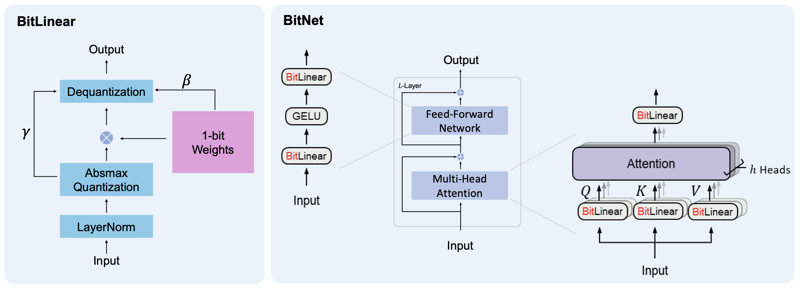
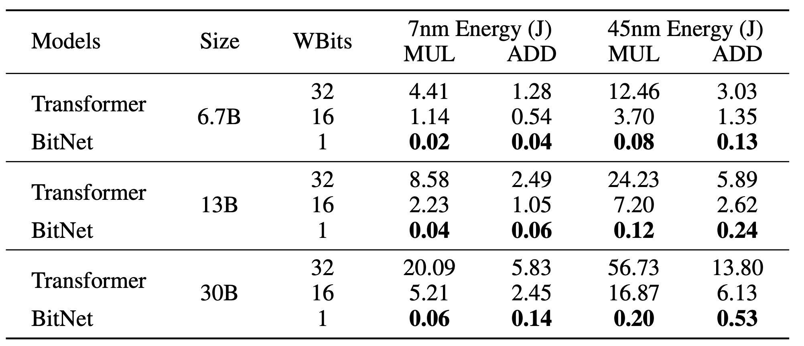
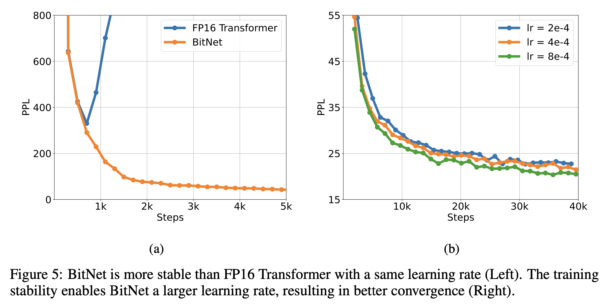

# BitNet: Scaling 1-bit Transformers for Large Language Models 论文分享

## Motivation

大型语言模型不断增大的规模为部署带来了挑战，并由于高能耗引发了对环境影响的担忧。引入了 BitLinear 作为 nn.Linear 层的直接替代品，使用量化感知训练方式从头开始训练 1 比特权重。

## Method



BitNet 架构的实现相当简单，只需替换 Transformer 中的线性投影（即 PyTorch 中的 nn.Linear）。此外，它补充了其他加速大型语言模型的方法，如 PagedAttention、FlashAttention 和推测性解码。除了线性层之外，其他组件保持高精度（8 位）。原因如下：

- 首先，残差连接和层归一化对大型语言模型的计算成本贡献可以忽略不计。
- 其次，随着模型变大，QKV 转换的计算成本远小于参数投影的计算成本。
- 第三，我们保留了输入/输出嵌入的精度，因为语言模型必须使用高精度概率来进行采样。

## BitLinear

普通的 Linear 层对输入张量 $x$ 的操作等价于：
$$
y=W x
$$
BitLinear 层对输入张量的操作等价于：
$$
y=\widetilde{W} \widetilde{x}
$$
相比于普通的 Linear 层，BitLinear 的权重需要进行二值化转化为 1 比特权重，输入张量需要进行 absmax 量化。下面分别对权重与输入张量的处理等一共四个步骤做讲解。BitLinear 同时兼顾并行。

### 权重二值化

首先，使用符号函数将权重二值化为 +1 或 −1。二值化分为以下两个步骤：

1. 在二值化之前将权重中心化为零均值，以在有限的数值范围内增加容量。
2. 使用符号函数将权重二值化为 +1 或 −1。二值化后使用一个缩放因子 β 来减少实值权重与二值化权重之间的 l2 误差。权重 $W \in\mathcal{R}^{n \times m}$ 的二值化可以表述为：

$$
\widetilde{W}=\mathrm{S i g n} ( W-\alpha),
$$
$$
\mathrm{S i g n} ( W_{i j} )=\left\{\begin{array} {c c} {{+1,}} & \quad\mathrm{i f} \ W_{i j} > 0, \\ {{-1,}} & \quad\mathrm{i f} \ W_{i j} \leq0, \\ \end{array} \right.
$$
$$
\alpha=\frac{1} {n m} \sum_{i j} W_{i j}
$$

二值化代码实现：

```python
def ste(self, x):
    """
	Applies the sign function for binarization and uses Straight-Through Estimator (STE) during backward pass.

    Args:
        x (Tensor): Input tensor.

	Returns:
        Tensor: Binarized tensor.
    """
    binarized_x = torch.sign(x)
    binarized_x = (binarized_x - x).detach() + x
    return binarized_x

def binarize_weights_groupwise(self):
    """
    Binarizes the weights of the layer in a group-wise manner using STE.

	Returns:
		Tensor: Binarized weights tensor.
    """
    group_size = self.weight.shape[0] // self.num_groups
    binarized_weights = torch.zeros_like(self.weight)

    for g in range(self.num_groups):
        start_idx = g * group_size
        end_idx = (g + 1) * group_size
        weight_group = self.weight[start_idx:end_idx]
        alpha_g = weight_group.mean()
        self.beta[start_idx:end_idx] = weight_group.abs().mean()
        binarized_weights[start_idx:end_idx] = self.ste(weight_group - alpha_g)

        return binarized_weights
```

代码中 BitNet 使用直通估计器训练模型，采用直通估计器（STE，[《Estimating or Propagating Gradients Through Stochastic Neurons for Conditional Computation》](https://arxiv.org/abs/1308.3432)）来在反向传播过程中近似梯度。这种方法绕过了非可微函数，例如 Sign（公式 5）和 Clip（公式 8）函数，在反向传递过程中。STE 允许梯度通过网络流动，而不受这些非可微函数的影响，使得训练我们的量化模型成为可能。详细介绍：[VQ-VAE的简明介绍：量子化自编码器](https://spaces.ac.cn/archives/6760)。

### 输入张量 absmax 量化

然后，将输入张量使用 absmax 量化为 b 位精度。通过乘以 $Q_b$ （$Q_b=2^{b−1}$）并除以输入矩阵的绝对最大值，将激活量缩放到 $[−Q_b,Q_b]$ 范围内：
$$
\widetilde{x}=\mathrm{Q u a n t} ( x )=\mathrm{C l i p} ( x \times\frac{Q_{b}} {\gamma},-Q_{b}+\epsilon, Q_{b}-\epsilon),
$$
$$
\mathrm{C l i p} ( x, a, b )=\mathrm{m a x} ( a, \mathrm{m i n} ( b, x ) ), \quad\gamma=| | x | |_{\infty},
$$

其中 $\epsilon$ 是一个小的浮点数，用于在执行剪切时防止溢出。$\gamma$ 是输入张量里面绝对值的最大值。absmax 量化代码实现：

```python
def quantize_activations_groupwise(self, x):
    """
    Quantizes the activations of the layer in a group-wise manner.

    Args:
        x (Tensor): Input tensor.
        b (int, optional): Number of bits for quantization. Default is 8.

    Returns:
        Tensor: Quantized activations tensor.
    """
    group_size = x.shape[0] // self.num_groups
    quantized_x = torch.zeros_like(x)
    self.gamma = torch.zeros((x.shape[0], 1))

    for g in range(self.num_groups):
        start_idx = g * group_size
        end_idx = (g + 1) * group_size
        activation_group = x[start_idx:end_idx]

        gamma_g = activation_group.abs().max()
        self.gamma[start_idx:end_idx] = gamma_g
        quantized_x[start_idx:end_idx] = torch.clamp(
            activation_group * self.Q_b / (gamma_g + self.eps),
            -self.Q_b + self.eps,
            self.Q_b - self.eps,
        )

    return quantized_x
```

> absmax量化的具体过程如下：
>
> 1. 确定量化比特位宽b：根据需求选择量化的目标位宽，如8位、4位等。
>
> 2. 计算量化因子s：对于一个待量化的张量T，找到其绝对值的最大值absmax，然后计算量化因子s = absmax / (2^(b-1) - 1)。这里的absmax是为了将张量的取值范围映射到[0, 2^(b-1) - 1]的区间内。
>
> 3. 量化权重：对于张量T中的每个元素t，计算其量化值q_t = round(t / s)，其中round表示四舍五入到最近的整数。这一步将浮点数值映射到离散的整数值。
>
> 4. 反量化：在推理时，需要将量化后的值q_t还原为浮点数。反量化的过程为t' = q_t * s，其中t'为还原后的近似值。
>
> 下面以一个具体的例子说明计算过程：
>
> 假设有一个权重矩阵W:
> [[0.3, -0.7, 1.2],
>  [0.8, -0.2, -0.5]]
>
> 选择8位量化，即b=8。
>
> 计算量化因子s:
> absmax = max(abs(0.3), abs(-0.7), abs(1.2), abs(0.8), abs(-0.2), abs(-0.5)) = 1.2
> s = 1.2 / (2^(8-1) - 1) = 1.2 / 127 ≈ 0.0094
>
> 量化权重：
> q_0.3 = round(0.3 / 0.0094) = 32
> q_-0.7 = round(-0.7 / 0.0094) = -74
> q_1.2 = round(1.2 / 0.0094) = 127
> q_0.8 = round(0.8 / 0.0094) = 85
> q_-0.2 = round(-0.2 / 0.0094) = -21
> q_-0.5 = round(-0.5 / 0.0094) = -53
>
> 量化后的矩阵Q:
> [[32, -74, 127],
>  [85, -21, -53]]
>
> 反量化：
> t'_0.3 = 32 * 0.0094 = 0.3008
> t'_-0.7 = -74 * 0.0094 = -0.6956
> ...
>
> 反量化后的矩阵W':
> [[0.3008, -0.6956, 1.1938],
>  [0.7990, -0.1974, -0.4982]]
>
> 可以看到，量化后的矩阵Q的取值范围在[-128, 127]之间，每个元素用8位有符号整数表示。反量化后的矩阵W'与原始矩阵W非常接近，但并非完全相等，这是量化过程引入的误差。

### LayerNorm 与反量化

根据上述权重二值化和输入张量量化方程，BitLinear 可等价于矩阵乘法：
$$
y=\widetilde{W} \widetilde{x}
$$
我们假设 $W$ 和 $x$ 中的元素是相互独立的，并且具有相同的分布，而 $W$ 和 $x$ 彼此独立。然后输出 $y$ 的方差被估计为：
$$
\begin{array} {r l} {{{\mathrm{V a r} ( y )}}} & {{{{}=n \mathrm{V a r} ( \tilde{w} \tilde{x} )}}} \\ {{{{}}}} & {{{{}=n E [ \tilde{w}^{2} ] E [ \tilde{x}^{2} ]}}} \\ {{{{}}}} & {{{{}=n \beta^{2} E [ \tilde{x}^{2} ] \approx E [ \tilde{x}^{2} ] =Var(\tilde{x}) + (E[\tilde{x}])^2}}} \\ \end{array}
$$
对于全精度计算，输出 $Var(y)$ 的方差在标准初始化方法（例如，Kaiming 初始化或 Xavier 初始化）下是 1，这对训练稳定性有很大的好处。为了在输入张量量化后保持方差，在输入张量量化之前引入了 LayerNorm 函数。这样，输出 $y$ 的方差就被估计为 $Var(y)≈E[LN(\tilde{x})^2]=1$，与全精度计算时的方差 $Var(y)$ 保持了相同的量级。有了 LayerNorm 和上述量化方法，我们得到了 BitLinear 的完整公式：
$$
y=\tilde{W} \tilde{x}=\tilde{W} \mathrm{Q u a n t} ( \mathrm{L N} ( x ) ) \times\frac{\beta\gamma} {Q_{b}}
$$
$$
\mathrm{L N} ( x )=\frac{x-E ( x )} {\sqrt{\mathrm{V a r} ( x )+\epsilon}}, \quad\beta=\frac{1} {n m} \| W \|_{1}
$$

$\beta$ 是权重矩阵绝对值的平均值。反量化代码实现：

```python
def dequantize_activations_groupwise(self, x):
    """
    Dequantizes the activations of the layer in a group-wise manner.

    Args:
        x (Tensor): Quantized input tensor.

    Returns:
        Tensor: Dequantized activations tensor.
    """
    return x * self.gamma * self.beta / self.Q_b
```

输出张量通过 ${β,γ}$ 重新缩放以将它们反量化到原始精度。

## 训练技巧

### Mixed precision training. 混合精度训练

在权重和激活函数被量化为低精度的同时，梯度和优化器状态则以高精度存储，以确保训练的稳定性和准确性。我们以高精度格式保持一个潜在的权重，用于累积可学习参数的更新。这些潜在权重在前向传播过程中即时被二值化，并且从不用于推理过程。

### Large learning rate. 大学习率

优化的一个挑战是，对潜在权重的微小更新往往在 1 比特权重上没有任何差异。这导致了基于 1 比特权重估计的偏差梯度和更新。在训练开始时，这个问题更为严重，那时模型应尽可能快地收敛。为了应对这一挑战，我们探索了各种方法，最终得出结论，提高学习率是加速优化最简单也是最好的方法。我们的实验表明，BitNet 在收敛方面受益于较大的学习率，而在相同学习率下，FP16 Transformer 在训练开始时就发散了。

## Result

### 节能

乘法需要更多的门电路，并且比加法耗散更多的功率。在 CPU 上运行 1.58 位模型，并且小心地使用现有的 SIMD 指令，可能会比 8 位权重模型使用的功率少很多。在笔记本电脑和移动设备上，每次推理的总能耗将非常重要，这些设备是靠电池供电的。



### 稳定

BitNet 在大学习率下更为稳定。



## References

code:

https://github.com/nkotak/1.58BitNet

https://github.com/frodo821/BitNet-Transformers

https://github.com/kyegomez/BitNet

doc:

https://github.com/microsoft/unilm/blob/master/bitnet/The-Era-of-1-bit-LLMs__Training_Tips_Code_FAQ.pdf

https://github.com/ggerganov/llama.cpp/issues/5761

直通估计器 Straight-Through Estimator：[VQ-VAE的简明介绍：量子化自编码器](https://spaces.ac.cn/archives/6760)

paper:

[BitNet: Scaling 1-bit Transformers for Large Language Models](https://arxiv.org/abs/2310.11453)

[The Era of 1-bit LLMs: All Large Language Models are in 1.58 Bits](https://arxiv.org/abs/2402.17764)

[Estimating or Propagating Gradients Through Stochastic Neurons for Conditional Computation](https://arxiv.org/abs/1308.3432)