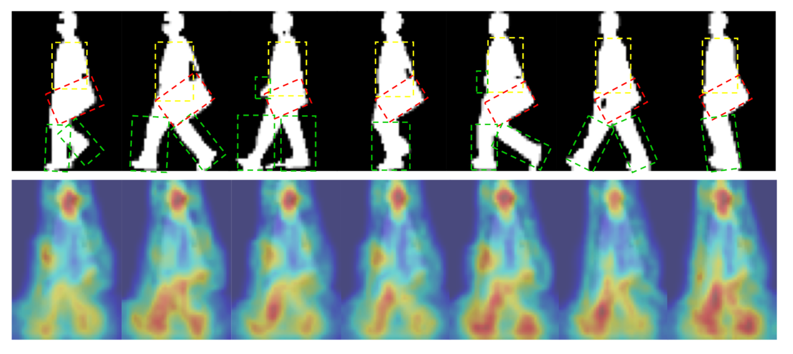
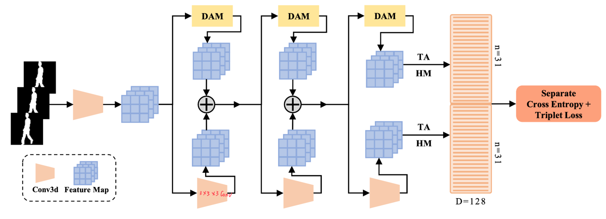
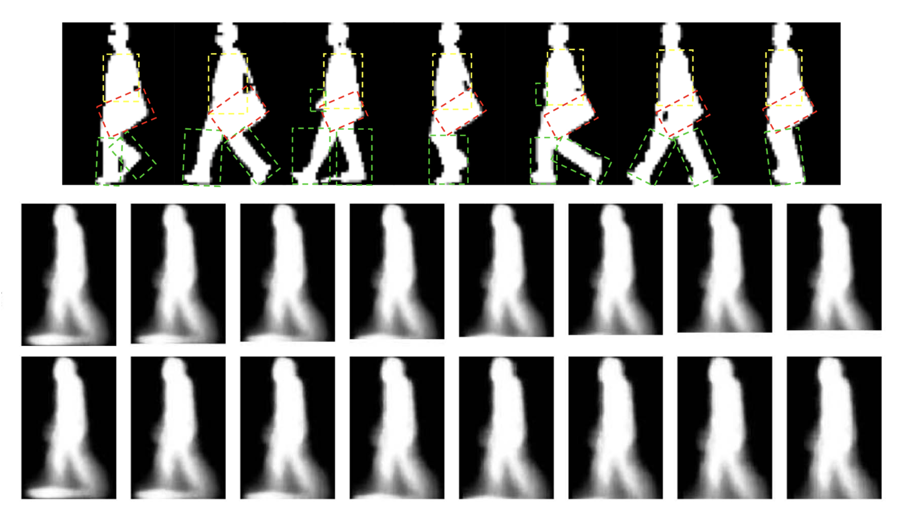
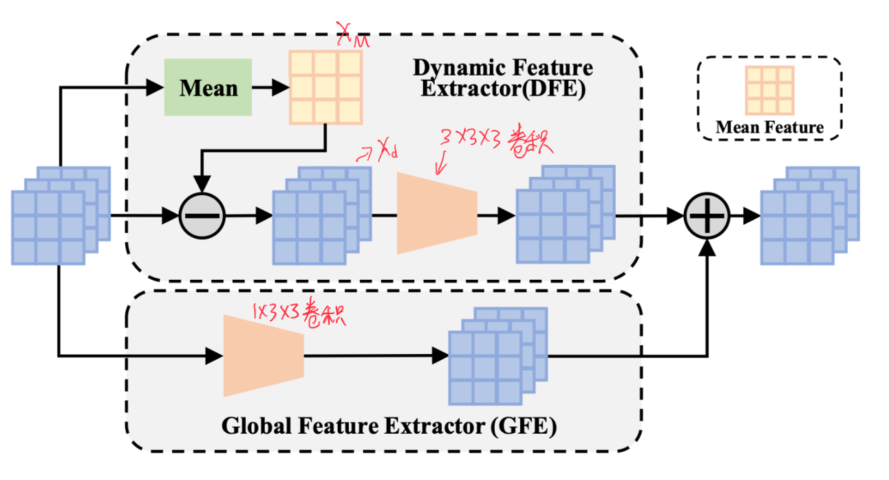
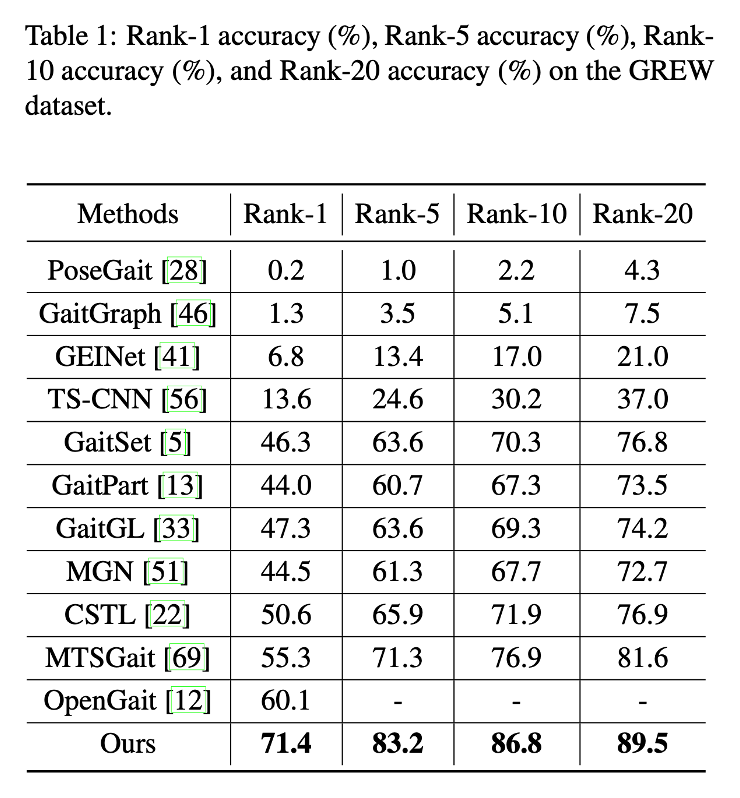
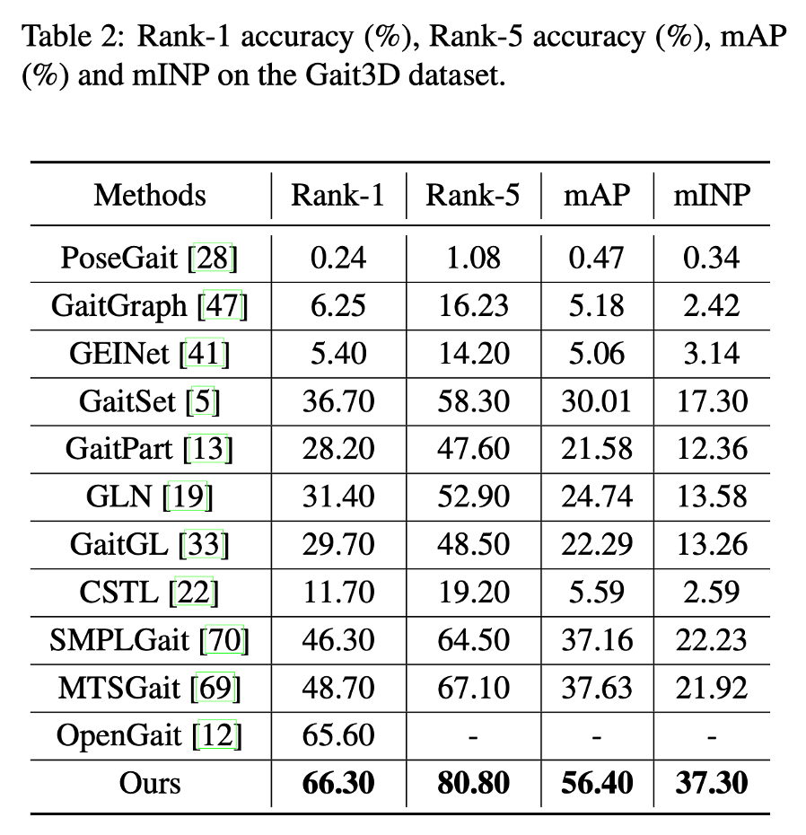
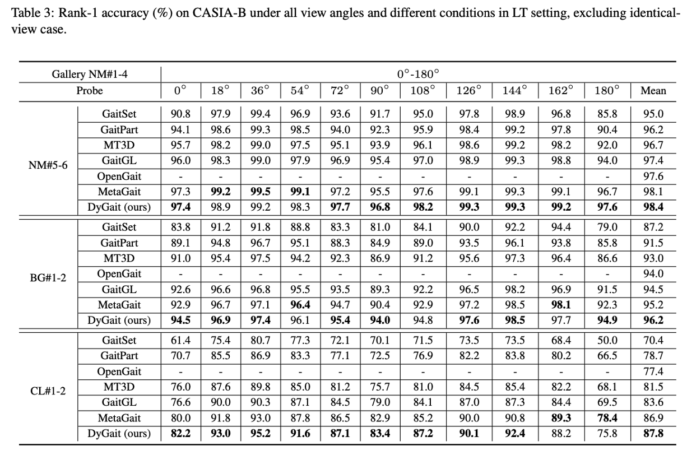
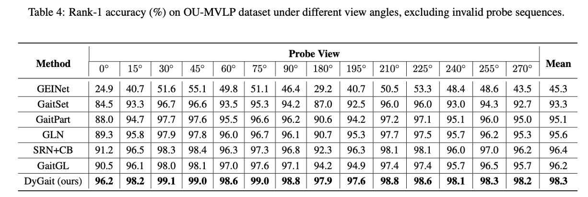
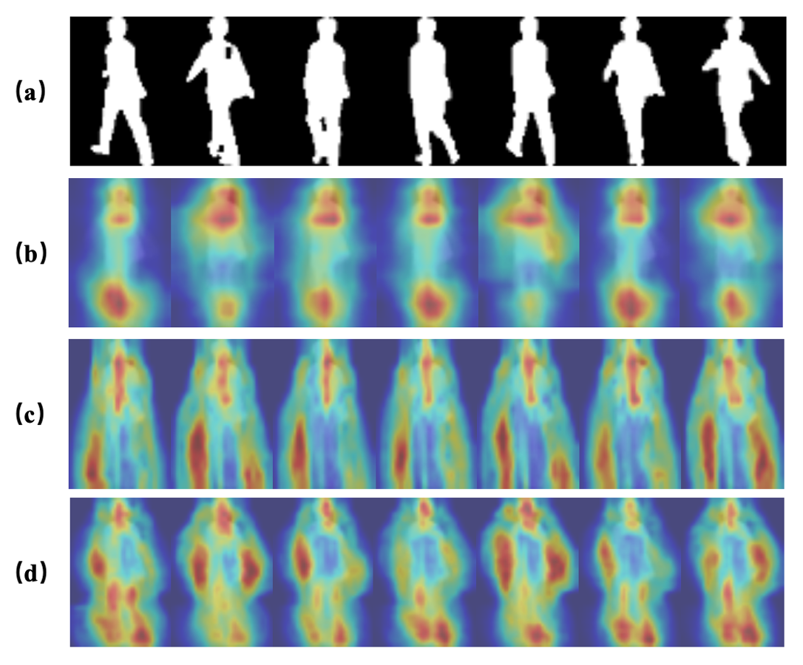
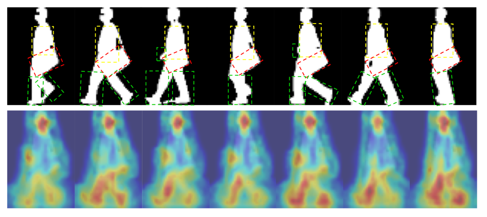

# DyGait: Exploiting Dynamic Representations for High-performance Gait Recognition 论文分享

今天我要分享的是今年ICCV的一篇步态识别的文章。

## 2 Motivation

目前大多数步态识别方法都是直接从视频帧里面提取特征。但是这些方法都是平等地学习特征图里面所有的特征，并没有足够关注动态特征，比如说像腿部这样随时间变化很大的动态特征。

图里面的第一行是步态轮廓图，绿色部分是四肢，黄色部分是躯干，红色是背包。人体的躯干和背包在每个画面里面都占了很大的空间，而且它们在人行走的时候几乎保持静止。相反腿部占用的空间小，还能在运动中不断变化。

所以，不同帧之间步态的主要差异其实在于动态特征，像包或外套这样的静态区域不是区分一个人的关键。人体的动态部分要比静态部分包含更多的信息，所以应该更多地关注动态特征。

因此作者提出了DyGait步态识别方法，这个方法可以自动提取步态的动态信息。图里面的第二行是热力图，说明DyGait更关注运动部分，比如说腿和胳膊。

## 3 pipeline

这个图是整个方法的网络架构，主要是由动态增强模块（DAM），时间聚合（TA）还有水平映射（HM）组成。

首先使用轮廓图作为整个网络的输入，再通过卷积层提取浅层特征，然后通过使用局部时间聚合（LTA）来聚合局部时间信息，从而生成初步的特征图。

然后使用本文提出的动态增强模块和3x3x3卷积分别提取特征。经过三轮相似的操作之后，使用时间聚合和水平映射操作来生成最后的特征表示。最后，采用三元组损失和交叉熵损失作为损失函数来训练网络。

## 4 DAM 动态增强模块动机

动态增强模块提出的动机主要有三点。

1. 第一点是因为，比如图里面人体躯干、包，还有外套，可以被当作静态信息，但是移动的四肢可以作为动态信息。像包和外套这样的不属于人体识别的信息可能会影响识别的效果。

2. 第二点是人体在行走过程中躯干相对保持不变，四肢通常有很大的变化，这说明人体的动态部分可以提供更多的区分信息。

3. 第三点是传统的基于平均函数的步态模板，比如说图里面第二行第三行是步态能量图，它们完全保留了躯干的信息，而且动态的四肢部分很淡。所以为了利用动态信息，作者想到利用每一帧的步态特征和步态模板之间的差异来生成动态特征图。

## 5 DAM 动态增强模块网络架构

这个图是动态增强模块的网络结构。动态增强模块分为两个分支。

其中一个分支是动态特征提取器。它是用来提取局部动态特征图的，并且建立步态动态部分的时空特征表示。

另外一个是全局特征提取器（GFE）是用来提取步态序列的全局特征。

在动态特征提取器里面，先对输入特征图求平均后跟输入特征图相减，然后再做3x3x3卷积输出特征图。

在全局特征提取器里面直接对输入特征图做1x3x3卷积，然后把得到的特征图和动态特征提取器的输出特征图相加，最后得到整个动态增强模块的输出特征图。

## 6 Result

从结果上看，在 GREW 和 Gait3D 这两个室外数据集上，Rank-1精度分别达到了71.4%和66.3%，达到了目前最先进的水平。

在GREW数据集上，本文的方法比目前最好的方法 OpenGait 高出了11%，说明本文的方法可以很好的提取具有区分性的特征。但是基于骨架的PoseGait和GaitGraph在性能上表现都不好，说明在真实环境里面，像骨架这种基于模型的模态没有比较好的特征表示能力。但是基于轮廓的方法就能够提取出更有区分性的特征表示。

在Gait3D数据集上，虽然也达到了最好的水平，但也只比最好的方法OpenGait高0.8%。依然有很大的进步空间。

## 7 Result

在 CASIA-B /ˈkeɪʒə b/ 和 OU-MVLP 这两个室内数据集上达到了平均98.4%和98.3%的精度，同样达到了目前最好的水平。

大部分方法在0度和180度这种步态信息较少的情况下，精度都会有所下降。

在 CASIA-B 数据集上，本文的方法在0度和180度的提包和外套场景下，在这两个角度上大约有2%的提升。

在 OU-MVLP 数据集上，在0度和180度这两个视角下，精度领先最好的方法大约5%。

## 8 Conclusion

这篇文章的主要贡献主要有三点。

1. 第一就是提出了DyGait这样新的步态识别框架，是第一个专门提取步态动态特征的网络。

2. 第二点是提出了动态增强模块（DAM），该模块允许网络关注关键信息并学习更具辨识性的步态识别表示，也可以通过关注动态信息有效地过滤无效噪声。

3. 在主流室内外数据集上都实现了最先进的性能。

但是这篇文章还有一些需要改进的地方。比如观察热力图我们可以发现，现有的方法存在关注头部信息的问题，人在行走时头部基本也是静止的。

另外一点就是现有的基于步态能量图提取动态特征的方法还是会产生冗余特征，未来应该研究更加灵活准确的机制来提取动态特征。