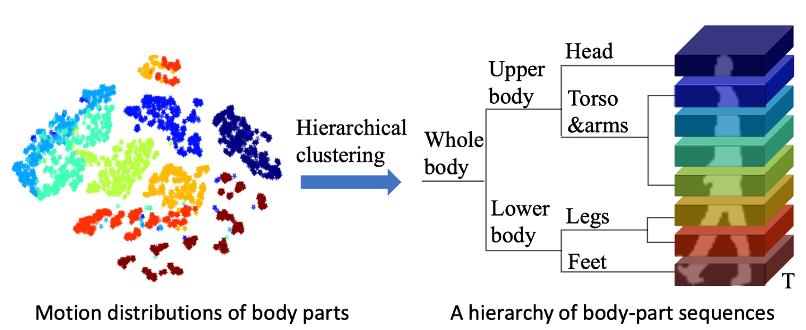
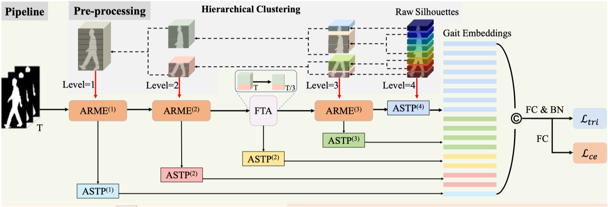
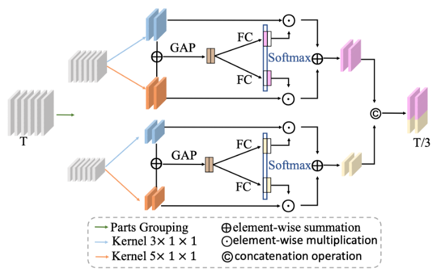
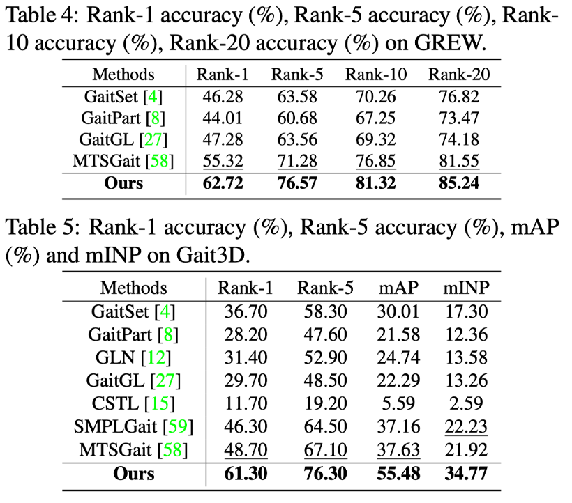

# Hierarchical Spatio-Temporal Representation Learning for Gait Recognition 论文分享

Code: https://github.com/gudaochangsheng/HSTL

arXiv:2307.09856v1

今天我主要讲的是今年7月的一篇步态识别领域的文章。

## 2 Motivation



步态识别之前提取局部特征的分区策略都是对图像进行均匀的分割，比如 GaitSet，GaitPart和GLN，但是这些都是基于人体平均分割的方法，主要限制在于它们没有考虑到局部身体运动的层次性质。这种基于身体部分平均分割的方法有可能把两个不同的身体部分分割在一起，这样不利于特征地明确表达。

在步态周期内，脚和下半身都具有独特的运动特征。左图，是人体各个部分的分布图。脚是棕色的，头是蓝色的，他们在特征空间里面的距离还是比较远的，所以头的运动学分布就跟脚有很大的区别。但是比如黄色是大腿，红色是小腿，他们的分布距离就很小。所以作者认为身体的高级语义信息可以被较高层次的聚类层捕获，不需要对身体部位做复杂的定位与标注。

以前的步态识别方法没有充分利用到不同身体部分之间的层次依赖关系，例如之前的GaitPart获得的就是层次独立的时空特征表达，各个身体部分独立提取特征。本文提出了层次时空表示学习框架，即 HSTL。它可以从步态序列中执行多级运动模式的从粗到细粒度的层次策略。

## 3 pipeline



如图是本文的pipeline，一共由5个层级构成，每级对不同层次的身体部分提取时空特征。

前两级和第四级都由一对ARME（Adaptive Region-based Motion Extractor，自适应区域运动提取器）和ASTP（Adaptive Spatio-Temporal Pooling，自适应时空池化）模块构成，分别用来学习区域独立的时空特征和层次特征映射。其中第一级将整个图像输入到自适应区域运动提取器中。第二级将人体分为两个部分输入到运动提取器中。第四级把人体分成四个部分输入到运动提取器中。

第三级由FTA（Frame-level Temporal Aggregation，帧级时间聚合）模块，还有ASTP（Adaptive Spatio-Temporal Pooling，自适应时空池化）模块组成，用来去除时间特征中冗余的信息。

最后一级仅由一个ASTP（Adaptive Spatio-Temporal Pooling，自适应时空池化）构成，最后一级将人体分为八个部分输入到自适应时空池化模块中。

最后将各级ASTP池化层的输出进行连接，实现粗粒度到细粒度特征的聚合，最终实现从全局到局部的多粒度特征融合。

## 4 ARME 自适应区域运动提取器


与现有方法不同，ARME自适应区域运动提取器考虑了与行走模式一致的不同部分序列之间的内在层次关系，学习不同身体部分层次的时空特征表达，而不是独立学习每个身体部分的独立特征。自适应区域运动提取器先把输入张量按照高度分割成指定部分，再对各个分割的身体部分独立执行3D卷积。最后模块的输出只压缩通道，保留时空分辨率。

代码实现：

```python
class ARME_Conv(nn.Module):
    def __init__(self, in_channels, out_channels, split_param ,m, kernel_size=(3, 3, 3), stride=(1, 1, 1),
                 padding=(1, 1, 1),bias=False,**kwargs):
        super(ARME_Conv, self).__init__()
        self.m = m

        self.split_param = split_param

        self.conv3d = nn.ModuleList([
            BasicConv3d(in_channels, out_channels, kernel_size, stride, padding,bias ,**kwargs)
            for i in range(self.m)])


    def forward(self, x):
        '''
            x: [n, c, s, h, w]
        '''
        feat = x.split(self.split_param, 3)
        feat = torch.cat([self.conv3d[i](_) for i, _ in enumerate(feat)], 3)
        feat = F.leaky_relu(feat)
        return feat
```

## 5 ASTP 自适应时空池化


在步态识别中，通过对特征图水平或统一分割获得压缩并且长度固定的特征表示是一个常见的手段，但是由于固定的分割容易导致不同身体部分在一个分割块里，不利于特征的明确表达，因此作者提出了ASTP自适应时空池化模块，使用不均匀分割特征图获取步态动作特征。自适应时空池化模块先在时间维度上做最大池化，将维度降为1，再压缩通道，然后按照预定义的身体部分高度分割特征图，并对每个分割图像做广义均值池化。最后将每个部分池化后的结果连接在一起，形成该层级最终的特征表达。

代码实现：

```python
class GeMHPP(nn.Module):
    def __init__(self, bin_num=[64], p=6.5, eps=1.0e-6):
        super(GeMHPP, self).__init__()
        self.bin_num = bin_num
        self.p = nn.Parameter(
            torch.ones(1)*p)
        self.eps = eps

    def gem(self, ipts):
        return F.avg_pool2d(ipts.clamp(min=self.eps).pow(self.p), (1, ipts.size(-1))).pow(1. / self.p)

    def forward(self, x):
        """
            x  : [n, c, h, w]
            ret: [n, c, p] 
        """
        n, c = x.size()[:2]
        features = []
        for b in self.bin_num:
            z = x.view(n, c, b, -1)
            z = self.gem(z).squeeze(-1)
            features.append(z)
        return torch.cat(features, -1)


# adaptive spatio-temporal pooling
class ASTP(nn.Module):
    def __init__(self, split_param, m, in_channels, out_channels):
        super(ASTP, self).__init__()
        self.split_param = split_param
        self.m = m
        self.hpp = nn.ModuleList([
            GeMHPP(bin_num=[1]) for i in range(self.m)])

        self.proj = BasicConv2d(in_channels, out_channels, 1, 1, 0)

        self.TP = PackSequenceWrapper(torch.max)
    def forward(self, x, seqL):
        # 时间维度变成1
        x = self.SP1(x, seqL=seqL, options={"dim": 2})[0]
        # 通道数从C变成C^l
        x = self.proj(x)
        # 分割图像
        feat = x.split(self.split_param, 2)
        # 每个分割图像进行GeM，
        feat = torch.cat([self.hpp[i](_) for i, _ in enumerate(feat)], -1)
        return feat
```

## 6 FTA 帧级时间聚合



以前的时间融合策略只在同一个时间尺度上做特征聚合，不能解决步态速度变化的问题。FTA帧级时间聚合模块在多个时间尺度上融合时间特征。减少了步态速度变化带来的信息冗余，同时压缩了步态序列的长度。该模块首先对每个身体部分在时间维度上使用两个不同的卷积核做最大池化操作，把时间维度压缩到原来的1/3，然后把两个尺度上的结果逐元素相加，再在空间维度上做全局平均池化，并通过两个独立的全连接层产生帧选择权重张量，并跟之前两个不同时间尺度的特征图做逐元素乘法，实现多时间尺度特征的融合。

代码实现：

```python
class FTA(nn.Module):

    def __init__(self, channel=64, FP_kernels=[3, 5]):
        super().__init__()
        self.FP_3 = nn.MaxPool3d(kernel_size=(FP_kernels[0],1,1),stride=(3,1,1),padding=(0,0,0))
        self.FP_5 = nn.MaxPool3d(kernel_size=(FP_kernels[1],1,1),stride=(3,1,1),padding=(1,0,0))
        self.gap = nn.AdaptiveAvgPool3d((None,1,1))
        self.fcs = nn.ModuleList([])
        for i in range(len(FP_kernels)):
            self.fcs.append(nn.Conv1d(channel,channel,1))
        self.softmax = nn.Softmax(dim=0)

    def forward(self, x):
        bs, c, t,_, _ = x.size()
        aggregate_outs = []
        outs1 = self.FP_3(x)
        aggregate_outs.append(outs1)
        outs2 = self.FP_5(x)
        aggregate_outs.append(outs2)
        aggregate_features = torch.stack(aggregate_outs, 0)
        hat_out_mid = sum(aggregate_outs)
        hat_out = self.gap(hat_out_mid).squeeze(-1).squeeze(-1)
        temporal = hat_out.size(-1)
        weights = []
        for fc in self.fcs:
            weight = fc(hat_out)
            weights.append(weight.view(bs, c, temporal, 1, 1))
        select_weights = torch.stack(weights, 0)
        select_weights = self.softmax(select_weights)
        outs = (select_weights * aggregate_features).sum(0)
        return outs

class FTA_Block(nn.Module):
    def __init__(self, split_param, m, in_channels):
        super(FTA_Block, self).__init__()
        self.split_param = split_param
        self.m = m
        self.mma = nn.ModuleList([
            FTA(channel=in_channels, FP_kernels=[3, 5])
            for i in range(self.m)])
    def forward(self, x):
        feat = x.split(self.split_param, 3)
        feat = torch.cat([self.mma[i](_) for i, _ in enumerate(feat)], 3)
        return feat
```

## 7 Result


在 CASIA-B /ˈkeɪʒə b/ 这个室内数据集上达到了平均98.1%的精度，尤其在0°和180°这两个不太有区分性的角度下的性能达到了目前最好的水平。

## 8 Result



在 GREW 和 Gait3D 这两个室外数据集上，Rank-1精度分别达到了62.72%，61.3%，达到了目前最先进的水平。

同时可以发现室外环境虽然达到了SOTA水平，但还是有很大的进步空间。可能的原因是HSTL该框架依然无法处理室外复杂的环境，比如，并不是每个步态序列都是有完整的身体。

## 9 Conclusion


这篇文章的主要贡献在于提出了HSTL框架提取人体的层次特征，获得更有区分性的特征表达。但是主要限制在于：比如右图的这张人体分区图，不难发现其实每个分区并不是所有部分都是有用的，比如人体步态内部，还有头部，对于步态识别的特征表示没什么用，步态信息多集中于身体的边缘。

未来不应局限于使用水平分割这样的简单的对基础结构的分割来提取特征，而是需要聚焦于如何提取高级的语义信息，来应对在现实世界里复杂多变的环境。