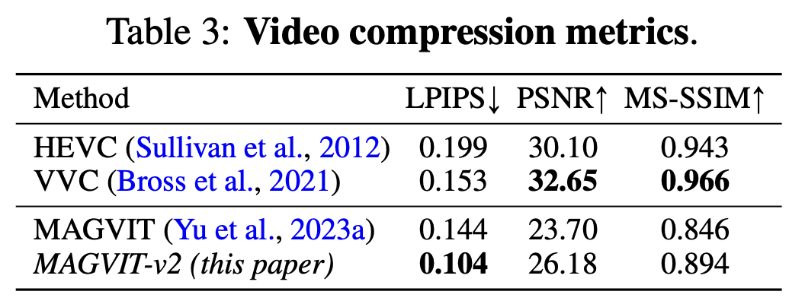

# Language Model Beats Diffusion -- Tokenizer is Key to Visual Generation 论文分享

Code: https://github.com/lucidrains/magvit2-pytorch

arXiv: [2310.05737](https://arxiv.org/abs/2310.05737)

今天我主要讲的是去年 10 月的一篇视觉分词器的文章。

## 2 背景


2017 年 [VQ-VAE](https://arxiv.org/abs/1711.00937) 提出了词汇表的概念，一个明显特征就是它的自编码器输出的编码向量是离散的。但是因为量化编码长度较短还有基于 CNN 的自回归生成器表达能力较弱，只能生成低分辨率的图像。


2020 年 [VQ-GAN](https://arxiv.org/abs/2012.09841) 把 [VQ-VAE](https://arxiv.org/abs/1711.00937) 的自回归生成器换成了 Transformer，增强了模型的表达能力。但是 [VQ-GAN](https://arxiv.org/abs/2012.09841) 只能生成图片，没办法生成视频。


2022 年 [MAGVIT](https://arxiv.org/abs/2212.05199) 把 [VQ-GAN](https://arxiv.org/abs/2012.09841) 里面的 2D 编码器换成 3D 编码器并通过多任务学习联合优化来生成视频。但是这次模型还不能结合大语言模型做文本到视频的生成任务，虽然大语言模型（LLMs）在语言生成任务上效果很好，但图像和视频生成不如扩散模型效果好。

本文的作者认为 LLM 和 Diffusion 模型有差距的一个主要原因就是缺少一个好的视觉分词器（tokenizer）。LLM 使用视觉分词器做视觉生成任务的好处主要有三点：

- **兼容大语言模型架构：**能利用上社区多年来对大语言模型架构积累的优化。同时统一文本和图像的 token 空间有利于真正的多模态模型研发。
- **压缩视觉特征表示：**降低存储和带宽，提升生成效率。
- **对视觉理解有利：**先前的研究表明，离散 token 在自监督表示学习的预训练目标中具有价值，正如在 BEiT 和 BEVT 中所讨论的那样，将 token 用作模型输入有助于提高模型的鲁棒性和泛化能力。

## 3 Motivation

本文的动机主要有两点。

- 实验表明随着词汇表的扩大，重建质量与生成质量没办法同时改善。所以作者提出了新的无查找量化方法（lookup-free quantizer，LFQ），能够学习一个大型词汇表，从而提高语言模型的生成质量。
- 同时因为 [MAGVIT](https://arxiv.org/abs/2212.05199) 3D 编码器时间感受野的存在，[MAGVIT](https://arxiv.org/abs/2212.05199) 没办法生成图片。所以本文作者改进了分词器结构，让视频和图像的生成可以使用共同的词汇表，不需要分别训练。


## 4 无查找量化方法


在以前，重建质量与生成质量之间的关系还没有明确的定论。作者通过实验发现词汇表的大小显著影响着模型的重建质量和生成质量。如图，在词汇表大小小于 2^13 的时候，增大词汇表可以同时提高重建质量与生成质量。但是对于传统的向量量化方法，当词汇表大小大于 2^13 的时候，虽然重建质量还在上升，但是生成质量反而在下降。一个合理的猜测是词汇表太大了，在生成图片视频进行 token 预测的时候，训练难度会显著提升。

无查找量化方法代码实现

```python
import torch

class LookupFreeQuantizer:
    def __init__(self, vocab_size: int=None):
        """
        初始化方法
        :param vocab_size: 词汇表大小，表示要将实数值张量映射到的整数范围。如果未提供，表示不限定词汇表大小。
        """
        self.vocab_size = torch.tensor(vocab_size)

    def sign(self, z: torch.Tensor):
        """
        将张量中的每个元素转换为其符号
        :param z: 包含实数值的张量
        :return: 符号化的张量
        """
        q_z = torch.sign(z)
        q_z[q_z == 0] = -1  # 将零元素转换为-1
        return q_z

    def token_index(self, q_z: torch.Tensor):
        """
        将符号化值张量转换为整数值张量
        :param q_z: 符号化的张量
        :return: 整数值张量
        """
        indices = (torch.arange(q_z.size(-1), dtype=torch.float32)).to(q_z.device)
        tokens = torch.sum(2**indices * (q_z > 0).float(), dim=-1)
        return tokens

    def quantize(self, z: torch.Tensor):
        """
        对实数值张量进行量化
        :param z: 包含实数值的张量
        :return: 符号化的值和整数值张量
        """
        if self.vocab_size is not None:
            assert z.size(-1) == torch.log2(self.vocab_size)

        q_z = self.sign(z)
        index = self.token_index(q_z)
        return q_z, index.int()

vector = torch.tensor([-1.0, -0.5, -0.0, -0.5, 1.0, 2.0, 3.0, 4.0])
a = LookupFreeQuantizer(2**vector.size(-1))

print(a.quantize(vector))
# tensor([-1., -1., -1., -1.,  1.,  1.,  1.,  1.])
# tensor(240, dtype=torch.int32) 11110000 = 2**7+2**6+2**5+2**4 = 240
```

为了解决增大词汇表大小的时候，重建质量与生成质量不能同时改善的问题。作者的方法是在增加词汇表大小的同时，降低词汇表编码的嵌入维度。作者直接把 VQ-VAE 的词汇表嵌入维度降成 0，所以原来 K 个 d 维向量的词汇表变成了一个整数集词汇表，大小是 2^d 个整数，其中 d 是特征向量的长度。词汇表大小这么设计的原因是作者把特征向量的每一位分配一个二进制位。当数字大于 0 时，对应的二进制位标记为 1，当数字小于等于 0 时，对应的二进制位标记为 0。最后特征向量的十进制编码就是词汇表整数集里面对应的数字。

无查找量化方法在减少编码嵌入维度的同时提高了计算效率。之前，词汇表嵌入与特征向量都是 d 维向量，需要通过查表的方法将向量替换成词汇表里面距离最近的嵌入，类似于一种聚类算法。但是把每个特征向量分别和词汇表里面每一个嵌入向量都计算距离，会导致计算量太大。减少编码嵌入维度的方法因为省去了之前的查表过程所以叫做无查找量化方法（lookup-free quantizer，LFQ）。

## 5 视觉分词器改进


视觉分词器的一个理想特性就是能够用共享的词汇表对图像还有视频进行标记化。但是利用 3D CNN 视觉分词器的 MAGVIT 因为存在时间感受野，所以无法对图像进行分词。如图，C-ViViT 采用完整的空间变换块结合因果时间变换块，这有两个缺点：

- 和 CNN 不同，位置嵌入让模型在训练的时候，对没见过的空间分辨率难以进行标记化。
- 3D CNN 比空间 Transformer 表现更好，可以生成更好的空间因果关系的 token

为了解决这些缺点，作者探索了两种可能的设计。如图 b 将 C-ViViT 和 MAGVIT 结合起来。假设时间压缩比为 4，3D CNN 处理 4 帧的块，然后是因果 Transformer。在图 c 里面，作者用时间上因果的 3D 卷积（Causal CNN）替换常规的 3D 卷积。具体就是常规的 3D 卷积层（内核大小：T × W × H）会把输入帧之前和之后的帧都输入到模型里面（时间填充方案包括在输入帧之前填充 round((T-1)/2) 帧，在输入帧之后填充 round(T/2) 帧）。但是因果 3D 卷积层的输入只有前 T-1 帧，之后不填充，每个帧的输出只取决于先前的帧。所以第一帧始终独立于其他帧，这样可以允许模型对单个图像进行标记化。

## 6 Result 图片重建实验


这是图片重建实验结果，可以看到重建效果还是很不错的。

## 7 Result 视频生成实验


视频生成实验用前 5 帧视频作为条件输入，跟 MAGVIT 使用相同的掩码语言模型 Transformer 主干网络的时候，FVD 值远低于 MAGVIT。

## 8 Result 图像生成实验


在图像生成实验中，本文的方法超过了目前所有的 Diffusion 方法。

## 9 Result 视频压缩实验




本文的方法比 H.265 (HEVC) 和H.265 (HEVC)下一代视频编码标准H.266 (VVC) 的视频压缩效果更好。在人类感知图像质量最相关的 LPIPS 指标上表现最好。

> LPIPS（Learned Perceptual Image Patch Similarity）是一个用于评估图像质量的指标，它不是专门为视频编码设计的，而是用于衡量两个图像之间的感知相似度。LPIPS 通过使用深度学习模型来模拟人类视觉系统的工作方式，从而更准确地反映人类对图像质量的感知。

## 10 Result 视频理解实验


使用视觉分词器重建的视频作为视频理解模型的输入进行训练，可以看到结果和输入原始视频很接近。

## 11 Result 消融实验


在消融实验里，因果 CNN 的设计在支持图像的同时让视频也涨点了，无查找量化方法和扩大词汇表的设计显著涨点，靠一些网络结构上的设计也有一定涨点。

## 12 Conclusion

作者利用无查找量化方法和改进的视觉分词器实现了图片与视频词汇表的统一。实验显示本文的视觉分词器在图片视频生成领域性能超越了目前最先进的 Diffusion 方法。在视频压缩方面也超越了下一代视频编码标准 VVC。未来可能的研究方向主要还是探索更高效的视觉表征方法，最好统一语言，图片，视频词汇表。

## References

https://github.com/google-research/magvit

[MAGVIT: Masked Generative Video Transformer](https://blog.csdn.net/kebijuelun/article/details/135069104)

[60. MAGVIT: 基于掩码多任务训练的高效视频生成模型 (CVPR2023 Highlight)](https://zhuanlan.zhihu.com/p/674145301)

[61. Magvit-v2: 在图像生成任务中超越Diffusion的大型语言模型](https://zhuanlan.zhihu.com/p/679032979)

https://bnucsy.github.io/MAGVIT/

[漫谈VAE和VQVAE，从连续分布到离散分布](https://zhuanlan.zhihu.com/p/388299884)

[什么是VAE与VQ-VAE](https://blog.csdn.net/zcyzcyjava/article/details/126559061)

[详解VQGAN（一）结合离散化编码与Transformer的百万像素图像生成](https://zhuanlan.zhihu.com/p/515214329)

[详解VQVAE：Neural Discrete Representation Learning](https://blog.csdn.net/justBeHerHero/article/details/128203770)

[VQ-VAE的简明介绍：量子化自编码器](https://www.spaces.ac.cn/archives/6760)

[简单得令人尴尬的FSQ：“四舍五入”超越了VQ-VAE](https://www.spaces.ac.cn/archives/9826)

[变分自编码器（一）：原来是这么一回事](https://www.spaces.ac.cn/archives/5253)

[FSQ 可能效果更好](https://github.com/lucidrains/magvit2-pytorch/issues/17)

[Finite Scalar Quantization: VQ-VAE Made Simple](https://arxiv.org/abs/2309.15505)

[【大模型 262】Transformer-Based Image/Video Generation](https://zhuanlan.zhihu.com/p/669020379)