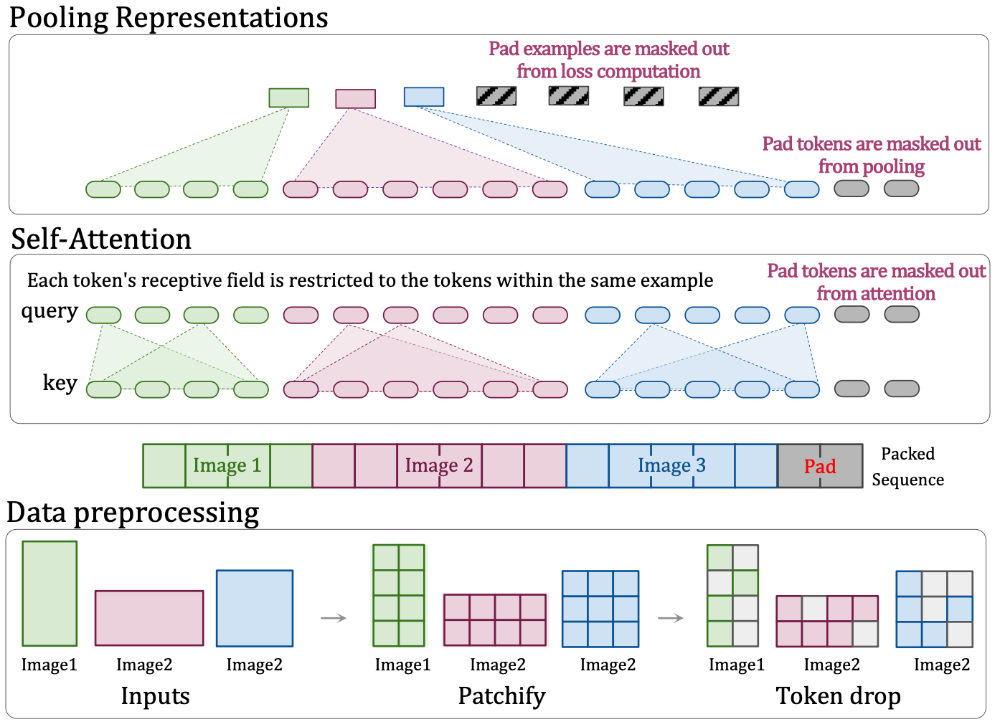
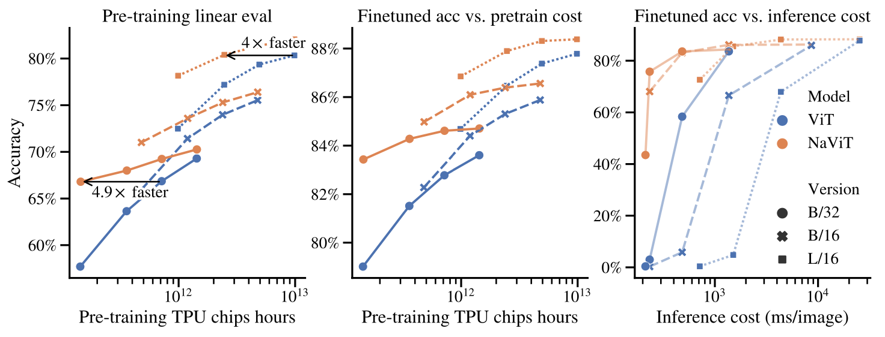
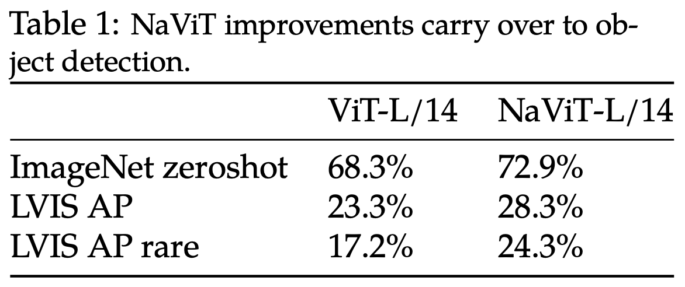

# ViT 系列解读

## NaViT（Native Resolution ViT，202307）

ArXiv：https://arxiv.org/abs/2307.06304

### Motivation

在处理图像时，将图像大小调整为固定分辨率的做法是常用方法。深度神经网络通常以输入批次进行训练和运行。为了在当前硬件上高效处理，需要固定的批次形状，因此需要固定的图像大小。视觉变换器（ViT）沿用了由于卷积神经网络架构的限制通过调整图像大小或者填充图像到固定大小的做法，但是调整图像大小的做法会损害性能，填充图像到固定大小的做法效率比较低（Lee等，2022）。

如图所示为三个代表性的分类（ImageNet，Deng等，2009）、检测（LVIS，Gupta等，2019）和网络图像（WebLI，Chen等，2022c）数据集，对三者宽高比进行分析，大多数图像不是接近正方形的。所以在调整不同高宽比图像时会损失信息，但是并没有一个更好的方法来训练这类图像。

在语言建模中，通过训练示例打包将多个不同示例的令牌组合在一个序列中来加速语言模型的训练（Krell等人，2021）绕过固定序列长度的限制是常见的做法。视觉变换器（ViT）同样提供了灵活的序列建模能力，它可以处理不同输入序列长度。

通过将图像视为补丁（令牌）序列，作者提出了 NaViT（原生分辨率 ViT）在训练期间使用序列打包来处理任意分辨率和宽高比的输入，这样就可以在图像的“原生”分辨率上进行训练。

### Method

这个图需要从下往上看。

1. 数据预处理的时候，对于三种可能的纵横比图片：长大于宽的图片、宽大长的图片、正方形图片，都统一分割成 patches 后编码为 tokens，之后随机丢弃的 tokens，这个操作就类比于经典 CNN 里面的 dropout 层。目的是提高算法的鲁棒性、训练速度也变快了。

> 为了支持可变的宽高比并轻松外推到未见过的分辨率，作者引入分数位置嵌入。首先将图像分块，得到每个分块的绝对坐标(x,y)。设图像的宽度为W，高度为H。将分块的绝对坐标除以图像边长得到分数坐标，(rx,ry):rx=x/W, ry=y/H。其中rx和ry的取值范围为[0,1]。这一步将绝对坐标归一化为相对坐标。然后将分数坐标映射到嵌入向量：ϕx(rx)和ϕy(ry):ϕx(rx):[0,1]→RD, ϕy(ry):[0,1]→RD。其中D为嵌入向量的维度。映射函数ϕx和ϕy可以是学习的嵌入、正弦函数或 NeRF 里面的学习型傅立叶位置嵌入等。最后将x和y方向的嵌入向量组合得到最终的位置嵌入。将ϕx(rx)和ϕy(ry)组合得到最终的位置嵌入向量ϕ(rx,ry)，例如通过相加：ϕ(rx,ry)=ϕx(rx)+ϕy(ry)。与绝对嵌入相比，分数嵌入提供了独立于图像大小的位置信息表示，分数嵌入将坐标归一化到实际输入图像的大小，但部分混淆了原始的纵横比，因为纵横比信息只隐含在分块数量中，这允许模型在训练期间观察极端的 token 坐标，直觉上这应该有助于泛化到更高的或者看不见的分辨率。但是，这是以模糊输入图像的纵横比为代价的。

2. 预处理完后，把三张图片生成的 patches 拉平为一个序列，不够的地方用 pad 填充。填充的思路是，在将多个样本打包成一个固定长度的序列时，最后一个样本的分辨率或 token 丢弃率可以被动态调整，以便精确匹配剩余的 token 数量，从而最小化填充 token 的数量。然而，作者发现在实践中，通过这种动态调整方法减少的填充 token 数量通常少于总 token 的 2%，因此认为没有必要使用这种复杂的动态填充方法，简单的填充方法就足够了。
3. 往上走第二部分 self-attention 部分，这部分讲的是 mask self attention，由于有 mask 的作用，他可以分块各算各的，就是三个图片不要搞混在一起了。为了防止示例相互关注，引入了额外的自注意力掩码。只要是计算过程中加上mask，就在一个小模块里可以单独计算单独处理，不影响整体的 input shape 和 output shape。从而达到了多尺寸全分辨率统一训练。
4. 编码器顶部的掩码池化旨在汇集每个示例中的令牌表示，从而在序列中每个示例生成单个向量表示。这部分讲的是将 self-attention 计算好的特征，通过 mask pooling，各算各的。

### Result

除了灵活的模型使用外，作者还展示了在大规模监督和对比图像-文本预训练中提高训练效率。NaViT 可以高效地转移到标准任务，如图像和视频分类、对象检测和语义分割，并在鲁棒性和公平性基准测试中取得了改进的结果。

在训练时，在固定的计算预算下，NaViT 性能始终优于 ViT。例如，作者用比顶尖性能的 ViT 少 4 倍的计算量就达到了相同的性能。

在目标检测任务中，对于需要在多个空间尺度上理解图像的细粒度任务（如对象检测）来说，原始分辨率训练可能特别有益。作者使用计算匹配的 NaViT 和 ViT 模型作为 OWL-ViT-L/14 对象检测器的主干网络（Minderer 等人，2022 年），遵循 OWL-ViT 的训练和评估协议。结果如表 1 所示。NaViT 基础的检测器在常见和未见过的 LVIS “稀有”类别上表现显著更好。这些实验使用的预训练时间比原始的 OWL-ViT 短，因此达到了较低的绝对性能；尽管如此，相对差异仍然表明 NaViT 为细粒度视觉任务产生了强大的特征表示。

### Conclusion

NaViT 标志着从大多数计算机视觉模型使用的标准、基于 CNN 设计的输入和建模流程中脱颖而出，并代表了 ViTs 的一个有希望的方向。

### References

doc：

[Sora系列论文精读2 多尺度视频patches统一训练](https://zhuanlan.zhihu.com/p/683694559)

paper：

[Efficient Sequence Packing without Cross-contamination: Accelerating Large Language Models without Impacting Performance](https://arxiv.org/abs/2107.02027)

code：

https://github.com/kyegomez/NaViT

https://github.com/lucidrains/vit-pytorch/blob/main/vit_pytorch/na_vit.py
