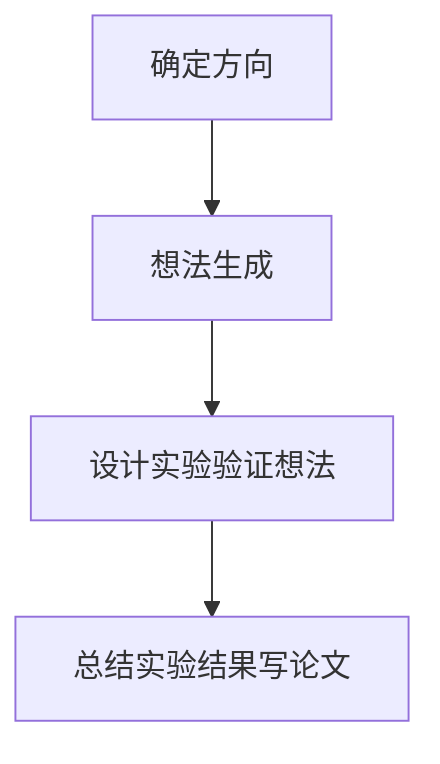
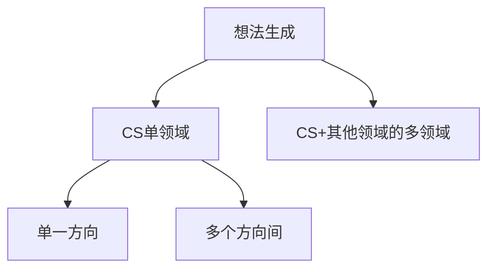
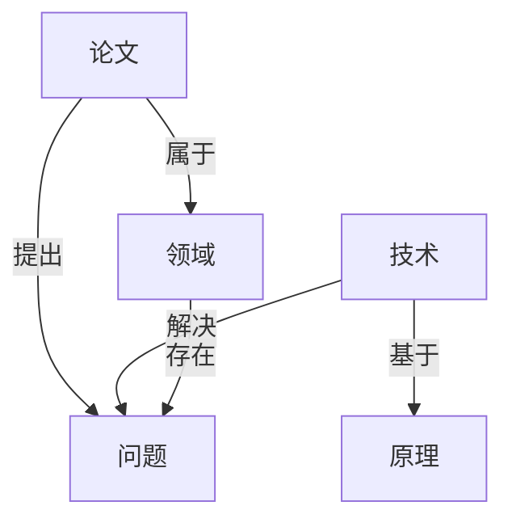

# AI4CS SOP 思路总结

## 目录

[TOC]


AI4CS 流程分为三个步骤：确定方向-想法生成-设计实验验证想法-总结实验结果写论文。



这几天的工作结论：目前的工作主要集中在第一步想法生成。已经通过“单领域单方向”的 LLM 直接提问的方式生成了我认为可靠的创新点，知识图谱一键生成代码已完成，生成的想法不如 LLM 直接生成的好。知识图谱可以在跨领域未引起充分关注的方法上可能有帮助。下一步重点工作应该放在第二步：跑实验。根据已有的想法写出第一篇论文比较重要。

## CS 方向的选择

- GPU 资源要求必须低。
- 有开源代码。

目前的符合条件的方向：

- 稀疏自编码器 (SAEs) 的解释性研究。

## AI4CS 步骤一：创新点生成

想法生成可以分为单领域和多领域两个方向。单领域指 CS 这一单一领域内部方向之间方法的组合，某一方向内部后续的研究思路。



因此创新点生成有三个方向：

- 单领域单方向：不可以使用知识图谱
- 单领域多方向：可以使用知识图谱
- 多领域：可以使用知识图谱

### 单领域单方向

对 CS 领域单一方向未解决的问题继续深入研究。

目前总结的创新点想法生成思路：

#### 创新点生成逻辑1：直接向 LLM 问论文法

示例问题：

- 这篇文章作者的动机是什么？
- 这篇论文可以启发后续哪些研究方向？
- 讲讲什么是结构化稀疏约束？怎么设计实验？
- 某某问题可以用其他领域的什么知识解决？
- 我觉得这篇文章角度很好。我想知道如果我想要写这样的论文。我应该怎么思考想到作者这样的思路。我认为作者提出了一个很好的问题。有没有实操性比较强的方法论让我能够提出跟作者一样新颖的idea？
- 给LLM训练与网络实现代码，将某篇论文里面未解决的问题向 LLM 提问。
- SAE 的特性适合解决哪些领域的问题

创新点提示词生成：

1. 我觉得这篇文章角度很好。我想知道如果我想要写这样的论文。我应该怎么思考想到作者这样的思路。我认为提出了一个很好的问题。有没有实操性比较强的方法论让我能够提出跟作者一样比较新颖的问题？
2. 请将你提出的实操性方法论指南转换为通用的LLM提示词，让我在询问其他论文时，LLM可以通过一样的方法论生成创新灵感。

实例

```markdown
这篇论文可以启发后续哪些研究方向？请根据以下视角挖掘新的创新点：

---

### 一、定位核心缺陷
1. **假设质疑**：  
   - "该模型的核心假设是什么？是否存在理论/数学上的局限性？"  
   - "若放宽或打破此假设，能否带来性能提升？"

2. **边界分析**：  
   - "模型的能力边界在哪里？是否存在某种数学定理（如Radon定理）可证明其缺陷？"  
   - "在极端/复杂场景下（如数据分布偏移、高噪声），模型为何失效？"

---

### 二、跨域理论迁移
1. **理论工具借用**：  
   - "是否存在其他学科（如几何、物理、生物）的经典理论可解释该模型的不足？"  
   - "如何将理论A中的概念B转化为本领域的可量化指标？"

2. **逆向设计**：  
   - "若理论C表明问题本质是D，现有模型是否忽略了D？如何显式建模D？"  
   - "能否基于理论C的反向约束，设计新的架构/损失函数？"

---

### 三、技术方案重构
1. **组件替换**：  
   - "模型的关键模块X能否替换为更符合问题本质的结构Y？"  
   - "若模块X是线性/局部的，如何引入非线性/全局交互？"

2. **动态化设计**：  
   - "模型的参数是否可动态生成（如超网络）以适应输入变化？"  
   - "如何平衡参数稳定性与动态适应性？"

---

### 四、效率-效果平衡
1. **计算解耦**：  
   - "模型的哪些部分可离线计算？哪些必须在线处理？"  
   - "如何减少在线计算的复杂度（如降维、近似）？"

2. **硬件适配**：  
   - "若部署到资源受限环境（如边缘设备），模型需如何简化？"  
   - "能否设计分层架构，兼顾粗筛精度与精排效果？"

---

### 五、验证创新价值
1. **问题重要性**：  
   - "模型解决的缺陷是否广泛存在于多个任务/数据集？"  
   - "该缺陷在实际应用中的影响有多大（如用户流失、成本增加）？"

2. **对比与消融**：  
   - "相比SOTA，新方法在哪些细分指标上提升？为何是SOTA的盲区？"  
   - "若移除核心创新点，性能下降多少？是否可复现理论预测的缺陷？"

---

### 使用示例（以推荐系统为例）
1. **核心缺陷**：  
   - "协同过滤的相似度计算是否忽略了用户意图的动态性？如何用流形学习理论解释其局限性？"

2. **理论迁移**：  
   - "社交网络中的弱连接理论能否用于改进推荐多样性？"

3. **技术重构**：  
   - "能否用超网络为用户动态生成兴趣感知的相似度函数？"

4. **效率平衡**：  
   - "动态相似度函数如何兼容ANN索引，实现实时推荐？"

---

**从理论缺陷出发，跨域迁移工具，设计革新架构，并严谨验证价值**，系统性产出高质量创新研究。
```

实例2

~~~markdown
#### **阶段1：假设解构**
```markdown
请基于论文内容，执行以下分析：
1. **识别潜在假设**：列出文中隐含但未经严格证明的3个核心假设，按"领域共识→论文假设→依赖前提"层级排列
2. **构建假设树**：用以下格式展开每个假设的子条件：
   - 假设A：[假设描述]
     ├─ 前提1：[条件描述] (证据强度：高/中/低)
     └─ 前提2：[条件描述] (证据强度：高/中/低)
3. **脆弱性评估**：对每个前提标注最可能失效的场景（如：当遇到[X]情况时，前提Y可能不成立）
```

#### **阶段2：矛盾实验设计**
```markdown
针对上述假设树，请：
1. **设计证伪实验**：为每个假设前提提出1个可操作的验证实验，包含：
   - 实验目的
   - 控制变量
   - 关键观测指标
   - 预期反例形态
2. **构建矛盾矩阵**：用表格形式展示以下关系：
   | 被验证前提 | 实验方法 | 支持假设的结果 | 推翻假设的结果 | 观测指标敏感性 |
   |---|---|---|---|---|
3. **生成异常指标**：提出2个创新性的量化指标，能有效捕捉到前提失效的早期信号
```

#### **阶段3：跨域灵感激发**
```markdown
请从以下角度拓展创新方向：
1. **方法论迁移**：列出3个其他领域（如生物学/物理学/经济学）中解决相似问题的经典方法，并说明如何改造应用于本论文场景
2. **技术嫁接**：提出将以下技术交叉结合的方案（选择2-3项）：
   [强化学习/拓扑数据分析/因果推断/信息论/复杂系统...]
3. **悖论构建**：设想一个与本论文结论矛盾的假说，并描述验证该假说需要的3个关键实验步骤
```

#### **阶段4：创新路线生成**
```markdown
请按以下框架输出研究方案：
**突破点发现**
通过[假设树分析]发现，当[特定条件]发生时，[原理论]的[具体前提]会失效，表现为[量化指标]的[异常变化模式]

**验证路径**
阶段1：[实验名称]
- 目标：验证[具体假设]在[X]场景下的鲁棒性
- 方法：采用[Y]方法，控制变量[Z]，观测指标[A,B,C]
- 预期异常：当[B]指标超过[阈值]时，提示[假设漏洞]

阶段2：[跨域验证]
- 引入[其他领域]的[概念/工具]，建立[新观测体系]
- 关键操作：[具体改造步骤]
- 颠覆性证据：若发现[特定现象]，则证明[新假说]

**理论跃迁**
若验证成功，将推动认知从"[旧范式]"转向"[新范式]"，突破性体现在：
1. [维度1：如重新定义特征原子性]
2. [维度2：如揭示跨尺度编码规律]
3. [维度3：如建立新的评估框架]
```

#### **阶段5：反事实构思**
```markdown
设想论文核心结论不成立的情况：
1. **极端场景构造**：描述3种可能使论文结论反转的极端条件（如数据分布/模型结构/目标函数的变化）
2. **逆向实验**：为每种极端条件设计1个验证实验，需包含：
   - 区别于原实验的创新点
   - 可证伪的判定标准
   - 潜在的新发现方向
3. **悖论指标**：提出1个能够同时捕获原始结论与反事实场景矛盾的量化指标
```

请执行阶段1到阶段5的分析。
~~~

#### 创新点生成逻辑2：质疑假设

论文有多个假设前提条件，作者默认这些假设是正确的（观点）。事实上假设不正确，需要实验验证。需要质疑这些假设。可以通过实验证明假设不正确。

案例一：Towards monosemanticity: Decomposing language models with dictionary learning 假设SAEs可通过增大字典规模逐步逼近规范单元。机制可解释性旨在将神经网络分解为可理解的原子单元（即“规范单元”），这些单元需满足唯一性、完整性和不可分解性。Sparse Autoencoders Do Not Find Canonical Units of Analysis 增大SAE的字典规模并不必然得到更基础的特征，反而可能导致特征的组合（如“蓝色方块”由“蓝色”和“方块”组合而成），而非发现原子单元。这动摇了“规范单元可通过SAE自动发现”的假设。

#### 创新点生成逻辑3：质疑默认选择

案例 Hypencoder: Hypernetworks for Information Retrieval

提问：我觉得这篇文章角度很好。我想知道如果我想要写这样的e论文。我应该怎么思考想到作者这样的思路。我认为提出了一个很好的问题。有没有实操性比较强的方法论让我能够提出跟作者一样的问题？

回答：

```markdown


### **方法论：如何提出Hypencoder式的创新研究问题**  
要提出类似Hypencoder的创新思路，需结合理论洞察、技术敏感性和工程平衡。以下是可操作的步骤指南：

---

#### **一、挖掘现有模型的根本缺陷**
1. **定位经典模型的核心假设**：  
   - **例**：传统双编码器假设内积足以建模查询-文档相关性。  
   - **方法**：梳理目标领域（如信息检索）的主流模型，分析其核心相似度函数（如内积、余弦、交叉注意力）。

2. **挑战假设的理论边界**：  
   - **关键问题**：当前模型是否受限于某种数学结构（如线性）？  
   - **工具**：使用几何、线性代数或复杂性理论分析模型能力上限。  
     - **例**：通过Radon定理证明内积无法处理高维文档集的线性不可分性。

3. **量化缺陷的实际影响**：  
   - **实验验证**：在标准数据集上构造极端案例（如凸包相交的文档），验证模型失效场景。  
   - **例**：在TREC TOT数据集上对比线性模型与非线性的Hypencoder，展示长尾查询的性能差异。

---

#### **二、寻找理论与技术的结合点**
1. **跨领域理论工具迁移**：  
   - **例**：将计算几何中的凸包理论引入信息检索，解释线性模型的局限。  
   - **方法**：关注数学、物理、生物学等领域的经典定理，思考其与目标任务的关联。

2. **从理论反推技术方案**：  
   - **例**：Radon定理表明线性不可分 → 需非线性评分函数 → 设计动态生成的神经网络（如q-net）。  
   - **步骤**：  
     1. **理论约束**：确定模型需满足的数学性质（如非线性、动态权重）。  
     2. **技术适配**：选择可实现该性质的架构（如超网络、注意力机制）。

3. **验证理论-技术的一致性**：  
   - **例**：通过可视化q-net的决策边界，证明其能分离凸包相交的文档集。

---

#### **三、设计兼顾效果与效率的方案**
1. **解耦计算瓶颈**：  
   - **问题**：交叉编码器效果佳但速度慢 → 如何保留非线性能力且高效？  
   - **方案**：将计算分为离线的文档编码和在线的查询相关计算。  
     - **例**：Hypencoder离线编码文档为向量，在线生成轻量q-net评分。

2. **近似检索算法的适配**：  
   - **关键**：新模型需兼容ANN（近似最近邻）搜索。  
   - **方法**：  
     - 构建文档图索引（如HNSW），基于局部搜索快速定位候选。  
     - 设计损失函数，使得模型输出与索引结构（如L2距离）兼容。

3. **资源-效果权衡验证**：  
   - **实验**：在相同硬件下对比Hypencoder与基线模型的吞吐量、显存占用。  
   - **例**：证明Hypencoder在8.8M文档上60ms的检索速度可达商用级要求。

---

#### **四、系统化验证创新价值**
1. **定义问题的重要性**：  
   - **普遍性**：缺陷是否存在于多数场景（如跨数据集、跨领域）？  
   - **例**：在MS MARCO、TREC TOT、BEIR等多数据集验证内积的局限性。

2. **创新性评估**：  
   - **对比基线**：与SOTA模型在标准任务上对比（如nDCG@10、MRR）。  
   - **消融实验**：验证核心组件（如超头层、q-net深度）的必要性。

3. **实用性证明**：  
   - **落地案例**：展示在搜索引擎、推荐系统中的实际应用潜力。  
   - **例**：与商业搜索引擎合作，证明Hypencoder对长尾查询的覆盖提升。

---

### **实操案例：复现Hypencoder的问题提出过程**
1. **观察现象**：传统检索模型在复杂查询（如多属性、模糊描述）上效果差。  
2. **理论归因**：用Radon定理证明线性内积无法处理高维文档集的线性不可分性。  
3. **技术设计**：  
   - 选择超网络动态生成q-net，引入非线性。  
   - 保留单文档向量编码，兼容图索引实现高效检索。  
4. **实验验证**：  
   - 在TREC DL-HARD等复杂任务上显著提升指标。  
   - 可视化q-net对凸包相交文档的分离能力。

---

### **关键思维习惯培养**
1. **质疑默认选择**：  
   - 为什么用内积？能否用更复杂的函数？是否存在理论约束？

2. **跨学科联想**：  
   - 定期阅读数学、物理等领域的经典论文，寻找可迁移的理论工具。

3. **问题驱动而非技术驱动**：  
   - 从“现有模型哪里不行？”出发，而非“我想用Transformer/GNN”。

4. **快速原型验证**：  
   - 用简化实验（如二维示例）快速验证理论猜想，再扩展到真实场景。

---

通过以上方法，你可以系统化地识别传统模型的根本缺陷，结合理论工具提出创新方案，并设计兼顾效果与效率的架构——这正是Hypencoder作者的思考路径。
```

总结：CS 单领域单方向可以生产很多有价值的想法，关键是设计实验验证这些想法。

知识图谱的角色：单领域单方向目前用不到知识图谱。

### 单领域多方向

对 CS 领域多个方向的技术融合。使用A方向的技术解决B方向的问题。可以使用知识图谱。

#### 创新点生成逻辑1：直接向 LLM 问多个论文法

几篇论文拼在一起塞进上下文，问研究方法上的想法

#### 创新点生成逻辑2：知识图谱

详见知识图谱想法生成总结

### 多领域：CS+其他领域

可以直接问 LLM 生成想法也可以应用知识图谱生成想法。

1. 创新逻辑1:

- CS里面的A问题->基于博弈论里面的B理论
- CS里面的C问题与A问题类似
- 因此可以基于博弈论里面的B理论来解决C问题

2. 创新逻辑2:

- CS里面的A问题与博弈论里面的B理论类似
- 因此可以基于博弈论里面的B理论来解决A问题

### 知识图谱想法生成方法总结

知识图谱只会在想法生成这一步用到。知识图谱生成代码目前的效果是给多篇论文pdf路径数组，一键自动生成完整知识图谱。支持同义词节点合并，孤立节点关系重建，论文粒度知识图谱重构。依靠 cypher 查询出来的想法丢给 LLM 生成想法的详细解释与实验步骤设计。

当前的知识图谱使用的节点与关系如下：

节点 (Nodes)

*   论文
*   问题
*   领域
*   原理
*   技术

关系 (Relationships)

*   论文 - 提出 -> 问题
*   论文 - 属于 -> 领域
*   技术 - 解决 -> 问题
*   技术 - 基于 -> 原理
*   领域 - 存在 -> 问题



#### node2vec

未探索

#### 结构洞

该模式匹配领域内尚未被任何技术解决的问题节点，相当于在知识图谱中定位"研究空白区域"。这种结构特征对应创新理论中的"结构洞（Structural Holes）"概念，即不同知识簇之间的连接缺口。

cypher 查询

```cypher
MATCH (d:领域)-[:存在]->(p:问题)
WHERE NOT ((:技术)-[:解决]->(p))
RETURN d.name, p.name, p.description
```

#### 技术演进路径分析（纵向创新）

用于发现技术迭代瓶颈。当同一问题下存在≥3项基于相同原理的技术时，意味着该技术路径可能接近理论极限。此时可：

- 用LLM分析技术演进规律，预测下一代技术形态
- 检测原理的应用饱和度，寻找替代性原理

cypher 查询

```cypher
MATCH (p:问题)<-[:解决]-(t:技术)-[:基于]->(pr:原理)
WITH p, COLLECT(DISTINCT t) AS techs, pr
WHERE SIZE(techs) >= 3
RETURN p.name AS 问题,
       [t IN techs | t.name] AS 技术演进序列,
       pr.name AS 基础原理
```

#### 跨域技术嫁接（横向创新）

寻找可迁移的技术原型。筛选出只应用于单一领域的技术，从而为跨域技术嫁接提供候选技术。

创新逻辑：

筛选出"单领域应用技术"，其原理具有跨领域扩展潜力。通过：

- 建立原理的领域无关性评估模型
- 构建技术-领域适配度矩阵

cypher 查询

```cypher
MATCH (t:技术)-[:解决]->(src:问题),
      (t)-[:基于]->(pr:原理)
WITH t, pr, src.领域 as srcDomain
WHERE NOT EXISTS{
    MATCH (t)-[:解决]->(p:问题)<-[:存在]-(d:领域)
    WHERE d.name <> srcDomain
}
RETURN t.name AS 候选技术,
       pr.name AS 核心原理,
       COUNT{(t)-[:解决]->()} AS 应用数
ORDER BY 应用数 ASC
```

#### 原理组合创新（交叉创新）

创新逻辑：
当同一问题存在≥2种不同原理的技术方案时，原理交叉可能产生突破。LLM可：

- 生成原理融合的数学表达形式
- 模拟不同组合方式的预期效果

示例：

联邦学习（分布式优化原理） × 差分隐私（信息论原理） → 安全分布式学习框架

```cypher
MATCH (p:问题)<-[:解决]-(t1:技术)-[:基于]->(pr1:原理),
      (p)<-[:解决]-(t2:技术)-[:基于]->(pr2:原理)
WHERE pr1 <> pr2
WITH p, pr1, pr2,
     COUNT(DISTINCT t1) AS t1_count,
     COUNT(DISTINCT t2) AS t2_count
WHERE t1_count >=2 AND t2_count >=2
RETURN p.name AS 问题,
       pr1.name + " × " + pr2.name AS 原理组合,
       toFloat(t1_count * t2_count) AS 组合潜力指数
```

#### 技术缺陷挖掘（逆向创新）

创新逻辑：
直接提取论文中明示的技术缺陷，构建"问题-技术-缺陷"三元组。通过LLM：

- 分类缺陷类型（计算效率/泛化能力/可解释性等）
- 生成针对性改进方案

示例：

目标检测YOLO系列 → 缺陷：小目标检测精度低
LLM建议：增加高分辨率特征图分支 + 动态感受野机制

```cypher
MATCH (t:技术)-[:解决]->(p:问题)
WHERE t.description CONTAINS '局限'
   OR t.description CONTAINS '挑战'
   OR t.description CONTAINS '不足'
RETURN p.name AS 问题,
       t.name AS 存在缺陷的技术,
       t.description AS 缺陷描述
```

apoc 版本

```cypher
MATCH (t:技术)-[:解决]->(p:问题)
WHERE t.description CONTAINS '局限'
   OR t.description CONTAINS '挑战'
   OR t.description CONTAINS '不足'
RETURN p.name AS 问题,
       t.name AS 存在缺陷的技术,
       apoc.text.regexGroups(t.description, '局限[\u4e00-\u9fa5]{5,20}')[0] AS 缺陷描述
```

### 其他创新点生成方法

这些方法未被充分探索：

- 第一性原理
- TRIZ 理论

## AI4CS 步骤二：设计实验验证想法

