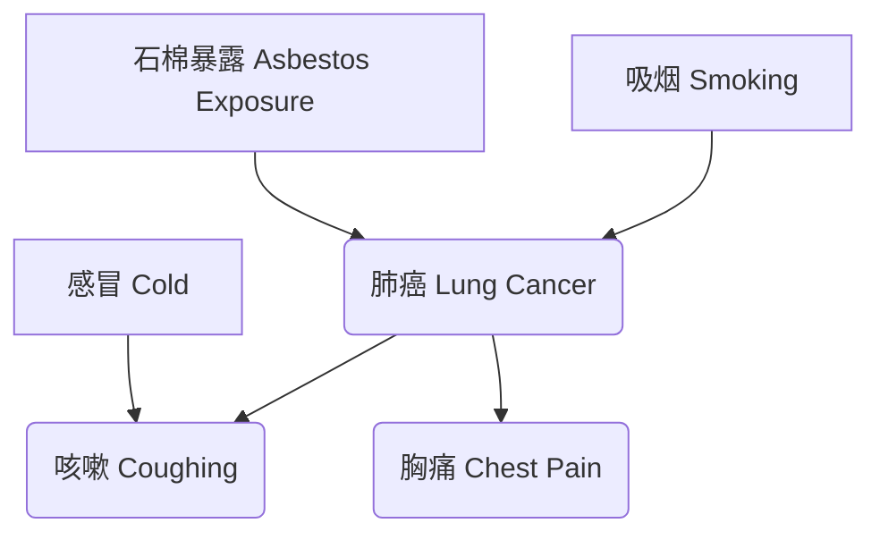

# 深度学习里面的数学

[TOC]

## 卡方散度

卡方散度用于衡量两个概率分布之间的差异。给定两个概率分布 P 和 Q，其卡方散度定义为：
$$
D_{\chi^2}(P|Q) = \sum_{x \in \text{supp}(Q)} \frac{(P(x) - Q(x))^2}{Q(x)}
$$
其中 $\text{supp}(Q)$ 表示 Q 的支撑集，即 Q(x) > 0 的所有 x 的集合。

## 卡方互信息

卡方互信息 (χ2-mutual information) 是一种衡量两个随机变量之间关联程度的指标，它基于卡方散度 (χ2-divergence)。

对于两个随机变量 X 和 Y，其联合概率分布为 PXY，边缘概率分布分别为 PX 和 PY，则 X 和 Y 之间的卡方互信息定义为：
$$
I_{\chi^2}(X;Y) = D_{\chi^2}(P_{XY} | P_X \otimes P_Y) = \sum_y D_{\chi^2}(P_{X|Y}(\cdot | y) | P_X(\cdot)) P_Y(y).
$$
**解释:**

- 卡方互信息可以看作是将联合分布 PXY 与假设 X 和 Y 独立时的分布 PX⊗PY 进行比较。
- 当 X 和 Y 独立时，卡方互信息为 0。
- 卡方互信息越大，说明 X 和 Y 之间的关联

[arXiv:2409.10559](https://arxiv.org/abs/2409.10559)

## KL 散度 (Kullback-Leibler divergence)

**定义:** 给定两个概率分布 P 和 Q，其 KL 散度定义为：
$$
D_{KL}(P|Q) = \sum_{x \in \text{supp}(P)} P(x) \log \frac{P(x)}{Q(x)}.
$$
在公式 $D_{KL}(P||Q) = \sum_{x \in supp(P)} P(x) \log \frac{P(x)}{Q(x)}$ 中，$supp(P)$ 表示概率分布 $P$ 的**支撑集 (support)**。

更具体地说，$supp(P)$ 是指概率分布 $P$ 中所有概率 $P(x)$ 大于 0 的 $x$ 的集合。 换句话说，它是 \(P\) 分布中所有可能出现的结果的集合。

例如：

*   如果 \(P\) 是一个离散型概率分布，描述抛硬币的结果（正面或反面），如果正面朝上的概率是 0.6，反面朝上的概率是 0.4，那么 $supp(P) = \{正面, 反面\}$。
*   如果 \(P\) 是一个连续型概率分布，例如标准正态分布，那么 \(supp(P)\) 是整个实数轴 $\mathbb{R}$，因为正态分布的概率密度函数在任何实数点上都大于 0。
*   如果\(P\)是一个离散型概率分布，其中\(P(x=1) = 0.5, P(x=2)=0.5\)，其他情况\(P(x)=0\), 那么$supp(P) = \{1, 2\}$.

在KL散度的定义中，求和符号 $\sum_{x \in supp(P)}$ 表示只对那些 \(P(x) > 0\) 的 \(x\) 值进行求和。这样做是因为当 \(P(x) = 0\) 时，$P(x) \log \frac{P(x)}{Q(x)}$ 这一项没有定义 (会出现 0 乘以无穷大的情况)。通过限制在支撑集上求和，可以避免这种未定义的情况。

**特点:**

- **对连续型和离散型数据都适用:** KL 散度可以用于连续型和离散型概率分布。
- **对 P 和 Q 的顺序敏感:** DKL(P∥Q) ≠ DKL(Q∥P)。
- **对 Q 中概率值接近 0 的情况相对不敏感:** 当 Q(x) 接近 0 而 P(x) 不接近 0 时，KL 散度的值会趋于正无穷；但当 P(x) 和 Q(x) 同时接近 0 时，KL 散度的值仍然可以是有限的。
- **Gibbs 不等式**：它总是【非负】的，并且当且仅当 p1(x) 和 p2(x)在每一处都相同时才为 0。为了理解这一点，我们可以将 KL 散度分解为两部分:

$$
\begin{aligned} K L\left(p_1(x), p_2(x)\right) &  =\int p_1(x) \log p_1(x) d x-\int p_1(x) \log p_2(x) d x \\ & =-\int p_1(x) \log p_2(x) d x-\left(-\int p_1(x) \log p_1(x) d x\right)\end{aligned}
$$

第二项带有负号，其对应的是 p1 的信息熵；第一项也带有负号，代表 p1 和 p2 之间的交叉熵。第一项始终不大于每个给定符号下的第二项，这便是 **Gibbs 不等式**；而 Gibbs 不等式的证明可以使用 **Jensen 不等式**：

[一文详解 codebook 技术史（从 VAE 到 VQ/RQ-VAE 到 FSQ） - 翟泽鹏的文章 - 知乎](https://zhuanlan.zhihu.com/p/2433292582)

前向和反向 KL 散度

https://dibyaghosh.com/blog/probability/kldivergence.html

近似 KL 散度

http://joschu.net/blog/kl-approx.html

## ELBO（证据下界）

### 推导一下证据下界 (ELBO) 的标准形式：

$$
 \text{ELBO}(q_\phi) = \mathbb{E}_{z \sim q_\phi(z)} [\log p_\theta(x, z)] - \mathbb{E}_{z \sim q_\phi(z)} [\log q_\phi(z)] 
$$

推导过程通常从模型证据的对数 $\log p_\theta(x)$ 或者近似后验与真实后验之间的 KL 散度开始。我们选择从 KL 散度开始，这更直接地体现了变分推断的目标。

**1. KL 散度定义**

我们考虑变分推断的目标：找到一个在某个简单分布族 $Q = \{q_\phi(z)\}$ 中的分布 $q_\phi(z)$，使其最接近（在 KL 散度意义下）真实的、但通常难以计算的后验分布 $p_\theta(z|x)$。

KL 散度 $ \text{KL}(q_\phi(z) || p_\theta(z|x)) $ 定义为：
$$
 \text{KL}(q_\phi(z) || p_\theta(z|x)) = \mathbb{E}_{z \sim q_\phi(z)} \left[ \log \frac{q_\phi(z)}{p_\theta(z|x)} \right] 
$$
根据期望的定义，这可以写成：
$$
 \text{KL}(q_\phi(z) || p_\theta(z|x)) = \int q_\phi(z) \log \frac{q_\phi(z)}{p_\theta(z|x)} dz 
$$

**2. 展开 KL 散度**

我们展开对数项：
$$
 \log \frac{q_\phi(z)}{p_\theta(z|x)} = \log q_\phi(z) - \log p_\theta(z|x) 
$$
代回到 KL 散度的期望形式中：
$$
 \text{KL}(q_\phi(z) || p_\theta(z|x)) = \mathbb{E}_{z \sim q_\phi(z)} [\log q_\phi(z) - \log p_\theta(z|x)] 
$$

**3. 使用条件概率重写后验**

根据条件概率的定义，后验分布 $p_\theta(z|x)$ 可以写成联合分布 $p_\theta(x, z)$ 和模型证据 $p_\theta(x)$ 的比值：
$$
 p_\theta(z|x) = \frac{p_\theta(x, z)}{p_\theta(x)} 
$$
取对数：
$$
 \log p_\theta(z|x) = \log p_\theta(x, z) - \log p_\theta(x) 
$$

**4. 代入 KL 散度表达式**

将 $\log p_\theta(z|x)$ 的表达式代入第 2 步的 KL 散度公式中：
$$
 \text{KL}(q_\phi(z) || p_\theta(z|x)) = \mathbb{E}_{z \sim q_\phi(z)} [\log q_\phi(z) - (\log p_\theta(x, z) - \log p_\theta(x))] 
$$
$$
 \text{KL}(q_\phi(z) || p_\theta(z|x)) = \mathbb{E}_{z \sim q_\phi(z)} [\log q_\phi(z) - \log p_\theta(x, z) + \log p_\theta(x)] 
$$

**5. 利用期望的线性性质**

将期望分解到各项：
$$
 \text{KL}(...) = \mathbb{E}_{z \sim q_\phi(z)} [\log q_\phi(z)] - \mathbb{E}_{z \sim q_\phi(z)} [\log p_\theta(x, z)] + \mathbb{E}_{z \sim q_\phi(z)} [\log p_\theta(x)] 
$$

**6. 处理关于 $\log p_\theta(x)$ 的期望**

注意到 $\log p_\theta(x)$ 是模型证据的对数，它是一个关于数据的量，不依赖于潜变量 $z$。因此，在对 $z \sim q_\phi(z)$ 取期望时，$\log p_\theta(x)$ 是一个常数。一个常数的期望就是它本身：
$$
 \mathbb{E}_{z \sim q_\phi(z)} [\log p_\theta(x)] = \log p_\theta(x) 
$$
代回到 KL 散度表达式：
$$
 \text{KL}(q_\phi(z) || p_\theta(z|x)) = \mathbb{E}_{z \sim q_\phi(z)} [\log q_\phi(z)] - \mathbb{E}_{z \sim q_\phi(z)} [\log p_\theta(x, z)] + \log p_\theta(x) 
$$

**7. 重新整理得到 ELBO**

现在我们重新整理这个等式，将 $\log p_\theta(x)$ 移到一边：
$$
 \log p_\theta(x) = \mathbb{E}_{z \sim q_\phi(z)} [\log p_\theta(x, z)] - \mathbb{E}_{z \sim q_\phi(z)} [\log q_\phi(z)] + \text{KL}(q_\phi(z) || p_\theta(z|x)) 
$$
我们定义证据下界 (ELBO) 为：
$$
\boxed{ \text{ELBO}(q_\phi) = \mathbb{E}_{z \sim q_\phi(z)} [\log p_\theta(x, z)] - \mathbb{E}_{z \sim q_\phi(z)} [\log q_\phi(z)] }
$$
那么，上面的关系式就变成了：
$$
 \log p_\theta(x) = \text{ELBO}(q_\phi) + \text{KL}(q_\phi(z) || p_\theta(z|x)) 
$$

**结论**

我们成功地推导出了 ELBO 的标准形式。这个推导过程也再次验证了 ELBO 是模型证据对数的下界，因为 KL 散度总是非负的 ($\text{KL}(\cdot||\cdot) \ge 0$)。在变分推断中，我们通过最大化 ELBO 来间接地最小化 $q_\phi(z)$ 与 $p_\theta(z|x)$ 之间的 KL 散度。

### **另一种形式（期望和熵）**

有时 ELBO 也被写成另一种形式，这有助于理解其构成：
$$
 \text{ELBO}(q_\phi) = \mathbb{E}_{z \sim q_\phi(z)} [\log p_\theta(x, z)] - \mathbb{E}_{z \sim q_\phi(z)} [\log q_\phi(z)] 
$$
注意到第二项是负的 $q_\phi(z)$ 的熵 (Entropy) $H(q_\phi)$ 的定义（$H(q_\phi) = -\mathbb{E}_{z \sim q_\phi(z)}[\log q_\phi(z)]$)。
并且，联合概率 $p_\theta(x, z)$ 可以写成 $p_\theta(z|x) p_\theta(x)$ 或 $p_\theta(x|z) p_\theta(z)$。如果我们使用后者 $p_\theta(x, z) = p_\theta(x|z) p_\theta(z)$，那么：
$$
 \log p_\theta(x, z) = \log p_\theta(x|z) + \log p_\theta(z) 
$$
代入 ELBO 定义：
$$
 \text{ELBO}(q_\phi) = \mathbb{E}_{z \sim q_\phi(z)} [\log p_\theta(x|z) + \log p_\theta(z)] - \mathbb{E}_{z \sim q_\phi(z)} [\log q_\phi(z)] 
$$
$$
 \text{ELBO}(q_\phi) = \mathbb{E}_{z \sim q_\phi(z)} [\log p_\theta(x|z)] + \mathbb{E}_{z \sim q_\phi(z)} [\log p_\theta(z) - \log q_\phi(z)] 
$$
$$
 \text{ELBO}(q_\phi) = \underbrace{\mathbb{E}_{z \sim q_\phi(z)} [\log p_\theta(x|z)]}_{\text{期望对数似然 (Expected Log-Likelihood)}} - \underbrace{\text{KL}(q_\phi(z) || p_\theta(z))}_{\text{近似后验与先验的KL散度}} 
$$
这提供了另一种理解 ELBO 的视角：最大化 ELBO 需要模型能够很好地重构数据（最大化第一项），同时让近似后验 $q_\phi(z)$ 不要离先验 $p_\theta(z)$ 太远（最小化第二项的 KL 散度，起到正则化作用）。

### 为什么证据下界 (ELBO) 总是小于等于（或等于）模型证据的对数 ($\log p_\theta(x)$)。

好的，我们来推导一下为什么证据下界 (ELBO) 总是小于等于（或等于）模型证据的对数 ($\log p_\theta(x)$)。

**出发点：KL 散度**

我们从近似后验 $q_\phi(z)$ 和真实后验 $p_\theta(z|x)$ 之间的 KL 散度 (Kullback-Leibler Divergence) 开始。KL 散度衡量了两个分布之间的差异，并且根据定义，它总是非负的：
$$
\text{KL}(q_\phi(z) || p_\theta(z|x)) \ge 0
$$
KL 散度的定义是：
$$
\text{KL}(q_\phi(z) || p_\theta(z|x)) = \mathbb{E}_{z \sim q_\phi(z)} \left[ \log \frac{q_\phi(z)}{p_\theta(z|x)} \right]
$$
展开这个期望：
$$
\text{KL}(q_\phi(z) || p_\theta(z|x)) = \int q_\phi(z) \log \frac{q_\phi(z)}{p_\theta(z|x)} dz
$$

**推导过程**

现在我们来处理 KL 散度定义中的对数项：
$$
\log \frac{q_\phi(z)}{p_\theta(z|x)} = \log q_\phi(z) - \log p_\theta(z|x)
$$
根据条件概率的定义，我们知道真实后验 $p_\theta(z|x) = \frac{p_\theta(x, z)}{p_\theta(x)}$。将其代入上式：
$$
\log p_\theta(z|x) = \log \frac{p_\theta(x, z)}{p_\theta(x)} = \log p_\theta(x, z) - \log p_\theta(x)
$$
将这个结果代回到 KL 散度的对数项中：
$$
\log \frac{q_\phi(z)}{p_\theta(z|x)} = \log q_\phi(z) - (\log p_\theta(x, z) - \log p_\theta(x))
$$
$$
\log \frac{q_\phi(z)}{p_\theta(z|x)} = \log q_\phi(z) - \log p_\theta(x, z) + \log p_\theta(x)
$$
现在，将这个展开后的对数项代回到 KL 散度的期望定义中：
$$
\text{KL}(q_\phi(z) || p_\theta(z|x)) = \mathbb{E}_{z \sim q_\phi(z)} [\log q_\phi(z) - \log p_\theta(x, z) + \log p_\theta(x)]
$$
利用期望的线性性质，将其分开：
$$
\text{KL}(...) = \mathbb{E}_{z \sim q_\phi(z)} [\log q_\phi(z)] - \mathbb{E}_{z \sim q_\phi(z)} [\log p_\theta(x, z)] + \mathbb{E}_{z \sim q_\phi(z)} [\log p_\theta(x)]
$$
注意到 $\log p_\theta(x)$ 是关于数据的证据，它不依赖于潜变量 $z$。因此，对 $z \sim q_\phi(z)$ 取期望时，它是一个常数：
$$
\mathbb{E}_{z \sim q_\phi(z)} [\log p_\theta(x)] = \log p_\theta(x)
$$
所以，KL 散度可以写成：
$$
\text{KL}(q_\phi(z) || p_\theta(z|x)) = \mathbb{E}_{z \sim q_\phi(z)} [\log q_\phi(z)] - \mathbb{E}_{z \sim q_\phi(z)} [\log p_\theta(x, z)] + \log p_\theta(x)
$$
现在我们回忆一下 ELBO 的定义：
$$
\text{ELBO}(q_\phi) = \mathbb{E}_{z \sim q_\phi(z)} [\log p_\theta(x, z)] - \mathbb{E}_{z \sim q_\phi(z)} [\log q_\phi(z)]
$$
我们可以看到 KL 散度的表达式中包含了负的 ELBO：
$$
\text{KL}(q_\phi(z) || p_\theta(z|x)) = - \text{ELBO}(q_\phi) + \log p_\theta(x)
$$
重新整理这个等式：
$$
\log p_\theta(x) = \text{ELBO}(q_\phi) + \text{KL}(q_\phi(z) || p_\theta(z|x))
$$

**结论**

我们已经推导出模型证据的对数 $\log p_\theta(x)$ 可以分解为 ELBO 和 KL 散度两项之和。
由于 KL 散度总是非负的：
$$
\text{KL}(q_\phi(z) || p_\theta(z|x)) \ge 0
$$
因此，我们可以得到：
$$
\log p_\theta(x) = \text{ELBO}(q_\phi) + (\ge 0 \text{ 的项})
$$
所以必然有：
$$
\log p_\theta(x) \ge \text{ELBO}(q_\phi)
$$
这就证明了 ELBO 确实是模型证据对数的下界。当且仅当近似后验 $q_\phi(z)$ 等于真实后验 $p_\theta(z|x)$ 时，KL 散度为 0，此时 ELBO 等于 $\log p_\theta(x)$。变分推断的目标就是通过调整 $q_\phi(z)$ 的参数 $\phi$ 来最大化 ELBO，这等价于最小化 $q_\phi(z)$ 与 $p_\theta(z|x)$ 之间的 KL 散度。

## 拉普拉斯近似 (Laplace Approximation)

**核心思想**

拉普拉斯近似是一种用于**近似概率分布**的技术，尤其常用于贝叶斯推断中近似**后验分布** $p(\theta|D)$。其核心思想是：

1.  找到目标概率分布的**峰值（Mode）**。
2.  用一个**高斯分布**来拟合目标分布在峰值周围的形状。

这个高斯分布的**均值**被设置为目标分布的峰值，其**协方差**则由目标分布在峰值处的**曲率（二阶导数）**决定。

**为什么使用高斯分布？**

高斯分布具有许多优良的数学性质，例如：

*   形式简单，由均值和协方差完全确定。
*   容易计算其归一化常数、期望、方差等。
*   便于进行后续的数学推导和计算。

**推导过程（基于对数概率）**

假设我们想要近似一个目标概率分布 $p(z)$（它可以是后验分布 $p(\theta|D)$，也可以是其他任何分布）。通常处理其对数 $\log p(z)$ 更方便。

1.  **找到峰值 (Mode)**：
    我们首先需要找到使 $p(z)$ (或 $\log p(z)$) 最大化的点 $z_0$。这个点称为分布的**众数 (Mode)**。在 $z_0$ 处，对数概率的梯度为零：
    $$
     \nabla_z \log p(z) |_{z=z_0} = 0 
    $$
    寻找 $z_0$ 通常需要进行数值优化。在贝叶斯推断中，如果 $p(z)$ 是后验分布 $p(\theta|D)$，那么 $z_0$ 就是**最大后验估计 (Maximum A Posteriori, MAP)** $\theta_{MAP}$。

2.  **泰勒展开 (Taylor Expansion)**：
    我们在峰值 $z_0$ 附近对 $\log p(z)$ 进行二阶泰勒展开：
    $$
     \log p(z) \approx \log p(z_0) + (z - z_0)^T \underbrace{\nabla_z \log p(z) |_{z=z_0}}_{=0} + \frac{1}{2} (z - z_0)^T \nabla^2_z \log p(z) |_{z=z_0} (z - z_0) 
    $$
    由于 $z_0$ 是峰值，一阶导数项为零。令 $H = -\nabla^2_z \log p(z) |_{z=z_0}$ 为**负海森矩阵 (Negative Hessian)** 在峰值处的值。注意，对于一个峰值（极大值点），$\nabla^2_z \log p(z) |_{z=z_0}$ 通常是负定的，所以 $H$ 是正定的。
    泰勒展开式变为：
    $$
     \log p(z) \approx \log p(z_0) - \frac{1}{2} (z - z_0)^T H (z - z_0) 
    $$

3.  **构建高斯近似**:
    对上式两边取指数：
    $$
     p(z) \approx p(z_0) \exp\left( -\frac{1}{2} (z - z_0)^T H (z - z_0) \right) 
    $$
    这个形式非常像一个**未归一化**的高斯分布的概率密度函数。回忆一下多元高斯分布 $\mathcal{N}(z | \mu, \Sigma)$ 的密度函数：
    $$
     \mathcal{N}(z | \mu, \Sigma) = \frac{1}{(2\pi)^{D/2} |\Sigma|^{1/2}} \exp\left( -\frac{1}{2} (z - \mu)^T \Sigma^{-1} (z - \mu) \right) 
    $$
    其中 $D$ 是 $z$ 的维度，$\mu$ 是均值，$\Sigma$ 是协方差矩阵，$\Sigma^{-1}$ 是精度矩阵 (Precision Matrix)。

    通过比较形式，我们可以看到，拉普拉斯近似 $q(z)$ 是一个高斯分布：
    $$
     q(z) = \mathcal{N}(z | z_0, H^{-1}) 
    $$
    其中：
    *   **均值 (Mean)**: $\mu = z_0$ （目标分布的峰值）
    *   **协方差矩阵 (Covariance Matrix)**: $\Sigma = H^{-1} = (-\nabla^2_z \log p(z) |_{z=z_0})^{-1}$ （负海森矩阵在峰值处的逆）

**应用场景**

*   **贝叶斯推断**: 最常见的应用是近似后验分布 $p(\theta|D) \propto p(D|\theta)p(\theta)$。
    *   首先找到 MAP 估计 $\theta_{MAP}$。
    *   计算对数后验 $\log p(\theta|D) = \log p(D|\theta) + \log p(\theta) + \text{const}$ 在 $\theta_{MAP}$ 处的负海森矩阵 $H$。
    *   后验分布近似为 $q(\theta|D) = \mathcal{N}(\theta | \theta_{MAP}, H^{-1})$。
*   **模型证据近似 (Bayesian Model Comparison)**: 拉普拉斯近似也可以用来近似模型证据 $p(D) = \int p(D|\theta)p(\theta) d\theta$。通过对 $p(D|\theta)p(\theta)$ 进行拉普拉斯近似，可以得到 $p(D)$ 的一个近似值，这对于模型选择很有用。
*   **经典预测编码 (Classical PC)**: 在 Friston 等人的经典预测编码框架中，（高斯）后验分布通常就是通过拉普拉斯近似得到的，其中精度矩阵对应于预测误差的加权。

**优点**

1.  **概念简单**: 基本思想直观易懂。
2.  **解析形式**: 得到的高斯近似具有解析形式，方便后续计算（如计算期望、边缘分布等）。
3.  **计算效率**: 相比于 MCMC 等采样方法，通常计算成本较低（主要开销在于优化找到峰值和计算/求逆海森矩阵）。
4.  **对于单峰分布效果好**: 如果目标分布本身就接近于单峰、对称的形状，拉普拉斯近似效果通常不错。

**缺点**

1.  **高斯假设**: 最根本的局限性在于它强制用高斯分布去拟合目标分布。
    *   **多峰分布 (Multimodal)**: 无法捕捉具有多个峰值的分布。它只会拟合其中一个峰值（取决于优化算法找到哪个峰值）。
    *   **偏态分布 (Skewed)**: 高斯分布是对称的，无法很好地拟合不对称的分布。
    *   **重尾分布 (Heavy-tailed)**: 高斯分布的尾部衰减很快，无法捕捉具有更重尾部的分布。
2.  **局部近似**: 它是基于峰值处的泰勒展开，因此只在峰值附近比较准确，远离峰值时近似效果会迅速变差。
3.  **优化困难**: 找到全局最优的峰值 $z_0$ 可能很困难，尤其是在高维空间或目标函数非凸的情况下。优化算法可能陷入局部最优。
4.  **海森矩阵计算与求逆**: 对于非常高维的问题，计算和存储海森矩阵（$D \times D$ 矩阵）以及求逆（计算复杂度约为 $O(D^3)$）可能会变得非常昂贵和不稳定。

**总结**

拉普拉斯近似是一种通过在目标分布的峰值处拟合高斯分布来进行近似推断的方法。它简单、快速，并能提供一个解析的高斯近似，但在处理非高斯形状（如多峰、偏态）的分布时表现不佳，并且其准确性局限于峰值附近。尽管有其局限性，它仍然是贝叶斯工具箱中一个有用且常用的近似方法，尤其是在对计算效率有要求或目标分布接近单峰高斯的情况下。

## 蒙特卡洛方法 (Monte Carlo Methods)

### 蒙特卡洛方法为什么能用样本均值近似期望，以及大数定律在其中扮演的角色。

**1. 目标：计算期望**

我们想计算一个函数 $f(x)$ 在某个概率分布 $p(x)$ 下的期望值，记作 $\mathbb{E}_{p(x)}[f(x)]$。根据定义：

*   如果 $x$ 是连续变量：
    $$
     \mathbb{E}_{p(x)}[f(x)] = \int f(x) p(x) dx 
    $$
*   如果 $x$ 是离散变量：
    $$
     \mathbb{E}_{p(x)}[f(x)] = \sum_{x} f(x) p(x) 
    $$

这个积分或求和在很多情况下是难以直接计算的，原因可能包括：

*   积分/求和的维度太高。
*   $p(x)$ 的形式复杂，导致积分没有解析解。
*   $f(x)$ 的形式复杂。

**2. 蒙特卡洛方法：用采样和平均来近似**

蒙特卡洛方法的核心思想非常直观：

1.  **采样 (Sampling)**: 我们从目标概率分布 $p(x)$ 中独立地抽取大量的样本 $x_1, x_2, \ldots, x_N$。“独立地”意味着抽取一个样本不会影响抽取其他样本。“从 $p(x)$ 中抽取”意味着这些样本出现的概率由 $p(x)$ 决定。
2.  **求值 (Evaluation)**: 计算函数 $f$ 在每个样本点上的值：$f(x_1), f(x_2), \ldots, f(x_N)$。
3.  **平均 (Averaging)**: 计算这些函数值的算术平均数：
    $$
     \hat{\mu}_N = \frac{1}{N} \sum_{i=1}^N f(x_i) 
    $$

蒙特卡洛方法声称，这个样本均值 $\hat{\mu}_N$ 是对真实期望 $\mathbb{E}_{p(x)}[f(x)]$ 的一个很好的近似，并且样本数量 $N$ 越大，这个近似通常就越好。

**3. 为什么可行？大数定律 (Law of Large Numbers, LLN)**

这种近似方法的合理性是由概率论中的**大数定律**来保证的。

*   **什么是大数定律？**
    大数定律是描述**大量重复独立随机事件**平均结果的定理。它有不同的形式（弱大数定律和强大数定律），但其核心思想是相同的：
    对于一系列**独立同分布 (independent and identically distributed, i.i.d.)** 的随机变量 $Y_1, Y_2, \ldots, Y_N$，如果它们的期望（均值）为 $\mu = \mathbb{E}[Y_i]$，那么当样本数量 $N$ 趋向于无穷大时，这些随机变量的**样本均值** $\bar{Y}_N = \frac{1}{N} \sum_{i=1}^N Y_i$ 会**收敛**到真实的期望 $\mu$。

    *   **弱大数定律 (WLLN)**: 表明样本均值 **依概率收敛 (converges in probability)** 到真实期望。这意味着，对于任何大于零的很小的数 $\epsilon$，当 $N$ 足够大时，样本均值 $\bar{Y}_N$ 与真实期望 $\mu$ 的差的绝对值大于 $\epsilon$ 的概率趋向于 0。
        $$
         \lim_{N \to \infty} P(|\bar{Y}_N - \mu| > \epsilon) = 0 
        $$
    *   **强大数定律 (SLLN)**: 表明样本均值 **几乎必然收敛 (converges almost surely)** 到真实期望。这是一个更强的结论，意味着样本均值 $\bar{Y}_N$ 等于真实期望 $\mu$ 的概率为 1，当 $N \to \infty$。
        $$
         P(\lim_{N \to \infty} \bar{Y}_N = \mu) = 1 
        $$

*   **大数定律如何应用于蒙特卡洛？**
    1.  我们从分布 $p(x)$ 中抽取样本 $x_1, x_2, \ldots, x_N$。因为每次抽取都是独立的，并且都来自同一个分布 $p(x)$，所以这些样本 $x_i$ 是独立同分布 (i.i.d.) 的。
    2.  然后我们计算 $f(x_1), f(x_2), \ldots, f(x_N)$。这些函数值可以看作是一系列新的随机变量，我们记作 $Y_i = f(x_i)$。由于 $x_i$ 是 i.i.d. 的，那么 $Y_i = f(x_i)$ 也是 i.i.d. 的随机变量。
    3.  这些新的随机变量 $Y_i$ 的期望是多少？根据期望的定义，它恰好就是我们想要计算的量：
        $$
         \mathbb{E}[Y_i] = \mathbb{E}_{p(x)}[f(x)] = \mu 
        $$
    4.  蒙特卡洛估计量 $\hat{\mu}_N = \frac{1}{N} \sum_{i=1}^N f(x_i)$ 正是这些 i.i.d. 随机变量 $Y_i$ 的**样本均值** ($\bar{Y}_N$)。
    5.  因此，根据大数定律（无论是弱形式还是强形式），当样本数量 $N$ 趋向于无穷大时，这个样本均值 $\hat{\mu}_N$ 就会收敛到 $Y_i$ 的真实期望 $\mu$，也就是我们最初想要计算的 $\mathbb{E}_{p(x)}[f(x)]$。

**4. 如何理解“当 N 足够大时，近似会收敛到真实值”？**

“收敛”在这里是一个概率意义上的概念，理解它的关键点是：

*   **不是精确相等（对于有限 N）**: 对于任何**有限**的样本数量 $N$，样本均值 $\hat{\mu}_N$ 本身仍然是一个**随机变量**。如果你重复进行整个蒙特卡洛过程（抽取 N 个样本并计算平均值），每次得到的 $\hat{\mu}_N$ 可能会略有不同。它不太可能精确地等于真实的期望 $\mu$。
*   **越来越接近**: 收敛意味着，随着你增加样本数量 $N$，样本均值 $\hat{\mu}_N$ “偏离”真实期望 $\mu$ 的**可能性**和**幅度**都变得越来越小。
*   **概率保证**: 大数定律提供了一个数学保证：只要你抽取足够多的样本，你的样本均值就有极高的概率非常接近真实的期望值。你可以通过增加 $N$ 来将估计的误差（即 $|\hat{\mu}_N - \mu|$）控制在任意小的范围内的概率提高到任意接近 1 的程度。
*   **方差减小**: 另一个理解方式是看样本均值的方差。如果 $Y_i = f(x_i)$ 的方差为 $\sigma^2 = \text{Var}(f(x))$，那么样本均值 $\hat{\mu}_N$ 的方差为：
    $$
     \text{Var}(\hat{\mu}_N) = \text{Var}\left(\frac{1}{N} \sum_{i=1}^N Y_i\right) = \frac{1}{N^2} \sum_{i=1}^N \text{Var}(Y_i) = \frac{1}{N^2} N \sigma^2 = \frac{\sigma^2}{N} 
    $$
    可以看到，随着 $N$ 的增大，样本均值 $\hat{\mu}_N$ 的方差减小，趋向于 0。这意味着 $\hat{\mu}_N$ 的分布越来越集中在它的均值（也就是真实期望 $\mu$）周围。

**总结**

蒙特卡洛方法之所以能用样本均值近似期望，是因为大数定律保证了：当从目标分布中抽取大量独立同分布的样本时，对这些样本应用函数 $f$ 后得到的函数值的算术平均数，会随着样本数量的增加而趋向于（收敛于）函数 $f$ 在该分布下的真实期望值。样本越多，近似就越可靠。

## 重要性采样 **(Importance Sampling)**

好的，我们来推导一下重要性采样 (Importance Sampling, IS) 的原理。

**目标**

假设我们想要计算函数 $f(x)$ 在目标概率分布 $p(x)$ 下的期望：
$$
 \mu = \mathbb{E}_{p(x)}[f(x)] = \int f(x) p(x) dx 
$$
(这里使用积分形式代表连续变量，对于离散变量，积分换成求和即可，原理相同。)

我们面临的问题是：**直接从 $p(x)$ 中抽取样本很困难或不可能**。

**解决方法：引入提议分布**

我们可以找到另一个我们**能够**从中采样的分布，称为**提议分布 (Proposal Distribution)** 或重要性分布 (Importance Distribution)，记作 $q(x)$。

关键要求：为了保证推导的有效性，提议分布 $q(x)$ 的支撑集 (support) 必须覆盖目标分布 $p(x)$ 的支撑集（至少是 $f(x)p(x)$ 不为零的区域）。也就是说，如果某个 $x$ 使得 $f(x)p(x) \neq 0$，那么必须有 $q(x) > 0$。否则，我们可能会错过 $p(x)$ 中有贡献的区域，导致结果错误。

**推导过程**

1.  **重写期望表达式**:
    我们可以在积分表达式中乘以并除以 $q(x)$（在 $q(x) > 0$ 的地方）：
    $$
     \mu = \int f(x) p(x) \frac{q(x)}{q(x)} dx 
    $$

2.  **重新组合**:
    重新排列各项，使得积分是关于 $q(x)$ 的形式：
    $$
     \mu = \int \left[ f(x) \frac{p(x)}{q(x)} \right] q(x) dx 
    $$

3.  **识别新的期望**:
    观察上式，它现在变成了计算函数 $g(x) = f(x) \frac{p(x)}{q(x)}$ 在**提议分布 $q(x)$** 下的期望：
    $$
     \mu = \mathbb{E}_{q(x)}\left[ f(x) \frac{p(x)}{q(x)} \right] 
    $$

4.  **定义重要性权重**:
    我们定义**重要性权重 (Importance Weight)** 为：
    $$
     w(x) = \frac{p(x)}{q(x)} 
    $$
    这个权重衡量了在点 $x$ 处，目标分布 $p(x)$ 相对于提议分布 $q(x)$ 的相对概率密度。它用于修正因从 $q(x)$ 而不是 $p(x)$ 采样所带来的偏差。如果 $p(x)$ 在某处比 $q(x)$ 大，那么从 $q(x)$ 中抽到的这个样本就需要被赋予更高的权重，反之亦然。

    将权重代入期望表达式：
    $$
     \mu = \mathbb{E}_{q(x)}[ f(x) w(x) ] 
    $$

5.  **蒙特卡洛近似**:
    现在，我们得到了一个在**提议分布 $q(x)$** 下的期望。由于我们假设可以从 $q(x)$ 中采样，我们可以使用标准的蒙特卡洛方法来近似这个期望。
    我们从 $q(x)$ 中抽取 $N$ 个独立同分布 (i.i.d.) 的样本：$x_1, x_2, \ldots, x_N \sim q(x)$。
    然后，重要性采样估计量 $\hat{\mu}_{IS}$ 就是这些样本上 $f(x_i) w(x_i)$ 的样本均值：
    $$
     \boxed{ \hat{\mu}_{IS} = \frac{1}{N} \sum_{i=1}^N f(x_i) w(x_i) = \frac{1}{N} \sum_{i=1}^N f(x_i) \frac{p(x_i)}{q(x_i)} } 
    $$
    根据大数定律，当 $N \to \infty$ 时，$\hat{\mu}_{IS}$ 收敛到真实的期望 $\mu$。

**处理未归一化的分布 (Unnormalized Case)**

在实际应用中，我们常常只知道目标分布 $p(x)$ 和/或提议分布 $q(x)$ 的未归一化形式。例如，在贝叶斯推断中，我们知道后验 $p(\theta|D) \propto \tilde{p}(\theta|D) = p(D|\theta)p(\theta)$，但不知道归一化常数 $p(D)$。

假设 $p(x) = \frac{\tilde{p}(x)}{Z_p}$ 且 $q(x) = \frac{\tilde{q}(x)}{Z_q}$，其中 $Z_p$ 和 $Z_q$ 是未知的归一化常数。

我们可以将重要性权重写成：
$$
 w(x) = \frac{p(x)}{q(x)} = \frac{\tilde{p}(x)/Z_p}{\tilde{q}(x)/Z_q} = \frac{Z_q}{Z_p} \frac{\tilde{p}(x)}{\tilde{q}(x)} 
$$
定义**未归一化的重要性权重 (unnormalized importance weight)**:
$$
 \tilde{w}(x) = \frac{\tilde{p}(x)}{\tilde{q}(x)} 
$$
那么 $w(x) = \frac{Z_q}{Z_p} \tilde{w}(x)$。

代入期望公式：
$$
 \mu = \mathbb{E}_{q(x)}[ f(x) w(x) ] = \mathbb{E}_{q(x)}\left[ f(x) \frac{Z_q}{Z_p} \tilde{w}(x) \right] = \frac{Z_q}{Z_p} \mathbb{E}_{q(x)}[ f(x) \tilde{w}(x) ] 
$$
我们仍然有未知的比例因子 $Z_q/Z_p$。

考虑计算常数 1 在 $p(x)$ 下的期望：
$$
 1 = \mathbb{E}_{p(x)}[1] = \int 1 \cdot p(x) dx 
$$
应用重要性采样公式：
$$
 1 = \mathbb{E}_{q(x)}[ 1 \cdot w(x) ] = \mathbb{E}_{q(x)}[w(x)] = \mathbb{E}_{q(x)}\left[ \frac{Z_q}{Z_p} \tilde{w}(x) \right] = \frac{Z_q}{Z_p} \mathbb{E}_{q(x)}[\tilde{w}(x)] 
$$
从中我们可以解出比例因子：
$$
 \frac{Z_p}{Z_q} = \mathbb{E}_{q(x)}[\tilde{w}(x)] \quad \implies \quad \frac{Z_q}{Z_p} = \frac{1}{\mathbb{E}_{q(x)}[\tilde{w}(x)]} 
$$
将这个结果代回到 $\mu$ 的表达式中：
$$
 \mu = \frac{1}{\mathbb{E}_{q(x)}[\tilde{w}(x)]} \mathbb{E}_{q(x)}[ f(x) \tilde{w}(x) ] = \frac{\mathbb{E}_{q(x)}[ f(x) \tilde{w}(x) ]}{\mathbb{E}_{q(x)}[\tilde{w}(x)]} 
$$

现在，我们可以对分子和分母分别使用蒙特卡洛近似。抽取样本 $x_1, \ldots, x_N \sim q(x)$（注意：如果 $q(x)$ 本身也是未归一化的 $\tilde{q}(x)$，我们仍需能从 $q(x)$ 或 $\tilde{q}(x)$ 中采样，通常假设可以从归一化的 $q(x)$ 采样）：
$$
 \mathbb{E}_{q(x)}[ f(x) \tilde{w}(x) ] \approx \frac{1}{N} \sum_{i=1}^N f(x_i) \tilde{w}(x_i) 
$$
$$
 \mathbb{E}_{q(x)}[\tilde{w}(x)] \approx \frac{1}{N} \sum_{i=1}^N \tilde{w}(x_i) 
$$
代入 $\mu$ 的表达式，$1/N$ 项消掉，得到**归一化的重要性采样 (Normalized Importance Sampling)** 估计量，也称为**自归一化重要性采样 (Self-normalized Importance Sampling)** 估计量：
$$
\boxed{ \hat{\mu}_{NIS} = \frac{\sum_{i=1}^N f(x_i) \tilde{w}(x_i)}{\sum_{i=1}^N \tilde{w}(x_i)} = \frac{\sum_{i=1}^N f(x_i) \frac{\tilde{p}(x_i)}{\tilde{q}(x_i)}}{\sum_{i=1}^N \frac{\tilde{p}(x_i)}{\tilde{q}(x_i)}} }
$$
这个估计量在实际中非常常用，因为它不要求知道目标分布或提议分布的归一化常数。不过需要注意的是，对于有限的 $N$，$\hat{\mu}_{NIS}$ 通常是**有偏 (biased)** 的，但它是**一致 (consistent)** 的，意味着当 $N \to \infty$ 时偏差趋于零。

**总结**
重要性采样通过引入一个容易采样的提议分布 $q(x)$，并使用重要性权重 $w(x) = p(x)/q(x)$ 来修正偏差，将计算 $\mathbb{E}_{p(x)}[f(x)]$ 的问题转化为计算 $\mathbb{E}_{q(x)}[f(x)w(x)]$ 的问题，然后使用蒙特卡洛方法进行近似。当分布未归一化时，可以使用自归一化估计量。选择一个好的提议分布 $q(x)$（即形状与 $|f(x)|p(x)$ 相似）对于降低估计量的方差至关重要。

### 为什么提议分布 $q(x)$ 的支撑集 (support) 必须覆盖 $f(x)p(x)$ 不为零的区域。

**1. 什么是支撑集 (Support)？**

一个概率分布 $p(x)$ 的支撑集是指所有使得 $p(x) > 0$ 的 $x$ 值的集合。通俗地说，就是这个分布可能产生样本的区域。

**2. 条件的含义**

条件 “如果某个 $x$ 使得 $f(x)p(x) \neq 0$，那么必须有 $q(x) > 0$” 意味着：

*   我们关注的是那些对目标期望 $\mathbb{E}_{p(x)}[f(x)] = \int f(x) p(x) dx$ **有贡献**的点 $x$。贡献不为零，意味着函数值 $f(x)$ 不为零，并且目标分布在 $x$ 处的概率密度 $p(x)$ 也不为零。
*   对于所有这些有贡献的点 $x$，我们**必须**保证我们用来采样的提议分布 $q(x)$ 在这些点处的概率密度大于零。换句话说，我们必须**有可能**从 $q(x)$ 中采样到这些点。

**3. 为什么这个条件至关重要？**

让我们回顾一下重要性采样的核心公式：
$$
 \mathbb{E}_{p(x)}[f(x)] = \int f(x) p(x) dx = \int \left[ f(x) \frac{p(x)}{q(x)} \right] q(x) dx = \mathbb{E}_{q(x)}\left[ f(x) \frac{p(x)}{q(x)} \right] 
$$
以及其蒙特卡洛近似：
$$
 \hat{\mu}_{IS} = \frac{1}{N} \sum_{i=1}^N f(x_i) \frac{p(x_i)}{q(x_i)} \quad \text{其中 } x_i \sim q(x) 
$$

现在，假设这个条件**不满足**。这意味着存在一个区域（或一些点） $A$，在这个区域里：
*   $f(x)p(x) \neq 0$ （即这个区域对真实的期望 $\mathbb{E}_{p(x)}[f(x)]$ 有非零的贡献）
*   但是 $q(x) = 0$ （即提议分布 $q(x)$ 在这个区域的支撑集之外）

**后果：**

1.  **采样永远无法触及重要区域**: 因为我们是从 $q(x)$ 中抽取样本 $x_i$，而 $q(x)$ 在区域 $A$ 中为零，所以我们抽取的样本 $x_1, \ldots, x_N$ **永远不可能**落入区域 $A$ 中。 $P(x_i \in A) = \int_A q(x) dx = 0$。

2.  **期望计算完全忽略该区域的贡献**: 在计算样本均值 $\hat{\mu}_{IS}$ 时，所有的样本 $x_i$ 都来自 $q(x)>0$ 的区域。因此，由区域 $A$ 贡献的 $f(x)p(x)$ 的那一部分**完全被忽略了**。

3.  **导致系统性偏差和错误结果**: 真实的期望 $\mathbb{E}_{p(x)}[f(x)]$ 是对所有 $x$ （包括区域 $A$）的 $f(x)p(x)$ 进行积分得到的。而我们的重要性采样估计量 $\hat{\mu}_{IS}$ 由于无法采样到区域 $A$，实际上是在近似 $\int_{x \notin A} f(x) \frac{p(x)}{q(x)} q(x) dx = \int_{x \notin A} f(x) p(x) dx$。这个值缺少了区域 $A$ 的贡献 $\int_{A} f(x) p(x) dx$，因此它会收敛到一个**错误**的值，而不是真实的期望 $\mu$。这种偏差是系统性的，无法通过增加样本数量 $N$ 来消除。

4.  **数学上的问题**: 在推导 $\mathbb{E}_{p(x)}[f(x)] = \mathbb{E}_{q(x)}[f(x) \frac{p(x)}{q(x)}]$ 时，我们隐式地假设了可以在 $p(x) \neq 0$ 的地方除以 $q(x)$。如果在某个 $x$ 处有 $p(x) > 0$ 但 $q(x) = 0$，那么重要性权重 $w(x) = p(x)/q(x)$ 在该点就是无穷大，这破坏了推导的基础。虽然从采样角度看，我们永远不会采样到需要计算这个无穷大权重的点，但这恰恰反映了问题的本质：我们无法通过 $q(x)$ 来“覆盖”或“代表” $p(x)$ 在该点的行为。

**一个简单的类比**

想象你想估计一个国家所有居民的平均年收入（$ \mathbb{E}_{p(x)}[f(x)] $，其中 $p(x)$ 是居民分布，$f(x)$ 是收入）。你进行抽样调查（从 $q(x)$ 采样）。但由于某种原因，你的调查方法（提议分布 $q(x)$）完全无法接触到该国最富有的 1% 人口（区域 $A$）。

*   这 1% 的人对真实的平均收入有显著贡献（因为 $f(x)p(x) \neq 0$ 在这个区域）。
*   你的调查样本中永远不会包含这 1% 的人（因为 $q(x) = 0$ 在这个区域）。
*   因此，你根据调查样本计算出的平均收入（$\hat{\mu}_{IS}$）将系统性地低于真实的平均收入，并且无论你调查多少人（增加 $N$），这个偏差都会存在。

**总结**

确保 $q(x) > 0$ 只要 $f(x)p(x) \neq 0$ 是为了保证我们的采样过程**有机会**探索到所有对目标期望值有贡献的区域。如果提议分布 $q(x)$ 在某个有贡献的区域取值为零，重要性采样就会系统性地忽略这部分贡献，导致最终的估计结果是**有偏且错误**的。这个条件是重要性采样方法正确性的基石。

好的，我们来推导朗之万动力学 (Langevin Dynamics) 的基本形式，并理解它为什么能用来从目标概率分布 $p(z)$ 中采样。

## 朗之万动力学

朗之万动力学的推导通常不涉及从零开始推导物理定律，而是基于一个核心思想：**构建一个随机过程，使其平衡态（或稳态、静态）分布恰好是我们想要采样的目标分布 $p(z)$**。这个过程通常通过**福克-普朗克方程 (Fokker-Planck Equation)** 与描述粒子运动的**随机微分方程 (Stochastic Differential Equation, SDE)** 联系起来。

**1. 目标和物理类比**

*   **目标**: 我们想要生成一系列样本 $z_1, z_2, \ldots$，使得这些样本的分布最终收敛到目标概率分布 $p(z)$。
*   **物理类比**: 想象一个（或多个）粒子在势能场 $U(z)$ 中运动。粒子会受到两个力的作用：
    *   **确定性力 (Drift)**: 将粒子推向势能更低（概率更高）区域的力，$F_{drift} = -\nabla U(z)$。
    *   **随机力 (Diffusion/Noise)**: 来自环境（例如，与溶剂分子碰撞）的随机扰动，导致布朗运动。
    这个系统的平衡态由玻尔兹曼分布描述，即粒子处于状态 $z$ 的概率与 $e^{-U(z)/kT}$ 成正比。

**2. 连接概率分布与势能**

我们可以将目标概率分布 $p(z)$ 与一个势能场 $U(z)$ 联系起来。一个自然的选择是定义：
$$
 U(z) = -\log p(z) 
$$
（这里我们暂时忽略了物理中的温度 $T$ 和玻尔兹曼常数 $k$，可以认为它们被吸收到其他常数中，或者说我们处理的是 $p(z) \propto e^{-U(z)}$ 的情况）。

根据这个定义，"势能更低"的区域对应于"$\log p(z)$ 更高"或"$p(z)$ 更高"的区域。推动粒子走向势能更低处的力变为：
$$
 F_{drift} = -\nabla U(z) = - \nabla (-\log p(z)) = \nabla \log p(z) 
$$
这个力就是目标对数概率密度的**梯度**（即**得分函数**），它指向概率密度增长最快的方向。

**3. 随机微分方程 (SDE)**

描述粒子在这种力和随机扰动下连续时间运动的数学语言是**随机微分方程 (SDE)**。朗之万方程是一个描述这种过程的 SDE，其一般形式（过阻尼情况，忽略惯性）为：
$$
 dz = a(z) dt + b(z) dW_t 
$$
其中：
*   $z(t)$ 是粒子在时间 $t$ 的状态（位置）。
*   $a(z)$ 是**漂移项 (drift term)**，代表确定性力 $F_{drift}$ 的影响。
*   $b(z)$ 是**扩散项 (diffusion term)**，代表随机力的大小。
*   $dW_t$ 是**维纳过程 (Wiener process)** 的增量，代表高斯白噪声。可以认为 $dW_t = \sqrt{dt} \xi_t$，其中 $\xi_t \sim \mathcal{N}(0, I)$。

**4. 福克-普朗克方程 (Fokker-Planck Equation)**

福克-普朗克方程描述了由上述 SDE 驱动的粒子系综的概率密度 $P(z, t)$ 如何随时间演化。对于上面的 SDE，对应的福克-普朗克方程是：
$$
 \frac{\partial P(z, t)}{\partial t} = - \nabla \cdot [a(z) P(z, t)] + \frac{1}{2} \nabla^2 : [b(z) b(z)^T P(z, t)] 
$$
(注意：这里的 $\nabla \cdot$ 是散度，$\nabla^2 :$ 表示二阶导数项，对于向量 $z$，这涉及海森矩阵和矩阵运算，形式会更复杂。简单起见，可以先考虑一维情况。)

**5. 寻找稳态解 (Stationary Solution)**

我们希望找到合适的漂移项 $a(z)$ 和扩散项 $b(z)$，使得当系统达到平衡时（$\frac{\partial P(z, t)}{\partial t} = 0$），其稳态分布 $P_{st}(z)$ 正好等于我们的目标分布 $p(z)$。即，我们需要 $p(z)$ 满足：
$$
 0 = - \nabla \cdot [a(z) p(z)] + \frac{1}{2} \nabla^2 : [b(z) b(z)^T p(z)] 
$$

可以证明（如上一轮思考过程所示），如果我们选择：
*   **漂移项**: $a(z) = D \nabla \log p(z)$ （与得分函数成正比）
*   **扩散项**: $b(z) = \sqrt{2D} I$ （各项同性的常数扩散）
其中 $D$ 是扩散系数（一个正常数）。

将这两项代入稳态福克-普朗克方程，等式成立：
$$
 - \nabla \cdot [D (\nabla \log p(z)) p(z)] + \frac{1}{2} \nabla^2 : [ ( \sqrt{2D}I ) (\sqrt{2D}I)^T p(z) ] 
$$
$$
 = - \nabla \cdot [D \frac{\nabla p(z)}{p(z)} p(z)] + \frac{1}{2} \nabla^2 : [ 2D I p(z) ] 
$$
$$
 = - D \nabla \cdot [\nabla p(z)] + D \nabla^2 p(z) 
$$
$$
 = - D \nabla^2 p(z) + D \nabla^2 p(z) = 0 
$$
（这里 $\nabla^2$ 是拉普拉斯算子 $\nabla \cdot \nabla$）

**6. 得到朗之万 SDE**

既然我们找到了使 $p(z)$ 成为稳态分布的漂移项和扩散项，我们就得到了描述粒子趋向于 $p(z)$ 分布的 SDE：
$$
 dz = D \nabla \log p(z) dt + \sqrt{2D} dW_t 
$$
这就是**朗之万方程 (Langevin Equation)**。模拟这个 SDE 足够长的时间，粒子 $z(t)$ 的分布就会接近 $p(z)$。

**7. 时间离散化：欧拉-丸山法 (Euler-Maruyama)**

为了在计算机上模拟这个连续时间过程，我们需要将其离散化。最简单的方法是欧拉-丸山法。我们将时间步长设为 $\eta$，用有限差分近似微分：
*   $dz \approx z_{t+\eta} - z_t$
*   $dt \approx \eta$
*   $dW_t \approx \sqrt{\eta} \xi_t$，其中 $\xi_t \sim \mathcal{N}(0, I)$ 是标准高斯随机向量。

代入朗之万 SDE：
$$
 z_{t+\eta} - z_t \approx D (\nabla_z \log p(z_t)) \eta + \sqrt{2D} \sqrt{\eta} \xi_t 
$$
整理得到离散更新规则：
$$
 z_{t+\eta} \approx z_t + D \eta \nabla_z \log p(z_t) + \sqrt{2 D \eta} \xi_t 
$$

**8. 简化形式与参数调整**

在机器学习和 MCMC 的文献中，通常会简化这个表达式，将扩散系数 $D$ 和时间步长 $\eta$ 合并或设定特定值。一种常见的形式是令 $\epsilon = D \eta$ （但这并不完全准确，因为噪声项的处理不同）。更常见的是，直接将离散时间步长（学习率）记为 $\eta$，并假设扩散系数 $D$ 被吸收到 $\eta$ 中或与温度相关，得到如下形式：
$$
 \boxed{ z_{t+1} = z_t + \eta \nabla_z \log p(z_t) + \sqrt{2\eta} \xi_t } 
$$
这就是**未调整朗之万算法 (Unadjusted Langevin Algorithm, ULA)** 的更新规则。

*   **漂移项 $ \eta \nabla_z \log p(z_t) $**: 推动样本向对数概率更高（概率更高）的方向移动，步长由 $\eta$ 控制。
*   **扩散项 $ \sqrt{2\eta} \xi_t $**: 注入均值为 0、协方差为 $2\eta I$ 的高斯噪声，允许算法探索状态空间并跳出局部模式。噪声的幅度与步长 $\eta$ 相关。

**结论**

朗之万动力学通过模拟一个粒子在 $-\log p(z)$ 定义的势能场中受梯度力和随机力作用的物理过程，构建了一个 SDE。这个 SDE 的设计保证了其稳态分布恰好是目标分布 $p(z)$。通过对该 SDE 进行时间离散化（如欧拉-丸山法），我们得到一个迭代更新规则 (ULA)。通过反复应用这个规则，生成的样本序列的分布会逐渐收敛到目标分布 $p(z)$（在满足一定条件且离散化误差可控的前提下）。这就是朗之万动力学用于采样的基本原理。

## 贝叶斯理论

好的，我们来比较一下**经验贝叶斯 (Empirical Bayes)** 和**朴素贝叶斯 (Naive Bayes)**，它们虽然名字里都有“贝叶斯”，但指代的是非常不同的概念和方法。

### **朴素贝叶斯 (Naive Bayes)**

*   **类型**: 它是一种**分类算法 (Classification Algorithm)**。
*   **核心思想**:
    1.  基于**贝叶斯定理**来计算给定输入特征 $x = (x_1, x_2, \ldots, x_n)$ 下，属于某个类别 $C_k$ 的后验概率 $P(C_k | x)$。
        $$
         P(C_k | x) = \frac{P(x | C_k) P(C_k)}{P(x)} 
        $$
    2.  为了计算似然 $P(x | C_k) = P(x_1, \ldots, x_n | C_k)$，它做出了一个非常**强的（朴素的）假设**：给定类别 $C_k$ 的条件下，所有输入**特征 $x_i$ 之间是条件独立的 (conditionally independent)**。
        $$
         P(x | C_k) = P(x_1, \ldots, x_n | C_k) = \prod_{i=1}^n P(x_i | C_k) 
        $$
    3.  然后通过最大化后验概率 (MAP) 来进行分类决策：
        $$
         \hat{y} = \arg\max_{k} P(C_k | x) = \arg\max_{k} P(C_k) \prod_{i=1}^n P(x_i | C_k) 
        $$
        (分母 $P(x)$ 对所有类别都是常数，可以忽略)。
*   **学习过程**: 学习朴素贝叶斯模型通常意味着从训练数据中估计以下概率：
    *   类别的先验概率 $P(C_k)$。
    *   每个特征在给定每个类别下的条件概率 $P(x_i | C_k)$（这取决于特征是离散的还是连续的，可能需要估计参数，如高斯分布的均值和方差，或离散特征的频率）。
*   **关键点**: “朴素”指的是特征条件独立性假设。这个假设在现实中往往不成立，但朴素贝叶斯在实践中常常表现得出奇地好，尤其是在文本分类等高维稀疏数据上。它计算简单、快速。
*   **关注点**: 主要关注如何利用特征独立性假设简化计算，并进行**分类预测**。

### **经验贝叶斯 (Empirical Bayes)**

*   **类型**: 它是一种**参数估计方法 (Parameter Estimation Method)**，或者说是一种进行贝叶斯推断的**思想/框架**。
*   **核心思想**:
    1.  它仍然在贝叶斯框架下思考，即假设模型参数 $\theta$ 本身是一个随机变量，具有先验分布 $p(\theta)$。
    2.  但在标准的完全贝叶斯 (Fully Bayesian) 方法中，先验分布 $p(\theta)$（或其超参数）是**固定**的，或者我们也为超参数设置先验（形成层级模型）。
    3.  而经验贝叶斯的核心不同在于：它试图**利用观测数据 $x$ 来估计先验分布 $p(\theta)$ 本身或者其超参数**。换句话说，先验不是完全预先设定的，而是由数据“经验地”确定。
    4.  一旦先验（或其超参数）被数据估计出来，后续的推断（例如计算后验 $p(\theta|x)$ 或后验预测分布）就按照标准的贝叶斯步骤进行，但使用的是这个由数据驱动的先验。
*   **常见做法**: 最常见的是估计**超参数**。假设先验分布 $p(\theta | \alpha)$ 由超参数 $\alpha$ 控制。经验贝叶斯的目标是找到 $\alpha$ 的估计值 $\hat{\alpha}$，通常是通过最大化**边际似然 (Marginal Likelihood)** $p(x | \alpha)$ 来实现：
    $$
     p(x | \alpha) = \int p(x | \theta) p(\theta | \alpha) d\theta 
    $$
    找到 $\hat{\alpha} = \arg\max_{\alpha} p(x | \alpha)$，然后使用这个 $\hat{\alpha}$ 对应的先验 $p(\theta | \hat{\alpha})$ 进行后续分析。这就是你在 DCPC 教程中看到的“最大化模型证据 $p_\theta(x)$”的目标，这里 $\theta$ 可以看作是包含模型结构参数和（可能隐含的）先验超参数的集合。
*   **关键点**: “经验”指的是用**数据 (经验)** 来帮助确定**先验**。它试图在频率学派（完全由数据决定）和完全贝叶斯学派（先验完全独立于当前数据设定）之间找到一种折中。
*   **关注点**: 主要关注如何**从数据中学习先验信息**，以改进参数估计或模型选择。

**总结区别**:

| 特征             | 朴素贝叶斯 (Naive Bayes)                      | 经验贝叶斯 (Empirical Bayes)                          |
| :--------------- | :-------------------------------------------- | :---------------------------------------------------- |
| **类型**         | 分类算法                                      | 参数估计方法/推断框架                                 |
| **核心假设**     | 特征在给定类别下条件独立                      | 先验分布（或其超参数）可以通过观测数据来估计          |
| **目标**         | 对新样本进行分类预测                          | 估计模型参数、超参数；进行贝叶斯推断                  |
| **学习内容**     | 类别先验 $P(C_k)$、特征条件概率 $P(x_i\|C_k)$ | 先验分布或其超参数 $\alpha$（通常通过最大化边际似然） |
| **"贝叶斯"含义** | 使用贝叶斯定理进行概率推理                    | 属于贝叶斯统计思想的范畴，但先验部分由数据驱动        |
| **主要应用**     | 文本分类、垃圾邮件过滤等                      | 参数估计、模型选择、层级模型、平滑估计                |

简而言之，**朴素贝叶斯**是一个具体的、基于特征独立性假设的**分类器**，而**经验贝叶斯**是一种更广泛的、用数据来**确定先验**的**统计推断思想**。它们处理的是完全不同的问题。

## 期望最大化 (Expectation-Maximization, EM) 算法

好的，我们来推导期望最大化 (Expectation-Maximization, EM) 算法。

**1. 问题设定：含有潜变量的最大似然估计**

假设我们有一组观测数据 $X$，以及一组无法观测的潜变量 $Z$。我们想要估计一个概率模型 $p_\theta(X, Z)$ 的参数 $\theta$，使得观测数据 $X$ 的似然 $p_\theta(X)$ 最大化。这称为**最大似然估计 (Maximum Likelihood Estimation, MLE)**。

观测数据的似然（边际似然）是通过对联合概率分布积分（或求和）掉潜变量 $Z$ 得到的：
$$
 p_\theta(X) = \int p_\theta(X, Z) dZ \quad (\text{或 } \sum_Z p_\theta(X, Z)) 
$$
我们的目标是找到 $\theta^*$：
$$
 \theta^* = \arg\max_\theta \log p_\theta(X) = \arg\max_\theta \log \int p_\theta(X, Z) dZ 
$$

**困难点**: 对数 $\log$ 函数在积分/求和符号的**外面**，这使得直接对 $\theta$ 求导并令其为零来求解变得非常困难，因为 $\theta$ 通常在 $p_\theta(X, Z)$ 内部，并且与 $Z$ 耦合。

**2. EM 算法的核心思想：引入辅助分布和下界**

EM 算法通过引入一个关于潜变量 $Z$ 的任意辅助概率分布 $q(Z)$ 来解决这个问题，并利用**证据下界 (ELBO)** 的思想（这与变分推断非常相似）。

我们重写对数似然，并在积分内部乘以并除以 $q(Z)$（假设 $q(Z) > 0$）：
$$
 \log p_\theta(X) = \log \int p_\theta(X, Z) dZ = \log \int q(Z) \frac{p_\theta(X, Z)}{q(Z)} dZ 
$$
这可以看作是关于分布 $q(Z)$ 的期望：
$$
\log p_\theta(X) = \log \mathbb{E}_{q(Z)}\left[ \frac{p_\theta(X, Z)}{q(Z)} \right]
$$
由于 $\log$ 是凹函数，根据**琴生不等式 (Jensen's Inequality)**，$\log \mathbb{E}[Y] \ge \mathbb{E}[\log Y]$：
$$
 \log p_\theta(X) \ge \mathbb{E}_{q(Z)}\left[ \log \frac{p_\theta(X, Z)}{q(Z)} \right] 
$$
我们定义右侧为**证据下界 (ELBO)**，记作 $\mathcal{L}(q, \theta)$：
$$
 \mathcal{L}(q, \theta) = \mathbb{E}_{q(Z)}\left[ \log p_\theta(X, Z) - \log q(Z) \right] = \int q(Z) \log \frac{p_\theta(X, Z)}{q(Z)} dZ 
$$
所以，我们有 $\log p_\theta(X) \ge \mathcal{L}(q, \theta)$。

**3. ELBO 与 KL 散度的关系**

我们知道对数似然可以分解为 ELBO 和 KL 散度：
$$
\log p_\theta(X) = \mathcal{L}(q, \theta) + \text{KL}(q(Z) || p_\theta(Z|X))
$$
其中 $p_\theta(Z|X) = \frac{p_\theta(X, Z)}{p_\theta(X)}$ 是潜变量 $Z$ 在给定观测 $X$ 和参数 $\theta$ 下的真实后验分布。

**4. EM 算法的迭代步骤**

EM 算法的目标是最大化 $\log p_\theta(X)$。由于直接最大化很困难，EM 采用迭代的方式，交替优化 $q(Z)$ 和 $\theta$ 来最大化下界 $\mathcal{L}(q, \theta)$，从而间接提升 $\log p_\theta(X)$。

假设当前参数的估计值为 $\theta^{(t)}$。EM 算法包含两个步骤：

**步骤一：期望步骤 (Expectation Step, E-step)**

*   **目标**: 固定当前参数 $\theta^{(t)}$，选择一个辅助分布 $q(Z)$ 来最大化当前的下界 $\mathcal{L}(q, \theta^{(t)})$。
*   **分析**: 从 $\log p_{\theta^{(t)}}(X) = \mathcal{L}(q, \theta^{(t)}) + \text{KL}(q(Z) || p_{\theta^{(t)}}(Z|X))$ 可以看出，当参数 $\theta^{(t)}$ 固定时，$\log p_{\theta^{(t)}}(X)$ 是一个常数。为了最大化 $\mathcal{L}(q, \theta^{(t)})$，我们需要最小化 KL 散度 $\text{KL}(q(Z) || p_{\theta^{(t)}}(Z|X))$。
*   **最优选择**: KL 散度的最小值为 0，当且仅当两个分布相等时取得。因此，最优的 $q(Z)$ 选择是**当前参数下的潜变量后验分布**:
    $$
     q^{(t+1)}(Z) = p_{\theta^{(t)}}(Z|X) 
    $$
*   **实际计算**: 在实践中，我们通常不需要显式地写出 $q^{(t+1)}(Z)$ 的完整形式。E-step 的核心是计算后续 M-step 所需的**期望**。具体来说，是计算**完全数据对数似然 (complete-data log-likelihood)** $\log p_\theta(X, Z)$ 在这个后验分布下的期望。我们定义这个期望为 **Q 函数**:
    $$
     Q(\theta | \theta^{(t)}) = \mathbb{E}_{Z \sim p_{\theta^{(t)}}(Z|X)} [\log p_\theta(X, Z)] 
    $$
    $$
     Q(\theta | \theta^{(t)}) = \int p_{\theta^{(t)}}(Z|X) \log p_\theta(X, Z) dZ 
    $$
    **E-step 的任务就是计算（或推导出易于计算的形式）这个 Q 函数。**

**步骤二：最大化步骤 (Maximization Step, M-step)**

*   **目标**: 固定我们在 E-step 中选择（或隐式确定）的分布 $q^{(t+1)}(Z) = p_{\theta^{(t)}}(Z|X)$，然后找到新的参数 $\theta$ 来最大化下界 $\mathcal{L}(q^{(t+1)}, \theta)$。
    $$
     \theta^{(t+1)} = \arg\max_\theta \mathcal{L}(q^{(t+1)}, \theta) 
    $$
*   **分析**:
    $$
     \mathcal{L}(q^{(t+1)}, \theta) = \mathbb{E}_{q^{(t+1)}(Z)}[\log p_\theta(X, Z) - \log q^{(t+1)}(Z)] 
    $$
    $$
     \mathcal{L}(p_{\theta^{(t)}}(Z|X), \theta) = \underbrace{\mathbb{E}_{Z \sim p_{\theta^{(t)}}(Z|X)} [\log p_\theta(X, Z)]}_{Q(\theta | \theta^{(t)})} - \underbrace{\mathbb{E}_{Z \sim p_{\theta^{(t)}}(Z|X)} [\log p_{\theta^{(t)}}(Z|X)]}_{\text{不依赖于 } \theta \text{ 的常数}} 
    $$
    因为第二项（负熵项）不依赖于我们正在优化的 $\theta$，所以最大化 $\mathcal{L}(p_{\theta^{(t)}}(Z|X), \theta)$ 就等价于最大化 Q 函数。
*   **M-step 的任务**:
    $$
     \theta^{(t+1)} = \arg\max_\theta Q(\theta | \theta^{(t)}) 
    $$
    这个最大化步骤通常比直接最大化 $\log p_\theta(X)$ 要容易得多，因为 Q 函数是**完全数据**对数似然的期望。在完全数据 $(X, Z)$ 下，$\log p_\theta(X, Z)$ 的形式通常更简单（例如，指数族分布），其期望也更容易处理和优化。

**5. 算法流程总结**

1.  **初始化**: 选择参数 $\theta^{(0)}$ 的初始值。
2.  **迭代** 直到收敛 (例如，$\theta$ 的变化很小或 $\log p_\theta(X)$ 变化很小):
    *   **(E-step)**: 根据当前的参数 $\theta^{(t)}$，计算 Q 函数：
        $$
         Q(\theta | \theta^{(t)}) = \mathbb{E}_{Z \sim p_{\theta^{(t)}}(Z|X)} [\log p_\theta(X, Z)] 
        $$
        (这通常涉及计算后验概率 $p_{\theta^{(t)}}(Z|X)$ 或其相关的统计量)。
    *   **(M-step)**: 最大化 Q 函数，找到新的参数估计：
        $$
         \theta^{(t+1)} = \arg\max_\theta Q(\theta | \theta^{(t)}) 
        $$
3.  **输出**: 最终的参数估计 $\theta^{(t+1)}$。

**6. 收敛性保证 (单调性)**

EM 算法保证了观测数据的对数似然 $\log p_\theta(X)$ 在每次迭代中都是**单调不减**的。即：
$$
 \log p_{\theta^{(t+1)}}(X) \ge \log p_{\theta^{(t)}}(X) 
$$
这个性质保证了 EM 算法会收敛到一个局部最优解（或鞍点）的最大似然估计。

**推导单调性**:
$$
 \log p_{\theta^{(t+1)}}(X) = \mathcal{L}(p_{\theta^{(t)}}(Z|X), \theta^{(t+1)}) + \text{KL}(p_{\theta^{(t)}}(Z|X) || p_{\theta^{(t+1)}}(Z|X)) 
$$
$$
 \log p_{\theta^{(t)}}(X) = \mathcal{L}(p_{\theta^{(t)}}(Z|X), \theta^{(t)}) + \text{KL}(p_{\theta^{(t)}}(Z|X) || p_{\theta^{(t)}}(Z|X)) 
$$
$$
 \log p_{\theta^{(t)}}(X) = \mathcal{L}(p_{\theta^{(t)}}(Z|X), \theta^{(t)}) \quad (\text{因为 KL=0}) 
$$
所以，
$$
 \log p_{\theta^{(t+1)}}(X) - \log p_{\theta^{(t)}}(X) = [\mathcal{L}(p_{\theta^{(t)}}(Z|X), \theta^{(t+1)}) - \mathcal{L}(p_{\theta^{(t)}}(Z|X), \theta^{(t)})] + \text{KL}(p_{\theta^{(t)}}(Z|X) || p_{\theta^{(t+1)}}(Z|X)) 
$$
根据 M-step 的定义，我们选择了 $\theta^{(t+1)}$ 来最大化 $\mathcal{L}(p_{\theta^{(t)}}(Z|X), \theta)$（因为这等价于最大化 $Q(\theta | \theta^{(t)})$），所以方括号中的项 $\ge 0$。
KL 散度项也总是 $\ge 0$。
因此，$\log p_{\theta^{(t+1)}}(X) - \log p_{\theta^{(t)}}(X) \ge 0$。

这就是 EM 算法的推导过程，它将一个困难的最大化问题转化为一个迭代进行期望计算和简单最大化的过程。

## 埃尔米特内积

**埃尔米特内积（Hermitian Inner Product）** 是将实数向量空间中我们熟悉的**点积（Dot Product，或欧几里得内积）**推广到**复数向量空间**的一种运算。它是复向量空间 $\mathbb{C}^n$ 上最常用（标准）的内积。

**为什么需要它？和点积有什么不同？**

在实数向量空间 $\mathbb{R}^n$ 中，两个向量 $\mathbf{a} = (a_1, ..., a_n)$ 和 $\mathbf{b} = (b_1, ..., b_n)$ 的点积定义为：
$$
 \mathbf{a} \cdot \mathbf{b} = \sum_{i=1}^n a_i b_i 
$$
这个点积有几个重要性质，特别是：
*   $\mathbf{a} \cdot \mathbf{a} = \sum_{i=1}^n a_i^2 = \| \mathbf{a} \|^2 \ge 0$，并且等于 0 当且仅当 $\mathbf{a} = \mathbf{0}$。这保证了向量的“长度平方”是非负实数。
*   $\mathbf{a} \cdot \mathbf{b} = \mathbf{b} \cdot \mathbf{a}$ （对称性）。

如果我们直接将这个定义用于复向量空间 $\mathbb{C}^n$，会遇到问题。例如，考虑复向量 $\mathbf{z} = \begin{pmatrix} i \end{pmatrix}$ 在 $\mathbb{C}^1$ 中。如果用 $\sum z_i^2$ 来计算“长度平方”，会得到 $i^2 = -1$，这不是一个非负实数，无法代表长度的平方。

为了解决这个问题，并保持内积（特别是向量与自身的内积）结果为非负实数的性质，埃尔米特内积引入了**复共轭**。

**定义：**

对于复向量空间 $\mathbb{C}^n$ 中的两个向量 $\mathbf{a} = (a_1, ..., a_n)$ 和 $\mathbf{b} = (b_1, ..., b_n)$，它们的**标准埃尔米特内积**（通常用 $\langle \cdot, \cdot \rangle$ 表示）定义为：
$$
\langle \mathbf{a}, \mathbf{b} \rangle = \sum_{i=1}^n \overline{a_i} b_i
$$
其中 $\overline{a_i}$ 是复数 $a_i$ 的**复共轭**（如果 $a_i = x + yi$，则 $\overline{a_i} = x - yi$）。

**等价的矩阵表示：**
如果我们将 $\mathbf{a}$ 和 $\mathbf{b}$ 看作列向量，那么埃尔米特内积可以写成：
$$
 \langle \mathbf{a}, \mathbf{b} \rangle = \mathbf{a}^* \mathbf{b} 
$$
其中 $\mathbf{a}^*$ 是 $\mathbf{a}$ 的**共轭转置**（先取共轭，再转置成行向量）。

**重要性质：**

1.  **共轭对称性 (Conjugate Symmetry)**：
    $$
     \langle \mathbf{a}, \mathbf{b} \rangle = \overline{\langle \mathbf{b}, \mathbf{a} \rangle} 
    $$
    注意，这与实数点积的对称性 ($\mathbf{a} \cdot \mathbf{b} = \mathbf{b} \cdot \mathbf{a}$) 不同。
2.  **对第二个参数是线性的 (Linearity in the second argument)**：
    $$
     \langle \mathbf{a}, \mathbf{b} + \mathbf{c} \rangle = \langle \mathbf{a}, \mathbf{b} \rangle + \langle \mathbf{a}, \mathbf{c} \rangle 
    $$
    $$
     \langle \mathbf{a}, \alpha \mathbf{b} \rangle = \alpha \langle \mathbf{a}, \mathbf{b} \rangle \quad (\text{其中 } \alpha \in \mathbb{C}) 
    $$
3.  **对第一个参数是反线性的 (Antilinearity in the first argument)**：
    $$
     \langle \mathbf{a} + \mathbf{b}, \mathbf{c} \rangle = \langle \mathbf{a}, \mathbf{c} \rangle + \langle \mathbf{b}, \mathbf{c} \rangle 
    $$
    $$
     \langle \alpha \mathbf{a}, \mathbf{b} \rangle = \overline{\alpha} \langle \mathbf{a}, \mathbf{b} \rangle \quad (\text{注意这里的共轭 } \overline{\alpha}) 
    $$
    （有些定义约定对第一个参数线性，对第二个参数反线性，这只是约定不同，核心思想一致）
4.  **正定性 (Positive-definiteness)**：
    $$
     \langle \mathbf{a}, \mathbf{a} \rangle = \sum_{i=1}^n \overline{a_i} a_i = \sum_{i=1}^n |a_i|^2 = \| \mathbf{a} \|^2 \ge 0 
    $$
    并且 $\langle \mathbf{a}, \mathbf{a} \rangle = 0$ 当且仅当 $\mathbf{a} = \mathbf{0}$。这保证了由内积定义的范数（长度）总是非负实数。

**命名来源：**
这个内积以法国数学家**查尔斯·埃尔米特（Charles Hermite）**的名字命名。

**与酉矩阵的关系：**
酉矩阵 $U$ 的定义 $U^* U = I$ 正是说明了 $U$ 对应的线性变换**保持了埃尔米特内积**。也就是说，对于任意向量 $\mathbf{a}, \mathbf{b}$：
$$
 \langle U\mathbf{a}, U\mathbf{b} \rangle = (U\mathbf{a})^* (U\mathbf{b}) = \mathbf{a}^* U^* U \mathbf{b} = \mathbf{a}^* I \mathbf{b} = \mathbf{a}^* \mathbf{b} = \langle \mathbf{a}, \mathbf{b} \rangle 
$$
这就是为什么酉矩阵在复向量空间中代表“旋转”和“反射”等保距变换，因为它们不改变向量间的“距离”和“角度”（这些概念都依赖于内积）。

**总结：**
埃尔米特内积是复向量空间上的标准内积，通过引入复共轭，确保了向量范数（长度）的非负实数性质，并定义了向量间的正交性。它是理解酉矩阵、量子力学等涉及复数领域的核心数学工具。

## 奇异值分解

https://gregorygundersen.com/blog/2018/12/10/svd/

https://x.com/goyal__pramod/status/1918273523434635592

好的，我们来推导奇异值分解（SVD）公式 $M = U \Sigma V^*$。推导的核心思想是利用 $M^*M$ （或 $MM^*$）的谱性质（特征值和特征向量）。这里我们以 $M^*M$ 为出发点。

假设 $M$ 是一个 $m \times n$ 的复数矩阵（对于实数矩阵，只需将共轭转置 $^*$ 替换为转置 $^\top$，酉矩阵替换为正交矩阵即可）。

**1. 考察 $M^*M$ 矩阵**

*   $M^*M$ 是一个 $n \times n$ 的方阵。
*   $M^*M$ 是**埃尔米特矩阵**（Hermitian Matrix），因为 $(M^*M)^* = M^* (M^*)^* = M^*M$。
*   $M^*M$ 是**半正定矩阵**（Positive Semidefinite Matrix）。对于任意 $n \times 1$ 向量 $\mathbf{x}$：
    $$
     \mathbf{x}^* (M^*M) \mathbf{x} = (M\mathbf{x})^* (M\mathbf{x}) = \|M\mathbf{x}\|^2 \ge 0 
    $$
    其中 $\| \cdot \|$ 是标准的欧几里得范数（或复向量的模长）。

**2. $M^*M$ 的谱分解（特征值分解）**

根据谱定理（Spectral Theorem），任何埃尔米特矩阵都可以被酉对角化。因此，对于 $n \times n$ 的半正定埃尔米特矩阵 $M^*M$，存在：

*   一组**实数且非负**的特征值 $\lambda_1 \ge \lambda_2 \ge \dots \ge \lambda_n \ge 0$。
*   一组对应的**标准正交**（orthonormal）的特征向量 $\mathbf{v}_1, \mathbf{v}_2, \dots, \mathbf{v}_n$，它们构成 $\mathbb{C}^n$（或 $\mathbb{R}^n$）的一个标准正交基。
    满足：
    $$
     M^*M \mathbf{v}_i = \lambda_i \mathbf{v}_i \quad \text{for } i = 1, \dots, n 
    $$

**3. 定义奇异值和构造 $V$ 矩阵**

*   定义 $M$ 的**奇异值**（Singular Values）为这些特征值的非负平方根：
    $$
     \sigma_i = \sqrt{\lambda_i} \quad \text{for } i = 1, \dots, n 
    $$
    因此 $\sigma_1 \ge \sigma_2 \ge \dots \ge \sigma_n \ge 0$。
*   构造 $n \times n$ 的**酉矩阵 $V$**，其列向量是上述标准正交的特征向量：
    $$
     V = [\mathbf{v}_1 | \mathbf{v}_2 | \dots | \mathbf{v}_n] 
    $$
    因为 $\{\mathbf{v}_i\}$ 是标准正交基，所以 $V^*V = I_n$。

**4. 考察向量 $M\mathbf{v}_i$ 的性质**

现在我们看看矩阵 $M$ 作用在这些特殊向量 $\mathbf{v}_i$ 上会发生什么。计算 $M\mathbf{v}_i$ 和 $M\mathbf{v}_j$ 的埃尔米特内积：
$$
 \langle M\mathbf{v}_i, M\mathbf{v}_j \rangle = (M\mathbf{v}_i)^* (M\mathbf{v}_j) = \mathbf{v}_i^* M^* M \mathbf{v}_j 
$$
因为 $M^*M \mathbf{v}_j = \lambda_j \mathbf{v}_j = \sigma_j^2 \mathbf{v}_j$，代入上式：
$$
 \langle M\mathbf{v}_i, M\mathbf{v}_j \rangle = \mathbf{v}_i^* (\sigma_j^2 \mathbf{v}_j) = \sigma_j^2 (\mathbf{v}_i^* \mathbf{v}_j) 
$$
由于 $\{\mathbf{v}_k\}$ 是标准正交基，$\mathbf{v}_i^* \mathbf{v}_j = \delta_{ij}$ （当 $i=j$ 时为 1，当 $i \neq j$ 时为 0）。所以：
$$
 \langle M\mathbf{v}_i, M\mathbf{v}_j \rangle = \sigma_j^2 \delta_{ij} 
$$
这告诉我们：
*   当 $i \neq j$ 时，内积为 0，说明向量集合 $\{M\mathbf{v}_1, M\mathbf{v}_2, \dots, M\mathbf{v}_n\}$ 是**相互正交**的。
*   当 $i = j$ 时，$\|M\mathbf{v}_i\|^2 = \langle M\mathbf{v}_i, M\mathbf{v}_i \rangle = \sigma_i^2 \delta_{ii} = \sigma_i^2$。这说明向量 $M\mathbf{v}_i$ 的模长（范数）恰好是对应的奇异值 $\sigma_i$。

**5. 构造 $U$ 矩阵**

设矩阵 $M$ 的秩为 $r$。这意味着 $M^*M$ 恰好有 $r$ 个正的特征值 ($\lambda_1, \dots, \lambda_r > 0$)，因此有 $r$ 个正的奇异值 ($\sigma_1, \dots, \sigma_r > 0$)，而 $\sigma_{r+1} = \dots = \sigma_n = 0$。

*   对于 $i = 1, \dots, r$（即 $\sigma_i > 0$），定义向量 $\mathbf{u}_i$：
    $$
     \mathbf{u}_i = \frac{1}{\sigma_i} M\mathbf{v}_i 
    $$
    这些向量 $\mathbf{u}_1, \dots, \mathbf{u}_r$ 是**标准正交的**，因为根据第 4 步的结果：
    $$
     \langle \mathbf{u}_i, \mathbf{u}_j \rangle = \left\langle \frac{1}{\sigma_i} M\mathbf{v}_i, \frac{1}{\sigma_j} M\mathbf{v}_j \right\rangle = \frac{1}{\sigma_i \sigma_j} \langle M\mathbf{v}_i, M\mathbf{v}_j \rangle = \frac{1}{\sigma_i \sigma_j} (\sigma_j^2 \delta_{ij}) = \delta_{ij} \quad (\text{for } i, j \le r) 
    $$
    这些 $\mathbf{u}_1, \dots, \mathbf{u}_r$ 构成了 $M$ 的**列空间**（值域 Range(M)）的一个标准正交基。它们是 $m \times 1$ 的向量。

*   对于 $i = r+1, \dots, n$（即 $\sigma_i = 0$），我们有 $\|M\mathbf{v}_i\|^2 = \sigma_i^2 = 0$，这意味着 $M\mathbf{v}_i = \mathbf{0}$。这些 $\mathbf{v}_{r+1}, \dots, \mathbf{v}_n$ 构成了 $M$ 的**零空间**（核 Null(M)）的一个标准正交基。

*   现在我们需要构建一个完整的 $m \times m$ **酉矩阵 $U$**。我们已经有了 $r$ 个标准正交向量 $\mathbf{u}_1, \dots, \mathbf{u}_r$。如果 $r < m$，说明列空间是 $\mathbb{C}^m$ 的一个真子空间。我们可以找到 $m-r$ 个额外的单位向量 $\mathbf{u}_{r+1}, \dots, \mathbf{u}_m$，使得它们与 $\mathbf{u}_1, \dots, \mathbf{u}_r$ 正交，并且它们自身也标准正交（例如，使用 Gram-Schmidt 方法扩展基）。这些向量构成了 $M$ 的**左零空间**（即 $M^*$ 的零空间 Null($M^*$)）的一个标准正交基。
    令 $U$ 是以 $\mathbf{u}_1, \dots, \mathbf{u}_m$ 作为列向量的矩阵：
    $$
     U = [\mathbf{u}_1 | \dots | \mathbf{u}_r | \mathbf{u}_{r+1} | \dots | \mathbf{u}_m] 
    $$
    因为其列向量是 $\mathbb{C}^m$ 的标准正交基，所以 $U$ 是一个 $m \times m$ 的酉矩阵 ($U^*U = I_m$)。

**6. 构造 $\Sigma$ 矩阵**

构造一个 $m \times n$ 的“对角”矩阵 $\Sigma$，其对角线元素为奇异值，其余元素为 0。具体地：
*   $\Sigma_{ii} = \sigma_i$ for $i = 1, \dots, \min(m, n)$
*   $\Sigma_{ij} = 0$ for $i \neq j$
*   如果 $m > n$，$\Sigma$ 下方的行全是 0。
*   如果 $n > m$，$\Sigma$ 右方的列全是 0。

可以写成块形式（假设 $r$ 是秩）：
$$
 \Sigma = \begin{pmatrix} D_r & 0 \\ 0 & 0 \end{pmatrix}_{m \times n} 
$$
其中 $D_r = \text{diag}(\sigma_1, \dots, \sigma_r)$ 是一个 $r \times r$ 的对角矩阵，包含所有正奇异值。周围的 0 块用来填充到 $m \times n$ 的尺寸。

**7. 验证 $M = U \Sigma V^*$ **

我们已经构造了 $U, \Sigma, V$。现在需要验证它们的乘积是否等于 $M$。一种验证方法是证明 $MV = U\Sigma$。如果这个等式成立，那么两边右乘 $V^*$ (因为 $V$ 是酉矩阵，$VV^* = I_n$) 即可得到 $M = U\Sigma V^*$。

我们来比较 $MV$ 和 $U\Sigma$ 的第 $j$ 列（$j=1, \dots, n$）：

*   $MV$ 的第 $j$ 列是 $M\mathbf{v}_j$。
*   $U\Sigma$ 的第 $j$ 列是 $U$ 乘以 $\Sigma$ 的第 $j$ 列。 $\Sigma$ 的第 $j$ 列是一个只有第 $j$ 个元素为 $\sigma_j$，其余元素为 0 的向量（表示为 $\sigma_j \mathbf{e}_j$，其中 $\mathbf{e}_j$ 是第 $j$ 个标准基向量）。所以 $U\Sigma$ 的第 $j$ 列是 $U (\sigma_j \mathbf{e}_j) = \sigma_j (U \mathbf{e}_j) = \sigma_j \mathbf{u}_j$。

现在比较 $M\mathbf{v}_j$ 和 $\sigma_j \mathbf{u}_j$：
*   **情况 1: $1 \le j \le r$** ($\sigma_j > 0$)
    根据第 5 步 $\mathbf{u}_j$ 的定义，我们有 $\mathbf{u}_j = \frac{1}{\sigma_j} M\mathbf{v}_j$，所以 $M\mathbf{v}_j = \sigma_j \mathbf{u}_j$。两者相等。
*   **情况 2: $r < j \le n$** ($\sigma_j = 0$)
    根据第 5 步，此时 $M\mathbf{v}_j = \mathbf{0}$。而 $\sigma_j \mathbf{u}_j = 0 \cdot \mathbf{u}_j = \mathbf{0}$。两者也相等。

既然对于所有的 $j=1, \dots, n$，$MV$ 的第 $j$ 列都等于 $U\Sigma$ 的第 $j$ 列，那么矩阵 $MV$ 和 $U\Sigma$ 相等：
$$
 MV = U\Sigma 
$$
两边右乘 $V^*$，得到：
$$
 MVV^* = U\Sigma V^* 
$$
$$
 M I_n = U\Sigma V^* 
$$
$$
 M = U\Sigma V^* 
$$

推导完成。我们证明了任何 $m \times n$ 矩阵 $M$ 都可以分解为一个 $m \times m$ 酉矩阵 $U$，一个 $m \times n$ 对角矩阵 $\Sigma$（对角元素为非负奇异值），和一个 $n \times n$ 酉矩阵 $V$ 的共轭转置 $V^*$ 的乘积。

## 马尔可夫毯（Markov Blanket）

**1. 什么是马尔可夫毯？**

在概率论和统计学中，尤其是在贝叶斯网络（一种表示变量间依赖关系的图模型）的背景下，一个节点（代表一个随机变量）的**马尔可夫毯**是指**最小的一组节点**，只要我们知道了这组节点的状态（取值），那么目标节点就与网络中所有其他节点**条件独立**（Conditionally Independent）了。

换句话说，马尔可夫毯就像一个“信息屏障”或“统计边界”。一旦你观测到了毯子上的节点，网络中毯子以外的任何其他信息对于预测或推断目标节点的当前状态都变得**无关紧要**了。

一个节点 $X$ 的马尔可夫毯通常由以下三类节点组成：

1.  **$X$ 的父节点（Parents of $X$）**: 直接影响 $X$ 的节点。
2.  **$X$ 的子节点（Children of $X$）**: 直接被 $X$ 影响的节点。
3.  **$X$ 的子节点的其他父节点（Other Parents of $X$'s Children）**: 也称为“配偶”（Spouses）或“共同父节点”（Co-parents）。这些节点与 $X$ 共同影响 $X$ 的某个子节点。

**数学表示：**
令 $MB(X)$ 表示节点 $X$ 的马尔可夫毯，$AllNodes$ 表示网络中所有节点的集合。那么条件独立性可以写为：
$$
 X \perp (AllNodes \setminus \{X\} \setminus MB(X)) \mid MB(X) 
$$
这意味着，在给定 $MB(X)$ 的条件下，$X$ 与网络中除了它自身及其马尔可夫毯之外的所有其他节点都独立。

**逐个拆解：**

1.  **$X$**：代表我们感兴趣的某个特定的节点（随机变量）。在贝叶斯网络或图模型中，这通常是一个圆圈或方框，代表一个可以取不同值的量（比如“是否下雨”、“体温”、“神经元活动水平”）。

2.  **$AllNodes$**：代表图中**所有**节点的集合。

3.  **$MB(X)$**：代表节点 $X$ 的**马尔可夫毯 (Markov Blanket)**。这是一个节点的集合，包含了：
    *   $X$ 的父节点 (Parents)
    *   $X$ 的子节点 (Children)
    *   $X$ 的子节点的其他父节点 (Other parents of $X$'s children, or "spouses")

4.  **$\setminus$**：集合减法符号。 $A \setminus B$ 表示从集合 A 中移除集合 B 中的所有元素。

5.  **$\{X\}$**：只包含节点 $X$ 本身的集合。

6.  **$AllNodes \setminus \{X\}$**：表示图中除了 $X$ 之外的所有其他节点。

7.  **$AllNodes \setminus \{X\} \setminus MB(X)$**：这部分比较关键。它表示：
    *   从所有节点 ($AllNodes$) 中...
    *   先移除节点 $X$ 本身 ($\setminus \{X\}$)...
    *   再移除 $X$ 的马尔可夫毯中的所有节点 ($\setminus MB(X)$)。
    *   所以，这个表达式代表了图中**所有既不是 $X$ 本身，也不在 $X$ 的马尔可夫毯内的节点**。可以理解为“图中所有与 $X$ 隔着马尔可夫毯的、更远的节点”。

8.  **$\perp$**：表示**统计独立性 (Statistical Independence)**。更准确地说，在这里因为有条件部分，它表示**条件独立性 (Conditional Independence)**。

9.  **$\mid MB(X)$**：表示**“给定 (Given)”** 或 **“以...为条件 (Conditioned on)”**。具体来说，是“假设我们已经知道了 $MB(X)$ 中所有节点的具体状态（观测值）”的条件下。

**组合起来解释：**

整个公式 $ X \perp (AllNodes \setminus \{X\} \setminus MB(X)) \mid MB(X) $ 的意思是：

**“在给定节点 $X$ 的马尔可夫毯 $MB(X)$ 中所有节点的状态的条件下，节点 $X$ 与图中所有不在其马尔可夫毯内的其他节点 ($AllNodes \setminus \{X\} \setminus MB(X)$) 是统计上条件独立的。”**

**更通俗的解释：**

想象一下马尔可夫毯 $MB(X)$ 就像围绕着节点 $X$ 的一个“信息屏障”或“统计边界”。

*   公式告诉你：只要你**观测到了这个屏障（马尔可夫毯 $MB(X)$）上的所有节点的状态**...
*   那么，屏障**外面**的任何其他节点 ($AllNodes \setminus \{X\} \setminus MB(X)$) 的状态，对于你推断或预测屏障**里面**的节点 $X$ 的状态，就**不再提供任何额外的信息**了。
*   换句话说，$X$ 的所有相关信息要么来自其马尔可夫毯本身，要么是通过马尔可夫毯从外界传递进来的。一旦毯子上的状态已知，更远处的节点就变得（关于 $X$）无关紧要了。

**在自由能原理（FEP）中的应用：**
FEP 借用了这个概念来定义一个系统（如一个生物体、一个细胞、一个大脑区域）与其环境的边界。在这个语境下：
*   **内部状态（Internal States）**: 对应于上面的目标节点 $X$。这是系统内部、无法被外界直接观测的状态（比如大脑的信念、细胞的代谢状态）。
*   **感觉状态（Sensory States）**: 类似于父节点或影响内部状态的边界节点。它们是系统接收环境信息的通道（比如视网膜的光感受器、细胞膜上的受体）。它们受到外部状态的影响，并影响内部状态。
*   **行动状态（Active States）**: 类似于子节点或受内部状态影响的边界节点。它们是系统作用于环境的方式（比如肌肉收缩、细胞分泌物质）。它们受到内部状态的影响，并影响外部状态。
*   **外部状态（External States）**: 对应于马尔可夫毯之外的节点。这是系统所处的环境。

根据马尔可夫毯的定义，内部状态和外部状态之间没有直接联系，它们的所有交互都必须通过感觉状态和行动状态（共同构成马尔可夫毯）来介导。系统通过感觉状态“感知”环境，通过行动状态“作用于”环境。

**2. 一个抽象例子（贝叶斯网络）**

假设我们有一个简单的贝叶斯网络，表示疾病、症状和风险因素之间的关系：

*   我们关注的节点是 **B (肺癌)**。
*   **B 的父节点**: A (吸烟), C (石棉暴露)
*   **B 的子节点**: D (咳嗽), E (胸痛)
*   **B 的子节点的其他父节点**: 对于子节点 D (咳嗽)，它的另一个父节点是 F (感冒)。对于子节点 E (胸痛)，没有其他父节点。

所以，节点 **B (肺癌)** 的马尔可夫毯是 **{A (吸烟), C (石棉暴露), D (咳嗽), E (胸痛), F (感冒)}**。

这意味着什么？如果我们知道了某人是否吸烟 (A)、是否暴露于石棉 (C)、是否咳嗽 (D)、是否有胸痛 (E)、以及是否感冒 (F)，那么这些信息就足以评估他患肺癌 (B) 的概率。网络中任何其他未包含的信息（比如他的饮食习惯、居住地等，如果它们不在这个毯子里）对于判断他*当前*是否患肺癌就变得无关紧要了。比如，感冒 (F) 本身不直接导致肺癌，但它能影响症状“咳嗽 (D)”，所以需要包含在内以区分肺癌引起的咳嗽和感冒引起的咳嗽（这体现了“子节点的其他父节点”的作用，用于解释共同的效应）。

**3. 一个生活例子（体温调节）**

*   **内部状态 (Internal State)**: 你身体的核心体温（比如 $37^\circ C$）。这是你想维持的、无法直接感知的状态。
*   **外部状态 (External State)**: 周围环境的温度（比如 $10^\circ C$ 或 $30^\circ C$）。
*   **马尔可夫毯**:
    *   **感觉状态 (Sensory States)**: 皮肤上的温度感受器。它们感知外部温度（受外部状态影响）和身体表面的温度，并将信号传递给大脑（影响内部状态的调节）。
    *   **行动状态 (Active States)**: 身体的反应，如发抖（肌肉收缩产热）、出汗（蒸发散热）、穿/脱衣服。这些行为受内部状态（大脑感知到体温偏离设定值）驱动，并改变身体与环境的热交换（影响外部状态对身体的作用，或直接改变微环境）。

在这个例子中，你的核心体温（内部状态）与外部环境温度（外部状态）的交互完全由你的皮肤感觉（感觉状态）和你的生理/行为反应（行动状态）所介导。你知道外部冷是因为皮肤感觉冷（感觉状态），你通过发抖或穿衣来应对（行动状态）。给定你的皮肤感觉和你的行动，外部的实际温度对于你*当前*的核心体温的影响已经被“屏蔽”了，信息已经通过毯子传递了。

**4. 一个具体的数值计算例子（简化）**

我们用一个极简化的线性高斯模型来说明条件独立性。假设有四个变量：外部原因 E, 感觉 S, 内部状态 I, 行动 A。

*   **模型:**
    1.  外部状态 $E$ 是一个随机值，比如服从标准正态分布 $E \sim N(0, 1)$。
    2.  感觉状态 $S$ 是对 $E$ 的带噪声的观测： $S = E + \epsilon_S$，其中噪声 $\epsilon_S \sim N(0, \sigma_S^2)$。
    3.  内部状态 $I$ 基于感觉 $S$ 形成（比如一个简单的追踪）：$I = S + \epsilon_I$，其中噪声 $\epsilon_I \sim N(0, \sigma_I^2)$。
    4.  行动状态 $A$ 基于内部状态 $I$ 决定：$A = I + \epsilon_A$，其中噪声 $\epsilon_A \sim N(0, \sigma_A^2)$。

*   **马尔可夫毯 (FEP 视角):** 内部状态 $I$ 的马尔可夫毯是感觉状态 $S$ 和行动状态 $A$。 {S, A} 构成了 $I$ 与 $E$ 之间的屏障。

*   **数值说明条件独立性:** 我们要说明 $ P(I | S, A, E) = P(I | S, A) $。在这个特定模型中，甚至更强：$ P(I | S, A, E) = P(I | S) $。

    假设我们观测到：
    *   外部状态 $E = 1.0$
    *   感觉噪声 $\epsilon_S = 0.2$，所以感觉状态 $S = E + \epsilon_S = 1.0 + 0.2 = 1.2$。
    *   内部状态噪声 $\epsilon_I = -0.1$，所以内部状态 $I = S + \epsilon_I = 1.2 - 0.1 = 1.1$。
    *   行动噪声 $\epsilon_A = 0.3$，所以行动状态 $A = I + \epsilon_A = 1.1 + 0.3 = 1.4$。

    现在，假设我们**只知道**马尔可夫毯的状态 $S=1.2$ 和 $A=1.4$。我们来推断 $I$。
    根据模型方程 $I = S + \epsilon_I$，其中 $\epsilon_I \sim N(0, \sigma_I^2)$。
    所以，给定 $S=1.2$，我们对 $I$ 的最佳估计（期望值）是 $E[I | S=1.2] = 1.2$，并且 $I$ 的条件分布是 $N(1.2, \sigma_I^2)$。

    现在，如果我们**额外**知道了 $E=1.0$，这对我们推断 $I$ 有没有帮助？
    没有。因为在模型 $I = S + \epsilon_I$ 中，一旦 $S$ 已知，$I$ 的值仅取决于 $S$ 和独立的噪声 $\epsilon_I$。$E$ 的值是通过 $S$ 间接影响 $I$ 的，其所有相关信息已经被 $S$ 的观测值 (1.2) 所包含了。
    所以，$P(I | S=1.2, A=1.4, E=1.0) = P(I | S=1.2)$，其分布仍然是 $N(1.2, \sigma_I^2)$。

    同样，知道行动 $A=1.4$ 对推断 $I$ 有帮助吗？在*这个特定的简化模型*中，$A$ 是 $I$ 的结果，知道 $A$ 可以反过来提供关于 $I$ 的信息（因为 $A = I + \epsilon_A$）。所以 $P(I|S,A)$ 会比 $P(I|S)$ 更精确（方差更小）。但关键是，即使知道了 $A$，再额外知道 $E$ 对推断 $I$ 仍然没有帮助。给定 $S$ 和 $A$，$I$ 仍然与 $E$ 条件独立。

    **数值小结:** 在这个模型里，给定 $S=1.2$ 和 $A=1.4$，$I$ 的概率分布就确定了。再告诉你 $E=1.0$ 不会改变这个分布。这就是马尔可夫毯的屏蔽作用：知道毯子上的状态 {S, A} 后，毯外的状态 E 对于毯内的状态 I 就变得无关了。

希望这些例子能帮助你理解马尔可夫毯的概念及其在 FEP 中的作用！

## 自由能原理（FEP）

### 从统计物理方程（如 Langevin 或 Fokker-Planck 方程）出发，推导出 FEP

好的，这个推导过程涉及到一些高等数学和物理概念，我会尽量以一种概念清晰的方式来解释。这个过程通常被称为从**物理动力学到信息动力学的映射**。

我们将主要关注**朗之万方程 (Langevin Equation)**，因为它更直观地描述了随机过程中的单个轨迹。福克-普朗克方程描述的是这些轨迹的概率密度如何演化，两者是等价的。

**1. 朗之万方程 (Langevin Equation)**

朗之万方程描述了一个在势场中运动并受到随机涨落（如热噪声）影响的粒子的运动。一个广义的朗之万方程可以写成：

$$
 \dot{x}(t) = f(x(t)) + \Gamma(x(t)) \omega(t) 
$$

其中：
*   $x(t)$ 是系统的状态向量（比如粒子的位置和速度，或者在FEP中，可以是内部状态、感觉状态等）。
*   $\dot{x}(t)$ 是状态向量对时间的导数。
*   $f(x(t))$ 是确定性的“漂移”项，描述了系统在没有噪声的情况下的动力学行为。通常，它可以表示为某个势函数 $V(x)$ 的负梯度，即 $f(x) = -\nabla V(x)$，表示系统趋向于势的极小值。
*   $\omega(t)$ 是高斯白噪声项，满足 $\langle \omega(t) \rangle = 0$ 且 $\langle \omega(t) \omega(t')^T \rangle = Q \delta(t-t')$，其中 $Q$ 是噪声协方差矩阵（通常与温度有关，比如 $Q = 2D\mathbb{I}$，其中 $D$ 是扩散系数）。
*   $\Gamma(x(t))$ 是一个矩阵，可能依赖于状态 $x$，它调节噪声的强度和方向。

**2. 福克-普朗克方程 (Fokker-Planck Equation)**

与朗之万方程等价地，福克-普朗克方程描述了状态 $x$ 在时间 $t$ 的概率密度 $p(x, t)$ 如何演化：

$$
 \frac{\partial p(x,t)}{\partial t} = -\nabla \cdot (f(x) p(x,t)) + \nabla \cdot \nabla (D(x) p(x,t)) 
$$

其中 $D(x) = \frac{1}{2} \Gamma(x) Q \Gamma(x)^T$ 是扩散张量。
当系统达到稳态时，$\frac{\partial p_{ss}(x)}{\partial t} = 0$，此时的稳态概率分布 $p_{ss}(x)$ 与系统的势函数 $V(x)$ 和噪声强度有关。对于简单的梯度流 $f(x) = -\nabla V(x)$ 和常数扩散 $D$，稳态分布是玻尔兹曼分布：$p_{ss}(x) \propto e^{-V(x)/D}$。

**3. 自由能原理 (FEP) 的核心思想：将动力学解释为推理**

FEP 的一个关键洞见是，这种随机动力学过程可以被解释为一种（近似的）**贝叶斯推理**过程，其中系统试图通过其内部状态来“推断”其环境的隐藏状态，并最小化与感觉输入相关的“意外”（surprise）。

这里的“自由能”在FEP中通常指**变分自由能 (Variational Free Energy)**，它是一个信息论量，作为“意外”的上界。

**4. 从物理动力学到信息论描述的步骤 (概念性)**

这个推导过程在不同的文献中可能有不同的侧重点和数学细节，但核心思想是相似的。这里我们概述一种常见思路：

**步骤一：定义生成模型 (Generative Model)**

FEP 假设系统（或智能体）拥有一个关于其感觉输入如何产生的**生成模型**。这个模型通常用概率形式表示，涉及到外部世界的隐藏状态 $ \psi $、感觉输入 $s$、以及系统的内部状态 $ \mu $（代表系统对 $ \psi $ 的信念或表征）。
生成模型可以写为 $p(s, \psi, \mu) = p(s | \psi, \mu) p(\psi | \mu) p(\mu)$ 或更常见的 $p(s, \psi | m)$，其中 $m$ 代表模型的参数。FEP 常用 $p(s, \psi) = p(s|\psi) p(\psi)$。

系统的目标是推断 $ \psi $ 给定 $s$。

**步骤二：引入变分自由能 (Variational Free Energy, F)**

由于直接计算后验概率 $p(\psi | s)$ 通常很困难，FEP 采用变分贝叶斯方法，引入一个可处理的近似后验分布 $q(\psi | \mu)$，其中 $\mu$ 是变分参数（对应系统的内部状态）。

变分自由能 $F$ 定义为：
$$
 F(\mu, s) = E_{q(\psi|\mu)}[\ln q(\psi|\mu) - \ln p(s, \psi)] 
$$
$$
 F(\mu, s) = \text{KL}[q(\psi|\mu) || p(\psi|s)] - \ln p(s) 
$$
其中 $\text{KL}[q || p]$ 是KL散度，衡量 $q$ 与真实后验 $p(\psi|s)$ 的差异。 $-\ln p(s)$ 是感觉输入 $s$ 的“意外”。
由于KL散度非负，所以 $F(\mu, s) \ge -\ln p(s)$。最小化 $F$ 等价于最小化KL散度（使 $q$ 接近 $p(\psi|s)$）并最小化意外的上界。

**步骤三：将动力学解释为自由能的梯度流**

这是关键的连接步骤。FEP 的核心主张是：系统的内部状态 $\mu$ 和行动 $a$（行动会影响未来的感觉输入 $s$）的动力学可以被描述为对变分自由能 $F$ 的梯度下降（或更广义的梯度流）。

*   **感知 (Perception)**: 内部状态 $\mu$ 的更新是为了最小化当前感觉输入 $s$ 下的自由能 $F(\mu, s)$：
    $$
     \dot{\mu} = -\kappa_\mu \nabla_\mu F(\mu, s) + \omega_\mu 
    $$
    这里的 $\kappa_\mu$ 是一个速率常数或精度矩阵，$\omega_\mu$ 是一个（可能存在的）噪声项。
    展开 $\nabla_\mu F$，可以得到与预测编码 (predictive coding) 相关的形式，其中内部状态的改变是为了减少“预测误差”。

*   **行动 (Action)**: 行动 $a$ 的选择是为了最小化**预期自由能 (Expected Free Energy, G)**。预期自由能是指在采取某个行动后，期望在未来获得的自由能。
    $$
     \dot{a} = -\kappa_a \nabla_a G(a) + \omega_a 
    $$
    预期自由能 $G(a) = E_{q(s'|\pi)}[F(\mu', s')] - H[q(\pi|a)]$ （这里的形式有多种，G通常包含未来预测误差的最小化和探索行为的驱动）。

**步骤四：连接朗之万方程与自由能梯度流**

现在我们要将朗之万方程 $\dot{x} = f(x) + \Gamma \omega$ 与上面的自由能梯度流 $\dot{\mu} = -\kappa_\mu \nabla_\mu F + \omega_\mu$ （我们暂时只关注感知）联系起来。

如果我们将系统的状态 $x$ 等同于内部状态 $\mu$，那么我们需要展示朗之万方程中的漂移项 $f(x)$ 可以被解释为变分自由能的负梯度 $-\nabla_\mu F$，并且噪声项 $\Gamma \omega$ 对应于 $\omega_\mu$。

这个映射通常依赖于以下假设和推论：

1.  **稳态分布和自由能**: 如果一个由朗之万方程描述的系统达到稳态，其稳态概率分布 $p_{ss}(x)$ 可以被看作是最小化某个“物理”自由能 $V(x)$ 的结果（在热力学意义上，$V(x) = -D \ln p_{ss}(x)$）。
2.  **将物理势 $V(x)$ 与变分自由能 $F(\mu, s)$ 联系**: 这是最微妙的一步。Friston 等人的工作表明，在某些条件下，描述系统物理动力学的势函数可以被重新解释或映射为（或至少与之密切相关）一个变分自由能函数。
    *   具体来说，如果系统的内部状态 $\mu$ 编码了关于外部世界 $\psi$ 的信念 $q(\psi|\mu)$，并且系统的动力学旨在使这个信念与感觉输入 $s$ (由 $p(s|\psi)$ 产生) 保持一致，那么驱动系统达到这种一致性的“力”就可以从变分自由能中导出。
    *   生成模型 $p(s,\psi)$ 中的先验 $p(\psi)$ 和似然 $p(s|\psi)$ 实际上定义了一个“信息几何”空间，而自由能是这个空间中的一个势函数。
3.  **预测编码的实现**: 朗之万动力学，特别是当它被组织成层级结构时，可以被看作是在执行一种形式的预测编码。在预测编码中，高层预测低层活动，而低层将预测误差传递给高层。这种误差最小化的过程数学上等价于自由能最小化。神经元活动的动力学方程（例如，基于电导的模型）在某些简化下可以映射到预测编码方案，进而映射到自由能最小化。

**一个更具体的例子 (简化的梯度流)：**

考虑一个简单的朗之万方程描述一个变量 $x$（代表内部状态 $\mu$）：
$$
 \dot{x} = -\frac{\partial V(x)}{\partial x} + \sqrt{2D} \xi(t) 
$$
其中 $V(x)$ 是一个物理势函数，$\xi(t)$ 是单位高斯白噪声。

现在，如果我们能将这个物理势 $V(x)$ 等同于或近似于在特定感觉输入 $s$ 下的变分自由能 $F(x; s)$（即 $V(x) \approx F(x;s)$），那么这个朗之万方程就变成了：
$$
 \dot{x} \approx -\frac{\partial F(x; s)}{\partial x} + \sqrt{2D} \xi(t) 
$$
这就直接表明了系统的物理动力学（由朗之万方程描述）等价于一个在信息论定义的自由能表面上的梯度下降过程（加上噪声）。

**关键的飞跃/假设：**

从物理方程到FEP的信息论描述，最核心的“飞跃”在于**将物理系统的演化重新诠释为一种“推断”或“模型拟合”过程**。
这通常需要：
*   将系统的状态变量划分为内部、感觉、行动和外部状态（马尔可夫毯结构）。
*   假设内部状态编码了对外部世界的某种“信念”或“模型”。
*   表明物理动力学（如粒子在势阱中的运动）可以**数学上等价于**这些信念在接收到感觉数据时进行更新以最小化预测误差（或自由能）的过程。

**总结与挑战：**

*   **概念上的等价性**: FEP 提供了一个强大的概念框架，将物理系统的自组织和适应行为与贝叶斯推理联系起来。朗之万方程描述了系统状态的随机演化，而FEP认为这种演化是有目的的——最小化自由能。
*   **数学上的推导**: 严格的数学推导通常涉及复杂的随机微积分、信息几何和对特定系统（如神经网络）动力学的近似。
*   **“As If”的解释**: 通常，这种映射是一种“as if”的解释：系统表现得**好像**它在最小化自由能。这并不一定意味着系统“知道”自由能或显式地计算它。
*   **不同层面的自由能**: 需要区分热力学自由能（与系统的物理能量和熵有关）和变分自由能（信息论量，衡量模型拟合的好坏和意外）。FEP 试图连接这两者，认为维持物理稳态（最小化热力学自由能）需要系统有效地推断其环境（最小化变分自由能）。

这个推导是 FEP 理论中最具挑战性和最受争议的部分之一。它依赖于将物理描述和信息论/计算描述进行巧妙的对应。Friston 的许多论文都在致力于阐述和完善这种对应关系。对于一个具体的物理系统，要明确写出其朗之万方程并严格推导出对应的自由能函数及其信息论解释，通常是一个非常复杂的问题。

### 从信息论的第一性原理（主要是最大熵/最大口径原理）出发推导自由能原理（FEP）

好的，我们来尝试从信息论的第一性原理（主要是最大熵/最大口径原理）出发，并引入“边界”约束，来推导或至少是论证自由能原理（FEP）。这个角度强调 FEP 作为一种保持特定统计结构（由边界定义）的、最不可预测（熵最大）的动态过程。

**核心思路：**

1.  **出发点 (Maximum Caliber)**：我们想要描述一个随时间演化的系统。对系统状态随时间变化的路径（轨迹）的最无偏见的描述，是在满足已知约束条件下，使得路径概率分布的熵（称为 Caliber 或 Path Entropy）最大化的那个分布。
2.  **关键约束 (Boundary/Markov Blanket)**：与标准应用不同，我们这里的核心约束是**系统存在一个特定的边界结构**（马尔可夫毯），将系统划分为内部状态 ($\mu$)、外部状态 ($\psi$) 以及边界状态（感觉 $s$ 和行动 $a$）。这个结构本身就蕴含了特定的**条件独立性约束**。
3.  **定义“事物”的约束 (Statistical Regularities at Boundary)**：仅仅有边界结构还不够。要定义一个特定的“事物”或“智能体”，我们需要施加关于这个边界**如何运作**的统计约束。这些约束体现了该事物的“同一性”或“稳态”。例如，约束可能要求：
    *   感觉状态 $s$ 在统计上与外部状态 $\psi$ 相关（感知）。
    *   内部状态 $\mu$ 在统计上能“解释”或“预测”感觉状态 $s$。
    *   行动状态 $a$ 由内部状态 $\mu$ 驱动，并倾向于导致满足上述条件的未来感觉状态。
4.  **推导结果 (Free Energy Minimization as Dynamics)**：通过最大化路径熵（Caliber）并施加这些与边界相关的结构和统计约束，最终推导出的最可能路径或动态演化规律，表现为一种**最小化变分自由能**的过程。

**推导步骤（概念性）：**

**步骤 1：设定最大口径框架 (Maximum Caliber Setup)**

*   考虑一个包含所有相关变量（内部 $\mu$，外部 $\psi$，感觉 $s$，行动 $a$）的完整系统。令 $x = (\mu, \psi, s, a)$ 代表系统的完整状态。
*   我们关注的是系统状态随时间演化的路径或轨迹 $\gamma = \{x(t)\}_{t=0}^T$。
*   根据最大口径原理，在没有任何约束的情况下，所有可能的路径都是等概率的。
*   我们寻找路径的概率分布 $P[\gamma]$ ，它能最大化路径熵（Caliber）:
    $$
     \mathcal{C}[P] = -\sum_{\gamma} P[\gamma] \ln P[\gamma] 
    $$
    （对于连续系统，使用路径积分和相对熵形式）

**步骤 2：引入边界结构约束 (Markov Blanket Structure Constraint)**

*   **核心约束 1 (结构性)**：路径必须在统计上**尊重马尔可夫毯的条件独立性**。这意味着 $\mu$ 和 $\psi$ 之间的直接相互作用必须为零（或极小）。所有交互必须通过 $s$ 和 $a$ 介导。
    *   例如，状态 $x$ 的瞬时变化 $\dot{x}$ 必须遵循这种分离：$\dot{\mu}$ 只能直接依赖于 $\mu, s, a$；$\dot{\psi}$ 只能直接依赖于 $\psi, s, a$；$\dot{s}$ 可能依赖于 $\mu, \psi, s, a$；$\dot{a}$ 可能依赖于 $\mu, \psi, s, a$（在 FEP 中通常简化为 $\dot{\mu}$ 依赖 $\mu, s$，$\dot{a}$ 依赖 $\mu, a$，$\dot{s}$ 依赖 $\psi, a$，$\dot{\psi}$ 依赖 $\psi, a$ 等）。
*   这可以通过限制动力学方程（例如，限制雅可比矩阵的结构）或直接作为对路径分布 $P[\gamma]$ 的约束来实现。

**步骤 3：引入定义“事物”的统计约束 (Statistical Constraints at Boundary)**

*   **核心约束 2 (功能性/统计性)**：为了让这个边界不仅仅是一个任意划分，而是定义了一个持续存在的“事物”（如一个适应环境的智能体），我们需要施加关于边界统计特性的约束。这些约束本质上要求系统表现得像是在进行某种形式的**推理和适应**。
*   这些约束可以被形式化为对路径平均值的期望约束 $ \langle F_k[\gamma] \rangle = d_k $，其中 $F_k[\gamma]$ 是路径上的某个统计量。关键的统计量与**信息处理**有关：
    *   **约束 a (低意外/Surprise)**：要求感觉状态 $s$ 相对于由内部状态 $\mu$ 推断出的外部状态 $\psi$ 的预测，其平均“意外”程度（$- \ln p(s|\psi)$ 或类似量）不能太高。这对应于系统需要有效地感知环境。
        $$
         \left\langle \int_0^T dt \, [-\ln p(s(t) | \psi(t))] \right\rangle_{P[\gamma]} \le C_1 
        $$
        （这里用 $p(s|\psi)$ 代表生成模型中的似然部分）
    *   **约束 b (模型准确性/Complexity)**：要求内部状态 $\mu$ 所代表的对外部状态的信念 $q(\psi|\mu)$ 不能与先验信念 $p(\psi)$ 偏离太大（或者说，内部模型不能过于复杂）。这通常用 KL 散度表示。
        $$
         \left\langle \int_0^T dt \, \text{KL}[q(\psi(t)|\mu(t)) || p(\psi(t))] \right\rangle_{P[\gamma]} \le C_2 
        $$
    *   **约束 c (行动效率/Pragmatic Value - 可选)**：可能还有关于行动 $a$ 倾向于导致满足约束 a 和 b 的未来状态的约束。

**步骤 4：求解约束下的最大口径问题**

*   使用拉格朗日乘子法将这些约束 $ \langle F_k[\gamma] \rangle = d_k $ 纳入最大化目标：
    $$
     \mathcal{L}[P, \lambda] = \mathcal{C}[P] - \sum_k \lambda_k (\langle F_k[\gamma] \rangle_{P[\gamma]} - d_k) 
    $$
*   最大化 $\mathcal{L}$ 得到的路径分布具有指数形式：
    $$
     P[\gamma] \propto \exp\left(-\sum_k \lambda_k F_k[\gamma]\right) = \exp(-\mathcal{A}[\gamma]) 
    $$
    其中 $\mathcal{A}[\gamma] = \sum_k \lambda_k F_k[\gamma]$ 是路径的“作用量”或“成本”。$\lambda_k$ 是拉格朗日乘子，其值由约束值 $d_k$ 确定。

**步骤 5：将路径作用量 $\mathcal{A}[\gamma]$ 与自由能联系起来**

*   现在看我们施加的统计约束 $F_k[\gamma]$。它们涉及 $- \ln p(s|\psi)$ 和 $\text{KL}[q(\psi|\mu)||p(\psi)]$ 这样的项。
*   回忆变分自由能的表达式（一种常见形式）：
    $$
     F(\mu, s) = E_{q(\psi|\mu)}[\ln q(\psi|\mu) - \ln p(s, \psi)] 
    $$
    $$
     F(\mu, s) = \underbrace{E_{q(\psi|\mu)}[-\ln p(s|\psi)]}_{\text{Accuracy / Expected Surprise}} + \underbrace{\text{KL}[q(\psi|\mu) || p(\psi)]}_{\text{Complexity}} 
    $$
    这里的 $p(s,\psi) = p(s|\psi)p(\psi)$ 是生成模型。
*   我们可以看到，最大口径框架中施加的统计约束（约束 a 和 b）正是构成变分自由能 $F$ 的两个主要组成部分（Accuracy 和 Complexity）。
*   因此，路径作用量 $\mathcal{A}[\gamma]$ 可以被写成（或至少与之密切相关）变分自由能 $F$ 在路径上的积分（可能加上其他与结构约束相关的项）：
    $$
     \mathcal{A}[\gamma] \approx \int_0^T dt \, [\lambda_1 (-\ln p(s|\psi)) + \lambda_2 \text{KL}(q||p) + ...] \approx \int_0^T dt \, F(\mu(t), s(t)) 
    $$
    （这里 $\lambda_1, \lambda_2$ 是与约束 C1, C2 对应的拉格朗日乘子，它们可能随时间变化或被吸收到 F 的定义中。）
*   根据路径积分的原理或最可几路径分析，系统最可能遵循的路径是使作用量 $\mathcal{A}[\gamma]$ 取极小值（通常是最小值）的路径。这等价于要求系统在每个时间点上的瞬时动态倾向于**最小化当前的变分自由能 $F(\mu, s)$**。
*   这种最小化过程可以通过梯度下降来实现：
    *   **感知 (内部状态更新)**: $\dot{\mu} \propto -\nabla_\mu F$
    *   **行动 (行动状态更新)**: $\dot{a} \propto -\nabla_a F$ (这里 F 是指预期自由能或瞬时自由能对行动的依赖)

**结论：**

从最大口径原理出发，当我们施加**定义了一个具有特定信息处理功能（如低意外、模型准确）的边界（马尔可夫毯）的结构性和统计性约束**时，推导出的系统最可能的动力学行为恰好表现为**最小化变分自由能**的过程。

这种推导方式的优势在于：

*   **根植于信息论**: 它将 FEP 直接建立在通用的信息论原理（最大熵/口径）之上，突显了其普适性，而不仅仅是特定物理系统的属性。
*   **明确边界的角色**: 它清楚地表明，FEP 中的动力学是维持特定边界统计结构所必需的结果。不同的边界约束会导致不同的自由能函数和不同的系统行为。
*   **原理而非理论**: 它也符合将 FEP 视为一个“原理”的观点——它提供了一个构建模型（通过选择约束）和优化目标（自由能）的框架，而不是一个直接预测具体数据的理论。

这个推导在概念上是清晰的，但将其完全数学化需要更复杂的技术（如随机微分方程、信息几何、路径积分等），并且需要仔细处理约束的具体形式以及它们如何精确地映射到自由能的各项。
