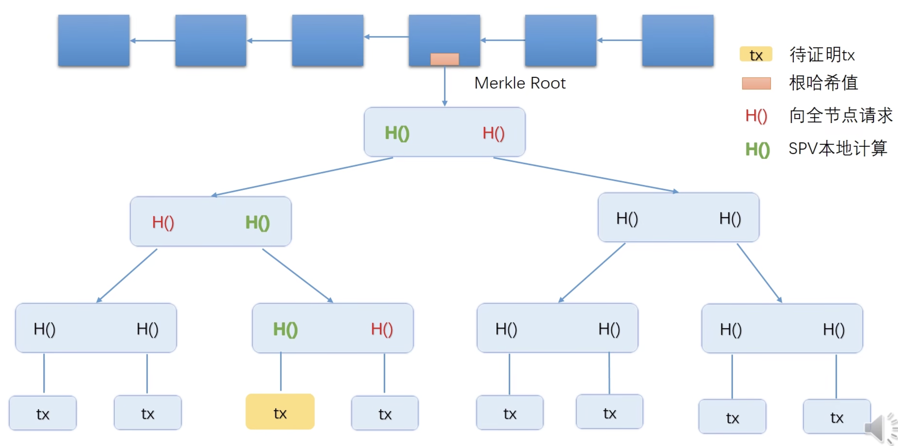
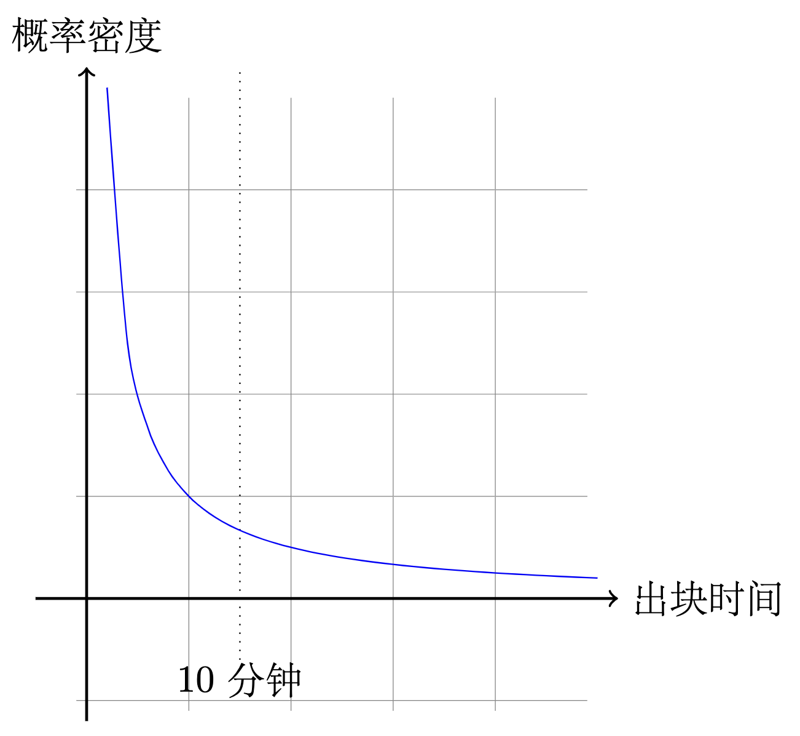
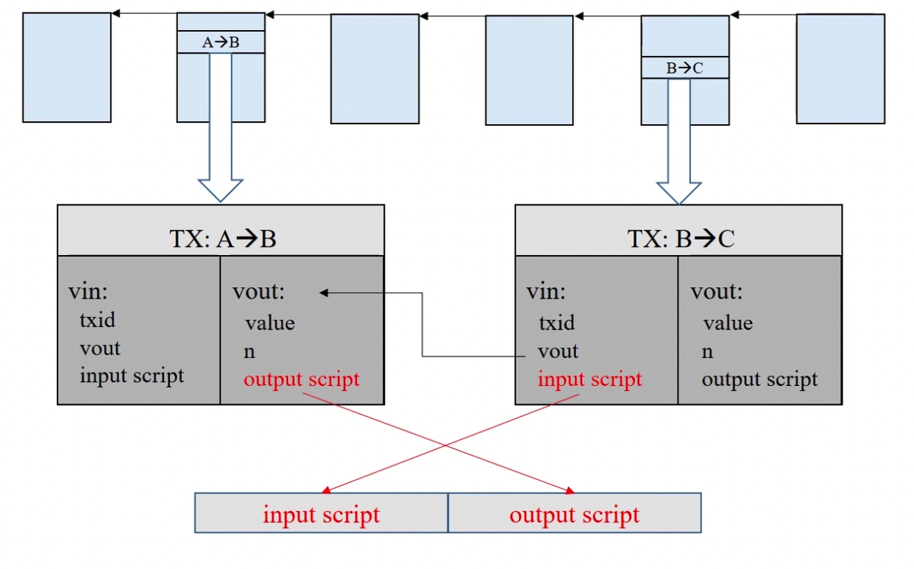
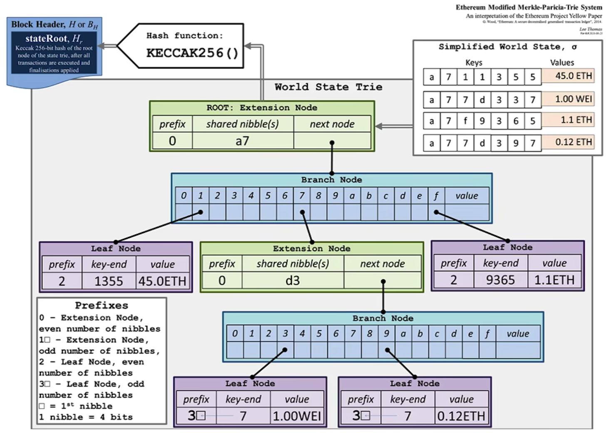

# 区块链

老师主页：http://zhenxiao.com/blockchain/

同学笔记：https://blog.csdn.net/Mu_Xiaoye/article/details/104299664

https://sinocifeng.github.io/downloadPage.html

## 密码学原理

比特币用到了密码学中的两个功能，一个是哈希，一个是签名。

### 哈希

密码学中的 hash 函数称为 cryptographic hash function，其两个重要性质分别为 collision resistance（对哈希碰撞具有抗拒性）和 hiding（隐藏性）

目前并不存在一个hash函数可以从数学上证明具有 collision resistance 的性质，但是发生 collision 的概率非常小，所以可以被认为是 collision resistance。

#### collision resistance 作用

对于任意一个 m,m'，都有 H(m) $\neq$ H(m')，所以对于消息 m 的任何修改，只要比较 hsah 值就可以被检测出来。

#### hiding

给定x和Hash(),可以很容易得到Hash(x),但没有办法在已知Hash(x)和Hash()的情况下，反推出x的具体取值

#### digital commitment

collision resistance 和 hiding 结合实现 digital commitment

某个人对某个股票进行涨停预测，我们如何保证能够知晓其预测是否准确？最简单的是提前公布，等待实际结果出现后验证。但实际中，当提前发布预测后，可能会由于预测者本身对股市实际结果造成影响。所以，应该将提前将其写于纸上并密封，交给第三方机构保管，等到实际结果出现后开启密封与实际对比，这就是 digital commitment。而第三方机构需要能够使人信服，在实际生活中，有很多场景并不存在一个这样的第三方机构，而区块链技术正为此提供了一个很好的解决方法。

我们把预测结果看作 x，提前公布 Hash(x)，等到预测结果发生时间来临后，公布 x，如果根据 x 可以得到公布的 Hash(x)，则说明公布的 x 确实为所预先预测的内容。从而，我们可以实际进行判断预测是否准确。实际使用中，为了 Hash(x) 分布足够均匀，会对 x 进行“加盐”，对 x 拼接一个 nonce，对其整体取 Hash，通常这个 nonce 是一个随机数。

#### Puzzle friendly

在比特币系统中，还需要第三个性质 Puzzle friendly。根据输入很难预测出输出。比特币系统需要一个哈希值，存在于某一个范围内，H(block header) $\leq$ target，nonce 是 block header 的组成部分，只能通过不停地调整 nonce 运算查找出来。block header 的组成细节详见 Merkle Tree（默克尔树）部分章节。

```
              whole space
┌──────┬───────────────────────────────────────┐
│target│                                       │
└──────┴───────────────────────────────────────┘
```

该性质保证了工作量证明（POW, proof of work）机制可以运行下去，挖矿难，但验证易。在比特币系统中采用 SHA-256 哈希函数。

### 签名

在比特币系统中，申请账户是用户自己来处理的，即自己创建一个公钥-私钥对。公钥和私钥的应用保证了“签名”的应用。当在比特币网络中进行转账时，通过“签名”可以明确是由哪个账户转出的。在发布交易时，通过自己私钥签名，其他人可以根据公钥进行验证，从而保证该交易由自己发起。也就是说，只有拥有私钥，才能将该账户中的比特币转走。

## 数据结构

### Hash pointer（哈希指针）

哈希指针不能用于循环链表，否则会出现循环依赖。

两个指针指向这个节点（实际上为一个），其中P为该节点的地址，H()为该节点的哈希值，该值与节点中内容有关。当节点（区块）中内容发生改变，该哈希值也会发生改变，从而保证了区块内容不能被篡改。

```
  p        H(m)
  │         │
  │         │
  │         │
  │         │
┌─▼─────────▼─┐
│             │
│    block    │
│             │
└─────────────┘
```

本区块的哈希值 H(m) 是在下一个 block 里面，也就是说每个 block 有两个部分，一个是前一个区块的 H(m)，还有一个是自己本身的内容。算自己的哈希值需要让自己的内容跟上一个区块的哈希值合在一起算本区块的哈希值。

```
┌─┐     ┌────┬─┐      ┌─────────┬─┐
│A│◄────┤H(A)│B│◄─────┤H(H(A)+B)│C│◄─────H(H(H(A)+B)+C)
└─┘     └────┴─┘      └─────────┴─┘
genesis                 most recent
block                   block
```

第一个区块叫创世区块，最后一个叫最新区块。最后一个区块的哈希值保存在系统中。篡改 B 的内容，而 C 中保存有 B 的哈希值，所以 C 也得进行修改。而同样C后区块也得修改。而用户只需要记住最后一个区块链的哈希地址，就可以检测区块链上内容是否被篡改。这个区块链的结构是一个简化版，具体的区块链结构详见 区块链完整结构 章节。

在实际应用中，一整条链可能会被切断分开保存在多个地方。若用户仅仅具有其中一段，当用到前面部分区块数据时，直接问系统中其他节点要即可，当要到之后，仅仅通过计算要到的最后一个区块的哈希值和自己保存哈希值是否一致可以判断所给内容是否确实为区块链上真实的内容。

### Merkle Tree（默克尔树）

```
                                root hash
                     ┌────────────────────────────┐
        ┌────────────┤H(H(H(A)+H(B))+H(H(C)+H(D)))│
        │            └──────────────┬─────────────┘
        │                           │
        │                           │
        ▼              ┌────────────▼────────────┐
hash pointers◄─────────┤H(H(A)+H(B)) H(H(C)+H(D))│
        ▲              └────┬───────────────┬────┘
        │                   │               │
        │                   │               │
        │                   │               │
        │              ┌────▼────┐     ┌────▼────┐
        └──────────────┤H(A) H(B)│     │H(C) H(D)│
                       └─┬─────┬─┘     └─┬─────┬─┘
                         │     │         │     │
                         │     │         │     │
                        ┌▼┐   ┌▼┐       ┌▼┐   ┌▼┐
     data blocks──────► │A│   │B│       │C│   │D│
                        └─┘   └─┘       └─┘   └─┘
                       transaction
```

本质上是一个 binary tree。只有最下面的区块存数据，其他都是哈希值。上图即为一个简单的 Merkle Tree，其中 A、B、C、D 为数据块。可见，A 和 B 各有一个哈希值，将其合并放在一个节点中，C 和 D 同样操作，而后，针对得到的两个节点分别取哈希，又可以得到两个新的哈希值，即为图中根节点。实际中，在区块块头（block header）中存储的是根节点的哈希值（对其再取一次哈希）。

该数据结构的优点在于：只需要记住 Root Hash（根哈希值），便可以检测出对树中任何部位的修改。

区块本身分为两部分 block header 和 block body（块头和块身），每一个区块本身（block body）是以 Merkle Tree 存储交易记录，在块头中存在有根哈希值（没有交易的具体信息），块身中存在交易列表，由多个 data blocks 组成。

#### block header 与 block body 组成部分

block header 包含了区块链一些宏观的信息。

- Version（比特币版本协议）
- Hash of previous block header（指向前一个区块指针）
- Merkle root hash（默克尔树根哈希值）
- target（挖矿难度目标阈值）
- nonce（随机数）

需要保证整个 block header 满足 H(block header) $\leq$ target。

block body 是由 transaction list（交易列表）组成。

#### 区块链完整结构

下面每一个区块都是 full node（全节点），包含区块链的完整信息，验证每个交易，所以也叫 full validating node。

```
               block1                                      block2
┌─────────────────────────────────────┐     ┌─────────────────────────────────────┐
│              header                 │     │              header                 │
│   ┌─────────────────────────────┐   │     │   ┌─────────────────────────────┐   │
│   │version                      │   │     │   │version                      │   │
│   │                             │   │     │   │                             │   │
│   │Hash of previous block header│◄──┼─────┼───┤Hash of previous block header│◄──┼─────...
│   │                             │   │     │   │                             │   │
│   │Merkle root hash             │   │     │   │Merkle root hash             │   │
│   │                             │   │     │   │                             │   │
│   │target                       │   │     │   │target                       │   │
│   │                             │   │     │   │                             │   │
│   │nonce                        │   │     │   │nonce                        │   │
│   └─────────────────────────────┘   │     │   └─────────────────────────────┘   │
│                                     │     │                                     │
│                                     │     │                                     │
│               body                  │     │               body                  │
│   ┌─────────────────────────────┐   │     │   ┌─────────────────────────────┐   │
│   │                             │   │     │   │                             │   │
│   │      transaction list       │   │     │   │      transaction list       │   │
│   │                             │   │     │   │                             │   │
│   │              .              │   │     │   │              .              │   │
│   │              .              │   │     │   │              .              │   │
│   │              .              │   │     │   │              .              │   │
│   └─────────────────────────────┘   │     │   └─────────────────────────────┘   │
│                                     │     │                                     │
└─────────────────────────────────────┘     └─────────────────────────────────────┘
```

#### Merkle Tree 应用

Merkle Tree 可以用于提供 Merkle Proof。比特币中节点分为轻节点和全节点。全节点保存整个区块的所有内容，包括 block header 和 block body，而轻节点仅仅保存区块的块头信息。

##### 为什么要分轻节点和全节点？

因为硬件的局限。一个区块大小为1MB，对于移动便携设备来说，如果存储区块的所有内容，则所需空间过大，而这是不现实的。所以轻节点只需要存储区块块头信息，全节点存储区块所有内容即可。

###### 全节点特点

- 一直在线
- 在本地硬盘上维护完整的区块链信息
- 在内存里维护UTXO集合，以便快速检验交易的正确性
- 监听比特币网络上的交易信息，验证每个交易的合法性
- 决定哪些交易会被打包到区块里
- 监听别的矿工挖出来的区块，验证其合法性
- 挖矿
  - 决定沿着哪条链挖下去？
  - 当出现等长的分叉的时候，选择哪一个分叉？

###### 轻节点特点

- 不是一直在线
- 不用保存整个区块链，只要保存每个区块的块头
- 不用保存全部交易，只保存与自己相关的交易
- 无法检验大多数交易的合法性，只能检验与自己相关，可以验证交易是符合难度要求。
- 的那些交易的合法性。
- 无法检测网上发布的区块的正确性
- 可以验证挖矿的难度
- 只能检测哪个是最长链，不知道哪个是最长合法链
- 转账不需要挖矿，只需要轻节点就行了

##### Merkle proof 实例

轻节点只有下图深蓝色的部分，没有具体的交易内容，只有根哈希值。轻节点已知本次交易内容，轻节点计算出本次交易的哈希值，请求全节点返回到根节点的所有红色哈希值，轻节点一层层向上计算到根节点，再与自己的根节点哈希值对比一下，一样则交易有效。这个过程就是 Merkle proof。



##### proof of membership

证明存在交易只需要 Merkle proof 在 $O(log(n))$ 就可以证明存在此交易。

##### proof of non-membership

只要全节点把所有的交易 data block 发给轻节点，轻节点一一验证，就可以证明不存在此交易，时间复杂度为 $O(n)$。可以使用 Sorted Merkle Tree 降低复杂度。

##### Sorted Merkle Tree

把所有的交易数据块取哈希，并按照哈希值大小排序，如果一个交易块不存在，则一定在两个已经存在的交易块之间，所以只要计算这两个交易块的哈希值，并进行 Merkle proof，如果通过了 Merkle proof，则确实不存在此交易数据块。

比特币中不需要证明不存在此交易，所以无需 Sorted Merkle Tree。

## 协议

电子货币交易协议需要满足交易不可伪造性，货币不可复制性。分为中心化的解决方案和去中心化的解决方案。

在中心化方案中，通过在电子货币加上付款人的数字签名，这样其他用户就不能伪造货币拥有者进行转账，即交易不可伪造。如何解决货币不可复制性呢？

### 双花攻击

数字货币本身为带有签名的数据文件，可以进行复制。对于用户来说就可以花两次。

1. 解决：对货币添加唯一编号，每次支付向货币发行单位查询真伪，一旦支付就不属于付款人。
2. 问题：货币发行单位是一个第三方机构，并且这是一个典型的第三方中心化方案。以去中心化思想为核心的比特币系统便吸引了人们的注意力。

去中心化也需要解决这两个问题。

### 去中心化交易协议实例

通过数字签名避免伪造身份，即交易不可伪造性。在交易中，收款方需要知道付款方的公钥，从而验证 A 签名是否有效，实际上其他节点都需要知道付款方公钥，验证交易合法性。交易过程需要对付款人进行身份认证，每次交易都需要有 A 的签名，用 A 的私钥签名，第三方可以通过 A 的公钥验证交易是否真的是 A 发起的，避免其他人将 A 的钱“偷走”。

需要说明的是发消息与数字签名的公私钥用途相反。A 向 B 发消息，用 B 的公钥加密，B 收到后用自己的私钥解密。

```
              ┌──────────────┐         ┌───────────┐      ┌─────────┐
              │              │         │           │      │         │
              │          ┌───┼─────────┼───┐     ┌─┼──────┼───┐   ┌─┼────────────┐
              │          │   │         │   │     │ │      │   │   │ │            │
┌─────────────┼──┐       │   │         ▼   │     │ │      ▼   │   │ C────►E(7)   │
│create coin  │  │       │   A──┬─────►B(5)│     │ B─┬───►C(2)│   │ │            │
│             ▼  │◄──────┤      │          │◄────┤   │        │◄──┤ │ signed by C│
│           A(10)│       │      └─────►C(5)│     │   └───►D(3)│   └─┼────────────┘
└────────────────┘       │             ▲   │     │ signed by B│     │
                         │  signed by A│   │     └────────────┘     │
                         └─────────────┼───┘                        │
                                       │                            │
                                       └────────────────────────────┘
```

- 在该图中，一个区块仅含有一个交易，实际中一个区块中包含多个交易，交易通过 Markle Tree 组织起来，在区块中存储。

- 上图的交易数据块有两种哈希指针：说明交易过程的，说明币的来源的。这两种指针都是为了避免双花，即货币不可复制性。每个币都是由来源的，不是凭空产生的。付款人的公钥哈希需要和货币上次交易的收款人即拥有者的公钥哈希一致。

- 在上图中，A 在 create coin 区块中获得了币，在该区块中存有 A 的公钥的哈希，即 A 的转账地址，如果下次交易付款人的公钥哈希与 A 作为收款人在上次获得币的交易地址，即 A 的公钥哈希相等，则 A 拥有该币。如果不相等，说明这个币当初不是给 A 的。如果 B' 冒充 A 给 B 一些 A 的货币，因为 B' 的公钥哈希（收款地址）不等于这些币拥有者的公钥哈希（收款地址），所以交易不成立。从付款人向回指的指针是说明本次交易的来源。

- 进行交易时，需要币的来源、付款人的公钥和收款人的地址，即收款人的公钥的哈希。（虽然公钥可以公开，但实际中更多公开的是公钥的哈希）

轻节点没有办法独立验证交易的合法性。比如无法验证 double spending（双花攻击）。因为轻节点没有存交易信息，它只存储块头信息。轻节点没有参与区块链的构造和维护

### 分布式共识协议

电子货币交易协议虽然满足了交易不可伪造性，货币不可复制性，但这仅仅是本地的账本，如何跟其他人的账本保持一致呢？

可以通过投票，多数通过就可以写入账本，此时谁有投票权就成了问题。如果有人恶意生成很多账户，就有了控制权。这就是女巫攻击。比特币通过工作量证明来赋予写入账本的权利。调整 nonce 值，如果 H(block header) $\leq$ target，谁就有写入去中心化账本的权利。

区块的插入位置是通过 Hash of previous block header（指向前一个区块指针）确定的。

如果一个区块被插入到了链的中间会被丢弃，比特币不允许分支。只有在一种情况存在短时间分支。如果两个节点同时拿到账本写入权利，两个区块同时写入，此时两个区块都会保留一会儿，直到下一个区块接上这两个区块里面的一个，没有接上的，就会被丢弃。这个被丢弃的区块叫 orphan block。

交易有验证时间的。 要看后面挖到矿打包的那个块，如果上面的快过下面的块 下面的块内容交易会失败，以上面的为准下面的就不被承认，所以比特币的交易有可能在几个块之后才会确认完成交易。

谁获得了记账权，谁就会获得比特币奖励。一开始是 50 BTC，每增加 21 万 BTC，奖励减少一半。

## BTC 具体实现

区块链是一个去中心化的账本，比特币采用了基于交易的账本模式。然而，系统中并无显示记录账户包含比特币数，实际上其需要通过交易记录进行推算。

### UTXO

在比特币系统中，全节点需要维护一个名为 UTXO (Unspent Transaction Output 尚未被花掉的交易输出) 的数据结构，为了方便回溯，转账的币的来源，避免双花，加速验证速度。

如图，A 转给 B 五个 BTC，转给 C 3 个 BTC，B 将 5 个 BTC 花掉，则该交易记录不保存在 UTXO 中，C 没有花掉，则该交易记录保存在 UTXO 中。

```
A──┬────►B(5)
   │
   └────►C(3)
```

UTXO 集合中每个元素要给出产生这个输出的交易的哈希值，以及其在交易中是第几个输出。通过这两个信息，便可以定位到 UTXO 中的输出。每个交易会消耗输出，但也会产生新的输出。

```
A──┬────►B(5)   B─────►D(5)
   │
   └────►C(3)
```

如图，A 转给 B 5 个 BTC，之后 B 将其转给 D，则 UTXO 中会删掉 A->B 这一交易记录，同时会添加 B->D 这一交易记录。

假如有人收到 BTC 转账，但一直不花，那么这个信息会一直保存在 UTXO 中。这种情况可能是该用户不想花这些 BTC (如：中本聪) ，也有可能是忘记了私钥导致无法花掉。所以，UTXO 是逐渐增大的，但该数据目前来说，一个普通的服务器硬盘中是可以完全保存这些数据的。

### Transaction fee 交易费

每个交易可以有多个输入，即多个比特币转入源，也可以有多个输出，即多个付款。一般来说，输入之和要等于输出之和（total inputs = total outputs）。 

存在一些交易的 total inputs 略大于 total outputs，这部分差额便作为交易费，给了获得记账权的节点。大多数区块可以包含多个交易区块。如果没有为别人打包交易区块的奖励，获得记账权发布自己的节点就只想着打包自己的交易区块，获得创建区块奖励。

如果帮别人打包交易可以收取一定的手续费，此时有可能是 total inputs = 1 BTC > total outputs = 0.99 BTC。这就是 BTC系统的 Tranction fee。获得记账权节点除了得到出块奖励之外， 还可以得到为别人打包交易区块的交易费。

但目前来说，交易费远远小于出块奖励。等到未来出块奖励变少，可能区块链的维护便主要依赖于交易费了。

### BTC 系统出块奖励机制

BTC 出块奖励每 4 年减一半，计算公式
$$
\frac{21 万 \times 10 分钟}{60分钟 \times 24小时 \times 365天} \approx 4年
$$

- 系统平均出块时间为 10 分钟，比特币通过公式自动调整难度（target）故意使出块时间在 10min（达成全网共识所需的必要时间）

### 基于账户的模式

比特币是基于交易的模式，还有一种基于账户的模式（以太坊）。基于账户的模式要求，系统中显示记录账户余额，可以直接查询当前账户余额。

比特币隐私性较好，但在进行交易时，因为没有账户这一概念，无法知道账户剩余多少 BTC，所以必须说明币的来源（防止双花攻击）。

基于账户的模式，则天然地避免了这种缺陷，转账交易就是对一个（多个）账户余额的数字减和另一个（多个）账户余额的数字加。

### BTC 系统区块信息

第 762268 块比特币区块信息网址：https://www.blockchain.com/explorer/blocks/btc/762268

部分区块信息

- Difficulty：每隔 2016 个区块调整难度，使出块时间在 10min。

### extra nonce

nonce 是一个 int_32 数字，最大搜索空间是 $2^{32}$。如果比特币价格过高，比特币会自己调整 Difficulty，有可能难度大到搜索完整个 nonce 空间，都找不到解。所以需要借助其他区块头可以修改的参数，增大搜索空间。

target是256位，可以把 Merkle root 最下面那个创世区块的 CoinBase 内容改了，这里可以写入任何内容。

coinbase 是每个区块的第一个交易，没有输入只有输出，可以随意改备注，每个发布区块者可以得到出块奖励，在区块中发布一个铸币交易（coinbase 交易）是 BTC 系统中产生新比特币的唯一方式。

> 第 762267 个区块的铸币交易详情页：https://www.blockchain.com/btc/tx/0566c6219bb5475983840fc6b3ac02a7f3bf83207b4d56e8daed6f945957375c

可以把 coinbase 前八个字节当作 extra nonce 来使用。使用两层循环，第一层循环调整 extra nonce 算出 Merkle root hash，第二层循环再调整 nonce。

### 普通转账交易

如果将本区块输入脚本和上一个区块输出脚本拼接起来可以顺利执行不出现错误，则说明交易合法。

### 挖矿过程的概率分析

#### 伯努利试验

每次尝试 nonce，可以视为一次伯努利试验，最典型的伯努利试验就是投掷硬币，正面和反面朝上概率为 p 和 1-p

在挖矿过程中，一次伯努利试验，成功的概率极小，失败的概率极大。挖矿便是多次进行伯努利试验，且每次随机。这些伯努利试验便构成了 a sequence of independent Bernoulli trials（一系列独立的伯努利试验）。

#### 泊松分布近似

根据概率论相关知识知道，伯努利试验本身具有无记忆性（memoryless）。也就是说， 无论之前做多少大量试验，对后续继续试验没有任何影响。 对于挖矿来说，便是多次伯努利试验尝试 nonce，最终找到一个符合要求的nonce。尝试的次数很多，成功的概率很小，这种情况可以采用泊松分布近似，由此通过概率论可以推断出，系统出块时间服从指数分布。出块时间指的是整个系统出块时间，并非单个节点出块时间。

#### progress free

系统平均出块时间为 10min，该时间为系统本身设计，通过难度调整维护整个系统平均出块时间。 指数分布本身也具有无记忆性。也就是说，对整个系统而言，已经过去 10min 没有挖到区块，那么平均仍然还需要等 10min，将来要挖多久和已经挖多久无关，如下图，十分钟之后还是一个指数函数，这样的过程叫 progress free。无记忆性类似于打游戏三下不出暴击，第四下暴击概率还是一样，不会因为你前三次没暴击而导致第四次暴击概率变大。



#### 挖矿公平性保证

一个节点的算力是另外一个的 10 倍，收益也应该是 10 倍，如果没有 progress free，那么10 倍算力的节点由于之前已经做了大量的计算工作，收益会超过 10 倍。progress free 是公平性的保证。

### 比特币总量计算

$$
21万 \times 50 + 21万  \times 25 + 21 万 \times 12.5 + \dots \\
= 21万 \times 50 \times (1 + \frac{1}{2} + \frac{1}{4} + \dots) = 2100 万
$$

挖矿这一过程并没有实际意义，但挖矿这一过程，却是对比特币系统的稳定起 到重要维护作用。 所以，只要大多数算力掌握在好的节点手中，便能够保障比特币系统的稳定。

### 比特币系统安全性分析

只要大多数算力掌握在诚实的节点手里，就能保证去中心化交易的安全。

#### 偷钱

90% 的算力掌握在好的节点手里，10% 在恶意节点手里。此时恶意节点拥有 10% 的概率获得记账权。恶意节点通过将别人的钱转到自己账上的交易强行写入区块链。这样的交易不会被大多数诚实的节点认可，其他节点会沿着另外一个分支继续挖矿。这样恶意节点就会损失开块奖励。

#### 双花攻击

```
                                    M->A             M->M'
┌────────┐       ┌────────┐       ┌────────┐       ┌────────┐
│        │       │        │       │        │       │        │
│        │◄──────┤        │◄──────┤        │◄──────┤        │
│        │       │        │       │        │       │        │
└────────┘       └────────┘       └────────┘       └────────┘
```

这样的交易是会立刻被检测出来，因为 M 的比特币来源不合法，会立刻被其他节点抛弃，去计算其他分支的区块链。

#### 分叉攻击实现双花攻击

```
                                    M->A
┌────────┐       ┌────────┐       ┌────────┐
│        │       │        │       │        │
│        │◄──────┤        │◄──────┤        │
│        │       │        │       │        │
└────────┘       └────────┘       └────────┘
                      ▲
                      │             M->M'
                      │           ┌────────┐
                      │           │        │
                      └───────────┤        │
                                  │        │
                                  └────────┘
```

虽然这依然不会被认可，但第一次 M->A 会在现实中产生不可逆的影响。M->A 买了一个东西，被承认，收到货，再把钱转给自己并扩展下面的分支，这样 M->A 就不会被承认，此时 M 再把钱转到自己的账户 M->M' 就会被承认，因为钱没有被花出去，可以再花一次，这样既得到了钱，也得到了货物。

一般来说，诚实的节点会沿着 M->A 继续向下扩展区块，所以 M->M' 要持续获得记账权才能让 M->M' 这个分支获得认可。但恶意节点的算力只有 10%，这种恶意攻击几乎是不可行的。只有掌握大部分算力达到 51% 以上才有可能。

##### confirmation

为了防范这样的攻击，一般需要多确认几个节点，这样的机制就是 confirmation。确认越多的区块，却不容易被篡改。比特币缺省是确认六个区块，交易才算被认可。需要被认可的区块叫 one confirmation，后面的区块以此类推直到 six confirmation，才会认为 one confirmation 不会被篡改。一般需要等待一个小时。

转账交易发出去了，还没有写入区块链，但外部的交易系统也会承认这个区块，叫 zero confirmation。外部的交易系统会确认是本人发起的交易，且这些币没有被花过，就可以进行 zero confirmation。可能交易成功后，货第二天才发货，如果第二天发现区块没有被写入，也可以取消交易。

#### 故意不包含合法交易

未包含的区块可以等待后续区块包含，所以问题不大。实际运行中，可能由于某段时间实际交易数太多，而一个区块包含交易数存在最大值，导致某些合法交易并未被写入区块链（等待 后续区块写入）。

#### selfish mining

提前挖到但不发布，继续挖下去，等到想要攻击的交易等了6次确认认为安全之后将整条链发布出去，试图回滚原来记录。这种情况，需要恶意节点掌握系统中半数以上算力，比如 51% 才行，否则无法成为最长合法链。

##### selfish mining 好处

如图所示，假使挖到 2 号时候先不发布，则其他人仍然需要挖 1 号区块，若其算力足够强，能保证别人挖出 1 之后可以挖出 3。可以此时将 2 和 3 一起发布，从而将 1 区块所在链最长合法链挤掉，减少了别人和自己竞争挖 3 号区块。

但这样存在风险，如果别人已经挖出 1，自己还没挖出 3，则需要尽快发布 2 和别人竞争最长合法链地位。

## 网络

比特币工作于网络应用层，其底层（网络层）是一个 P2P Overlay network（P2P 覆盖网络）。比特币系统中所有节点完全平等，其他网络存在超级节点（super node）。加入网络需要知道一个种子节点，通过种子节点告知自己它所知道的节点。节点之间的通信采用了 TCP 协议，便于穿透防火墙。当节点离开时，只需要自行退出程序即可，其他节点在一定时间后仍然没有收到该节点消息，便会将其删掉。

### 比特币网络设计原则

简单、鲁棒（最坏情况下能达到最优状况，即健壮性）而非高效。

每个节点维护一个邻居节点集合，消息传播在网络中采用洪泛法，某个节点在收到一条消息会将其发送给所有邻居节点并标记已经接收过这个节点，下次再收到便不会再发送该消息。

### 邻居节点的选取

在世界上所有节点中随机选取邻居节点，可能加州的节点的邻居节点可能是阿根廷的，邻居节点的选取未考虑网络底层拓扑结构，也与现实世界物理地址无关。该网络具有极强鲁棒性，但牺牲了网络效率。

### 网络中的交易规则

比特币系统中，每个节点要维护一个等待上链的交易集合。第一次听到交易，若是合法交易，则将其加入该交易集合并转发给邻居节点，以后再收到该交易就不再转发，避免网络上交易无限传输。

假如网络中存在两个冲突交易，如交易1：A->B，交易2：A->C（假设花费的同一笔钱）。具体接收哪个取决于节点先接收到哪个交易，无论哪个交易上链了，另外一个交易一定会被丢弃。

BTC协议对于区块大小限制为不大于1M大小。比特币区块最多 4000 个交易，区块最大 1M 字节，每个交易最多 250 字节左右。

## 挖矿难度

nonce 是一个 int_32 数字，最大搜索空间是 $2^{32}$。如果比特币价格过高，比特币会自己调整 Difficulty，有可能难度大到搜索完整个 nonce 空间，都找不到解。所以需要借助其他区块头可以修改的参数，增大搜索空间。 

BTC中的 mining 就是不断尝试区块块头中的 nonce 和 extra nonce 的值，使得：
$$
H(block \ header)≤target
$$
比特币用的哈希算法是 SHA-256。产生的 hash 值是 256 位，整个输出空间是$2^{256}$个可能取值。难度就是调整输出的 hash 值前多少位是 0，0越多，难度越大。

挖矿难度与目标阈值成反比，因为 target 越大，哈希值越容易在范围里。用公式表示：
$$
difficulty = \frac{difficulty\_1\_target}{target}
$$

- difficulty_1_target 是难度为 1 的时候，难度可以理解为平均计算次数，算一次就能算到结果称为难度为1。这是一个很大的数字。

- target 越大，越容易。

### 出块时间

target 越大，出块时间越短。当系统出块时间短的时候，多个节点同时挖出矿，出现分叉将成为常态。分叉过多对系统达成共识没有好处。

系统诚实节点在不同的分叉进行计算，多个分叉同时增长，速度缓慢，如果恶意的节点集中算力，增长特定分叉，就可以把其他分叉抛弃，让自己的分叉达成共识，这就是 51% attack。恶意节点的算力只需要比其他分叉拥有的算力多就行。

```
                          ┌───────┐
                          │       │
                   ┌─────►│       │   orphan block
                   │      └───────┘
                   │
                   │
┌───────┐    ┌─────┴─┐    ┌───────┐    ┌───────┐
│       │    │       │    │       │    │       │  slow
│       ├───►│       ├───►│       ├───►│       │  orphan block
└───────┘    └──┬──┬─┘    └───────┘    └───────┘
                │  │
                │  │
                │  │      ┌───────┐
                │  │      │       │
                │  └─────►│       │  orphan block
                │         └───────┘
                │
                │
                │         ┌───────┐    ┌───────┐    ┌───────┐    ┌───────┐
                │         │       │    │       │    │       │    │       │
                └────────►│       ├───►│       ├───►│       ├───►│       │  fast
                          └───────┘    └───────┘    └───────┘    └───────┘
```

比特币的出块时间控制在 10 分钟，以太坊只需要 15 秒，以太坊使用的是 ghost 共识协议。以太坊对于 orphan block 也给予奖励，这个奖励就是 uncle reward。以太坊也需要保持稳定的出块时间。

### 调整挖矿难度

比特币规定每隔 2016 个区块，调整一次目标阈值，即挖矿难度。大约是 14 天调整一次。$2016 \times 10 /(60 \times 24)=14天$。

target 迭代更新公式
$$
target = target \times \frac{actual\_time}{expected\_time}
$$

- expected time 是预计时间即 $2016 \times 10$。
- actual time 是最近 2016 个区块实际的挖矿时间。

如果实际时间多于 14 天，则 target 会变大，如果实际时间少于两个星期，target 就会变小，增大难度。

target 最多增大或减小四倍，不会突然变化很多。

### 验证区块

为了防止恶意节点不调整区块难度，把验证 target 作为判定合法区块的标准之一。

nBits 有四个字节是 target 的压缩编码，如果 nBits 不符合调整要求，就不是合法的区块，不会被接受。

## 挖矿

如果在挖的这个区块另外一个人已经挖到了，此时应该停止当前的挖矿，重新组装一个候选区块，从头开始挖。这么做并不可惜，因为挖矿的操作是无记忆性（memoryless 或者 progress free）的。

### 第一代挖矿设备 CPU

只用到指令集的少数指令，硬盘很多资源都是闲置的。

### 第二代挖矿设备 GPU

大规模通用并行计算，有很多组件都用不到，比如浮点数计算，比特币的挖矿只用到了整数操作。

### 第三代挖矿设备 ASIC 芯片

专门为了挖矿设计。性价比高，一种芯片智能挖一种货币，只要使用一样的 mining puzzle。SHA256 矿机既可以挖 BTC 也可以挖 BCH，但是不能同时挖两种币，BTC 和 BCH 之间也没有依附关系。

第三代违背了比特币设计的初衷。后来者 alternative mining puzzle 可以对抗 ASIC 机器，让普通 CPU 也能参与进来，这种性质叫做 ASIC resistance。

### 矿池

矿池为了解决收入不稳定的问题。对于整个系统来说，确实 10 分钟挖出一个区块，但对于个人来说，可能一年才挖出一个比特币。这个收入是非常不稳定的。矿池挖到区块的时候就会把收益分给矿工。

矿工只负责计算哈希值。全节点的其他职责都由矿主 pool manager 来承担。

矿主通过矿工提交的 share almost valid block 数量，作为工作量证明，share almost valid block 不一定是真正的 target，可以是降低难度的 target，比如原来 target 前面有 70 个 0，现在矿工计算出了 60个零的 block，矿工把这样的 share almost valid block 发给矿主，后来如果有人挖到了区块，收益以 矿工各自的 share almost valid block 作为工作量证明分配收益。

### 矿工不可能偷一个挖到的区块

每个矿工都是按照矿主分配的任务进行的计算。矿主负责组装好一个区块，然后交给矿工去尝试各种各样的 nonce，光调整 nonce 是不够的，还要调整 coinbase，矿主把不同的 coinbase 对应的 nonce 值的范围交给不同的矿工去尝试。coinbase transaction 里面有收款人的地址，这个地址填的是矿主的地址，矿工把自己挖到的区块发布出去最后钱也会到矿主的钱包里。如果自己把收款人改了，交易内容改变了，算出来的 Merkle root hash 根哈希值也是不一样的，提交给矿主是不认可这个工作量证明的，相当于就是单干，跟矿池没有关系。

### 矿工捣乱

挖到区块把他丢弃掉，矿池之间存在竞争关系，其他矿池可能派矿工搞破坏，也是有可能的。

### 矿池危害

矿池可以集中算力发动攻击。

1. 可以发动双花攻击，A 转给 B 一些比特币，当后面确认了六个区块后，B 认为已经安全了，此时 A 在 A 转给 B 这个交易之前发动双花攻击，利用掌握的 51% 算力超越原来的区块链。

2. 也可以发动 Boycott 封锁攻击，可以阻止特定交易上线，比如要封锁 A 的所有交易，一旦存在 A 交易的区块上链，B 就开始分叉攻击，把 A 的交易覆盖。这样 A 的交易永远不能完成。而且别人也不敢包含 A 的交易，不然当 B 发动攻击时，这些区块就白挖了。

3. 算力无论多强，也不可以把别人账户上面的钱转走。因为没有当事人的私钥。把没有签名的区块企图盗取币，诚实的矿工不会沿着这条链继续挖下去。一旦 51% 攻击成功，比特币就彻底失去价值，马上归零，这样子矿池损失是最大的，随意不会自毁长城，反而会自动减少算力，维护比特币的安全性。

## 比特币脚本



前面有个 A->B的交易，这个交易合法性已经验证完毕。现在有个新的交易B->C，此时需要验证 B 的交易是否合法。验证交易是否合法需要通过脚本验证交易是否是交易者 B 本人发起，币是否属于 B 本人。

下面以 P2PKH 为例。

### 交易是否是交易者本人发起？

只需要验证 input 脚本里面的签名是属于 B 本人的。input 脚本中给出了交易发起人对该交易的签名和自己的公钥，output 脚本中给出了收款人的公钥哈希。如果是合法交易，收款人就是 intput 中交易发起人。input 中签名用公钥检查合法，说明本次交易确实被币所有者发起。

### 币是否属于本人？

只需要证明 input 脚本与 output 脚本公钥哈希相同就行。验证 input 中给出的公钥是否与 output 中给出的公钥哈希是否对应，如果对应，这说明币的来源是合法的。

### 脚本执行过程

一开始的比特币版本需要把输入脚本跟输出脚本拼接在一起从头到尾执行一遍。后来出于安全考虑，输入脚本和输出脚本分开执行。先执行输入脚本，再执行输出脚本。

先执行输入脚本，如果没有出错再执行输出脚本，最后栈顶为非零值，即为 True，最后的结果就是合法的。如果执行过程中出现任何错误，这个结果就是非法的。

如果一个交易有多个输入，每个输入脚本都要和对应的输出脚本匹配验证，全部验证通过，这个交易才是合法的。


下面是输入输出脚本的四种形式。所有的操作前面都有一个 OP_...，为了简单起见下面所有都省略了。

### P2PK (Pay to Public Key)

Input script:

- PUSHDATA(Sig)，用交易发起者的私钥对整个交易的签名。把输入脚本的签名压入栈。

output script:

- PUSHDATA(PubKey)，把输出里提供的收款人的公钥压入栈。这个收款人就是本次交易的发起人。
- CHECKSIG，把两个栈元素弹出，用公钥检查检查签名是否正确。如果正确返回 True 到栈顶，否则执行出错，交易非法。

### P2PKH(Pay to Public Key Hash)

input script:

- PUSHDATA (Sig)，把交易发起人对该交易的签名压入栈
- PUSHDATA (PubKey)，把输入脚本公钥压入栈

output script:

- DUP，把栈顶的元素复制，即把上一条输入脚本交易发起者公钥复制放到栈顶。
- HASH160，把栈顶元素输入脚本交易发起者公钥弹出，取哈希值，并把交易发起者公钥哈希值压入栈。
- PUSHDATA (PubKeyHash)，把输出脚本里面的收款人公钥的哈希值压入栈。这个收款人就是本次交易的发起者。相当于别人不需要知道我的公钥，只需要公钥的哈希值就能给我转账。
- EQUALVERIFY，弹出栈顶两个哈希值，比较是否相等。防止有人冒名顶替，用自己的公钥冒充收款人的公钥。假设哈希值相等就从栈顶消失了。 
- CHECKSIG，弹出两个栈元素，用公钥检查签名是否正确。如果是正确的，栈顶留下 True。

### P2SH (Pay to Script Hash)

不使用收款人公钥的哈希，是收款人提供的脚本的哈希。

input script:

- PUSHDATA (Sig)，交易发起者提供可以让赎回脚本能够正确运行所需要的本人的签名。
- PUSHDATA (serialized redeemScript)，收款人，即交易发起者需要给出赎回脚本

output script:

- HASH160，把栈顶元素输入脚本交易发起者赎回脚本弹出，取哈希值，并把交易发起者赎回脚本哈希值压入栈。
- PUSHDATA (redeemScriptHash)，收款人的赎回脚本的哈希值入栈，即本次交易的发起人。
- EQUAL，验证两个哈希值是否相等。

input script 要给出一些签名（数目不定）及一段序列化的redeemScript。验证分如下两步：

- 验证 input script 里面序列化的 redeemScript 是否与 output script 中的哈希值匹配？
- 反序列化并执行 redeemScript, 验证 input script 中给出的
  签名是否正确？

两步验证都通过了，这个交易才是合法的。这里相当于转账给智能合约（以太坊中的概念）

redeem Script 的形式

- P2PK 形式
- P2PKH 形式
- 多重签名形式

#### 用 P2SH 实现 P2PK

redeemScript:

- PUSHDATA (PubKey)
- CHECKSIG

input script:

- PUSHDATA (Sig)
- PUSHDATA (serialized redeemScript)

output script:

- HASH160
- PUSHDATA (redeemScriptHash)
- EQUAL

##### 第一阶段的验证

- PUSHDATA (Sig)
- PUSHDATA (seriRS)
- HASH160
- PUSHDATA (RSH）
- EQUAL

##### 第二阶段的验证

- PUSHDATA (PubKey)
- CHECKSIG

#### 多重签名

比特币系统中一个输出可能要求多个签名才能把钱取出来。保护私钥，即使泄漏出去了只要其他人不同意钱就取不出来。

最早的多重签名，目前已经不推荐使用
input script:

- X，CHECKMULTISIG 有一个 bug，执行的时候会从堆栈上多弹出一个元素，无法修复 bug，除非通过硬分支。实际的解决方案就是在堆栈上多压进一个没用的元素。
- PUSHDATA (Sig 1)
- PUSHDATA (Sig 2)，签名的相对顺序需要和输出脚本里面的公钥顺序一样。
- PUSHDAIA (Sig M)，输入脚本中只需要给出 N 个中任意 M 个签名，就可以取钱。

outputScript:

- M，阈值，需要 M 个人签名才能取钱
- PUSHDATA (pubkey 1)
- PUSHDATA (pubkey 2)
- ...
- PUSHDATA (pubkey N)
- N，表示需要给出 N 个公钥
- CHECKMULTISIG

##### 多重签名脚本执行实例

下面是 3 个人只要 2 个人同意就可以取钱。

- FALSE，多余的元素
- PUSHDATA (Sig 1)
- PUSHDATA (Sig 2)，与公钥顺序一致
- 2，m 入栈
- PUSHDATA (pubkey_1)
- PUSHDATA (pubkey_2)
- PUSHDATA (pubkey_3)
- 3，n 入栈
- CHECKMULTISIG，检查堆栈是不是包含 3 个签名中的 2 个

这是早期的多重签名并没有使用 P2SH 实现。在现实中又不方便的地方，每隔商家转账公布的方式不一样，有的是 5 选 3，有的是 4 选 2，对用户来说过于复杂。可以使用 P2SH 解决。

##### 用 P2SH 实现多重签名

现在的多重签名一般都采用 P2SH 的形式。

input script:

- X，CHECKMULTISIG 有一个 bug，执行的时候会从堆栈上多弹出一个元素，无法修复 bug，除非通过硬分支。实际的解决方案就是在堆栈上多压进一个没用的元素。
- PUSHDATA (Sig 1)
- PUSHDATA (Sig 2)，签名的相对顺序需要和输出脚本里面的公钥顺序一样。
- ...
- PUSHDAIA (Sig M)，输入脚本中只需要给出 N 个中任意 M 个签名，就可以取钱。
- PUSHDATA (serialized RedeemScript)

output script: 输出脚本变得很简单，复杂度都转移到了赎回脚本里面

- HASH160，对输入的赎回脚本操作得到 rsh
- PUSHDATA (RedeemScriptHash)，赎回脚本哈希值入栈，由商家即收款人公布
- EQUAL

redeemScript: 是在输入脚本里面提供的，即是收款人提供的。

- M
- PUSHDATA (pubkey 1)
- PUSHDATA (pubkey 2)
- ...
- PUSHDATA (pubkey N)
- N，所有人的公钥数量。
- CHECKMULTISIG

商家变化付款的时候只需要修改输入脚本里面的签名数，和赎回脚本里面的内容，然后公布赎回脚本的哈希值就好了，对于用户来说仅仅是付款地址，哈希值变了。

输出脚本相当于问商家要支付宝二维码，以后商家打算用这笔钱时，它的输入脚本会很麻烦，换来上一次用户付款很简单。

##### 用 P2SH 实现多重签名脚本执行实例

第一阶段

- FALSE
- PUSHDATA (Sig 1)
- PUSHDATA (Sig 2)
- PUSHDATA (seriRS)
- HASH160
- PUSHDATA (RSH)
- EQUAL，弹出栈顶两个哈希值，判断输入脚本和输出脚本的哈希值是否相等

第一阶段结束后栈还有

- Sig_1
- Sig_2
- FALSE

第二阶段，就是把赎回脚本展开执行放入栈中。

- 2
- PUSHDATA (pubkey_1)
- PUSHDATA (pubkey 2)
- PUSHDATA (pubkey 3)
- 3
- CHECKMULTISIG，检查堆栈是不是包含 3 个签名中的 2 个

判断第一阶段结束后的所有签名的数量及其对应的公钥是否都在栈里，匹配成功则交易合法。

### Proof of Burn

#### output script

```bash
RETURN
	[zero or more ops or text]
	
```

这种形式的 output 被称为：Provably Unspendable/Prunable Outputs

#### 脚本说明

假如有一个交易的 input 指向这个 output，不论 input 里的 input script 如何设计，执行到 RETURN 命令之后都会直接返回 false，不会执行 RETURN 后面的其他指令，所以这个 output 无法再被花出去，因为输出内容永远无法兑现，全节点不需要保存 UTXO，其对应的 UTXO 也就可以被剪枝了，无需保存。

输出脚本无条件的返回错误，包含这个操作的脚本永远不可能通过验证，用于证明销毁比特币，或者用于在区块链上永久保存消息。

#### 证明销毁比特币

有些小币种需要证明销毁一定数量的比特币才能获得一定数量的币，这些货币叫做 AltCoin（Alternative Coin）。

#### 记录消息

执行到 return 就终止了，return 后面的内容没有机会执行，所以可以写入任意内容。

可以记录 digital commitment，例如把知识产权的哈希值放到 return 后面，保存到区块链上。

coinbase 也可以写入任意的内容，但只有获得记账权的节点才可以写。发布交易不需要有记账权，所有节点都可以使用这个方法消费一些比特币就可以记录消息。

有些没有销毁任何比特币，输入的所有比特币全部用来付交易费，把输入的比特币作为交易费付给挖到矿的矿工了。

## 分叉

### state fork

两个节点同时挖到矿，可以同时发布节点，造成临时分叉， 对比特币当前状态有意见分歧导致的分叉叫 state fork。

分叉攻击 forking attack 也是一种 state fork，叫做 deliberrate fork。

### protocal fork

比特币软件升级不能保证所有人都升级，有些人可能不同意当前版本的升级，用不同版本的协议造成的分叉叫 protocal fork。

根据对协议修改的内容不同，还可以分为硬分叉和软分叉。

#### hard fork

给比特币增加新的特性，扩展新功能。旧的节点不认可新的特性。最典型的例子就是区块大小限制。区块太小导致比特币每秒只能处理 7 个交易，延迟很高。所以有人开始修改协议。

假如大多数节点都升级了区块大小，只要区块不超过 4 M 就是合法的，原来是 1 M，少数区块没有升级，此时会发生永久性分叉。虽然大区块认为大小区块分叉都是合法的，但是大区块会一直沿着大区块挖，因为大部分算力都是大区块，所以会沿着最长合法链挖。

小区块认为大区块不合法，会自己在另外一个分支挖。大区块分叉也有可能出现小区块，但是只要这条链上有小区块不认可的大区块，整条链对于小区块来说都是非法的。所以大家各自沿着自己认为合法的链挖，永远分叉。

交易在网络中传播，绝大多数节点都会收到，但是交易中是不包含版本号的，版本号是节点打包时加在区块头的，所以一个交易可以同时包含在上下两条链，只不过包含它的区块的头部信息中的协议版本号不同。

回放：由于除了大小不同，数据结构都相同，则可以将从一条链上得到的交易复制到另一条链上。为了解决硬分叉的问题，后来区块头加入 chain ID。

#### soft fork

对比特币协议加以限制，原来的协议会变得不合法，引起软分叉，但不是永远的，是临时的。

比如大部分节点把区块大小改为 0.5 M，大部分算力会沿着小区块那条链挖，旧节点沿着另外一条路挖，最后因为小区块也是合法的，最后大区块也会沿着小区块那条最长合法链挖。

block header 里面的 nonce 只有 4 个字节，最多 $2^{32}$ 可能性，所以需要把 coinbase 域前八个字节变成 extra nonce，一共 $2^{96}$ 种可能性，难度完全够用了。但 coinbase 还有很多空间，不止这八个字节。

剩下的空间有人提出可以作为 UTXO 集合的根哈希值。 UTXO 是当时还没有花掉的交易的输出。UTXO 只是全节点在维护，并没有存到区块链里面。把 UTXO 组成 merkle tree，算出跟哈希值，然后存到 coinbase 域里。这样如果轻节点向全节点请求账户余额，轻节点就可以证明全节点的返回值是正确的。这种软件更新会导致软分叉。

P2SH：Pay to Script Hash 就是最著名的软分叉。旧节点只会验证第一阶段，验证 redeem Script 是否正确。新节点才会做第二阶段的验证。旧节点认为合法的交易，新节点可能认为是非法的。新节点认为合法的交易，旧节点一定会判断是合法的交易，因为旧节点只验证第一阶段。

## BTC 问答

- 如果收款人不在线怎么办？

并不需要收款人在线，区块链会记录交易记录与收款人是否在线没有关系。

- proof of Burn

对于 OP_RETURN 语句执行，永远返回错误，但依然会被写进区块链，因为 OP_RETURN 语句执行是在这个区块的输出脚本里面，只有有人想花这个钱的时候才会被验证为非法。

- 是否有可能矿工偷其他矿工挖到的答案？

每个矿工挖到的 nonce 是跟自己的收款地址绑定在一起的。一旦改变收款地址，根哈希值就会变化。

- 交易费是否需要提前给谁？

一个交易有很多输入还有输出，总输出减总输入的差额就是交易费。交易费给谁不需要提前知道，哪个矿工先挖到矿，他会把区块内部交易的差额收集起来，作为自己的交易费。

## 比特币的匿名性

比特币可以无限开户，无限转移资本，感觉只要其中涉及的账户构成的树有足够多的“枝杈”，向上追溯是很困难的，并且可以用一推账户的微操掩盖一个人的重大目的

### 比特币交易透露个人钱包间的关联

比特币交易允许多个 input，多个 output。

例如下面的交易，数字代表转账明细。

```
         4     5
input: addr1 addr2
output:addr3 addr4
         6     3
```

很容易可以判断，addr4 是找零地址，因为如果 addr4 是商家地址，就不需要两个输入了，因为钱不够才使用两个输入的。

### 比特币与真实身份关联

一旦比特币系统与现实世界交互，就有可能暴露真实身份。

## 比特币引发的思考

### 哈希指针

在计算机中指针存储的是本地计算机的地址，只有在本地才有意义。哈希指针只是一种形象的说法，只有哈希，没有指针。

区块链的链表是通过存在 levelDB 的 kv 键值对，串联起来的，不是真正的链表。最后一个区块哈希值为 key，可以通过 kv，寻找到上一个区块的内容，再根据内容中的哈希 key，找到上上个区块。以此类推。有些指针没有存 kv，可以问全节点。这样的机制保证了区块链不被篡改

### 区块恋

有人把区块链密钥分成两部分，以后在一起就可以取出来。这样不安全，因为私钥从 256 位变为 128 位。现实中共享私钥可以使用多重签名。

### 分布式共识

达成共识是不可能的，比特币没有取得真正意义下的共识，比特币随时可能被分叉攻击。

在异步的环境中，不可能区分远程服务器是否宕机或者网络拥堵。

### 比特币的稀缺性

稀缺的东西不适合作为货币，因为一开始拥有多数比特币的人只会越来越富。就跟房地产一样，房价疯长的社会不是一个健康的社会。

### 量子计算

为了防止量子计算机破解私钥，比特币系统对货币地址取了哈希，这样就不能推导出原来的公钥，也不能推导出私钥了。

每次交易是将比特币全部花出，一部分用于支付，一部分转移到新的账户，所以不会有余额。

## 以太坊概述

以太坊与比特币的区别

- 以太坊出块时间只有十几秒，并且提出了基于 ghost 协议的共识机制。
- 以太坊设计的 mining puzzle 对内存的要求很高。这样可以限制 ASIC 芯片的使用。
- 以太坊把工作量证明（proof of work）转换为权益证明（proof of stake）。
- 以太坊增加对智能合约的支持。比特币是货币去中心化，以太坊在此基础上增加了去中心化智能合约的支持。
- BTC 最小的计量单位是一聪（satoshi），ETH 最小的计量单位是 Wei，1 以太币等于 $10^{18}$ Wei。

## ETH 账户

比特币没有账户的概念，比特币是基于交易运行的。钱包拥有者可能不知道自己有多少钱。在比特币中，如果 A 传给 B 10 个比特币，B 转给 C 3 个比特币，因为比特币是基于交易的，所以 B 是把上次交易的所有比特币都参与此次交易，另外 7 个比特币会自动转到一个新的临时地址里，再转移给自己。

而以太坊是基于账户的，当 A 转给 B 10 ETH 时，只需要检查 A 的账户里有没有 10 个 ETH。

以太坊天然防御双花攻击。如果想花两次只要扣两次钱就可以了。

### 防御重放攻击

但除了双花攻击还有 reply attack，重放攻击。以太坊通过将交易与 nonce 打包签名的方式防止重放攻击。nonce 内容是这是 A 的第几次交易。全节点通过状态树维护每个账户的当前交易次数，如果新的交易来了，检查交易 nonce 是否是全节点存下来 nonce 加一，是的话交易成立，即使重放攻击，因为 nonce 不是全节点存下来 nonce 加一，所以交易不会被认可。

### 账户类型

外部账户与合约账户的构成：

外部账户（externally owned account）

- 账户余额（balance）
- nonce

合约账户（smart contract account）

- balance
- nonce
- code
- storage，存储程序状态。

一个合约账户可以调用另外一个合约账户

合约账户不能主动发起一个交易，交易只能由外部账户发起。

创建合约账户的时候会返回合约地址，通过地址调用合约。调用过程中状态会发生变化，即 storage 会改变。

## ETH 状态树

以太坊中用到的账户地址是 160 位的，20 个字节，40 个 16 进制数。以太坊需要通过一个数据结构实现账户地址映射到账户状态。

证明余额可以用 Merkle tree。但如果每次交易都重新构建一个 Merkle tree 计算代价是非常大的。所以使用 Merkle tree 实现账户地址映射到账户状态是不可行的。

也可以使用哈希表进行键值映射，因为以太坊地址是对公钥进行哈希，再把前面一段长度截掉，后面的作为以太坊地址，哈希表会把地址做哈希，所以会产生哈希碰撞。所以不能用哈希表。

### 字典树

英文 trie，词源 retrieval。以太坊是利用类似 trie 的数据结构存储账户地址与状态之间的映射的。字典树最基础的应用——查找一个字符串是否在“字典”中出现过。

以太坊的 trie 性质（优点）

- 以太坊所有的键值都是 40 位 16 进制数（160 bit），长度一样。所以 trie 上长度都一致。
- 不存在哈希碰撞。只要地址不一样，一定映射到不同分支。
- 无关插入顺序。无论怎么改变插入顺序，最后的树是一样的。
- 更新操作局部性好。不需要访问整棵树。

缺点

有些只有一个叶子节点，但还是要排 40 层，浪费空间。可以使用 Patricia tree 改进，使用路径压缩。

### Patricia tree

键值分布比较稀疏的时候路径压缩比较好。稀疏的意思就是用到的字母比较少，如果路径每个字节都不一样，就无法压缩。

如果有新的地址加入，可能原来压缩的路径还要扩展开来。

以太坊地址有 $2^{160}$ 个可能，所以地址是稀疏的。

### Merkle Patricia tree

Merkle Patricia Tree 是一种使用哈希函数来存储数据的树形数据结构。它将数据存储在一系列的哈希桶中，每个桶都包含一个哈希值，这个哈希值由它的子节点的哈希值计算而来。这种数据结构可以用来验证一个节点所拥有的数据是否完整，并且可以更加高效地查找数据。

- 防篡改。任何一个账号修改，都会改变哈希值。
- 利用 Merkle proof 证明账户余额。账户自底向上整个分支作为 Merkle proof 发给轻节点。
- 证明账户不存在。

### Modified MPT

以太坊真正用的是 Modified MPT，没有本质的修改。如图：



块之间的指针是用哈希指针连接的。

以太坊区块间状态树大部分节点是共享的。只有发生改变的账户，才会在下一个区块中新建分支。

以太坊因为确认交易的时间只有十几秒，所以很容易产生分支，被抛弃的分支必须回滚到上一个状态。智能合约很复杂，历史运行状态保存才能被回滚。

利用 RLP（Recursive Length Profix）序列化存储状态树 key，value。

## ETC 交易树与收据树

交易树是一种用于存储交易信息的数据结构，它将交易信息存储在一个树形结构中，用于记录以太坊网络中发生的所有交易。

收据树是一种类似的数据结构，它将收据信息存储在一个树形结构中，用于记录以太坊网络中发生的所有收据。它们的主要作用是用于记录和验证网络中发生的交易，以及验证参与者身份。

### bloom filter

Bloom Filter 是一种用于在以太坊网络中优化查询效率的数据结构。它可以被用来快速查找让特定节点以及它所拥有的数据结构，如交易和智能合约，在网络中的位置。这样可以快速地让节点在网络中查找它需要的信息，从而提高网络整体的性能。

bloom filter 可以把一个大的集合计算出一个很紧凑的 128bits 长度的摘要来查找交易信息。因为轻节点没有所有交易的信息，只有块头信息。

对集合的元素用哈希函数取哈希映射到 128 位比特长度的摘要中，把对应位置的 bit 取 1。如果一个元素哈希后摘要的对应位置是 0，则原来的集合不存在这个元素。

用 bloom filter 只有可能出现误报（false positive），原来不在集合中的元素取哈希发生哈希碰撞。但不可能出现漏报（false negative），如果元素取哈希后摘要位置为 0，则一定不在原来的集合里。

bloom filter 不支持删除操作，因为集合中可能有多个元素映射到同一个位置，如果删除一个元素而置零，会导致可能有其他元素在集合里，最终显示不在集合里面。

交易生成的收据里包含 bloom filter，记录交易的类型，地址等其他信息。发布的区块在块头有一个总的 bloom filter，是这个区块有所有交易 bloom filter 的并集。

如果要查找一个交易，需要在区块块头 bloom filter 查找需要找的交易类型。如果块头的 bloom filter 里面没有的话，所以这个交易不在这个区块里面。如果在块头 bloom filter 里面的话，就去查找区块里面所包含的交易所对应的收据树里面的 bloom filter。也没可能也没有，因为可能出现误报（false positive）。

用 bloom filter 可以快速过滤掉大量的无关区块。

## ETC GHOST 协议

GHOST 全称为 Greedy Heaviest-Observed Sub-Tree，即贪婪最重可观察子树协议。与 Bitcoin 中的最长链原则不同，以太坊使用 GHOST 协议，通过判断最重子树来决定主链。

### GHOST 详解

出块时间是十分钟，会导致很多分叉，因为只承认最长合法链，拥有大比例算力的矿池会大概率成功写入区块链。个人矿工会处于劣势，挖到的区块会被丢弃，无法获得区块奖励。

以太坊利用 GHOST 协议解决利益分配问题。在分支里除了较长的那个区块链，其余的都是 uncle block。最长合法链只能最多包含两个叔父区块，最长合法链区块的矿工就可以得到 2 * 1 / 32 * 3 + 3 个以太币。被包含的叔父区块可以得到 7 / 8 * 3 个以太币。

假设一共有三个分支，长分支包含两个 uncle block 交易，就会得到 2 * 1 / 32 * 3 + 3 个以太币。

```
                                      7/8*3
                                  ┌────────┐
                                  │        │
                      ┌───────────┤        │uncle block
                      │           │        │
                      │           └────────┘
                      ▼
┌────────┐       ┌────────┐       ┌────────┐       ┌────────┐
│        │       │        │       │        │       │        │
│        │◄──────┤        │◄──────┤        │◄──────┤        │2*1/32*3+3
│        │       │        │       │        │       │        │
└────────┘       └────────┘       └────────┘       └────────┘
                      ▲
                      │           ┌────────┐
                      │           │        │
                      └───────────┤        │uncle block
                                  │        │
                                  └────────┘
```

虽然没有挖到最长合法链上的区别，但 uncle block 的矿工依然可以得到大部分的区块奖励。这样做鼓励系统出现分支之后即使合并。

缺点：有的矿池故意不包含叔父区块，这样虽然自己损失 1/32 个以太币，但是叔父区块损失 7/8*3 个以太币。

改进：为了避免某个区块不包含当代叔父，扩展叔父区块的定义，所以七代以内未合并的区块都是叔父区块，如果某个区块不包含，最长合法链上面的其他区块就会包含，直到所有叔父区块都合并。

```
           2/8       4/8       6/8
          ┌─┐       ┌─┐       ┌─┐
          │ │       │ │       │ │
          └┬┘       └┬┘       └┬┘
           │         │         │
      ┌────┘    ┌────┘    ┌────┘
      ▼         ▼         ▼
┌─┐  ┌─┐  ┌─┐  ┌─┐  ┌─┐  ┌─┐  ┌─┐  ┌─┐  ┌─┐
│ │◄─┤ │◄─┤ │◄─┤ │◄─┤ │◄─┤ │◄─┤ │◄─┤ │◄─┤ │
└─┘  └─┘  └─┘  └─┘  └─┘  └─┘  └─┘  └─┘  └─┘
           ▲         ▲         ▲         1/32
           └────┐    └────┐    └────┐
                │         │         │
               ┌┴┐       ┌┴┐       ┌┴┐
               │ │       │ │       │ │
               └─┘       └─┘       └─┘
                3/8       5/8       7/8
```

合并不同代的叔父区块得到的 uncle reward 奖励不一样。七代之前没有区块奖励。最长合法链无论合并哪一代的叔父区块都得到 1/32 个以太币。

优点：

- 鼓励出现分叉后积极合并叔父区块。
- 全节点不必记住 100 代的叔父区块，节省查询时间。

对于 state fork 这种对当前状态有分歧的临时性分支可以合并。但如果出于对协议的不认同，互相认为对方是非法的，则无法合并。

执行智能合约的时候可以得到汽油费 gas fee。叔父区块得不到汽油费，只能得到 7/8 * 3 的 block reward。gas fee 只占总奖励的很小的一部分。

最长合法链包含叔父区块的时候，只检查区块发布是否合法，不检查交易是否合法，也不会执行智能合约。

uncle block 特指分叉后的第一个区块，分支后面的区块都不是叔父区块。只有分支第一个区块才有奖励。如果分支后面的区块也得到奖励，则 forking attack 的成本太低了。A -> B 后，A 发动分叉攻击，把钱转给自己 A -> A'。然后狂挖，让自己成为最长合法链，如果把 B 的交易回滚了就成功，如果无法回滚合并主链后还能得到奖励，所以分叉除第一个区块不能得到奖励。

## ETC 挖矿算法

ASIC 芯片比普通计算机的算力强很多，但内存性能不好，所以如果可以设计一个 ASIC resistance 的 memory hard mining puzzle 就可以了。

### scrypt 算法

LiteCoin 利用 scrypt 算法实现 memory hard mining puzzle。Scrypt 是一种密码哈希函数，它旨在使破解更加困难，以抵御类型的攻击，例如字典攻击和暴力破解攻击。它是一种基于掩码构建函数，旨在减少对字典攻击的可能性，通常用于存储散列密码，例如用于保护网页服务器的密码。

有一个数组，第一个用伪随机数填好，数组后面的元素每一个都是前面的元素取哈希得到的。解 puzzle 的时候，用伪随机数通过一定的运算，随机读取数组中的一个数字，再用这个数字做一定的运算后得到下一个读取数字的位置，如果计算机没有存储这个数组，则取数字的时候每一次都要从头计算到这个数字。这对于计算机来说就是 memory hard。

LiteCoin 很好解决了新币冷启动的问题，比特币也没有解决好。一开始算力小的时候极容易受到 51% 攻击。我们要求挖矿算法 diffcult to solve, but easy to verify. 但是 scrypt 算法对于验证也是 memory hard。实际应用中，LiteCoin 规定数组 128K。

LiteCoin 与 Bitcion 区别：

- LiteCoin 的出块速度是比特币的四倍
- mining puzzle 不一样

### 以太坊算法

也是 memory hard mining puzzle。分为 16M cache 和 1G dataset（DAG）。轻节点只需要保存 16M 的 cache，用于快速验证，只有矿工才需要 1G 的 dataset。
