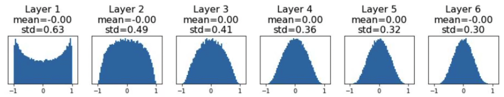

# CS231n 笔记

## 线性分类、损失函数与梯度下降

偏置项的作用就是不让函数过原点，不是所有的线性分类器都过原点，需要在整个平面内自由移动。

Dropout 就是神经网络训练过程中随机丢掉一些神经元，是正则化的一种方式，防止过拟合。

模型训练过程中先计算分数，再计算 $e^x$，转化为正数，再归一化转化为概率，再通过交叉熵计算损失。

最大似然估计损失函数，也叫交叉熵损失函数。-log(x)，x 是预测的概率，对于正确的那个分类的概率，其他类别的概率不管，如果预测概率越接近 1，就越靠近 0，正确的类别概率越低，惩罚就越大。

batchsize 就是每次喂给模型的数据量，一般是 2 的指数。否则每次把整个数据集都计算一遍再算梯度，可能内存不够。当 batchsize 等于一的时候就是随机梯度下降（SGD）。

传统机器学习需要手动提取特征，需要特征工程，深度学习是模型自动提取特征。

用数值解进行梯度的校验，用解析解求精确的梯度。

## 神经网络与反向传播

### 激活函数

非线性激活函数为神经网络带非线性，否则堆多少层神经元都跟单个线性层无异。这样就可以拟合非线性的边界了。

#### sigmoid

公式
$$
sigmoid(x)=\frac{1}{1+e^{-x}}
$$

- x 大于 0，sigmoid 大于 0.5
- x 小于 0，sigmoid 小于 0.5

缺点：

- x 趋近无穷大，函数饱和，梯度为 0。饱和性会导致梯度消失。

- 输出总是正数，求梯度的时候一直都是正数，所以所有权重 w 的偏导数同号，要么一起增大，要么一起减小。产生 zig zag path。解释地址：https://www.bilibili.com/video/BV1K7411W7So?t=848.2&p=7

- 指数运算消耗计算资源

不要在中间层使用 sigmoid 函数。可以在二分类问题中在最后一层加一个逻辑回归

#### ReLu

Rectified Linear Unit 修正线性单元公式是 max(0, x)。修正线性激活函数。

x 大于 0，梯度为 1。收敛速度比双曲正切函数快 6 倍。AlexNet 开创性贡献就是使用了 ReLu 函数。

缺点：

- 输出不是关于 0 对称的。
- Dead ReLu 问题，左边区域输出为 0，意味着有一些神经元是死的，不会有任何输出，也不会更新。原因可能是初始化的时候有一些参数初始化为 0，也有可能是学习率太大掉进了局部最优解出不来。解决办法是在 ReLu 左边加一个正的偏置项 0.01，即 Leaky ReLu 就可以缓解Dead ReLu 问题。

#### tanh

tanh(x)

x 趋近无穷大，函数饱和，梯度为 0，存在梯度消失问题。因为有正有负，可以避免 zig zag path 的问题。

#### Leaky ReLu

在 ReLu 基础上做改进，让 x 小于 0 时，也有梯度。

max(0.01x, x)

x 大于 0，梯度为 1。

#### Maxout

将神经元的输出输入到 k 个神经元，比较选出最大的输出到下一层，以 k = 2 为例，公式为
$$
max(\omega_{1}^{T}x+b_1,\omega_{2}^{T}x+b_{2})
$$
视频解释：https://www.bilibili.com/video/BV1K7411W7So?t=1322.7&p=7

#### ELU

在 ReLu 基础上做改进，让 x 小于 0 时，也有梯度。公式
$$
\begin{equation}
ELU=\left\{
\begin{aligned}
x &,& x \geq 0, \\
\alpha(e^x-1)&,& x < 0.
\end{aligned}
\right.
\end{equation}
$$
x 大于 0，梯度为 1。

每一层的神经元都与上一层的所有神经元相连，所以是全连接神经网络。

缺点：指数运算，计算量大。

#### 激活函数总结

- Use ReLU. Be careful with your learning rates
- Try out Leaky ReLU / Maxout / ELU
- Try out tanh but don't expect much
- Don't use sigmoid

### 反向传播

f=(x+y)z，最后的结果是f，一个神经元有权重 x，y，z，利用链式求道计算权值的梯度，需要反着算，令 x+y=q， 从最后一步步求导到最终的权值梯度。

```
                              q
   df/dx=(df/dq)*(dq/dx)  ┌───────┐           ┌───────┐
x ───────────────────────►│       │  df/dq    │       │
   df/dy=(df/dq)*(dq/dy)  │   +   ├──────────►│       │
y ───────────────────────►│       │           │       │
                          └───────┘           │   *   ├────────► f
                                              │       │
             z ──────────────────────────────►│       │
                                     df/dz    │       │
                                              └───────┘
```

## 卷积神经网络

图片的边缘一些像素只能卷积一次，中间会卷积很多次，不公平，所以在图片边缘加上 padding，提高边缘像素卷积的次数

池化的作用，也叫下采样，下采样作用

1. 减少参数量
2. 防止过拟合
3. 平移不变性

1x1卷积作用：

- 降维成升维
- 跨通道信息交融，就相当于是在同一位置，不同的卷积核对其可以提取不同特征，不同的通道，代表不同的特征信息
- 减少参数量
- 增加模型深度
- 提高非线性表示能力

卷积神经网络就是卷积层，池化层，全连接层，倾向于不使用全连接层和池化层，只使用卷积层，这个叫全卷积网络 FCN。

- 使用池化层可以拥有平移不变性，但是会丢失空间信息
- 全连接层参数非常大，全连接层会把向量拉平，丢失了空间信息

## 可视化卷积神经网络

T-SNE 降维到二维，把最后一个全连接层的多维数据提取出来，如果两个点在高维空间中距离远，放在二维平面上距离也远。T-SNE就是把特征降维 然后在空间中表示出来 这样可以看到各个特征之间的“距离”，降维算法是非监督的。

https://projector.tensorflow.org 可以演示多种降维算法

导向反向传播某个神经元的激活相对于原始输入图像的梯度，用于生产原始像素对应的图片。

可以用图像分类问题进行定位和语义分割。

## 训练神经网络 第一部分

### 数据预处理

机器学习的大部分工作都是特征工程，有两个方法进行预处理

#### 数据标准化处理

$$
x = \frac{x - \bar{x}}{\sigma(x)}
$$

处理后的特征将服从标准正态分布（均值为 0，标准差为 1）。减去均值把分布平移到原点，除以标准差进行幅度的缩放，变得圆，而不是狭长。

#### 主成分分析

视频讲解：https://www.bilibili.com/video/BV1K7411W7So?t=1549.3&p=7

找到方差最大的方向就是第一主成分，即协方差矩阵主特征向量方向。第二主成分是协方差矩阵次特征向量，与主特征向量正交。

数据按这两个方向进行线性投影，此时协方差矩阵是对角矩阵，对数据不同维度进行去相关。单独进行幅度缩放，此时协方差矩阵是单位矩阵，数据每个维度的方差为 1，即 PCA 白化。

白化分为 PCA 白化和 ZCA 白化。投影后直接在主成分上除以标准差缩放，变成圆形是 PCA 白化。再还原到原来的数据坐标空间里面就是 ZCA 白化。

#### 特征工程作用

狭长形的数据的损失函数对决策边界斜率变化敏感。变成圆形之后可以设置更高的学习率，损失函数对变化没有那么敏感了，不会出现震荡，更快的收敛。

#### 特征工程具体应用

- AlexNet 对每个输入图像减去“平均图像”
- VGGNet 每个通道减去各通道的均值
- ResNet 每个通道分别减去各通道的均值并除以各通道标准差

PCA 与白化不经常用到。

### 权重初始化

多层神经网络所有权重全部初始化为同一个数会发生什么？

- 同一层的所有神经元前向推断和反向传播完全相同，相当于每一层只有一个神经元，不能学到不同的特征。
- 多层神经网络不能将权重初始化为同一个数否则无法打破“对称性”（Symmetry）。

逻辑回归（LR）中是可以将权重初化为同一个常数的，因为逻辑回归没有隐含层，只有一个神经元，可以直接接受不同的 x，打破对称性。

#### 梯度消失

https://www.bilibili.com/video/BV1K7411W7So?t=1983.2&p=7

以下是三种权值初始化方法。

##### Activation statistics

使用双曲正切函数作为激活函数的随机正态分布权值初始化会导致梯度消失。权值初始化代码

```python
W = 0.01 * np.random.randn(Din, Dout)
```

由于每次都有一个 0.01 的幅度缩放，在经过双曲正切函数后输出每经过一层就会越来越分布于零。梯度公式
$$
f(\sum \omega_ix_i+b) \\
\frac{\partial f}{\partial x} = f' \cdot x_i 
$$
由于$x_i$ 是上一层经过双曲正切函数的输出分布于零，梯度也会趋近 0，梯度消失。

如果调整幅值到 0.05

```python
W = 0.05 * np.random.randn(Din, Dout)
```

由于每次都有一个 0.05 的幅度缩放，在经过双曲正切函数后输出每经过一层就会越来越分布于 1 或 -1，双曲正切值越来越饱和，导致梯度为 0。
$$
f(\sum \omega_ix_i+b) \\
\frac{\partial f}{\partial x} = f' \cdot x_i
$$
此时 x 虽然都是趋近于 1 或 -1，但 f' 等于 0，所以梯度消失了。

##### "Xavier" Initialization

为了解决梯度消失的问题可以使用 "Xavier" Initialization，上面的幅值是人工指定的，可以让幅值通过输入维度 Din 确定。初始化代码

```python
W = np.random.randn(Din, Dout) / np.sqrt(Din)
```

如果输入维度很大，分母就很大，幅值就比较小，自适应调整权重的幅度。最后没有出现极端聚集或分散的情况，每一层方差都差不多不变。



输入维度越多，幅值越小的原理是维数越多，噪声就比较多，权值变化就会大，需要更大的惩罚稳定权值。

在卷积神经网络中，Din 就是卷积核，Din = 感受野大小 = 卷积核大小 = kernel_size^2 * input_channels。

###### 证明 "Xavier" Initialization 方差不变

假设 x，w 均值为 0（关于 0 对称），且独立同分布，有 y = Wx，证明
$$
\begin{aligned}
\operatorname{Var}\left(\mathrm{y}_{\mathrm{i}}\right) & =\operatorname{Din} * \operatorname{Var}\left(\mathrm{x}_{\mathrm{i}} \mathrm{w}_{\mathrm{i}}\right) \\
& =\operatorname{Din} *\left(\mathrm{E}\left[\mathrm{x}_{\mathrm{i}}^2\right] \mathrm{E}\left[\mathrm{w}_{\mathrm{i}}^2\right]-\mathrm{E}\left[\mathrm{x}_{\mathrm{i}}\right]^2 \mathrm{E}\left[\mathrm{w}_{\mathrm{i}}\right]^2\right) \\
& =\operatorname{Din} * \operatorname{Var}\left(\mathrm{x}_{\mathrm{i}}\right)^* \operatorname{Var}\left(\mathrm{w}_{\mathrm{i}}\right)
\end{aligned}
$$
If $\operatorname{Var}\left(\mathrm{w}_{\mathrm{i}}\right)=1 / \operatorname{Din}$ then $\operatorname{Var}\left(\mathrm{y}_{\mathrm{i}}\right)=\operatorname{Var}\left(\mathrm{x}_{\mathrm{i}}\right)$

w 本来是 N(0,1)，处理一下变成N(0,1/sqrt(Din))了，方差就是1/Din

另外一个证明方法
$$
\begin{aligned}
\operatorname{Var}\left(Y_i\right) & =\operatorname{Var}\left(w_i x+B_i\right) \\
& =\operatorname{Var}\left(\sum_{j=1}^d w_{i j} X_j+B_i\right) \\
& =d \times \operatorname{Var}\left(W_{i j} X_j\right) \\
& =d \times\left(E\left[w_{i j}^2\right] E\left[X_j^2\right]-E^2\left[w_{i j}\right] E^2\left[x_j\right]\right) \\
& =d \times \operatorname{Var}\left(W_{i j}\right) \operatorname{Var}\left(X_j\right) \\ 
\text { 当 }\operatorname{Var}&\left(w_{i j}\right) =\frac{1}{d} \text { 时 } \operatorname{Var}\left(Y_i\right)=\operatorname{Var}\left(X_j\right)
\end{aligned}
$$

##### Kaiming / MSRA Initialization

MSRA Initialization 专门针对 ReLu 设计的，ReLu 无法使用 "Xavier" Initialization，ReLu 使用 "Xavier" Initialization 也会出现梯度消失。何恺明提出了 Kaiming / MSRA Initialization，初始化代码

```python
W = np.random.randn(Din, Dout) / np.sqrt(2 / Din)
```

欲使 $\operatorname{Var}\left(Y_i\right)=\operatorname{Var}\left(X_j\right)$

若 wij 服从正态分布，则 wij ～ N(0,2/d)

若 wij 服从均匀分布，则 wij ～ $Uniform(-\sqrt{\frac{6}{d}},\sqrt{\frac{6}{d}})$

### Batch Normalization

视频讲解：https://www.bilibili.com/video/BV1K7411W7So?t=2621.6&p=7

批归一化

这里就是讲如何初始化权重，才能尽可能的避免输出值堆积在0附近，从而导致反向传播的时候梯度消失

## 训练神经网络 第二部分

下面介绍六种优化器。

### SGD

传统的随机梯度梯度下降迭代算法

```python
while True:
	dx = compute_gradient(x)
	x = Learning_rate * dx
```

传统随机梯度下降的缺点

- 在梯度较大的方向上发生震荡，减小学习率不能解决震荡问题。因为减小学习率，正确方向的更新也会变慢。
- 容易陷入鞍点，鞍点是四周方向梯度为零，权值不会更新。

### SGD + Momentum

权值更新时增加一个动量，使下山具有惯性。动量随机梯度下降代码

```python
vx = 0 #初始动量为0
while True:
	dx = compute_gradient(x)
	vx = rho * vx + dx # 速度方向与梯度方向的矢量和就是真实谷底的方向
	x -= Learning_rate * vx
```

- Rho 代表摩擦力，在0.9到0.99之间。v = $\rho$v + dx，当 $\rho$ 等于 0 时，就是随机梯度下降。
- 当前梯度越大，动量就越大。
- 速度比 SGD 快。
- 使运动轨迹平滑，消除震荡，https://www.bilibili.com/video/BV1K7411W7So?t=927.1&p=8
- 缺点是容易冲过头，最后还是要回到最低点，各种梯度下降方法速度对比：https://www.bilibili.com/video/BV1K7411W7So?t=993.4&p=8

### SGD + Nesterov Momentum

为了防止 Momentum 冲过头的缺点，使用 Nesterov Momentum。Momentum 在更新权值的时候，同时考虑上一次的速度与当前梯度，方向是两者矢量和，容易冲过最低点，延长收敛时间。Nesterov Momentum 先沿着上一次的速度方向更新，再计算新的位置的梯度，相比于 Momentum，Nesterov Momentum 可以提前感知到 梯度的变化，在冲过最低点之前放缓更新的脚步，更快的达到最优点。

更新公式：https://www.bilibili.com/video/BV1K7411W7So?t=1217.6&p=8

### AdaGrad 优化器

既然在梯度大的方向容易产生震荡，只要在梯度大的方向上加上惩罚，就可以抑制梯度大方向上的更新。伪代码

```python
grad_squared = 0
while True:
    dx = compute_gradient(x)
    grad_squared += dx * dx # 因为是累加，随着训练进行会变得很大
    x -= learning_rate * dx / (np.sqrt(grad_squared) + 1e-7)
```

随着训练的进行，1/np.sqrt(grad_squared) 会衰减到 0。导致无法更新。为了解决这个问题，提出了 RMSProp。

### RMSProp: Leaky AdaGrad

伪代码

```python
grad_squared = 0
while True:
	dx = compute_gradient(x)
    grad_squared = decay_rate * grad_squared +(1 - decay_rate) * dx * dx
	x -= learning_rate * dx / (np.sqrt(grad_squared) + 1e-7)
```

在 AdaGrad 基础上加上了衰减因子 decay_rate。decay_rate 相当于 Nesterov Momentum 中的 $\rho$。

### Adam

可以把上面两种方法融合在一起。代码

```python
first_moment = 0
second_moment = 0 # 都初始化为 0，在训练起始阶段难以预热进入工作状态
while True:
    dx = compute_gradient(x)
    first_moment = beta1 * first_moment + (1 - beta1) * dx # 第一动量 Momentum
    second_moment = beta2 * second_moment + (1 - beta2) * dx * dx # 第二动量 AdaGrad
    x -= learning_rate * first_moment / (np.sqrt(second_moment) + 1e-7)
```

做出以下修改，让模型刚开始训练时两个动量有较高的初始值。

```python
first_moment = 0
second_moment = 0 # 都初始化为 0，在训练起始阶段难以预热进入工作状态
while True:
    dx = compute_gradient(x)
    first_moment = beta1 * first_moment + (1 - beta1) * dx # 第一动量 Momentum
    second_moment = beta2 * second_moment + (1 - beta2) * dx * dx # 第二动量 AdaGrad
    first_unbias = first_moment / (1 - beta1 ^ t)
    second_unbias = second_moment / (1 - beta2 ^ t)
    x -= learning_rate * first_unbias / (np.sqrt(second_unbias) + 1e-7)
```

- Beta1 一般是 0.9，beta2 一般是 0.999
- learning_rate 为 $10^{-3}$ 或 $5 \times 10^{-4}$。

### 学习率

不能太高或者太低。ResNet 每 30 轮将学习率乘以 0.1。也可以用余弦函数，线性函数，指数函数减小学习率，随着训练轮次越多，学习率越小。

上一节六种优化器都是一阶优化算法。

### 二阶优化

牛顿法就是二阶优化。二阶导数可以提高收敛速度。

海森矩阵的逆矩阵计算量大。

用拟牛顿法代替海森矩阵的逆矩阵。

一般一阶优化够用了。

### 过拟合

防止过拟合有三种方法

#### 早停

训练过程中，训练集准确率和验证集准确率的差值叫 GAP。

如果一开始 GAP，不明显，后面开始出现明显的 GAP，此时模型已经过拟合了，需要提前停止模型的训练。

#### 模型集成

- 训练多个好而不同的模型。可以获得 2% 的准确率的提升。
- 在训练过程中不同时刻的模型集成。
- 周期性增大学习率，分别跳到不同的局部最优点。这就是好而不同。

#### 正则化

1. 可以使用 L1， L2，或者把两者结合起来的弹性网络正则化。
2. 也可以使用 Dropout，神经元以一定概率停止输出，这个概率一般设置为 0.5。全连接层的神经元每个神经元都彼此联系，通过 Dropout 把联系给掐断，让每个神经元专注于某个特定特征的识别。打破特征之间的联合适应性，每个特征都能独当一面。每一个神经元有两种状态，本质上 Dropout 就是把 $2^N$ 个模型集成起来。

其他 dropout 有效的解释：https://www.bilibili.com/video/BV1K7411W7So?t=3528.7&p=8

### 数据增强

可以把图形旋转，平移，缩放，随机裁剪，可以防止过拟合，起到了正则化的作用，避免偶然误差。

### 超参数

1. 校验初始损失函数值

检查损失函数值的数量级，防止出现错误。

2. 在小数据集上尝试过拟合

如果在小数据集上过拟合，在大数据集上也可以有更好的优化。

3. 找到可以让损失函数较快下降的学习率

可以尝试 1e-1，1e-2，1e-3，1e-4。

4. 一开始用比较大的学习率，后面用比较小的学习率

查看训练集验证集准确率的变化，判断是否需要早停。

5. 看损失函数图

随时调整学习率。

6. 观察训练集验证集的准确率

如果两者一起提高且有 GAP，说明需要继续训练。

如果两者一起提高且没有 GAP，说明欠拟合，需要更深的神经网络

如果训练集提高，验证集下降，说明出现过拟合。

## 卷积神经网络工程实践技巧

### 小卷积核的好处

可以用两个 3 * 3 卷积代替 5 * 5 卷积，5 * 5 图像经过两次 3 * 3  卷积后变成 一个像素，这一个像素反映了一开始的5 * 5的图像。一般不替换，因为两个3 * 3更好的原因等同于之前说的在一定程度上网络层数越深越好，模型的表示能力就好，并且参数量更少。

同样用三个 3 * 3 卷积代替 7 * 7 卷积，每次增加一个卷积核，其所代表的原始图像就向外扩大一圈。

降低运算量，引入更多的非线性变换技巧

- 可以把大卷积核换成小卷积核
- 使用1 * 1卷积核进行升维和降维
- 可以把 N * N 卷积核换成 1 * n 和 n * 1 卷积核

### 如何高效计算卷积

- 把卷积运算变成矩阵乘法。

把感受野拉成行向量，卷积核拉成列向量，相乘再 reshape 回多通道矩阵。

- 使用快速傅立叶变换
- 使用加速矩阵乘法

## 迁移学习

自己不需要大量的数据训练，拿别人的模型，自己只需要少量的数据进行训练。

如果目标模型跟前人的模型分类差异较大，可以训练全部神经元，让权重初始化为迁移模型的权重。

如果相差不大，冻结卷积层，只训练最后一层和全连接层。

如果数据集太小，可以找一个类似的大数据集训练模型，对模型进行迁移学习和微调泛化到小数据集上。

## 学习进度

2022-12-14

计划：

- 看完四集 cs231n

成果：

- 第四集看完。

2022-12-15

计划：

- 看完六集 cs231n

成果：

- 第六集看完。

2022-12-16

计划：

- 看完七集 cs231n

成果：

- 第七集除了 Batch Normalization 都看完。

2022-12-17

计划：

- 看完8集 cs231n

成果：

- 第8集看完。

2022-12-18

计划：

- 看完9集 cs231n

成果：

- 第9集看完。

2022-12-18

计划：

- 看完10集 cs231n

成果：

- 第10集看完。
