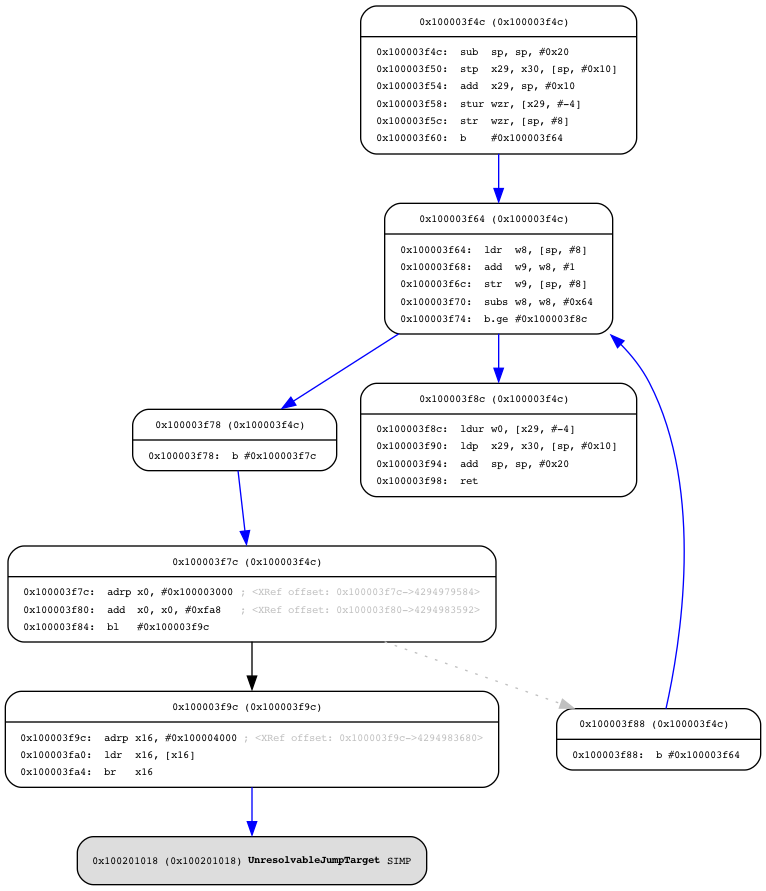

# 大创实验报告

[TOC]

## GCC 交叉编译 openssl

### 查看openssl支持编译的目标平台

```
./Configure
```

输出：

```
BS2000-OSD BSD-generic32 BSD-generic64 BSD-ia64 BSD-sparc64 BSD-sparcv8 
BSD-x86 BSD-x86-elf BSD-x86_64 Cygwin Cygwin-i386 Cygwin-i486 Cygwin-i586 
Cygwin-i686 Cygwin-x86 Cygwin-x86_64 DJGPP MPE/iX-gcc UEFI UWIN VC-CE VC-WIN32 
VC-WIN32-ARM VC-WIN32-ONECORE VC-WIN64-ARM VC-WIN64A VC-WIN64A-ONECORE 
VC-WIN64A-masm VC-WIN64I aix-cc aix-gcc aix64-cc aix64-gcc android-arm 
android-arm64 android-armeabi android-mips android-mips64 android-x86 
android-x86_64 android64 android64-aarch64 android64-mips64 android64-x86_64 
bsdi-elf-gcc cc darwin-i386-cc darwin-ppc-cc darwin64-arm64-cc darwin64-ppc-cc 
darwin64-x86_64-cc gcc haiku-x86 haiku-x86_64 hpux-ia64-cc hpux-ia64-gcc 
hpux-parisc-cc hpux-parisc-gcc hpux-parisc1_1-cc hpux-parisc1_1-gcc 
hpux64-ia64-cc hpux64-ia64-gcc hpux64-parisc2-cc hpux64-parisc2-gcc hurd-x86 
ios-cross ios-xcrun ios64-cross ios64-xcrun iossimulator-xcrun iphoneos-cross 
irix-mips3-cc irix-mips3-gcc irix64-mips4-cc irix64-mips4-gcc linux-aarch64 
linux-alpha-gcc linux-aout linux-arm64ilp32 linux-armv4 linux-c64xplus 
linux-elf linux-generic32 linux-generic64 linux-ia64 linux-mips32 linux-mips64 
linux-ppc linux-ppc64 linux-ppc64le linux-sparcv8 linux-sparcv9 linux-x32 
linux-x86 linux-x86-clang linux-x86_64 linux-x86_64-clang linux32-s390x 
linux64-mips64 linux64-s390x linux64-sparcv9 mingw mingw64 nextstep 
nextstep3.3 sco5-cc sco5-gcc solaris-sparcv7-cc solaris-sparcv7-gcc 
solaris-sparcv8-cc solaris-sparcv8-gcc solaris-sparcv9-cc solaris-sparcv9-gcc 
solaris-x86-gcc solaris64-sparcv9-cc solaris64-sparcv9-gcc solaris64-x86_64-cc 
solaris64-x86_64-gcc tru64-alpha-cc tru64-alpha-gcc uClinux-dist 
uClinux-dist64 unixware-2.0 unixware-2.1 unixware-7 unixware-7-gcc vms-alpha 
vms-alpha-p32 vms-alpha-p64 vms-ia64 vms-ia64-p32 vms-ia64-p64 vos-gcc 
vxworks-mips vxworks-ppc405 vxworks-ppc60x vxworks-ppc750 vxworks-ppc750-debug 
vxworks-ppc860 vxworks-ppcgen vxworks-simlinux
```

References

[openssl交叉编译问题_ty的专栏-CSDN博客_openssl交叉编译](https://blog.csdn.net/ty3219/article/details/77717478)

### 交叉编译工具链搜索

```
sudo apt search arm | grep gcc 
sudo apt search mips | grep gcc
```

### 目标平台arm

安装目标平台arm（linux-armv4）交叉编译工具：

```
sudo apt install -y gcc-arm-linux-gnueabi
```

生成makefile文件：

```
./Configure linux-armv4
```

从O0到O3优化编译命令：

```
make clean
make -j8 CC=arm-linux-gnueabi-gcc CFLAGS="-Wall -O0" CXXFLAGS="-Wall -O0"

make clean
make -j8 CC=arm-linux-gnueabi-gcc CFLAGS="-Wall -O1" CXXFLAGS="-Wall -O1"

make clean
make -j8 CC=arm-linux-gnueabi-gcc CFLAGS="-Wall -O2" CXXFLAGS="-Wall -O2"

make clean
make -j8 CC=arm-linux-gnueabi-gcc CFLAGS="-Wall -O3" CXXFLAGS="-Wall -O3"
```

-j8表示同时执行8个编译指令，这个数字一般设置为核心数的两倍。编译完成后可以在apps目录下找到openssl可执行文件。

References

[CFLAGS详解_xinyuan510214的专栏-CSDN博客_cflags编写makefile](https://blog.csdn.net/xinyuan510214/article/details/50457433)

### 目标平台mips

安装目标平台mips（linux-mips32）交叉编译工具：

```
sudo apt install -y gcc-mips-linux-gnu
```

生成makefile文件：

```
./Configure linux-mips32
```

从O0到O3优化编译命令：

```
make clean
make -j8 CC=mips-linux-gnu-gcc CFLAGS="-Wall -O0" CXXFLAGS="-Wall -O0"

make clean
make -j8 CC=mips-linux-gnu-gcc CFLAGS="-Wall -O1" CXXFLAGS="-Wall -O1"

make clean
make -j8 CC=mips-linux-gnu-gcc CFLAGS="-Wall -O2" CXXFLAGS="-Wall -O2"

make clean
make -j8 CC=mips-linux-gnu-gcc CFLAGS="-Wall -O3" CXXFLAGS="-Wall -O3"
```

References

[mips mipsel mips64el 区别_whatday的专栏-CSDN博客_mips64el](https://blog.csdn.net/whatday/article/details/53696814)

### References

[用忽略configure的方式 交叉编译 静态链接 的 tcpdump](https://xuanxuanblingbling.github.io/ctf/tools/2021/08/16/tcpdump/)

## clang 交叉编译 openssl

### openssl支持编译的目标平台

```
./Configure
```

输出：

```
BS2000-OSD BSD-generic32 BSD-generic64 BSD-ia64 BSD-sparc64 BSD-sparcv8 
BSD-x86 BSD-x86-elf BSD-x86_64 Cygwin Cygwin-i386 Cygwin-i486 Cygwin-i586 
Cygwin-i686 Cygwin-x86 Cygwin-x86_64 DJGPP MPE/iX-gcc UEFI UWIN VC-CE VC-WIN32 
VC-WIN32-ARM VC-WIN32-ONECORE VC-WIN64-ARM VC-WIN64A VC-WIN64A-ONECORE 
VC-WIN64A-masm VC-WIN64I aix-cc aix-gcc aix64-cc aix64-gcc android-arm 
android-arm64 android-armeabi android-mips android-mips64 android-x86 
android-x86_64 android64 android64-aarch64 android64-mips64 android64-x86_64 
bsdi-elf-gcc cc darwin-i386-cc darwin-ppc-cc darwin64-arm64-cc darwin64-ppc-cc 
darwin64-x86_64-cc gcc haiku-x86 haiku-x86_64 hpux-ia64-cc hpux-ia64-gcc 
hpux-parisc-cc hpux-parisc-gcc hpux-parisc1_1-cc hpux-parisc1_1-gcc 
hpux64-ia64-cc hpux64-ia64-gcc hpux64-parisc2-cc hpux64-parisc2-gcc hurd-x86 
ios-cross ios-xcrun ios64-cross ios64-xcrun iossimulator-xcrun iphoneos-cross 
irix-mips3-cc irix-mips3-gcc irix64-mips4-cc irix64-mips4-gcc linux-aarch64 
linux-alpha-gcc linux-aout linux-arm64ilp32 linux-armv4 linux-c64xplus 
linux-elf linux-generic32 linux-generic64 linux-ia64 linux-mips32 linux-mips64 
linux-ppc linux-ppc64 linux-ppc64le linux-sparcv8 linux-sparcv9 linux-x32 
linux-x86 linux-x86-clang linux-x86_64 linux-x86_64-clang linux32-s390x 
linux64-mips64 linux64-s390x linux64-sparcv9 mingw mingw64 nextstep 
nextstep3.3 sco5-cc sco5-gcc solaris-sparcv7-cc solaris-sparcv7-gcc 
solaris-sparcv8-cc solaris-sparcv8-gcc solaris-sparcv9-cc solaris-sparcv9-gcc 
solaris-x86-gcc solaris64-sparcv9-cc solaris64-sparcv9-gcc solaris64-x86_64-cc 
solaris64-x86_64-gcc tru64-alpha-cc tru64-alpha-gcc uClinux-dist 
uClinux-dist64 unixware-2.0 unixware-2.1 unixware-7 unixware-7-gcc vms-alpha 
vms-alpha-p32 vms-alpha-p64 vms-ia64 vms-ia64-p32 vms-ia64-p64 vos-gcc 
vxworks-mips vxworks-ppc405 vxworks-ppc60x vxworks-ppc750 vxworks-ppc750-debug 
vxworks-ppc860 vxworks-ppcgen vxworks-simlinux
```

References

[openssl交叉编译问题_ty的专栏-CSDN博客_openssl交叉编译](https://blog.csdn.net/ty3219/article/details/77717478)

### clang支持编译的目标平台

triple 的一般格式为\<arch\>\<sub\>-\<vendor\>-\<sys\>-\<abi\>，其中：

- arch = x86_64、i386、arm、thumb、mips等。
- sub = v5, v6m, v7a, v7m等。
- vendor = pc, apple, nvidia, ibm,等。
- sys = none, linux, win32, darwin, cuda等。
- abi = eabi, gnu, android, macho, elf等。

References

[使用Clang作为编译器 -- 使用 Clang 交叉编译_梦在哪里的博客-CSDN博客_clang交叉编译](https://blog.csdn.net/qq_23599965/article/details/90901235)

### 目标平台arm（linux-armv4）

先搜索能用的交叉编译工具链，利用gcc -v，查看自己的gcc版本，再多次用

```
sudo apt search aarch64 | grep binutils
```

确定每一个库的版本，整理后需要安装arm目标平台必要的库有：

```
sudo apt install -y binutils-aarch64-linux-gnu cpp-9-aarch64-linux-gnu g++-9-aarch64-linux-gnu linux-libc-dev-arm64-cross libstdc++-9-dev-arm64-cross libstdc++6-8-dbg-arm64-cross libstdc++6-arm64-cross libgcc-9-dev-arm64-cross crossbuild-essential-arm64
```

References

[play_with_llvm/ch03.md at master · tuoxie007/play_with_llvm](https://github.com/tuoxie007/play_with_llvm/blob/master/ch03.md)

生成makefile文件：

```
./Configure linux-armv4
```

从O0到O3优化编译命令：

```
make clean
make -j8 CC=clang AR=llvm-ar RANLIB=llvm-ranlib CFLAGS="--target=arm-linux-gnu -mfloat-abi=softfp -marm -Wall -O0" CXXFLAGS="--target=arm-linux-gnu -mfloat-abi=softfp -marm -Wall -O0"

make clean
make -j8 CC=clang AR=llvm-ar RANLIB=llvm-ranlib CFLAGS="--target=arm-linux-gnu -mfloat-abi=hard -marm -Wall -O0" CXXFLAGS="--target=arm-linux-gnu -mfloat-abi=hard -marm -Wall -O0"

make clean
make -j8 CC=arm-linux-gnueabi-gcc CFLAGS="-Wall -O1" CXXFLAGS="-Wall -O1"

make clean
make -j8 CC=arm-linux-gnueabi-gcc CFLAGS="-Wall -O2" CXXFLAGS="-Wall -O2"

make clean
make -j8 CC=arm-linux-gnueabi-gcc CFLAGS="-Wall -O3" CXXFLAGS="-Wall -O3"
```

-j8表示同时执行8个编译指令，这个数字一般设置为核心数的两倍。编译完成后可以在apps目录下找到openssl可执行文件。

编译遇到错误，使用：

```bash
readelf --dynamic libcrypto.so
nm --print-file-name --dynamic libpthread.so.0 | grep __atomic
nm --print-file-name --dynamic libdl.so.2 | grep __atomic
nm --print-file-name --dynamic libc.so.6 | grep __atomic
```

[Undefined reference when compiling program, what to do - Uppsala Multidisciplinary Center for Advanced Computational Science - Uppsala University, Sweden](https://www.uppmax.uu.se/support/faq/software-faq/undefined-reference-when-compiling-program--what-to-do/)

```bash
sudo find / -name libc.so.6
/snap/core/11743/lib/i386-linux-gnu/libc.so.6
/snap/core/11743/lib/x86_64-linux-gnu/libc.so.6
/snap/core/11606/lib/i386-linux-gnu/libc.so.6
/snap/core/11606/lib/x86_64-linux-gnu/libc.so.6
/snap/core18/1988/lib/i386-linux-gnu/libc.so.6
/snap/core18/1988/lib/x86_64-linux-gnu/libc.so.6
/snap/core18/2128/lib/i386-linux-gnu/libc.so.6
/snap/core18/2128/lib/x86_64-linux-gnu/libc.so.6
/snap/snapd/13170/lib/x86_64-linux-gnu/libc.so.6
/snap/snapd/12883/lib/x86_64-linux-gnu/libc.so.6
/usr/lib/x86_64-linux-gnu/libc.so.6
/usr/mips-linux-gnu/lib/libc.so.6
/usr/arm-linux-gnueabihf/lib/libc.so.6
/usr/arm-linux-gnueabihf/libsf/libc.so.6
/usr/aarch64-linux-gnu/lib/libc.so.6
/usr/arm-linux-gnueabi/lib/libc.so.6
/usr/arm-linux-gnueabi/libhf/libc.so.6
find: ‘/run/user/1000/doc’: 权限不够
find: ‘/run/user/1000/gvfs’: 权限不够
/home/yym/桌面/armv5-eabi--glibc--stable-2020.08-1/arm-buildroot-linux-gnueabi/sysroot/lib/libc.so.6
/home/yym/桌面/mips32--glibc--stable-2020.08-1/mips-buildroot-linux-gnu/sysroot/lib/libc.so.6
sudo find / -name libdl.so.2
/snap/core/11743/lib/i386-linux-gnu/libdl.so.2
/snap/core/11743/lib/x86_64-linux-gnu/libdl.so.2
/snap/core/11606/lib/i386-linux-gnu/libdl.so.2
/snap/core/11606/lib/x86_64-linux-gnu/libdl.so.2
/snap/core18/1988/lib/i386-linux-gnu/libdl.so.2
/snap/core18/1988/lib/x86_64-linux-gnu/libdl.so.2
/snap/core18/2128/lib/i386-linux-gnu/libdl.so.2
/snap/core18/2128/lib/x86_64-linux-gnu/libdl.so.2
/snap/snapd/13170/lib/x86_64-linux-gnu/libdl.so.2
/snap/snapd/12883/lib/x86_64-linux-gnu/libdl.so.2
/usr/lib/x86_64-linux-gnu/libdl.so.2
/usr/mips-linux-gnu/lib/libdl.so.2
/usr/arm-linux-gnueabihf/lib/libdl.so.2
/usr/arm-linux-gnueabihf/libsf/libdl.so.2
/usr/aarch64-linux-gnu/lib/libdl.so.2
/usr/arm-linux-gnueabi/lib/libdl.so.2
/usr/arm-linux-gnueabi/libhf/libdl.so.2
find: ‘/run/user/1000/doc’: 权限不够
find: ‘/run/user/1000/gvfs’: 权限不够
/home/yym/桌面/armv5-eabi--glibc--stable-2020.08-1/arm-buildroot-linux-gnueabi/sysroot/lib/libdl.so.2
/home/yym/桌面/mips32--glibc--stable-2020.08-1/mips-buildroot-linux-gnu/sysroot/lib/libdl.so.2
sudo find / -name libpthread.so.0
/snap/core/11743/lib/i386-linux-gnu/libpthread.so.0
/snap/core/11743/lib/x86_64-linux-gnu/libpthread.so.0
/snap/core/11606/lib/i386-linux-gnu/libpthread.so.0
/snap/core/11606/lib/x86_64-linux-gnu/libpthread.so.0
/snap/core18/1988/lib/i386-linux-gnu/libpthread.so.0
/snap/core18/1988/lib/x86_64-linux-gnu/libpthread.so.0
/snap/core18/2128/lib/i386-linux-gnu/libpthread.so.0
/snap/core18/2128/lib/x86_64-linux-gnu/libpthread.so.0
/snap/snapd/13170/lib/x86_64-linux-gnu/libpthread.so.0
/snap/snapd/12883/lib/x86_64-linux-gnu/libpthread.so.0
/usr/lib/x86_64-linux-gnu/libpthread.so.0
/usr/mips-linux-gnu/lib/libpthread.so.0
/usr/arm-linux-gnueabihf/lib/libpthread.so.0
/usr/arm-linux-gnueabihf/libsf/libpthread.so.0
/usr/aarch64-linux-gnu/lib/libpthread.so.0
/usr/arm-linux-gnueabi/lib/libpthread.so.0
/usr/arm-linux-gnueabi/libhf/libpthread.so.0
find: ‘/run/user/1000/doc’: 权限不够
find: ‘/run/user/1000/gvfs’: 权限不够
/home/yym/桌面/armv5-eabi--glibc--stable-2020.08-1/arm-buildroot-linux-gnueabi/sysroot/lib/libpthread.so.0
/home/yym/桌面/mips32--glibc--stable-2020.08-1/mips-buildroot-linux-gnu/sysroot/lib/libpthread.so.0
make -j8 CC=clang AR=llvm-ar RANLIB=llvm-ranlib CFLAGS="--target=arm-linux-gnu -mfloat-abi=softfp -marm -Wa,--noexecstack -I /usr/arm-linux-gnueabi/lib -I /usr/arm-linux-gnueabi/libhf -Wall -O0" CXXFLAGS="--target=arm-linux-gnu -mfloat-abi=softfp -marm -Wa,--noexecstack -I /usr/arm-linux-gnueabi/lib -I /usr/arm-linux-gnueabi/libhf -Wall -O0"
```

### 目标平台mips（linux-mips32）

生成makefile文件：

```
./Configure linux-mips32
```

从O0到O3优化编译命令：

```
make clean
make -j8 CC=clang AR=llvm-ar RANLIB=llvm-ranlib CFLAGS="--target=mips-linux-gnu -Wall -O0" CXXFLAGS="--target=mips-linux-gnu -Wall -O0"

make clean
make -j8 CC=mips-linux-gnu-gcc CFLAGS="-Wall -O1" CXXFLAGS="-Wall -O1"

make clean
make -j8 CC=mips-linux-gnu-gcc CFLAGS="-Wall -O2" CXXFLAGS="-Wall -O2"

make clean
make -j8 CC=mips-linux-gnu-gcc CFLAGS="-Wall -O3" CXXFLAGS="-Wall -O3"
```

References

[openssl交叉编译问题_ty的专栏-CSDN博客_openssl交叉编译](https://blog.csdn.net/ty3219/article/details/77717478)

[CFLAGS详解_xinyuan510214的专栏-CSDN博客_cflags编写makefile](https://blog.csdn.net/xinyuan510214/article/details/50457433)

## 学习软件分析

## Data Flow Analysis

### Overview of Data Flow Analysis

#### may analysis

不放过任何一条动态运行时可能的行为。

over-approximation （过近似）需要把所有可能的情况都要考虑进去，比如一个基本块可能被多个分支所指向。

```
┌─────┐               ┌─────┐
│ x+1 │               │ x-1 │
└──┬──┘               └──┬──┘
   │                     │
   │                     │
   │                     │
   │                     │
   │                     │
   │    ┌───────────┐    │
   │    │           │    │
   └────►   basic   ◄────┘
        │           │
        └───────────┘
```

x 可能是加一也有可能是减一，不能漏掉任何一种情况，这是 over-approximation，所以是 may analysis。

#### must analysis

结果必须是正确的，如果像 may analysis 考虑所有的情况，结果不一定正确，所以反而会报错。must analysis 是 under-approximation。

无论是 may analysis 还是 must analysis，都是让结果分析正确。over-approximation 与under-approximation 统称为 safe-approximation。

### Preliminaries of Data Flow Analysis

#### Input and Output States

- Each execution of an IR statement transforms an input state to a new output state.
- The input (output) state is associated with the program point before (after) the statement.

基本块之前的程序状态是 IN[s1]，基本块执行结束后的状态为 OUT[s1]，如图

```
        │
        │
      IN[s1]
        │
     ┌──▼───┐
     │      │
     │  s1  │
     │      │           ┌────────────┐
     └──┬───┘           │            │
        │             ┌─┤     s1     ├──┐
      OUT[s1]         │ │            │  │
        ┼             │ └────────────┘  │
      IN[s2]          │                 │
        │             │                 │
      ┌─▼───┐         │                 │
      │     │         │                 │
      │ s2  │         ▼                 ▼
      │     │      ┌──────┐          ┌──────┐
      └─┬───┘      │      │          │      │
        │          │ s2   │          │  s3  │
      OUT[s2]      └──────┘          └──────┘
        │
        ▼                 IN[s2]=IN[s3]=OUT[s1]

 IN[s2] = OUT[s1]


┌──────┐          ┌──────┐
│      │          │      │
│ s2   │          │  s3  │
└──┬───┘          └───┬──┘
   │                  │
   │                  │
   │                  │
   │                  │
   │                  │
   │  ┌────────────┐  │
   │  │            │  │
   └──►     s1     ◄──┘
      │            │
      └────────────┘


   IN[s1]=IN[s3]^OUT[s1]
   ^is a meet operator(and,or...)
```

整体上把握静态分析的一句话

In each data-flow analysis application, we associate with every program point a data-flow value that represents an abstraction of the set of all possible program states that can be observed for that point.

静态分析的最后结果就是对每一个程序节点关联一个所有可能程序状态抽象的数据流值。

一个具体的例子，解释什么是程序状态抽象

```
                   abstraction states
x = 10;           ┌───────────────────┐
  ───────────────►│x = +,y = undefined│
y = -1;           ├───────────────────┤
  ───────────────►│x = +,y = -        │
x = y;            ├───────────────────┤
  ───────────────►│x = -,y = -        │
x = x / y;        ├───────────────────┤
  ───────────────►│x = +,y = -        │
                  └───────────────────┘
```

Data-flow analysis is to find a solution to a set of safe-approximation-directed constraints on the IN[s]'s and OUT[s] 's, for all statements s.

- constraints based on semantics of statements (transfer functions)
- constraints based on the flows of control

一个 statements 就是一句话，一个赋值语句等。

#### Notations for Transfer Function's Constraints

转换函数的约束。

前向分析

```
        │        │
 IN[s1] │        │
        │        │
  ┌─────▼────┐   │
  │          │   │
  │    s1    │   │
  │          │   │
  └─────┬────┘   │
        │        │
OUT[s1] │        │
        │        │
        ▼        ▼

  OUT[s1] = f_s(IN[s1])
```

反向分析

```
        │        ▲
 IN[s1] │        │
        │        │
  ┌─────▼────┐   │
  │          │   │
  │    s1    │   │
  │          │   │
  └─────┬────┘   │
        │        │
OUT[s1] │        │
        │        │
        ▼        │

   IN[s1] = f_s(OUT[s1])
```

#### Notations for Control Flow's Constraints

分为基本块之间的约束和基本块内的约束

##### 基本块内的控制流

示例

```
    B
┌────────┐
│        │
│   s1   │
│   s2   │
│   s3   │
│   .    │
│   .    │
│   .    │
│   sn   │
│        │
└────────┘
```

sn 表示不同的 statement，statement 就是不含跳转的语句。
$$
IN[s_{i+1}] = OUT[s_i], for \ all \ i = 1,2,...,n - 1
$$

##### 基本块间的控制流

对于基本块开始和结尾的控制流 ^a2c635
$$
IN[B] = IN[s_1] \\
OUT[B] = OUT[s_n]
$$
示例一

```
┌──────────┐    ┌──────────┐   │
│          │    │          │   │
│          │    │          │   │
│    P1    │    │    P2    │   │
│          │    │          │   │
└───────┬──┘    └────┬─────┘   │
        │            │         │
        │            │         │
        │            │         │
 ┌──────▼────────────▼─────┐   │
 │                         │   │
 │            B            │   │
 │                         │   │
 └─────────────────────────┘   ▼
```

符号表示
$$
OUT[B] = f_B(IN[B]), f_B = f_{S_n} \circ \ ... \ \circ f_{S_2} \circ f_{S_1} \\
IN[B] = \bigwedge P \ a \ predecessor \ of\ B\ OUT[P]
$$
B 的所有前驱 P 的输出的 meet 操作等于 B 的输入。meet 是一种处理，可以是并也可以是且。

示例二 

```
┌──────────┐    ┌──────────┐
│          │    │          │   ▲
│          │    │          │   │
│    s1    │    │    s2    │   │
│          │    │          │   │
└──────────┘    └──────────┘   │
        ▲            ▲         │
        │            │         │
        │            │         │
 ┌──────┴────────────┴─────┐   │
 │                         │   │
 │            B            │   │
 │                         │   │
 └─────────────────────────┘   │
```

符号表示
$$
IN[B] = f_B(OUT[B]), f_B = f_{S_1} \circ \ ... \ \circ f_{S_{n-1}} \circ f_{S_n} \\
OUT[B] = \bigwedge S \ a \ successor \ of\ B\ IN[S]
$$
B 的输出是所有 B 的后继节点 S 输入的 meet 操作。

### Data Flow Analysis Applications

#### (I) Reaching Definitions Analysis

##### 什么是可达性？

A definition d at program point p reaches a point q if there is a path
from p to q such that d is not killed along that path.

Translated as: definition of variable v at program point p reaches
pointq if there is a path from p to q such that no new definition of
V appears on that path

- p 点就是变量 v 被定义的地方
- 如果有一条路径从 p 到 q，则可达
- 这条路径中不能出现新的 v 定义。如果 v 被重新定义，则这条路径被killed

示例图

```
p：v=...
│
│
│
└──────┐
       │     \ /
       │v=... x
┌──────┘     / \
│
│
│
▼
q
```

##### Reaching Definitions 应用

可以用在编译优化和错误检测

Reaching definitions can be used to detect possible undefined
variables. e.g., introduce a dummy definition for each variable V at
the entry of CFG, and if the dummy definition of V reaches a point
p where V is used, then V may be used before definition (as
undefined reaches v)

- dummy definition 就是一个 label 用于标记变量未定义

在进入 CFG 之前，会有一个 entry node 使用 label 记录所有的未定义变量，如果这些 entry node 里面的未定义变量有一条路径到变量使用的地方，说明变量未定义就使用了，此时编译器报错。

Reaching Definitions 是一个 may analysis，所有的路径都必须定义了，到这个使用这个变量的点才安全。只要有一条路径未定义就报错，所以需要过近似。只要有一条未定义，都是 unsafe。

##### Reaching Definitions 抽象

可以使用一个 bit 串来表示 Definitions。第 n 个 bit，就代表第 n 个  Definitions。

##### Reaching Definitions 实例

```
B: v = x op y
```

有一个 statement 生成了定义 B，写出 Transfer Function
$$
OUT[B] = gen_B \ \cup (IN[B] - kill_B) 
$$
定义 B 的输出是 B 生成的定义并 B 输入的定义减去 B 里面的变量在其他地方的定义

Control Flow 符号表示
$$
IN[B] = \cup_{P \ a \ predecessor \ of\ B}\ OUT[P]
$$
Transfer Function 实例


- $gen_{B_n}$ 数组就是 $B_n$ 里面所有的 statement 形成的 Definitions
- $kill_{B_n}$ 数组包括 $B_n$ 里所有 statement 里被定义的变量在其他基本块里面的 Definitions

##### Algorithm of Reaching Definitions Analysis

迭代算法


- OUT[B] 数组的含义是在这一点有没有 definition 能流到它，由于 entry 没有 statement，所以 $OUT[entry] = \phi$
- 算法第二行和第三行是初始化基本块 OUT，B\\entry 的意思是初始化所有的基本块，除了 entry 节点。
- 为什么不把 B\\entry 中的 entry 删掉，把第一行删掉，让第二行对所有的基本块都适用呢？因为这是控制流分析的算法模版，需要对所有的情况都适用，算法需要有普适性，有一些控制流分析算法对于 entry 节点的初始化是跟其他基本块不一样的，不能把 entry 归类到基本块初始化里面。
- 对于 must analysis，entry 节点初始化为空，但 biasic block 初始化就不是空了，may 分析一般初始化为空，must 分析一般初始化为 top。
- 第三行初始化，因为还没有开始分析，所以没有 Definition 能 reach 到这里，所以是空集。
- 算法第四行 while 循环，如果有一个 basic block 的 OUT 的 change 了，就执行 while 循环里面的语句
- 算法第六七行，是 Control Flow 的约束和 Transfer Function 的约束

算法是会停止的，因为 IN[B] 和 OUT[B] 的元素数是非严格递增且有上界，所以极限存在，会收敛。

应用迭代算法的例子

```
            ┌─────┐
            │entry│
            └──┬──┘
               │   0000 0000
          ┌────▼────┐
       D1:│x = p + 1│
       D2:│y = q + 2│B1
          └────┬────┘
               │
┌───────────┐  │  1100 0000=gen(1100 0000)U(IN(0000 0000)-kill(0001 1010))
│           │  │
│         ┌─▼──▼────┐
│      D3:│m = k    │
│      D4:│y = q - 1│B2
│         └──┬─────┬┘
│            │     │
│       ┌────┘     └───┐
│       │              │
│    ┌──▼──┐       ┌───▼─────┐
│ D5:│x = 4│    D7:│x = m - 3│B3
│ D6:│z = 5│B4     └───┬─────┘
│    └┬─┬──┘           │
│     │ │              │
│     │ │              │
└─────┘ └─────┐   ┌────┘
              │   │
            ┌─▼───▼┐
         D8:│z = 2p│B5
            └──┬───┘
               │
               │
             ┌─▼──┐
             │exit│
             └────┘
```


#### (lI) Live Variables Analysis

#### (III) Available Expressions Analysis

## 利用 angr Patcherex 实现二进制补丁

### 生成 CFG 图

python 包地址：https://github.com/angr/angr

安装 [angr](https://github.com/angr/angr)

```
pip install angr
```

安装 CFG 可视化工具 [angr-utils](https://github.com/axt/angr-utils)

```bash
cd angr-dev
git clone https://github.com/axt/bingraphvis
pip install -e ./bingraphvis
git clone https://github.com/axt/angr-utils
pip install -e ./angr-utils
```

安装 graphviz

```
brew install graphviz
```

编写测试程序 test.cpp

```cpp
#include <stdio.h>
int main() {
    int i = 0;
    while (i++ < 100) {
        printf("Hello world!\n");
    }
}
```

编译

```
g++ test.cpp -o test && ./test
```

生成 CFG 图

```cpp
import angr
from angrutils import *
proj = angr.Project("test", load_options={'auto_load_libs':False})
cfg = proj.analyses.CFG()
plot_cfg(cfg, "test", asminst=True, remove_imports=True, remove_path_terminator=True)
```

查看图片



### 二进制混淆

编写代码，以下示例修改了二进制 CADET_00003，以便在每次用户输入新字符串时打印“HI!”。

```python
import patcherex
from patcherex.backends.detourbackend import DetourBackend
from patcherex.backends.reassembler_backend import ReassemblerBackend
from patcherex.patches import *

# the detour backend can be used as well:
# backend = DetourBackend("test_binaries/CADET_00003")
backend = ReassemblerBackend("CADET_00003")
patches = []

transmit_code = '''
  ; eax is the transmitted buffer
  ; ebx is the length
  pusha
  mov ecx,eax
  mov edx,ebx
  mov eax,0x2
  mov ebx,0x1
  mov esi,0x0
  int 0x80
  popa
  ret
  '''
patches.append(AddCodePatch(transmit_code, name="transmit_function"))
patches.append(AddRODataPatch(b"HI!\x00", name="transmitted_string"))
# the following code is going to be executed just before the original instruction at 0x8048166
injected_code = '''
; at this code location, it is fine to clobber eax and ebx
mov eax, {transmitted_string} ; a patch can refer to another patch address, by putting its name between curly brackets
mov ebx, 4
call {transmit_function}
'''
patches.append(InsertCodePatch(0x8048166,injected_code,name="injected_code_after_receive"))

# now we ask to the backend to inject all our patches
backend.apply_patches(patches)
# and then we save the file
backend.save("CADET_00003_mod1")
# at this point you can try to run /tmp/CADET_00003_mod1 inside the DECREE VM or using our modified version of QEMU
```

