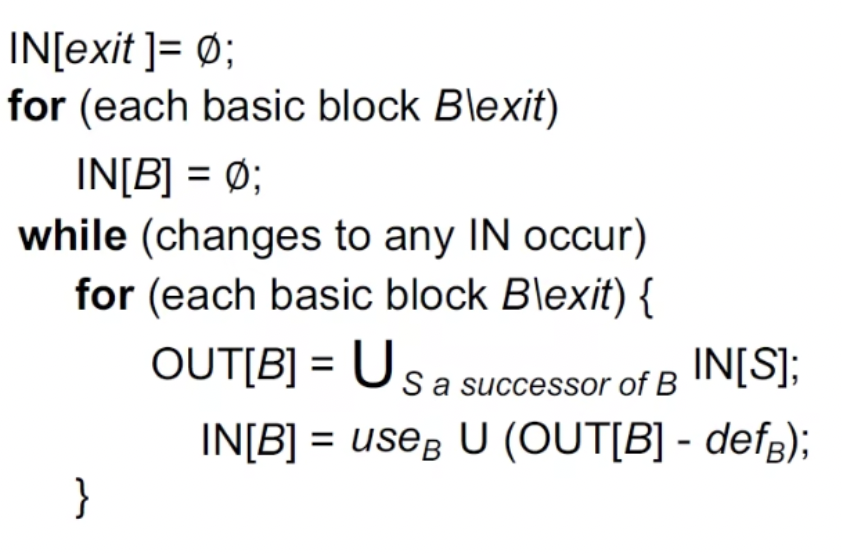
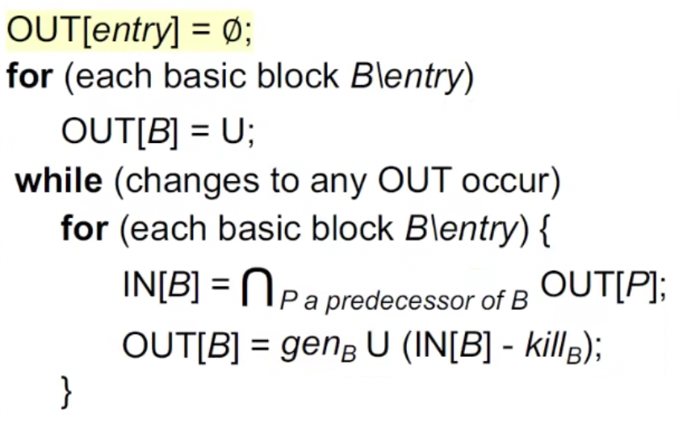

# 软件分析

## Data Flow Analysis

### Overview of Data Flow Analysis

无论是 may analysis 还是 must analysis，都是让结果分析正确。over-approximation 与 under-approximation 统称为 safe-approximation。

may 必包括所有阳，可假阳；must 必真阳可假阴。

#### may analysis

不放过任何一条动态运行时可能的行为。

over-approximation （过近似）需要把所有可能的情况都要考虑进去，比如一个基本块可能被多个分支所指向。

```
┌─────┐               ┌─────┐
│ x+1 │               │ x-1 │
└──┬──┘               └──┬──┘
   │                     │
   │                     │
   │                     │
   │                     │
   │                     │
   │    ┌───────────┐    │
   │    │           │    │
   └────►   basic   ◄────┘
        │           │
        └───────────┘
```

x 可能是加一也有可能是减一，不能漏掉任何一种情况，这是 over-approximation，所以是 may analysis。

#### must analysis

结果必须是正确的，如果像 may analysis 考虑所有的情况，结果不一定正确，所以反而会报错。must analysis 是 under-approximation。

### Preliminaries of Data Flow Analysis

本部分介绍数据流分析的一些基础概念，包括输入输出状态，静态分析到底做了什么，控制流约束（传递函数）。

#### Input and Output States

- Each execution of an IR statement transforms an input state to a new output state.
- The input (output) state is associated with the program point before (after) the statement.

基本块之前的程序状态是 IN[s1]，基本块执行结束后的状态为 OUT[s1]，如图

```
        │
        │
      IN[s1]
        │
     ┌──▼───┐
     │      │
     │  s1  │
     │      │           ┌────────────┐
     └──┬───┘           │            │
        │             ┌─┤     s1     ├──┐
      OUT[s1]         │ │            │  │
        ┼             │ └────────────┘  │
      IN[s2]          │                 │
        │             │                 │
      ┌─▼───┐         │                 │
      │     │         │                 │
      │ s2  │         ▼                 ▼
      │     │      ┌──────┐          ┌──────┐
      └─┬───┘      │      │          │      │
        │          │ s2   │          │  s3  │
      OUT[s2]      └──────┘          └──────┘
        │
        ▼                 IN[s2]=IN[s3]=OUT[s1]

 IN[s2] = OUT[s1]


┌──────┐          ┌──────┐
│      │          │      │
│ s2   │          │  s3  │
└──┬───┘          └───┬──┘
   │                  │
   │                  │
   │                  │
   │                  │
   │                  │
   │  ┌────────────┐  │
   │  │            │  │
   └──►     s1     ◄──┘
      │            │
      └────────────┘


   IN[s1]=IN[s3]^OUT[s1]
   ^is a meet operator(and,or...)
```

#### 一句话阐释静态分析

In each data-flow analysis application, we associate with every program point a data-flow value that represents an abstraction of the set of all possible program states that can be observed for that point.

静态分析的最后结果就是对每一个程序节点关联一个所有可能程序状态抽象的数据流值。包括这个点是否存活，是否被 killed，是否是 dead。后面 Data Flow Analysis Applications 的三种 Analysis 会详细分析。

#### 程序状态抽象

静态分析就是对每一个程序节点关联一个所有可能程序状态抽象的数据流值。什么是程序状态抽象？

```
                   abstraction states
x = 10;           ┌───────────────────┐
  ───────────────►│x = +,y = undefined│
y = -1;           ├───────────────────┤
  ───────────────►│x = +,y = -        │
x = y;            ├───────────────────┤
  ───────────────►│x = -,y = -        │
x = x / y;        ├───────────────────┤
  ───────────────►│x = +,y = -        │
                  └───────────────────┘
```

Data-flow analysis is to find a solution to a set of safe-approximation-directed constraints on the IN[s]'s and OUT[s]'s, for all statements s.
- constraints based on semantics of statements (transfer functions)
- constraints based on the flows of control

一个 statements 就是一句话，一个赋值语句等。

#### Notations for Transfer Function's Constraints

转换函数的约束。

前向分析

```
        │        │
 IN[s1] │        │
        │        │
  ┌─────▼────┐   │
  │          │   │
  │    s1    │   │
  │          │   │
  └─────┬────┘   │
        │        │
OUT[s1] │        │
        │        │
        ▼        ▼

  OUT[s1] = f_s(IN[s1])
```

反向分析

```
        │        ▲
 IN[s1] │        │
        │        │
  ┌─────▼────┐   │
  │          │   │
  │    s1    │   │
  │          │   │
  └─────┬────┘   │
        │        │
OUT[s1] │        │
        │        │
        ▼        │

   IN[s1] = f_s(OUT[s1])
```

#### Notations for Control Flow's Constraints

分为基本块之间的约束和基本块内的约束

##### 基本块内的控制流

示例

```
    B
┌────────┐
│        │
│   s1   │
│   s2   │
│   s3   │
│   .    │
│   .    │
│   .    │
│   sn   │
│        │
└────────┘
```

sn 表示不同的 statement，statement 就是不含跳转的语句。
$$
IN[s_{i+1}] = OUT[s_i], for \ all \ i = 1,2,...,n - 1
$$

##### 基本块间的控制流

对于基本块开始和结尾的控制流
$$
IN[B] = IN[s_1] \\
OUT[B] = OUT[s_n]
$$
示例一

```
┌──────────┐    ┌──────────┐   │
│          │    │          │   │
│          │    │          │   │
│    P1    │    │    P2    │   │
│          │    │          │   │
└───────┬──┘    └────┬─────┘   │
        │            │         │
        │            │         │
        │            │         │
 ┌──────▼────────────▼─────┐   │
 │                         │   │
 │            B            │   │
 │                         │   │
 └─────────────────────────┘   ▼
```

符号表示
$$
OUT[B] = f_B(IN[B]), f_B = f_{S_n} \circ \ ... \ \circ f_{S_2} \circ f_{S_1} \\
IN[B] = \bigwedge P \ a \ predecessor \ of\ B\ OUT[P]
$$
B 的所有前驱 P 的输出的 meet 操作等于 B 的输入。meet 是一种处理，可以是并也可以是且。

示例二 

```
┌──────────┐    ┌──────────┐
│          │    │          │   ▲
│          │    │          │   │
│    s1    │    │    s2    │   │
│          │    │          │   │
└──────────┘    └──────────┘   │
        ▲            ▲         │
        │            │         │
        │            │         │
 ┌──────┴────────────┴─────┐   │
 │                         │   │
 │            B            │   │
 │                         │   │
 └─────────────────────────┘   │
```

符号表示
$$
IN[B] = f_B(OUT[B]), f_B = f_{S_1} \circ \ ... \ \circ f_{S_{n-1}} \circ f_{S_n} \\
OUT[B] = \bigwedge S \ a \ successor \ of\ B\ IN[S]
$$
B 的输出是所有 B 的后继节点 S 输入的 meet 操作。

### Data Flow Analysis Applications

#### (I) Reaching Definitions Analysis

##### 什么是 Reaching Definitions？

A definition d at program point p reaches a point q if there is a path
from p to q such that d is not killed along that path.

Translated as: definition of variable v at program point p reaches
pointq if there is a path from p to q such that no new definition of
V appears on that path

- p 点就是变量 v 被定义的地方
- 如果有一条路径从 p 到 q，则可达
- 这条路径中不能出现新的 v 定义。如果 v 被重新定义，则这条路径被killed

示例图

```
p：v=...
│
│
│
└──────┐
       │     \ /
       │v=... x
┌──────┘     / \
│
│
│
▼
q
```

##### Reaching Definitions 应用

可以用在编译优化和错误检测

Reaching definitions can be used to detect possible undefined
variables. e.g., introduce a dummy definition for each variable V at
the entry of CFG, and if the dummy definition of V reaches a point
p where V is used, then V may be used before definition (as
undefined reaches v)

- dummy definition 就是一个 label 用于标记变量未定义

在进入 CFG 之前，会有一个 entry node 使用 label 记录所有的未定义变量，如果这些 entry node 里面的未定义变量有一条路径到变量使用的地方，说明变量未定义就使用了，此时编译器报错。

Reaching Definitions 是一个 may analysis，所有的路径都必须定义了，到这个使用这个变量的点才安全。只要有一条路径未定义就报错，所以需要过近似。只要有一条未定义，都是 unsafe。

may 必包括所有阳，可假阳；must 必真阳可假阴。

##### Reaching Definitions 传递函数

假设一个 statement，这个 statement 生成了定义 B

```
B: v = x op y
```

B 的所有前驱节点叫 P，B 的输入用 Control Flow 符号表示
$$
IN[B] = \cup_{P \ a \ predecessor \ of\ B}\ OUT[P]
$$
IN[B]就是把所有前驱节点的输出取并集。

写出 Transfer Function
$$
OUT[B] = gen_B \ \cup (IN[B] - kill_B) 
$$
定义 B 的输出是 B 生成的定义并 B 输入的定义减去 B 里面的变量在其他地方的定义。Transfer Function 传递函数定义了算法如何在基本块间传递。

##### Transfer Function 实例


- $gen_{B_n}$ 数组就是 $B_n$ 里面所有的 statement 形成的 Definitions
- $kill_{B_n}$ 数组包括 $B_n$ 里所有 statement 里被定义的变量在其他基本块里面的 Definitions

##### Algorithm of Reaching Definitions Analysis

迭代算法


- OUT[B] 数组的含义是在这一点有没有 definition 能流到它，由于 entry 没有 statement，所以 $OUT[entry] = \phi$
- 算法第二行和第三行是初始化基本块 OUT，B\\entry 的意思是初始化所有的基本块，除了 entry 节点。
- 为什么不把 B\\entry 中的 entry 删掉，把第一行删掉，让第二行对所有的基本块都适用呢？因为这是控制流分析的算法模版，需要对所有的情况都适用，算法需要有普适性，有一些控制流分析算法对于 entry 节点的初始化是跟其他基本块不一样的，不能把 entry 归类到基本块初始化里面。
- 对于 must analysis，entry 节点初始化为空，但 biasic block 初始化就不是空了，may 分析一般初始化为空，must 分析一般初始化为 top。
- 第三行初始化，因为还没有开始分析，所以没有 Definition 能 reach 到这里，所以是空集。
- 算法第四行 while 循环，如果有一个 basic block 的 OUT 的 change 了，就执行 while 循环里面的语句
- 算法第六七行，是 Control Flow 的约束和 Transfer Function 的约束

算法是会停止的，因为 IN[B] 和 OUT[B] 的元素数是非严格递增且有上界，所以极限存在，会收敛。见“证明迭代算法收敛”小节。可以通过有没有回环判断需不需要下一次迭代，有回环就需要迭代。

##### Reaching Definitions Analysis 迭代算法实例

可以使用一个 bit 串来表示 Definitions。第 n 个 bit，就代表第 n 个  Definitions。每个 Definition 用一位 bit 位表示八个组成 0000 0000，分别为 D1～D8

第一轮迭代，所有基本块输入输出初始化为 0000 0000，算出所有基本块的输出

```
            ┌─────┐
            │entry│
            └──┬──┘
               │   000000000
          ┌────▼────┐
       D1:│x = p + 1│
       D2:│y = q + 2│B1
          └────┬────┘
  0000 0000    │
┌───────────┐  │  1100 0000=gen(1100 0000)U(IN(0000 0000)-kill(0001 1010))
│           │  │
│         ┌─▼──▼────┐
│      D3:│m = k    │
│      D4:│y = q - 1│B2
│         └──┬─────┬┘
│  1011 0000 │     │
│       ┌────┘     └───┐1011 0000=gen(0011 0000)U(IN(1100 0000)-kill(0100 0010))
│       │              │
│    ┌──▼──┐       ┌───▼─────┐
│ D5:│x = 4│    D7:│x = m - 3│B3
│ D6:│z = 5│B4     └───┬─────┘
│    └┬─┬──┘           │
│     │ │              │
│     │ │ 0011 1100    │ 0011 0010=gen(0000 0010)U(IN(1011 0000)-kill(1000 1000))
└─────┘ └─────┐   ┌────┘
              │   │
            ┌─▼───▼┐   IN_B5=0011 1110
         D8:│z = 2p│B5
            └──┬───┘
               │
               │   0011 1011
             ┌─▼──┐
             │exit│
             └────┘
```

根据算法，如果有任何一个 basic block 他的 out 变化就要进行下一次遍历，直到没有变化为止。只要 IN 没变，OUT 就不会变。 最后 bit 数组即数据流值表示的是 $D_n$ 是否可以 reach 到这一点，1000 0000 表示 D1 可以 reach 到这一点。数据流值是程序状态的一个抽象。

##### 证明迭代算法收敛

- kill 与 gen 是不变的。
- 所以唯一的变量就是 IN 数组，IN 数组会变化，有时候这个变化会被 kill 掉，但如果没被 kill 掉，IN 的变化就会体现在最后的 OUT 数组里面
- 所以整个比特串中的 bit 只能从 0->1,1->1，不可能从 1->0，一个程序的 Definition 是有限的，这是一个单调递增过程，所以会停止，最坏情况就是所有 0 都变成 1，算法到达不动点。

#### (lI) Live Variables Analysis

##### 什么是动态变量？

```
 v P
  │
  │
  │
  │use(v)
  │
  │
  │
  │
  ▼
EXIT
```

如图所示，如果在 CFG 上存在路径，从 p 开始，在这条路径上 v 被使用了，并且从 p 到被 use 的路径上并没有被 redefined。则称变量 v 在 p 点存活。否则就是一个 dead value。

##### 动态变量分析应用

如果程序运行的某一时刻寄存器满了，则需要替换掉 dead value，因为 dead value 是以后都不会使用到的变量，所以可以被替换掉。

##### 理解动态变量分析

Reaching Definitions Analysis 是对程序里所有的 Definitions 做分析，Live Variables Analysis 是对程序里所有的变量做分析。Reaching Definitions Analysis 使用比特串进行数据流分析，同样 Live Variables Analysis 也用比特串表示所有的变量。

只要有一条 path 变量被用到了，说明这个变量就是 live 的。

如果是并操作就是 may analysis，如果是交操作就是 must analysis。反过来不一定成立，因为 may analysis 除了并操作，还有其他的操作。

##### 动态变量分析的传递函数

动态变量分析利用反向分析比较简单。

```
        ┌─────┐
 ▲      │v = 3│P
 │      └──┬──┘
 │         │ IN(B)={?}
 │         │
 │      ┌──▼──┐B
 │  ┌───┤  ?  ├───┐
 │  │   └─────┘   │
 │  │             │ OUT(B)=S1US2={v}
 │  │             │
    │             │
┌───▼───┐     ┌───▼───┐
│... = v│     │... ...│
└───────┘     └───────┘
    S1           S2
```

基本块 B 表示从 P 到 S1 S2 之间所有的其他基本块。

若B处是v = v - 1，则 IN[B] = {v}。虽然 v 被重定义了，但只要被使用了，P 点处 v 就是 live Variable。

写出 Transfer Function
$$
OUT[B] = \cup_{S \ a \ successor \ of\ B}\ IN[S] \\
IN[B] = use_B \ \cup (OUT[B] - def_B)
$$
OUT[B] 就是 B 所有的后继节点的输入取并集，IN[B] 指在 B 里被使用的所有变量并上 (B 的后继节点所有被使用的变量减掉 B 里面被重定义的变量)。

##### Algorithm of Live Variables Analysis



- 算法第一行初始化 IN[exit] = $\phi$，对于程序的最后一步，未来不可能被用到，所以是空。
- 一般来说 may analysis 初始化为空（bottom），must analysis 初始化为 all（top），即全1。
- 从第四行开始就是 Transfer Function 不停地迭代。

##### Live Variables Analysis 迭代算法实例

算法开始时各节点输入输出初始化为 000 0000，分别对应变量 x y z p q m k。use 数组里应该保留在定义之前的使用的变量，不能保留定义之后的使用的变量，定义之后使用的变量在定义之前是 dead，比如 IN[B2] 的计算。

```
            ┌─────┐
   000 0000 │entry│
   xyz pqmk └──┬──┘
               │  001 1101
          ┌────▼────┐
       D1:│x = p + 1│
       D2:│y = q + 2│B1
          └────┬────┘
               │
┌───────────┐  │ 100 1001
│           │  │
│         ┌─▼──▼────┐
│      D3:│m = k    │
│      D4:│y = m - 1│B2
│         └──┬─────┬┘
│            │     │ OUT(B2)=IN(B4)UIN(B3)=110 1000
│       ┌────┘     └───┐100 1000=use_BU(OUT(B)-def_B)=100 0000U(000 1000-100 0000)
│       │010 1000      │
│    ┌──▼──┐       ┌───▼─────┐
│ D5:│x = 4│    D7:│x = x - 3│B3
│ D6:│q = y│B4     └───┬─────┘
│    └┬─┬──┘           │
│     │ │              │
│     │ │000 1000      │ 000 1000=use_BU(OUT(B)-def_B)=000 1000U(000 0000-001 0000)
└─────┘ └─────┐   ┌────┘
              │   │
            ┌─▼───▼┐
         D8:│z = 2p│B5
            └──┬───┘
               │
               │
             ┌─▼──┐
             │exit│
             └────┘
```

#### (III) Available Expressions Analysis

An expression x op y is available at program point p if 

(1) all paths from the entry to p must pass through the evaluation of x op y

(2) after the last evaluation of x op y, there is no redefinition of x or y, before program point p

##### 成为 Available Expression 的两个条件

- 从 entry 到程序 p 点所有的路径都必须要执行 x op y。
- 并且每一条路径上的最后一个 evaluation 都不能是重新定义 x op y。

#####  Available Expressions Analysis 应用

- This definition means at program p, we can replace expression x op y by the result of its last evaluation
- 如果每条路径的最后不会 redefinition，最后还需要计算一次 x op y，并且 x op y 此时是 Available Expression，最后一个 x op y 就不需要计算，此时可以少计算一个 x op y，Available Expressions Analysis 用于去除重复计算的表达式。
- The information of available expressions can be used for detecting global common subexpressions.

##### Available Expressions Analysis Data Flow Values

Available Expressions Analysis 的状态依然用 Data Flow Values 表示，程序里面的每一个表达式都用一个 bit 位来表示。最后组成一个比特串。1 代表这个表达式是 available，0 表示这个表达式不是 available。

##### Available Expressions Analysis 优化重复计算小例子

```
          ┌──────────┐
          │a = e^16*x│
          └─┬─────┬──┘
            │     │
 {e^16*x}   │     │
            │     │
   ┌────────▼─┐   │
   │x = ...   │   │
{} │b = e^16*x│   │ {e^16*x}
   └────────┬─┘   │
            │     │
  {e^16*x}  │     │
          ┌─▼─────▼──┐
          │c = e^16*x│
          └──────────┘
```

- x = ... 重新定义了 x，所以 $e^{16}*x$ 在 x = ... 之后就不是 Available Expression 了。
- IN[$c = e^{16}*x$] 左右各有两个 $e^{16}*x$，IN[$c = e^{16}*x$] 是对到达它所有路径的结果取交，因为根据定义是所有路径都要 evaluate x op y，如果有一条路径 $e^{16}*x$ 不是 Available Expression，则 $e^{16}*x$ 就不是 Available Expression。
- 左边的 $e^{16}*x$ 其中 x 被重新定义了，所以在 x = ... 执行结束后 $e^{16}*x$ 就不是 Available Expression 了。直到 b = $e^{16}*x$ 执行完，$e^{16}*x$ 又是 Available Expression 了。
- 由于左边的 $e^{16}*x$ 其中 x 被重新定义了，所以左右两个 $e^{16}*x$ 的值不一样，虽然表达式是一样的。但这个无所谓，因为程序实际运行的时候只走一条路径，由于左右两个 IN 都一样，都是 $e^{16}*x$，所以 CFG 可以优化为

```
          ┌──────────┐
          │t = e^16*x│
          └─┬─────┬──┘
            │     │
 {e^16*x}   │     │
            │     │
   ┌────────▼─┐   │
   │x = ...   │   │
{} │t = e^16*x│   │ {e^16*x}
   └────────┬─┘   │
            │     │
  {e^16*x}  │     │
          ┌─▼─────▼──┐
          │t = e^16*x│
          └──────────┘
```

- 这样最后一个 $e^{16}*x$ 就不用计算了，每条路径都使用这条路径最后一个表示大计算 $e^{16}*x$ 的结果
- 比如左边就使用原来 b = $e^{16}*x$ 的小结果，右边就使用 a = $e^{16}*x$ 的计算结果

##### Available Expressions Analysis 的传递函数

根据上面的例子，再结合 Available Expression 从 entry 到程序 p 点所有的路径都必须要执行 x op y，写出 Available Expressions Analysis 的传递函数
$$
IN[B] = \cap_{P \ a \ predecessor \ of\ B}\ OUT[P] \\
OUT[B] = gen_B \ \cup (IN[B] - kill_B)
$$

##### 深入理解 Available Expressions Analysis

Available Expressions Analysis 是 must analysis。对于 must analysis，结果可以有漏报，但不能错报。所以 Available Expressions Analysis 的分析结果可能不会分辨出所有的 Available Expression，但是只要是在结果里面的一定是 Available Expression，不可能错报。这样才能保证优化都是对的优化，保证了 safe-approximation，本质上是 ubder-approximation。

##### Available Expressions Analysis 漏报例子

```
         ┌──────────┐
         │a = e^16*x│
         └─┬─────┬──┘
           │     │
{e^16*x}   │     │
           │     │
  ┌────────▼─┐   │
  │x = ...   │   │
{}└────────┬─┘   │
           │     │
           │     │
        {} │     │ {e^16*x}
         ┌─▼─────▼──┐
         │c = e^16*x│
         └──────────┘
```

相比上面的例子删掉了 b = $e^{16}*x$，这次从左边传递到最后的时候，由于 IN[c = $e^{16}*x$] 是取交操作，所以到最后没有 Available Expression。但 $e^{16}*x$ 实际是 Available Expression。

##### Algorithm of Available Expressions Analysis



- 程序开始的时候没有 Available Expression，所以初始化为空
- must analysis 初始化都是全1，所以算法第三行初始化为 all。
- 如果初始化为全 0，分析过程中某一点取交，如果是全0，则取交后的结果也是全零，分析没有意义。
- 逐语句先做 gen，再合并 kill，因为一个基本块里面有可能既有重定义 x，也有计算含有 x 的表达式，此时逐语句先做 gen，再合并 kill 不会出错。要一个 Expression 一个 Expression 看，不能先把所有的先 gen，比如 x = x - 1，就需要先 gen，再 kill。

##### Available Expressions Analysis 迭代算法实例

根据上一节的算法初始化后

```
     bit string：
     p-1 z/5 2*y e^7*x y+3
      0   0   0    0    0
            ┌─────┐
            │entry│
            └──┬──┘
               │ 00000
               │
          ┌────▼────┐
          │y = p - 1│B1
          └────┬────┘
               │
┌───────────┐  │11111
│           │  │
│         ┌─▼──▼────┐
│         │k = z / 5│
│         │p = e^7*x│B2
│         └──┬─────┬┘
│     11111  │     │
│       ┌────┘     └───┐11111
│       │              │
│    ┌──▼──────┐   ┌───▼─────┐
│    │x = 2 * y│   │z = y + 3│B3
│  B4│q = e^7*x│   └───┬─────┘
│    └┬─┬──────┘       │11111
│11111│ │11111         │
│     │ │              │
└─────┘ └─────┐   ┌────┘
              │   │
            ┌─▼───▼───┐
            │m = e^7*x│
          B5│y = z / 5│
            └──┬──────┘
               │11111
             ┌─▼──┐
             │exit│
             └────┘
```

第一轮迭代

```
     bit string：
     p-1 z/5 2*y e^7*x y+3
      0   0   0    0    0
            ┌─────┐
            │entry│
            └──┬──┘
               │ 00000
               │
          ┌────▼────┐
          │y = p - 1│B1
          └────┬────┘
               │
┌───────────┐  │10000
│           │  │
│         ┌─▼──▼────┐
│         │k = z / 5│
│         │p = e^7*x│B2
│         └──┬─────┬┘
│     01010  │     │
│       ┌────┘     └───┐01010
│       │              │
│    ┌──▼──────┐   ┌───▼─────┐
│    │x = 2 * y│   │z = y + 3│B3
│  B4│q = e^7*x│   └───┬─────┘
│    └┬─┬──────┘       │00011
│01110│ │01110         │
│     │ │              │
└─────┘ └─────┐   ┌────┘
              │   │00010=01110&00011
            ┌─▼───▼───┐
            │m = e^7*x│
          B5│y = z / 5│
            └──┬──────┘
               │01010
             ┌─▼──┐
             │exit│
             └────┘
```

- B4 需要逐语句逐个进行先 gen，再 kill。

继续做迭代，直到输入没有变化。

### Data Flow Analysis Comparison

|                   | Reaching Definitions    | Live Variables          | Available Expressions   |
| ----------------- | ----------------------- | ----------------------- | ----------------------- |
| Domain            | Set of definitions      | Set of variables        | Set of expressions      |
| Direction         | Forwards                | Backwards               | Forwards                |
| May/Must          | May                     | May                     | Must                    |
| Boundary          | OUT[entry] = $\phi$     | IN[exit] = $\phi$       | OUT[entry] = $\phi$     |
| Initialization    | OUT[B] = $\phi$         | IN[B] = $\phi$          | OUT[B] = U              |
| Transfer function | OUT = gen U (IN - kill) | OUT = gen U (IN - kill) | OUT = gen U (IN - kill) |
| Meet              | $\bigcup$               | $\bigcup$               | $\bigcap$               |

### Data Flow Analysis Foundations

#### View lterative Algorithm in Another Way

- Given a CFG (program) with k nodes, the iterative algorithm updates OUT[n] for every node n in each iteration.

- 迭代算法每次迭代都更新每个点的 OUT[n]，这每个点都是一个 statement。

- Assume the domain of the values in data flow analysis is V, then we can define a k-tuple
  $$
  (OUT[n_1], OUT[n_2],..., OUT[n_k])
  $$
  as an element of set $(V_1 \times V_2 \ ... \times V_k)$ denoted as $V^k$, to hold the values of the analysis after each iteration.

- 每种迭代算法的值域不同，比如 Reaching Definitions Analysis 的值域是 Definitions，Live Variables Analysis 的值域是 Variables，Available Expressions Analysis 的值域是 Expressions。迭代算法分析的值域假定为 V，对于每一个 OUT[n] 的值域都是 V，我们可以定义一个含有 k 个元素的元组，每次算法迭代都是更新这个元组里面的值。所有的值域加起来形成一个整个算法的值域 $V^k$。

- Each iteration can be considered as taking an action to map an element of $V^k$ to a new element of $V^k$, through applying the transfer functions and control-flow handing, abstracted as a function $F:V^k \to V^k$

- $V^k$ 是输入的值域，也是输出的值域。传递函数就是一个叫 F 的函数，这个函数将从一个 $V^k$ 值域转换到另外一个 $V^k$ 值域，也就是说输入输出域保持一样，比如输入函数的域是 int，输出域也是 int。输出的是下一次迭代的 OUT[n] 值，循环到算法中止。

- Then the algorithm outputs a series of k-tuples iteratively until a k-tuple is the same as the last one in two consecutive iterations.

- 算法输出一系列 k-tuples，直到这次输出与最近上一次输出一样，则算法停止。

#### k-tuples 迭代实例引出不动点

对于 Live Variables Analysis 的迭代算法


下面是算法抽象模拟，从初始化到算法停止
$$
init \Longrightarrow (\bot, \bot,..., \bot) = X_0 \\
 iter\ 1 \Longrightarrow (v_1^1, v_2^1, ... , v_k^1) = X_1 = F(X_0)\\
 iter\ 2 \Longrightarrow (v_1^2, v_2^2, ... , v_k^2) = X_2 = F(X_1) \\
 \vdots \\
 iter\ i \Longrightarrow (v_1^i, v_2^i, ... , v_k^i) = X_i = F(X_{i-1}) \\
 iter\ i+1 \Longrightarrow (v_1^i, v_2^i, ... , v_k^i) = X_{i + 1} = F(X_i) \\
$$

- 初始化为 $\bot$ 是 bottom 的意思，在这里是指空集 $\phi$。
- Iter1 指第一次遍历，v 的下标是第几个 node，上标是指第一次迭代。
- 第 i 次迭代与第 i + 1 次迭代结果一样，所以使用一样的上标。
- 将输出的结果 k-tuples 用 X 来表示，当函数停止时，有$X_i = X_{i+1} = F(X_i)$，根据不动点定义：当存在 $X = F(X)$，称 X 是函数 F 的不动点。所以当迭代算法停止时到达不动点。

#### Partial Order

一个集合满足偏序关系需要满足三个条件：自反性，对称性，传递性。
$$
\begin{aligned}
&\forall \mathrm{x} \in \mathrm{P}, \mathrm{x} \sqsubseteq \mathrm{x} \\
&\forall \mathrm{x}, \mathrm{y} \in \mathrm{P}, \mathrm{x} \sqsubseteq \mathrm{y} \wedge \mathrm{y} \sqsubseteq \mathrm{x} \Rightarrow \mathrm{x}=\mathrm{y} \\
&\forall \mathrm{x}, \mathrm{y}, \mathrm{z} \in \mathrm{P}, \mathrm{x} \sqsubseteq \mathrm{y} \wedge \mathrm{y} \sqsubseteq \mathrm{z} \Rightarrow \mathrm{x} \sqsubseteq \mathrm{z}
\end{aligned}
$$
偏序集也是 poset，偏序的意思是不要求集合中的任意两个元素满足偏序关系。也就是说集合中可以存在有两个元素不可比较。

```
 ┌───{a,b}───┐
 │           │
 │           │
 │           │
 ▼           ▼
{a}         {b}
 │           │
 │           │
 │           │
 ▼           ▼
{ }         { }
```

上面这个关系整体满足偏序关系，但第二层 a 和 b 之间无法比较，所以 a b 不满足偏序关系。

#### Upper and Lower Bounds

##### 集合的上界与下界定义

Given a poset $(\mathrm{P}, \sqsubseteq)$ and its subset $\mathrm{S}$ that $\mathrm{S} \subseteq \mathrm{P}$, we say that $\mathrm{u} \in \mathrm{P}$ is an upper bound of $\mathrm{S}$, if $\forall \mathrm{x} \in \mathrm{S}, \mathrm{x} \sqsubseteq \mathrm{u}$. Similarly, $1 \in \mathrm{P}$ is an lower bound of $\mathrm{S}$, if $\forall \mathrm{x} \in \mathrm{S}, 1 \sqsubseteq \mathrm{x}$.

##### 集合的上界与下界实例

```
┌────────────────────────┐P
│                        │
│     ┌───{a,b}───┐      │
│     │           │      │
│   ┌─┼─┐         │      │
│   │ │ │S        │      │
│   │ ▼ │         ▼      │
│   │{a}│        {b}     │
│   │ │ │         │      │
│   │ │ │         │      │
│   │ │ │         │      │
│   │ ▼ │         ▼      │
│   │{ }│        { }     │
│   └───┘                │
│                        │
└────────────────────────┘
```

S 是 P 的子集，对于集合 S，{a}，{a, b} 都是 upper bound，{} 是 lower bound。

##### 最少上界与最大下界定义

- We define the least upper bound (lub or join) of S, written $\sqcup S$, if for every upper bound of $\mathrm{S}$, say u, $\sqcup \mathrm{S} \sqsubseteq \mathrm{u}$.
- Similarly, We define the greatest lower bound (glb, or meet) of S, written $\sqcap \mathrm{S}$, if for every lower bound of $S$, say $1,1 \sqsubseteq \sqcap S$.
- Usually, if $\mathrm{S}$ contains only two elements a and $\mathrm{b}(\mathrm{S}=\{\mathrm{a}, \mathrm{b}\})$, then $\sqcup \mathrm{S}$ can be written $\mathrm{a} \sqcup \mathrm{b}$ (the join of a and b) $\sqcap \mathrm{S}$ can be written a $\sqcap \ \mathrm{b}$ (the meet of a and b)

##### 最少上界与最大下界定义实例

```
┌────────────────────────┐P
│                        │
│     ┌───{a,b}───┐      │
│     │           │      │
│   ┌─┼─┐         │      │
│   │ │ │S        │      │
│   │ ▼ │         ▼      │
│   │{a}│        {b}     │
│   │ │ │         │      │
│   │ │ │         │      │
│   │ │ │         │      │
│   │ ▼ │         ▼      │
│   │{ }│        { }     │
│   └───┘                │
│                        │
└────────────────────────┘
```

S 是 P 的子集，对于集合 S，{a}，{a, b} 都是 upper bound，其中{a} 是最小上界，{} 是 lower bound，同时也是最大上界。
